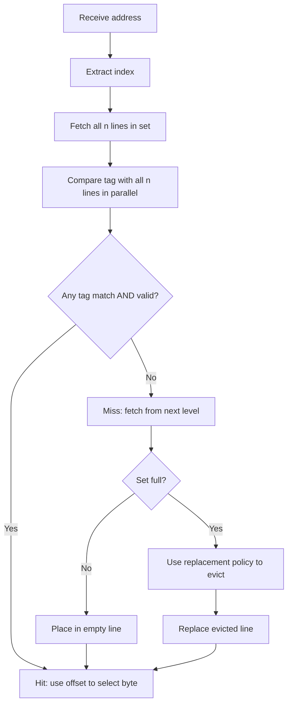

# Set-Associative Cache

## Overview

A **set-associative cache** divides the cache into sets, each containing multiple lines (ways). A memory block maps to one specific set but can occupy any line within that set. This is the most common cache organization in modern CPUs, balancing hit rate and hardware complexity.

## How It Works

### Structure

```
Cache = 2^s sets × n ways × line_size bytes

n-way set-associative: each set has n lines
```

### Address Decomposition

```
┌──────────┬──────────────┬──────────────┐
│   Tag     │    Index     │   Offset     │
└──────────┴──────────────┴──────────────┘
  t bits       s bits         b bits
```

Same as direct-mapped, but the index selects a **set** (with n lines) instead of a single line.

### Lookup Process



## Detailed Example

**Cache**: 4 sets, 2-way, 16-byte lines, 16-bit address

```
b = log₂(16) = 4
s = log₂(4)  = 2
t = 16 - 2 - 4 = 10
```

**Access sequence**:

| Step | Address | Tag | Set | Way 0 | Way 1 | Result |
|------|---------|-----|-----|-------|-------|--------|
| 1 | 0x00A0 | 0x002 | 2 | [0x002, V] | [empty] | Miss (cold) |
| 2 | 0x00B0 | 0x002 | 3 | [0x002, V] | [empty] | Miss (cold) |
| 3 | 0x00A4 | 0x002 | 2 | [0x002, V] | [empty] | **Hit!** |
| 4 | 0x04A0 | 0x012 | 2 | [0x002, V] | [0x012, V] | Miss (conflict, but fits!) |
| 5 | 0x08A0 | 0x022 | 2 | [needs eviction] | [needs eviction] | Miss (set full) |

In step 4, the 2-way associativity allows both 0x002 and 0x12 to coexist in set 2. Direct-mapped would have evicted 0x002.

## Hardware Implementation

```
Set Index ──►┌──────────────────────────────┐
             │         Set Array            │
             │  ┌─────┐ ┌─────┐ ┌─────┐    │
             │  │Way 0│ │Way 1│ │Way n│    │
             │  │Tag  │ │Tag  │ │Tag  │    │
             │  │Data │ │Data │ │Data │    │
             │  │V  D │ │V  D │ │V  D │    │
             │  └──┬──┘ └──┬──┘ └──┬──┘    │
             └─────┼────────┼──────┼────────┘
                   ▼        ▼      ▼
             ┌─────────────────────────────┐
Tag ────────►│   n Comparators (parallel)  │
             └──────────┬──────────────────┘
                        │ One-hot select
                        ▼
             ┌─────────────────────────────┐
Offset ─────►│   Mux → Data Out           │
             └─────────────────────────────┘
```

**Key hardware**: n comparators + n-to-1 multiplexer. This is why higher associativity costs more.

## Associativity vs Performance

| Associativity | Miss Rate Reduction | Hardware Cost | Access Time |
|---------------|--------------------:|--------------:|------------:|
| 1-way (direct) | Baseline | Lowest | Fastest |
| 2-way | -20-30% | Low | Fast |
| 4-way | -30-40% | Moderate | Moderate |
| 8-way | -35-45% | High | Slower |
| 16-way | -38-48% | Very High | Slow |
| Full | -40-50% | Highest (CAM) | Slowest |

Diminishing returns beyond 4-8 way.

## Set-Associative in Modern CPUs

| Cache Level | Typical Associativity | Why |
|-------------|----------------------|-----|
| L1 I-cache | 4-way or 8-way | Balance hit time and hit rate |
| L1 D-cache | 4-way or 8-way | Same |
| L2 | 8-way | Larger, higher associativity |
| L3 | 12-way to 16-way | Very large, shared; high associativity needed |

## Replacement in Set-Associative

When a set is full, a replacement policy decides which line to evict:

- **LRU** (Least Recently Used): Best hit rate, expensive for high associativity
- **Pseudo-LRU**: Approximation using tree structure; common in 4-8 way
- **Random**: Simple hardware, surprisingly good performance
- **FIFO**: First-in first-out; simple but suboptimal

See [Replacement Policies](replacement.md) for details.

## Interview Questions

1. **Q**: A cache is 64 KB, 4-way set-associative, with 32-byte lines. How many sets, tag bits (32-bit address)?
   **A**: Lines = 64 KB / 32 B = 2048. Sets = 2048 / 4 = 512. Index = log₂(512) = 9. Offset = log₂(32) = 5. Tag = 32 - 9 - 5 = 18 bits.

2. **Q**: Why is 4-way associativity considered the "sweet spot"?
   **A**: The miss rate reduction from 1-way to 4-way is significant (~30-40%), but the hardware cost (4 comparators, LRU logic) is manageable. Beyond 4-way, each additional way provides diminishing returns while increasing access time and power.

3. **Q**: How does set-associative cache handle a write?
   **A**: On a write hit, the matching way is updated. On a write miss with write-allocate, the line is fetched and placed in an empty way (or a victim is evicted). The replacement policy selects which way to use.

4. **Q**: What is the advantage of set-associative over direct-mapped for arrays that are powers of 2 in size?
   **A**: Power-of-2 sized arrays accessed with stride that's a power of 2 cause severe conflict misses in direct-mapped caches. Set-associative caches allow multiple array rows to coexist in the same set, reducing thrashing.

## Common Mistakes

- ❌ Confusing "4-way set-associative" with "4 sets" (it's 4 lines per set)
- ❌ Forgetting that set count = cache_size / (line_size × associativity)
- ❌ Assuming higher associativity always means better performance (access time increases)
- ❌ Not considering that LRU is exact only for small associativity (pseudo-LRU for 4+ way)

## Summary

Set-associative caches offer the best balance of hit rate and hardware complexity. Each set contains n lines, and a block can go in any line of its designated set. 4-way to 8-way is the sweet spot for most caches. The hardware requires n comparators per access, and replacement policies manage evictions.

## Cross-References

- [Cache Mapping](cache-mapping.md) — Overview of all strategies
- [Direct-Mapped](direct-mapped.md) — Simpler alternative
- [Fully Associative](fully-associative.md) — Maximum associativity
- [Replacement Policies](replacement.md) — Eviction strategies
- [Cache Basics](cache-basics.md) — Fundamental concepts
