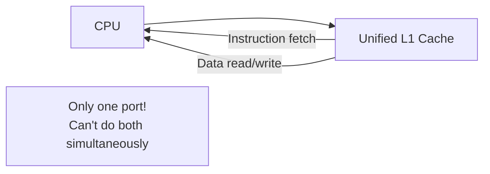
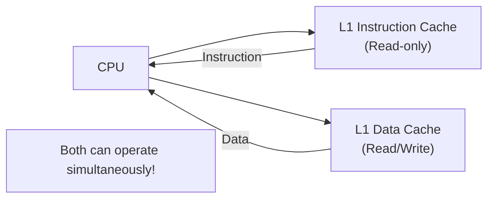
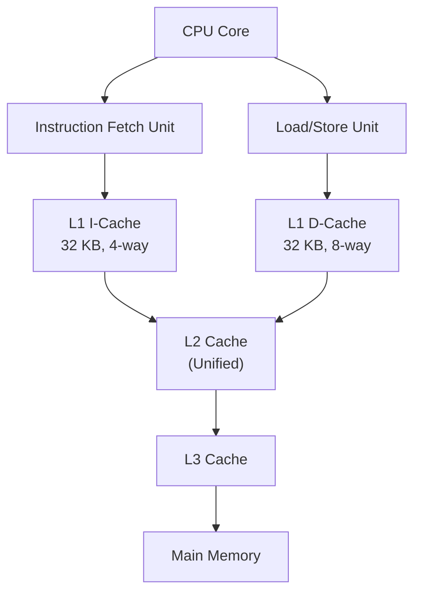

# Split Cache (I-Cache / D-Cache)

## Overview

Most modern processors have a **split L1 cache** — separate caches for instructions (I-cache) and data (D-cache). This design, rooted in the Harvard architecture, allows the CPU to fetch an instruction and read/write data simultaneously, eliminating structural hazards in the pipeline.

## Why Split?

### The Problem with Unified Cache



With a unified cache, the CPU can either:
- Fetch an instruction, OR
- Read/write data

But not both in the same cycle. This creates a **structural hazard**.

### The Solution: Split Cache



Two separate caches, two separate ports, no conflict.

## Split Cache Architecture



### Typical Sizes (Modern CPUs)

| Cache | Size | Associativity | Line Size | Ports |
|-------|------|---------------|-----------|-------|
| L1 I-Cache | 32–64 KB | 4-way or 8-way | 64 B | Read-only, 1 port |
| L1 D-Cache | 32–64 KB | 4-way or 8-way | 64 B | Read/Write, 2 ports (load + store) |
| L2 | 256 KB–1 MB | 8-way | 64 B | Unified |
| L3 | 4–64 MB | 12–16-way | 64 B | Unified, shared |

## Instruction Cache Specifics

### Read-Only
The I-cache is **read-only** from the CPU's perspective:
- No writes (self-modifying code is special — see below)
- No dirty bits needed
- No write policy needed
- Simpler hardware

### Self-Modifying Code
When a program writes to an address that's in the I-cache:
1. The write goes to the D-cache
2. The coherence protocol detects the conflict
3. The I-cache entry is **invalidated**
4. The next instruction fetch gets the updated data

This is called **I-cache/D-cache coherence** and is handled differently by different architectures.

### Branch Prediction Interaction
The I-cache feeds the branch predictor:
- Branch Target Buffer (BTB) uses I-cache addresses
- I-cache miss → pipeline stall (instruction fetch stall)
- Prefetching into I-cache is critical for performance

## Data Cache Specifics

### Read/Write
The D-cache handles:
- **Loads**: CPU reads data (register ← memory)
- **Stores**: CPU writes data (memory ← register)

### Store Buffer
Writes go through a **store buffer** before hitting the D-cache:


Benefits:
- Decouples store execution from cache write latency
- Allows store-to-load forwarding (if load addresses match pending stores)
- Write combining for adjacent stores

### Load-Store Ordering
The D-cache must handle:
- **Store-to-load forwarding**: If a load reads from an address that has a pending store in the store buffer
- **Memory ordering**: Stores may be reordered (memory model dependent)

## Split vs Unified: Trade-offs

| Aspect | Split | Unified |
|--------|-------|---------|
| Bandwidth | 2× (simultaneous I+D) | 1× (must arbitrate) |
| Structural hazards | None | Must arbitrate between I and D |
| Capacity | Fixed partition (may waste) | Flexible (I-heavy or D-heavy) |
| Hardware | Two caches, two tag arrays | One cache, one tag array |
| Coherence | Need I/D coherence for self-modifying code | Not needed |
| Complexity | Higher (two independent caches) | Lower |

## Cache Utilization Imbalance

A split cache can waste capacity if one side is underutilized:

```
Scenario: Data-heavy workload
  I-cache: 10% utilized (3.2 KB of 32 KB used)
  D-cache: 100% utilized (32 KB fully used)
  
  With unified: 64 KB could be used for data
  With split: 32 KB wasted on I-cache
```

However, the bandwidth advantage of splitting usually outweighs this.

## Intel and AMD Implementations

### Intel Skylake+
- L1 I-Cache: 32 KB, 8-way, 4 cycles
- L1 D-Cache: 48 KB, 12-way, 5 cycles (increased from 32 KB in Ice Lake)
- L2: 512 KB, 8-way, 12 cycles (unified)
- L3: 2 MB/core, 16-way (shared)

### AMD Zen 3+
- L1 I-Cache: 32 KB, 8-way, 4 cycles
- L1 D-Cache: 32 KB, 8-way, 4 cycles
- L2: 512 KB, 8-way, 12 cycles (unified, per core)
- L3: 32 MB/CCX, 16-way (shared within CCX)

## Interview Questions

1. **Q**: Why is L1 cache split into I-cache and D-cache?
   **A**: To allow simultaneous instruction fetch and data access in the same cycle. A unified cache would require arbitration, creating a structural hazard that limits pipeline throughput.

2. **Q**: Is the I-cache coherent with the D-cache?
   **A**: Yes, but it requires special handling. When a store writes to an address that's in the I-cache, the I-cache entry must be invalidated. This is handled by the coherence protocol or dedicated snooping logic.

3. **Q**: Why don't I-caches need dirty bits?
   **A**: The I-cache is read-only from the CPU's perspective. Instructions are never written by the CPU (except self-modifying code, which invalidates the I-cache entry). No writes means no dirty data.

4. **Q**: Can L2 and L3 caches be split?
   **A**: They can be, but almost always aren't. L2 and L3 are unified because the bandwidth requirement is lower (they're farther from the CPU), and unified design maximizes capacity utilization.

5. **Q**: What is store-to-load forwarding?
   **A**: When a load reads from an address that has a pending store in the store buffer, the load can get the data directly from the store buffer without waiting for the store to commit to the D-cache.

## Common Mistakes

- ❌ Assuming all cache levels are split (only L1 is typically split)
- ❌ Forgetting that self-modifying code requires I-cache invalidation
- ❌ Not knowing that the D-cache has a store buffer
- ❌ Confusing "split" with "separate address spaces" (they share the same address space)

## Summary

Split L1 caches separate instruction and data streams to enable simultaneous access, eliminating structural hazards. The I-cache is read-only and simpler; the D-cache handles loads and stores with a store buffer. L2 and L3 are unified for maximum capacity utilization. The trade-off is potential capacity waste but significantly higher bandwidth.

## Cross-References

- [Cache Basics](cache-basics.md) — Fundamental cache concepts
- [Cache Mapping](cache-mapping.md) — I-cache and D-cache use set-associative mapping
- [Coherence](coherence.md) — I/D cache coherence for self-modifying code
- [Performance](../performance/README.md) — Cache bandwidth and pipeline throughput
