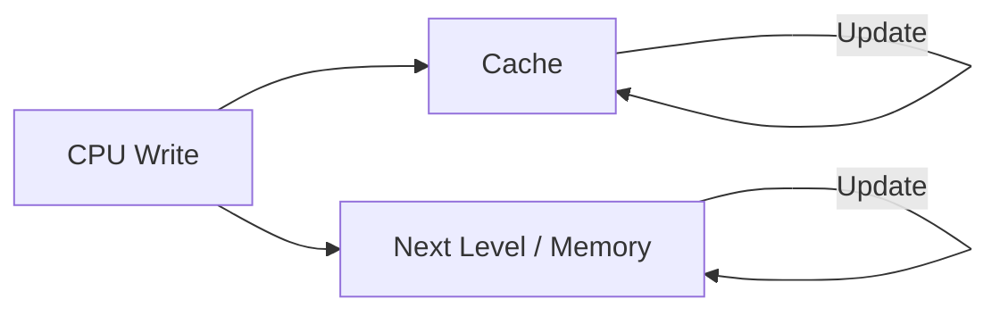
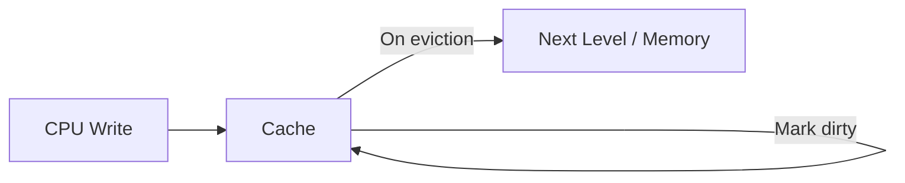
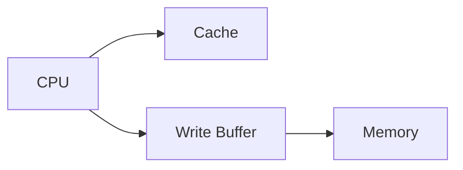
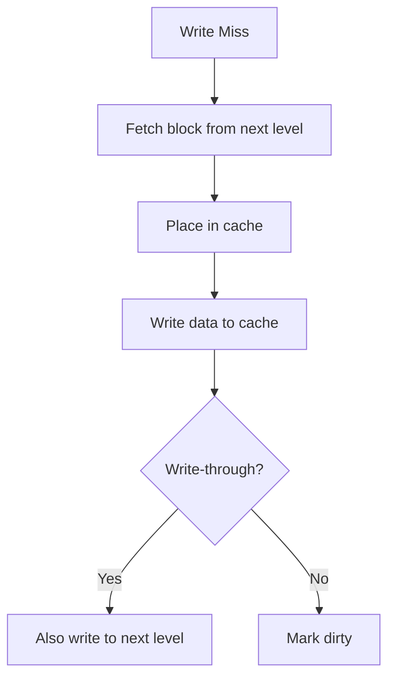
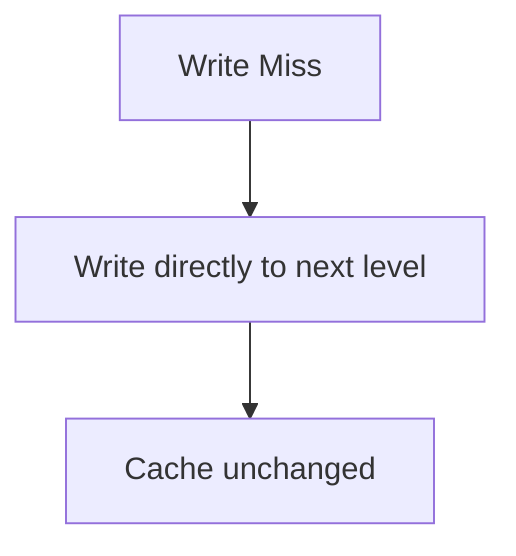
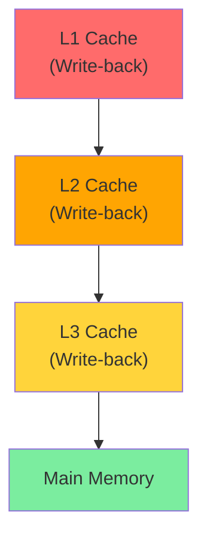

# Write Policies

## Overview

**Write policies** determine how the cache handles write operations. They affect performance, consistency, and bus traffic. There are two dimensions: what happens on a **write hit** (write-through vs write-back) and what happens on a **write miss** (write-allocate vs no-write-allocate).

## Write Hit Policies

### Write-Through

On a write hit, data is written to **both** the cache and the next level simultaneously.



| Pros | Cons |
|------|------|
| Simple design | Every write goes to next level (high bandwidth) |
| Data always consistent between cache and memory | Write latency = next level latency |
| No dirty bits needed | Slower writes |
| Easy to implement | Bus contention on write-heavy workloads |

**Used in**: L1 instruction caches (read-only), some embedded systems, write-through L1 with write-back L2 (common in modern CPUs).

### Write-Back

On a write hit, data is written **only to the cache**. The line is marked **dirty**. The dirty line is written to the next level only when **evicted**.



| Pros | Cons |
|------|------|
| Writes are fast (cache speed) | Complex: need dirty bit per line |
| Reduces bus traffic (write combining) | Data inconsistency risk (stale memory) |
| Multiple writes to same line → one writeback | Dirty data lost on crash |
| Absorbs write bursts | Read misses to dirty lines need writeback + read |

**Used in**: L1 data caches, L2, L3 caches in virtually all modern CPUs.

### Write Buffer

Used with write-through to decouple CPU writes from memory writes:



The CPU writes to the cache and buffer, then continues. The buffer drains to memory asynchronously. Prevents CPU stalls on writes but can overflow if writes are too fast.

## Write Miss Policies

### Write-Allocate (Fetch-on-Write)

On a write miss:
1. Fetch the block from the next level into the cache
2. Write the data in the cache
3. Apply the write-hit policy (write-through or write-back)



### No-Write-Allocate (Write-around)

On a write miss:
1. Write directly to the next level
2. Do **not** fetch the block into the cache



## Common Combinations

| Combination | Description | Use Case |
|-------------|-------------|----------|
| **Write-back + Write-allocate** | Most common. Fetch on miss, write to cache, evict dirty later. | L1D, L2, L3 in modern CPUs |
| **Write-through + No-write-allocate** | Write to memory on miss, don't cache. | Simple embedded systems |
| **Write-through + Write-allocate** | Rare. Fetch on miss but also write through. | Some GPU caches |
| **Write-back + No-write-allocate** | Rare. Write to memory on miss, cache only on reads. | Specialized designs |

**Why write-back + write-allocate is dominant**: Exploits temporal locality of writes. If you write to a location, you'll likely write again soon. Fetching into cache means subsequent writes are fast.

## Dirty Bit

Each cache line has a **dirty bit** (modified bit):
- **0**: Line is clean (matches next level)
- **1**: Line has been written (must writeback on eviction)

```
Cache Line Entry:
┌───────┬───────┬───────┬──────────────────┐
│ Valid │ Dirty │  Tag  │     Data         │
│  1b   │  1b   │  tb   │   line_size × 8b │
└───────┴───────┴───────┴──────────────────┘
```

### Dirty Eviction

When a dirty line is evicted:
1. Write the dirty line back to the next level
2. Then load the new line

This doubles the miss penalty for dirty evictions:
```
Effective Miss Penalty = Base Miss Penalty + (Dirty Rate × Writeback Time)
```

## Write Combining

An optimization where multiple writes to the same cache line are combined into a single writeback:

```
Without combining: Write byte 0, byte 4, byte 8 → 3 writes to memory
With combining:    Write byte 0, byte 4, byte 8 → 1 writeback on eviction
```

Modern CPUs use **write combining buffers** for non-cacheable memory regions (e.g., video memory).

## Streaming Stores (Non-Temporal Writes)

Bypass the cache entirely and write directly to memory:

```x86asm
MOVNTPS [mem], xmm0  ; Non-temporal store (SSE)
```

Useful when writing data that won't be read soon (avoids cache pollution).

## Write Policies in Multi-Level Caches



Modern hierarchy: **All levels use write-back**. Dirty data propagates down only on eviction. The **inclusive property** (if present) ensures that evicting from L3 forces a writeback to memory.

## Interview Questions

1. **Q**: Why do modern CPUs use write-back instead of write-through?
   **A**: Write-back reduces memory bus traffic. Multiple writes to the same cache line result in only one writeback on eviction. Write-through would generate a memory write for every store instruction, overwhelming the memory bus.

2. **Q**: What is the dirty bit and when is it checked?
   **A**: The dirty bit indicates a cache line has been modified. It's checked on eviction — if dirty, the line must be written back to the next level before the new line can be loaded.

3. **Q**: Why might you use no-write-allocate with write-through?
   **A**: If the workload has poor write locality (writes are scattered), fetching a cache line on a write miss wastes bandwidth since the line won't be reused. Writing directly to memory and not caching avoids polluting the cache.

4. **Q**: What is a write buffer and what problem does it solve?
   **A**: A write buffer holds pending writes for a write-through cache. The CPU writes to the buffer and continues execution, while the buffer drains to memory asynchronously. This decouples CPU speed from memory write latency.

5. **Q**: How does dirty eviction affect miss penalty?
   **A**: A dirty eviction requires writing back the old line before loading the new one. If the writeback can't overlap with the read, the miss penalty doubles.

## Common Mistakes

- ❌ Confusing write-through with write-back
- ❌ Forgetting that write-back needs dirty bits
- ❌ Not knowing write-allocate vs no-write-allocate
- ❌ Assuming write-through is "simpler" for multi-core (coherence is still complex)
- ❌ Forgetting about write buffers in write-through designs

## Summary

Write-back with write-allocate is the dominant policy in modern caches. Write-back reduces bus traffic by writing dirty lines only on eviction. Write-allocate fetches the block on a write miss to exploit write locality. The dirty bit tracks modified lines. Write-through is simpler but generates more traffic.

## Cross-References

- [Cache Basics](cache-basics.md) — Read and write fundamentals
- [MESI Protocol](mesi.md) — Coherence for write-back caches
- [Coherence](coherence.md) — Multi-core consistency
- [Performance](../performance/README.md) — How write policies affect performance
