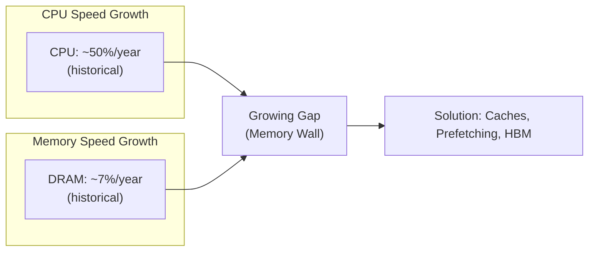

# Memory Technologies

## Overview

Understanding the physical memory technologies that underpin the memory hierarchy is essential for grasping why caches exist, why certain bottlenecks occur, and how modern systems achieve their performance characteristics. This section covers SRAM, DRAM, DDR, GDDR, HBM, and non-volatile memory.

## Technology Comparison

| Technology | Speed | Density | Cost/GB | Power | Volatile | Use Case |
|------------|-------|---------|---------|-------|----------|----------|
| SRAM | ~1 ns | Low | Very High | Moderate | Yes | CPU Caches |
| DRAM | ~50-100 ns | High | Low | Moderate | Yes | Main Memory |
| DDR4/DDR5 | ~50-80 ns | High | Low | Moderate | Yes | System RAM |
| GDDR6/6X | ~10-20 ns | Moderate | Moderate | High | Yes | GPU Memory |
| HBM2/3 | ~10-30 ns | Very High | High | Moderate | Yes | GPU/HPC |
| NAND Flash | ~25-100 μs | Very High | Very Low | Low | No | SSDs |
| Optane (3D XPoint) | ~10 μs | High | Moderate | Low | No | Storage/Memory |

## The Memory Wall

The **memory wall** is the growing disparity between CPU speed and memory speed. It's the fundamental reason the memory hierarchy exists.

## Why Different Technologies?

| Requirement | Best Technology | Why |
|-------------|----------------|-----|
| Fastest access | SRAM | 6T cell, no refresh, simple circuit |
| Largest capacity | DRAM | 1T+1C cell, very dense |
| Highest bandwidth | HBM | Stacked die, wide interface |
| Lowest cost/GB | NAND Flash | Multi-level cells, 3D stacking |
| Non-volatile | NAND/3D XPoint | Retains data without power |

## Cross-References

- [Memory Hierarchy](../memory-hierarchy/README.md) — How these technologies fit together
- [Cache Basics](../memory-hierarchy/cache-basics.md) — SRAM in caches
- [Performance](../performance/README.md) — Memory bandwidth and latency
- [Storage](../../storage/overview.md) — NAND flash in SSDs

## Cross References

- [SRAM](sram.md)
- [DRAM](dram.md)
- [DDR](ddr.md)
- [Memory Hierarchy](../memory-hierarchy/README.md)
