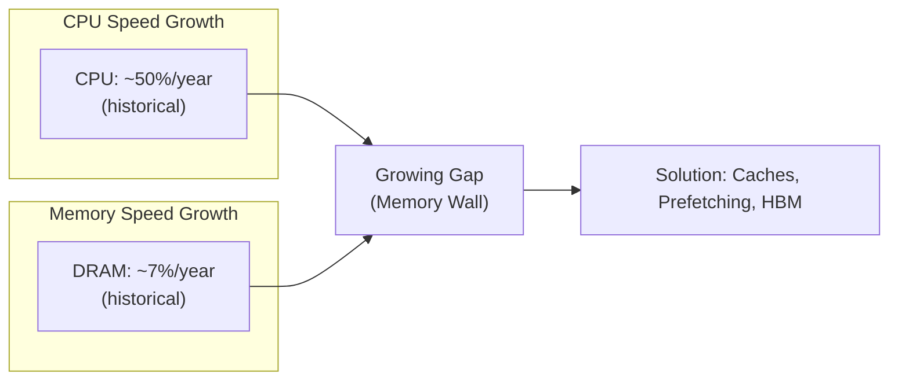

# Memory Technologies

## Overview

Understanding the physical memory technologies that underpin the memory hierarchy is essential for grasping why caches exist, why certain bottlenecks occur, and how modern systems achieve their performance characteristics. This section covers SRAM, DRAM, DDR, GDDR, HBM, and non-volatile memory.

## Why Memory Technology Matters

- **Performance bottleneck**: Memory access is often the limiting factor (the "memory wall")
- **Cost tradeoffs**: Faster memory costs more per GB
- **Power consumption**: Memory can consume 30-40% of total system power
- **Interview essential**: Understanding why caches exist requires knowing memory technology

## The Memory Wall



The **memory wall** is the growing disparity between CPU speed and memory speed. It's the fundamental reason the memory hierarchy exists.

```text
Latency Comparison (orders of magnitude):
├── L1 Cache:    ~1 ns      (SRAM)
├── L2 Cache:    ~4 ns      (SRAM)
├── L3 Cache:    ~10 ns     (SRAM)
├── DRAM:        ~50-100 ns (DRAM)
├── NVMe SSD:    ~10-25 μs  (NAND Flash)
└── HDD:         ~5-10 ms   (Magnetic)

Ratio L1:DRAM = ~1:100
Ratio L1:SSD = ~1:10,000
Ratio L1:HDD = ~1:1,000,000
```

## SRAM (Static Random-Access Memory)

### Cell Structure: 6-Transistor (6T) Cell

```text
        VDD                    VDD
         |                      |
        ┌┴┐                    ┌┴┐
        │T5│                    │T6│
        └┬┘                    └┬┘
         │                      │
    ┌────┴────┐            ┌────┴────┐
    │         │            │         │
   ┌┴┐  Q    └────┐      ┌┴┐  Q̄    └────┐
   │T1│──────────│──────│T3│──────────│
   └┬┘          │      └┬┘          │
    │           │       │           │
    ├─── WL ────┤       ├─── WL ────┤
    │           │       │           │
   ┌┴┐         └──┐    ┌┴┐         └──┐
   │T2│           │    │T4│           │
   └┬┘           └─   └┬┘           └─
    │              BL    │              BL̄
```

### SRAM Characteristics

| Property | Value | Explanation |
|----------|-------|-------------|
| **Cell size** | 6 transistors | Two cross-coupled inverters + 2 access transistors |
| **Speed** | ~1 ns | No refresh needed, simple read circuit |
| **Density** | Low | 6T per bit = large die area |
| **Power** | Moderate (static) | Draws current even when not accessed |
| **Volatility** | Volatile | Loses data without power |
| **Cost** | Very high | ~$10-50/GB equivalent |
| **Use case** | CPU caches, register files | Speed-critical, small capacity |

### How SRAM Works

- **Two stable states**: Cross-coupled inverters hold either 0 or 1
- **No refresh needed**: Feedback loop maintains state indefinitely
- **Fast read**: Sense amplifier detects which side is high/low
- **Fast write**: Drive one bitline high, other low, assert wordline
- **Non-destructive read**: Reading doesn't destroy the stored value

## DRAM (Dynamic Random-Access Memory)

### Cell Structure: 1-Transistor + 1-Capacitor (1T1C)

```text
        WL (Word Line)
         │
        ┌┴┐
        │T│ (Access Transistor)
        └┬┘
         │
    BL ──┤
         │
        ┌┴┐
        │C│ (Storage Capacitor)
        └┬┘
         │
        GND

- T: Access transistor (controlled by word line)
- C: Storage capacitor (stores charge = data)
- BL: Bit line (used for read/write)
```

### DRAM Characteristics

| Property | Value | Explanation |
|----------|-------|-------------|
| **Cell size** | 1 transistor + 1 capacitor | Much smaller than SRAM |
| **Speed** | ~50-100 ns | Requires charge sensing and refresh |
| **Density** | High | 1T1C = very compact |
| **Power** | Moderate (dynamic) | Refresh cycles consume power |
| **Volatility** | Volatile | Capacitor leaks charge |
| **Cost** | Low | ~$2-5/GB |
| **Use case** | Main memory (system RAM) | Large capacity, moderate speed |

### DRAM Operation

**Read cycle:**
1. Assert word line → access transistor opens
2. Capacitor shares charge with bit line (tiny voltage change)
3. Sense amplifier detects and amplifies the signal
4. **Destructive read** — capacitor charge is depleted
5. Sense amplifier restores data back to capacitor (write-back)

**Refresh cycle:**
1. DRAM cells leak charge over time (~64 ms retention)
2. Controller must periodically read and rewrite every row
3. Typical refresh interval: 64 ms (8K refresh cycles)
4. Refresh penalty: ~5-10% of available bandwidth

### DRAM Organization

```text
DRAM Chip
├── Bank Group 0
│   ├── Bank 0: Array of rows × columns
│   ├── Bank 1
│   ├── Bank 2
│   └── Bank 3
├── Bank Group 1
│   ├── Bank 0
│   └── ...
└── ...

Access sequence: Row Activate → Column Read → Precharge
Row buffer acts as a cache for the activated row
```

## DDR SDRAM (Double Data Rate)

DDR transfers data on **both rising and falling edges** of the clock signal.

### DDR Generations

| Generation | Year | Data Rate | Voltage | Prefetch | Bandwidth (per chip) |
|-----------|------|-----------|---------|----------|---------------------|
| DDR | 2000 | 200-400 MT/s | 2.5V | 2n | 0.8-1.6 GB/s |
| DDR2 | 2003 | 400-1066 MT/s | 1.8V | 4n | 1.6-4.2 GB/s |
| DDR3 | 2007 | 800-2133 MT/s | 1.5V | 8n | 3.2-8.5 GB/s |
| DDR4 | 2014 | 1600-3200 MT/s | 1.2V | 8n | 6.4-12.8 GB/s |
| DDR5 | 2020 | 3200-6400 MT/s | 1.1V | 16n | 12.8-25.6 GB/s |

### DDR5 Improvements over DDR4

| Feature | DDR4 | DDR5 |
|---------|------|------|
| **Data rate** | Up to 3200 MT/s | Up to 6400 MT/s |
| **Voltage** | 1.2V | 1.1V |
| **Channel architecture** | 1 channel per DIMM | 2 channels per DIMM |
| **Burst length** | BL8 | BL16 |
| **Bank groups** | 4 | 8 |
| **On-die ECC** | No | Yes |
| **Power management** | On motherboard | On DIMM (PMIC) |

## GDDR (Graphics DDR)

Optimized for **high bandwidth** in GPUs.

| Generation | Year | Bandwidth | Use |
|-----------|------|-----------|-----|
| GDDR5 | 2008 | ~28 GB/s per chip | Mid-range GPUs |
| GDDR5X | 2016 | ~48 GB/s per chip | High-end GPUs |
| GDDR6 | 2018 | ~64 GB/s per chip | RTX 20/30 series |
| GDDR6X | 2020 | ~108 GB/s per chip | RTX 3090/4090 |

**Key differences from DDR:**
- Higher clock speeds (wider bus, higher frequency)
- Wider data bus (32-bit per chip vs 8-bit for DDR)
- PAM4 signaling (GDDR6X — 4 voltage levels per symbol)
- Higher power consumption
- Not designed for low-latency random access

## HBM (High Bandwidth Memory)

**Stacked DRAM** connected via silicon interposer for extreme bandwidth.

```text
Traditional DRAM:
┌──────────┐     ┌──────────┐
│   CPU    │◄───►│  DRAM    │  Limited by PCB trace length
└──────────┘     └──────────┘

HBM:
┌──────────┐
│   CPU    │
│          │◄───►┌───┐
│  (on     │     │D0 │  ← DRAM die 0
│ interposer)    │D1 │  ← DRAM die 1
│          │     │D2 │  ← DRAM die 2
└──────────┘     │D3 │  ← DRAM die 3
                 └───┘
                 Stacked + connected via TSVs
```

| Generation | Year | Bandwidth | Stack Height | Use |
|-----------|------|-----------|-------------|-----|
| HBM | 2013 | 128 GB/s | 4 dies | AMD Fury |
| HBM2 | 2016 | 307 GB/s | 8 dies | NVIDIA V100 |
| HBM2E | 2019 | 461 GB/s | 8 dies | NVIDIA A100 |
| HBM3 | 2022 | 819 GB/s | 8-12 dies | NVIDIA H100 |
| HBM3E | 2024 | 1.2 TB/s | 12 dies | NVIDIA H200 |

**Key features:**
- **TSV (Through-Silicon Via)**: Vertical connections through stacked dies
- **Wide interface**: 1024-bit bus (vs 64-bit for DDR)
- **Lower power per bit**: Shorter traces, lower voltage
- **Very expensive**: Used only in high-end GPUs, HPC, AI accelerators

## NAND Flash (Non-Volatile)

### How NAND Flash Works

- Stores data as **trapped charge** in a floating gate (or charge trap)
- **Non-volatile**: Retains data without power
- **Block erasure**: Can only erase entire blocks (128 KB - 1 MB)
- **Write asymmetry**: Write is slow, erase is very slow

### NAND Cell Types

| Type | Bits/Cell | Endurance | Speed | Cost | Use |
|------|----------|-----------|-------|------|-----|
| **SLC** | 1 | ~100K P/E cycles | Fastest | Highest | Enterprise SSDs |
| **MLC** | 2 | ~10K P/E cycles | Fast | High | Consumer SSDs |
| **TLC** | 3 | ~1-3K P/E cycles | Moderate | Low | Most consumer SSDs |
| **QLC** | 4 | ~500-1K P/E cycles | Slow | Lowest | Read-heavy storage |

### 3D NAND (Vertical Stacking)

```text
Planar NAND (traditional):           3D NAND (modern):
┌───┬───┬───┬───┬───┐              Layer 1: ─────────
│ C │ C │ C │ C │ C │              Layer 2: ─────────
└───┴───┴───┴───┴───┘              Layer 3: ─────────
  Cells side by side                Layer 4: ─────────
  (limited by lithography)          Layer 128: ───────
                                    Cells stacked vertically
                                    (not limited by lithography)
```

Modern 3D NAND: 128-232+ layers stacked vertically

## Emerging Memory Technologies

| Technology | Speed | Density | Volatility | Maturity |
|-----------|-------|---------|------------|----------|
| **3D XPoint (Optane)** | ~10 μs | High | No | Discontinued (Intel) |
| **MRAM** | ~3-10 ns | Moderate | No | Production (embedded) |
| **ReRAM** | ~10 ns | High | No | Research/limited |
| **PCM** | ~50 ns | High | No | Research |
| **FeRAM** | ~10 ns | Moderate | No | Niche production |

## Technology Comparison Summary

| Technology | Speed | Density | Cost/GB | Power | Volatile | Use Case |
|------------|-------|---------|---------|-------|----------|----------|
| SRAM | ~1 ns | Low | Very High | Moderate | Yes | CPU Caches |
| DRAM | ~50-100 ns | High | Low | Moderate | Yes | Main Memory |
| DDR4/DDR5 | ~50-80 ns | High | Low | Moderate | Yes | System RAM |
| GDDR6/6X | ~10-20 ns | Moderate | Moderate | High | Yes | GPU Memory |
| HBM2/3 | ~10-30 ns | Very High | High | Moderate | Yes | GPU/HPC |
| NAND Flash | ~25-100 μs | Very High | Very Low | Low | No | SSDs |
| Optane (3D XPoint) | ~10 μs | High | Moderate | Low | No | Storage/Memory |

## Why Different Technologies?

| Requirement | Best Technology | Why |
|-------------|----------------|-----|
| Fastest access | SRAM | 6T cell, no refresh, simple circuit |
| Largest capacity | DRAM | 1T+1C cell, very dense |
| Highest bandwidth | HBM | Stacked die, wide interface |
| Lowest cost/GB | NAND Flash | Multi-level cells, 3D stacking |
| Non-volatile | NAND/3D XPoint | Retains data without power |

## Interview Questions

**Q: Why is SRAM used for caches instead of DRAM?**

A: SRAM is faster (~1ns vs ~50-100ns) because it uses a 6-transistor cell with cross-coupled inverters that maintain state without refresh. DRAM uses a 1T1C cell where the capacitor leaks charge, requiring periodic refresh. SRAM's non-destructive read and simpler access circuitry make it ideal for caches where speed matters most, despite being larger and more expensive.

**Q: Explain the DRAM read process.**

A: 1) Assert the word line to open the access transistor. 2) The storage capacitor shares its charge with the bit line (tiny voltage change). 3) A sense amplifier detects and amplifies the signal. 4) The read is destructive — the capacitor's charge is depleted. 5) The sense amplifier writes the data back to restore the capacitor. This process takes ~50-100ns.

**Q: What is the memory wall and how does the industry address it?**

A: The memory wall is the growing gap between CPU speed (historically doubling every ~18 months) and DRAM speed (improving ~7% per year). Solutions include: 1) Cache hierarchies (SRAM caches bridge the gap), 2) HBM (stacked DRAM for higher bandwidth), 3) Prefetching (predict and load data before it's needed), 4) Wider buses (DDR5 uses 2 channels per DIMM), 5) Processing-in-memory (compute near data).

**Q: Compare DDR4 and DDR5.**

A: DDR5 doubles the data rate (up to 6400 MT/s vs 3200), uses lower voltage (1.1V vs 1.2V), has 2 channels per DIMM (vs 1), longer burst length (BL16 vs BL8), on-die ECC for reliability, and PMIC on the DIMM for better power management. DDR5 also has 8 bank groups (vs 4) for better parallelism.

**Q: Why is HBM so much faster than regular DRAM?**

A: HBM uses a very wide interface (1024-bit bus vs 64-bit for DDR), stacked dies connected by through-silicon vias (TSVs), and shorter physical traces (on-package vs on-PCB). The wide bus provides massive bandwidth (up to 1.2 TB/s for HBM3E), though latency is similar to regular DRAM. The tradeoff is cost and limited capacity.

## Cross-References

- [Memory Hierarchy](../memory-hierarchy/README.md) — How these technologies fit together
- [Cache Basics](../memory-hierarchy/cache-basics.md) — SRAM in caches
- [Performance](../performance/README.md) — Memory bandwidth and latency
- [Storage](../../storage/overview.md) — NAND flash in SSDs
