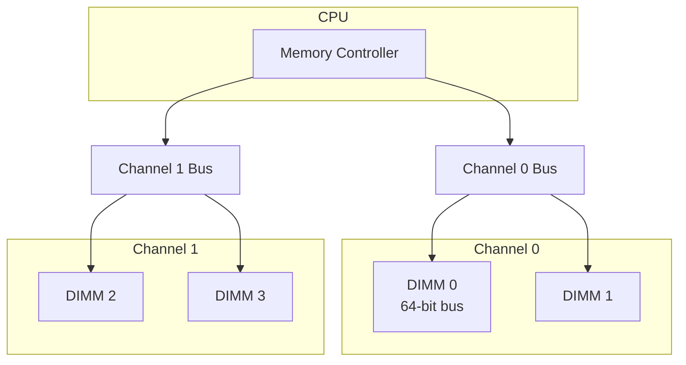

# DDR (Double Data Rate) SDRAM

## Overview

**DDR SDRAM** transfers data on both the rising and falling edges of the clock signal, doubling the data rate without increasing the clock frequency. DDR has evolved through multiple generations (DDR → DDR2 → DDR3 → DDR4 → DDR5), each increasing speed, bandwidth, and efficiency.

## Double Data Rate Signaling

```
Clock:    ┌──┐  ┌──┐  ┌──┐  ┌──┐
          │  │  │  │  │  │  │  │
       ───┘  └──┘  └──┘  └──┘  └──

SDR:      ──D0────D1────D2────D3──    (1 transfer/cycle)
          (data changes on rising edge only)

DDR:      ─D0─D1─D2─D3─D4─D5─D6─D7─  (2 transfers/cycle)
          (data changes on both edges)
```

**Data rate = 2 × Clock frequency**

Example: DDR4-3200 runs at 1600 MHz clock → 3200 MT/s (megatransfers/second).

## DDR Generations

### DDR1 (2000)
- Voltage: 2.5V
- Data rate: 200-400 MT/s
- Prefetch: 2n
- Bandwidth: Up to 3.2 GB/s per chip

### DDR2 (2003)
- Voltage: 1.8V
- Data rate: 400-800 MT/s
- Prefetch: 4n
- Bandwidth: Up to 6.4 GB/s per chip

### DDR3 (2007)
- Voltage: 1.5V
- Data rate: 800-2133 MT/s
- Prefetch: 8n
- Bandwidth: Up to 17 GB/s per chip

### DDR4 (2014)
- Voltage: 1.2V
- Data rate: 1600-3200 MT/s
- Prefetch: 8n
- Bank groups: 4 groups of 4 banks (16 total)
- Bandwidth: Up to 25.6 GB/s per chip

### DDR5 (2020)
- Voltage: 1.1V
- Data rate: 3200-6400+ MT/s
- Prefetch: 16n
- Bank groups: 8 groups of 4 banks (32 total)
- Two 32-bit sub-channels per DIMM
- On-die ECC
- Bandwidth: Up to 51.2 GB/s per chip

## DDR4 vs DDR5

| Feature | DDR4 | DDR5 |
|---------|------|------|
| Voltage | 1.2V | 1.1V |
| Max data rate | 3200 MT/s | 6400+ MT/s |
| Prefetch | 8n | 16n |
| Bank groups | 4 | 8 |
| Channel width | 64-bit | 2×32-bit |
| Burst length | BL8 | BL16 |
| ECC | On-motherboard | On-die |
| Power management | DIMM-level | On-DIMM voltage regulator |

## Prefetch Architecture

The **prefetch buffer** is key to DDR's bandwidth scaling:

```
DDR1: 2n prefetch → Fetch 2 bits per pin per internal cycle
DDR2: 4n prefetch → Fetch 4 bits per pin per internal cycle
DDR3: 8n prefetch → Fetch 8 bits per pin per internal cycle
DDR4: 8n prefetch → Same as DDR3, but higher clock
DDR5: 16n prefetch → Fetch 16 bits per pin per internal cycle
```

Higher prefetch means the internal array can run slower while the I/O pins run faster.

## Memory Channel Architecture



### Bandwidth Calculation

```
Bandwidth = Data Rate × Bus Width × Channels

DDR4-3200, dual channel:
= 3200 MT/s × 8 bytes × 2 = 51.2 GB/s

DDR5-6400, dual channel:
= 6400 MT/s × 8 bytes × 2 = 102.4 GB/s
```

## CAS Latency (CL)

The number of clock cycles between a read command and data availability:

```
Absolute latency = CL / Clock frequency

DDR4-3200 CL16: 16 / 1600 MHz = 10 ns
DDR4-2400 CL17: 17 / 1200 MHz = 14.17 ns
DDR5-4800 CL40: 40 / 2400 MHz = 16.67 ns
```

Higher DDR5 CL in cycles, but lower absolute latency due to higher clock.

## Ranks and Channels

### Rank
A group of DRAM chips that share the same command/address bus and respond together:
- **Single-rank**: 8 chips × 8 bits = 64 bits
- **Dual-rank**: 16 chips, two groups of 8 (interleaved for higher bandwidth)

### Channel
An independent bus between the memory controller and DIMMs:
- **Single-channel**: 64-bit bus
- **Dual-channel**: Two 64-bit buses = 128-bit effective
- **Quad-channel**: Server/HEDT platforms

## Interview Questions

1. **Q**: What does DDR stand for and how does it work?
   **A**: Double Data Rate. Data is transferred on both the rising and falling edges of the clock, effectively doubling the data rate without increasing clock frequency. A 1600 MHz clock achieves 3200 MT/s.

2. **Q**: How is DDR5 different from DDR4?
   **A**: DDR5 has two 32-bit sub-channels (vs one 64-bit), 16n prefetch (vs 8n), on-die ECC, higher data rates (up to 6400+ MT/s), lower voltage (1.1V), and more bank groups (8 vs 4).

3. **Q**: Calculate the bandwidth of DDR4-3200 in dual-channel mode.
   **A**: 3200 MT/s × 8 bytes (64 bits) × 2 channels = 51.2 GB/s.

4. **Q**: Why does DDR5 have two 32-bit sub-channels instead of one 64-bit?
   **A**: Two sub-channels allow independent operations, improving concurrency and reducing effective latency. While each sub-channel has half the bandwidth, the ability to service two independent requests simultaneously improves real-world performance.

5. **Q**: What is CAS latency and why does it matter?
   **A**: CAS latency (CL) is the delay in clock cycles between a read command and data availability. Lower CL means lower latency. However, absolute latency depends on both CL and clock frequency: latency = CL / clock_freq.

## Common Mistakes

- ❌ Confusing clock frequency with data rate (data rate = 2× clock for DDR)
- ❌ Assuming higher DDR number always means lower latency (CL increases too)
- ❌ Forgetting that bandwidth depends on bus width AND channels
- ❌ Not knowing prefetch architecture
- ❌ Confusing MT/s with MHz

## Summary

DDR SDRAM transfers data on both clock edges, doubling throughput. Each generation (DDR1–DDR5) increases data rate through higher clocks and deeper prefetch. DDR5 introduces dual sub-channels and on-die ECC. Bandwidth = Data Rate × Bus Width × Channels.

## Cross-References

- [DRAM](dram.md) — Underlying DRAM technology
- [GDDR](gddr.md) — GPU-optimized variant
- [HBM](hbm.md) — High-bandwidth alternative
- [Memory Hierarchy](../memory-hierarchy/README.md) — Where DDR fits

## Cross References

- [DRAM](dram.md)
- [GDDR](gddr.md)
- [HBM](hbm.md)
