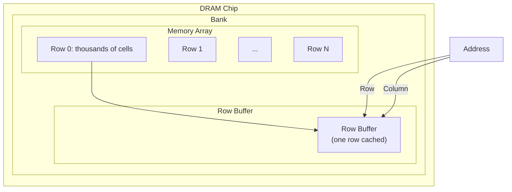

# DRAM (Dynamic Random-Access Memory)

## Overview

**DRAM** (Dynamic RAM) is the primary technology used for main memory in computers. "Dynamic" because data is stored as charge on a capacitor that leaks over time, requiring periodic **refresh**. DRAM offers much higher density and lower cost per bit than SRAM, but at significantly higher latency.

## How DRAM Works

### 1T1C Cell (One Transistor, One Capacitor)

Each DRAM bit uses just **1 transistor** and **1 capacitor**:

```
Word Line ──┬── Access Transistor ──┬── Bit Line
            │                       │
            └──── Storage Capacitor ─┘
                    (charged = 1, discharged = 0)
```

The capacitor stores charge (1 bit). The transistor acts as a switch, connecting the capacitor to the bit line when the word line is activated.

### Read Operation (Destructive)
1. Bit line precharged to VDD/2
2. Word line activated → access transistor opens
3. Capacitor shares charge with bit line
4. Sense amplifier detects tiny voltage change (~±50 mV)
5. **Read is destructive** — capacitor charge is disturbed
6. Sense amplifier restores the charge (write-back)

### Write Operation
1. Bit line driven to target voltage (VDD for 1, GND for 0)
2. Word line activated
3. Capacitor charges/discharges to match bit line

### Refresh
Capacitors lose charge over time due to leakage. Every cell must be refreshed:
- **Refresh interval**: ~64 ms (JEDEC standard)
- **Refresh command**: Reads and rewrites an entire row
- **Refresh penalty**: ~10% of time spent refreshing (for 8K rows)

## DRAM Organization



### Hierarchy
- **Channel**: Bus connecting memory controller to DIMMs
- **DIMM**: Module containing multiple DRAM chips
- **Rank**: Group of chips that respond to the same command
- **Bank**: Independent array within a chip (enables parallelism)
- **Row**: A page of data in a bank (typically 8 KB)
- **Column**: Individual bytes within a row

### Row Buffer

Each bank has a **row buffer** (sense amplifier array) that caches one row:
- **Row hit** (page hit): Data already in row buffer → fast access (~13 ns for DDR4)
- **Row conflict** (page miss): Must close current row, open new row → slow (~20 ns)
- **Row closed** (page empty): Must open row → medium (~15 ns)

## DRAM Latency Components

```
Total Latency = tRCD + tCL + tRP (for worst case)

tRCD (RAS-to-CAS Delay): Time to open a row (~14 ns DDR4)
tCL (CAS Latency): Time to access column in open row (~14 ns DDR4)
tRP (Row Precharge): Time to close a row before opening another (~14 ns DDR4)
```

**Row hit**: Only tCL needed (~14 ns)
**Row conflict**: tRP + tRCD + tCL (~42 ns)

## DRAM Generations

| Generation | Voltage | Data Rate | Prefetch | Bandwidth/Chip |
|------------|---------|-----------|----------|----------------|
| SDRAM | 3.3V | 100-133 MHz | 1n | 0.8-1.1 GB/s |
| DDR | 2.5V | 200-400 MHz | 2n | 3.2 GB/s |
| DDR2 | 1.8V | 400-800 MHz | 4n | 6.4 GB/s |
| DDR3 | 1.5V | 800-2133 MHz | 8n | 17 GB/s |
| DDR4 | 1.2V | 1600-3200 MHz | 8n | 25.6 GB/s |
| DDR5 | 1.1V | 3200-6400 MHz | 16n | 51.2 GB/s |

## DRAM vs SRAM

| Property | DRAM | SRAM |
|----------|------|------|
| Cell size | 6-8 F² (very small) | 120-150 F² |
| Transistors/bit | 1 (+ capacitor) | 6 |
| Density | High (~8 Gbit/chip) | Low |
| Latency | 50-100 ns | 0.5-2 ns |
| Refresh | Yes (every 64 ms) | No |
| Cost/GB | ~$3-5 | ~$1000+ |
| Use | Main memory | Caches |

## DRAM Scaling Challenges

1. **Capacitor scaling**: Harder to make smaller capacitors with enough charge
2. **Leakage**: Smaller capacitors leak faster → more frequent refresh
3. **Row hammer**: Accessing one row repeatedly can flip bits in adjacent rows
4. **Retention time**: Decreases with smaller cells

### Row Hammer Attack
Rapidly activating the same row can cause bit flips in adjacent rows due to charge coupling. This is a security concern (can be used to gain kernel privileges).

**Mitigations**: TRR (Target Row Refresh), increased refresh frequency.

## Interview Questions

1. **Q**: Why is DRAM called "dynamic"?
   **A**: Because data is stored as charge on a capacitor that dynamically leaks over time. Without periodic refresh, the data would be lost within milliseconds. SRAM is "static" because it uses a bistable latch that holds data indefinitely.

2. **Q**: What is a row buffer and why does it matter for performance?
   **A**: The row buffer caches the most recently opened row in a bank. If the next access is to the same row (row hit), it's fast (~14 ns). If it's to a different row (row conflict), the current row must be closed and the new one opened (~42 ns). Row hit rate significantly impacts memory performance.

3. **Q**: How does DRAM refresh affect performance?
   **A**: Refresh commands block the bank being refreshed, preventing access to that bank. With ~8K rows and 64 ms refresh interval, roughly 10% of DRAM time is spent refreshing. Modern DDR5 has per-bank refresh to reduce this impact.

4. **Q**: Why is DRAM read destructive?
   **A**: When the capacitor shares charge with the bit line, the capacitor's voltage changes. The sense amplifier detects this change and then restores the capacitor to its original state. This is why reads and writes have similar latency.

5. **Q**: What is row hammer and how is it mitigated?
   **A**: Row hammer is when rapidly activating a row causes bit flips in adjacent rows due to charge coupling. Mitigations include Target Row Refresh (TRR), which proactively refreshes adjacent rows, and increased refresh frequency.

## Common Mistakes

- ❌ Confusing DRAM (main memory) with SRAM (caches)
- ❌ Forgetting that DRAM reads are destructive
- ❌ Not knowing about row buffer hit/miss/penalty
- ❌ Assuming all DRAM accesses take the same time
- ❌ Forgetting about refresh overhead

## Summary

DRAM stores each bit as charge on a capacitor with one access transistor (1T1C cell). It's dense and cheap but slow (~50-100 ns) and requires refresh every 64 ms. The row buffer caches one row per bank, making row hits much faster than row conflicts. DDR5 offers up to 6400 MT/s with 16n prefetch.

## Cross-References

- [SRAM](sram.md) — Faster but less dense
- [DDR](ddr.md) — DDR generations and signaling
- [GDDR](gddr.md) — GPU-optimized DRAM
- [HBM](hbm.md) — High-bandwidth stacked DRAM
- [Memory Hierarchy](../memory-hierarchy/README.md) — Where DRAM fits

## Cross References

- [SRAM](sram.md)
- [DDR](ddr.md)
- [OS Virtual Memory](../../os/virtual-memory/README.md)
- [OS Swapping](../../os/memory/swapping.md)
