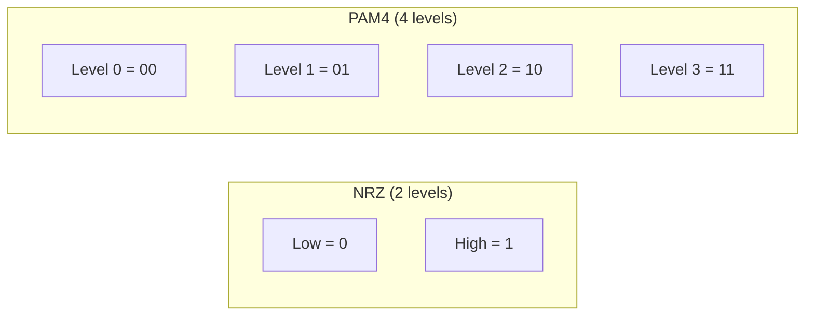
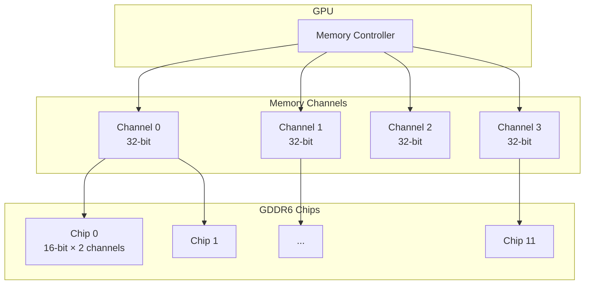

# GDDR (Graphics Double Data Rate)

## Overview

**GDDR** is a specialized type of DRAM designed for GPUs and high-bandwidth applications. While DDR is optimized for low latency (CPU workloads), GDDR is optimized for **high bandwidth** (GPU workloads). Modern GDDR6 and GDDR6X achieve significantly higher bandwidth than DDR5 through wider interfaces and higher clock speeds.

## GDDR vs DDR

| Property | DDR5 | GDDR6 | GDDR6X |
|----------|------|-------|--------|
| Target | CPU | GPU | GPU |
| Bandwidth/chip | ~8 GB/s | ~16-24 GB/s | ~24-48 GB/s |
| Interface width | 8-bit per chip | 16-bit per chip | 8-bit (PAM4) |
| Latency | Low (~10 ns) | Moderate (~15-20 ns) | Moderate (~15-20 ns) |
| Power/chip | Low | High | Very High |
| Density | High | Moderate | Moderate |
| Signaling | NRZ | NRZ | PAM4 |

**Key insight**: GDDR trades latency for bandwidth. GPUs need massive bandwidth (hundreds of GB/s), not low latency.

## GDDR Generations

### GDDR3 (2004)
- Data rate: up to 3.2 Gbps/pin
- Used in: Xbox 360, PS3, older GPUs

### GDDR5 (2008)
- Data rate: up to 8 Gbps/pin
- Voltage: 1.35-1.5V
- Used in: NVIDIA GTX 10 series, AMD RX 500 series

### GDDR5X (2016)
- Data rate: up to 14 Gbps/pin
- PAM4 signaling (first in consumer memory)
- Used in: NVIDIA GTX 1080 Ti

### GDDR6 (2018)
- Data rate: up to 24 Gbps/pin
- Voltage: 1.35V
- Two 16-bit channels per chip
- Used in: NVIDIA RTX 30 series, AMD RX 6000 series

### GDDR6X (2020)
- Data rate: up to 24 Gbps/pin (effective 48 Gbps with PAM4)
- **PAM4 signaling**: 4 voltage levels per symbol = 2 bits per symbol
- Used in: NVIDIA RTX 3090, RTX 4090

## PAM4 Signaling (GDDR6X)

Traditional NRZ (Non-Return-to-Zero) uses 2 voltage levels:
```
NRZ: High = 1, Low = 0 → 1 bit per symbol
```

PAM4 (Pulse Amplitude Modulation, 4 levels) uses 4 voltage levels:
```
PAM4: Level 3 = 11, Level 2 = 10, Level 1 = 01, Level 0 = 00 → 2 bits per symbol
```



**Benefit**: Double the data rate at the same symbol rate.
**Cost**: Tighter voltage margins → more susceptible to noise → requires better signal integrity.

## GDDR6 Memory Subsystem



### RTX 3090 Example
- Memory: 24 GB GDDR6X
- Bus width: 384-bit
- Data rate: 19.5 Gbps/pin
- Bandwidth: 384 × 19.5 / 8 = 936 GB/s

### RTX 4090 Example
- Memory: 24 GB GDDR6X
- Bus width: 384-bit
- Data rate: 21 Gbps/pin
- Bandwidth: 384 × 21 / 8 = 1008 GB/s

## GDDR6 vs HBM

| Property | GDDR6 | HBM2E |
|----------|-------|-------|
| Interface | PCB traces | Silicon interposer |
| Bandwidth | Up to 1 TB/s | Up to 1.8 TB/s |
| Capacity | Up to 24 GB | Up to 48 GB |
| Power efficiency | Lower | Higher (GB/s per watt) |
| Cost | Lower | Higher |
| Use case | Consumer GPUs | Datacenter, HPC |
| Form factor | Discrete chips | Stacked die |

## Power Consumption

GDDR is power-hungry due to high clock speeds and wide interfaces:

```
GDDR6 power per chip: ~4-7W
GDDR6X power per chip: ~7-12W

Total memory power:
RTX 3090: 12 chips × ~8W = ~96W (memory alone!)
RTX 4090: 12 chips × ~10W = ~120W
```

This is why GPUs have massive power budgets (300-450W).

## Interview Questions

1. **Q**: Why do GPUs use GDDR instead of DDR?
   **A**: GPUs need massive bandwidth to feed thousands of cores, not low latency. GDDR provides much higher bandwidth per chip (16-48 GB/s vs 8 GB/s for DDR5) through wider interfaces and higher clock speeds. The latency penalty doesn't matter much for GPU workloads (thousands of threads hide latency).

2. **Q**: What is PAM4 signaling in GDDR6X?
   **A**: PAM4 uses 4 voltage levels instead of 2 (NRZ), encoding 2 bits per symbol instead of 1. This doubles the data rate at the same symbol frequency, but requires tighter voltage margins and better signal integrity.

3. **Q**: Calculate the bandwidth of a 384-bit GDDR6X bus at 21 Gbps/pin.
   **A**: Bandwidth = 384 pins × 21 Gbps / 8 bits = 1008 GB/s ≈ 1 TB/s.

4. **Q**: Why is GDDR power consumption so high?
   **A**: High clock speeds (up to 21 Gbps/pin), wide interfaces (384-bit), and PAM4 signaling all consume significant power. Each GDDR6X chip can consume 7-12W, and a GPU may have 12 chips.

## Common Mistakes

- ❌ Confusing GDDR with DDR (different optimization targets)
- ❌ Not knowing PAM4 signaling in GDDR6X
- ❌ Assuming GDDR has lower latency than DDR (it's actually higher)
- ❌ Forgetting that GPU bandwidth is much higher than CPU bandwidth

## Summary

GDDR is optimized for bandwidth over latency, making it ideal for GPUs. GDDR6 uses NRZ signaling up to 24 Gbps/pin; GDDR6X uses PAM4 for up to 48 Gbps effective. A 384-bit GDDR6X bus can achieve ~1 TB/s bandwidth. The trade-off is higher power consumption and latency compared to DDR.

## Cross-References

- [DRAM](dram.md) — Base DRAM technology
- [HBM](hbm.md) — Stacked alternative
- [GPU](../parallelism/gpu.md) — Why GPUs need high bandwidth
- [Memory Hierarchy](../memory-hierarchy/README.md) — Where GDDR fits

## Cross References

- [DDR](ddr.md)
- [HBM](hbm.md)
- [GPU](../parallelism/gpu.md)
