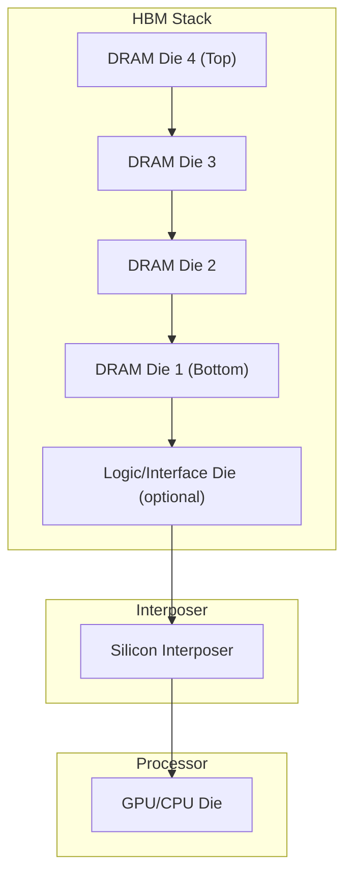
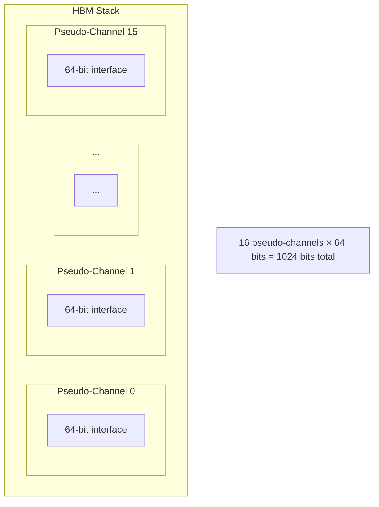

# HBM (High Bandwidth Memory)

## Overview

**HBM** (High Bandwidth Memory) is a stacked DRAM technology that achieves extremely high bandwidth with excellent power efficiency. By stacking multiple DRAM dies vertically and connecting them with through-silicon vias (TSVs), HBM provides massive bandwidth in a compact package. It's used in high-end GPUs, AI accelerators, and HPC systems.

## How HBM Works

### 3D Stacking



- **4-16 DRAM dies** stacked vertically
- Connected by **TSVs** (Through-Silicon Vias) — vertical electrical connections through silicon
- Mounted on a **silicon interposer** alongside the processor
- **1024-bit wide interface** per stack (vs 32-bit for GDDR)

### Through-Silicon Vias (TSVs)

```
TSV: Vertical metal connection through silicon die

┌──────────┐
│ Die 3    │──┐
│          │  │ TSV
│ Die 2    │──┤
│          │  │ TSV
│ Die 1    │──┘
└──────────┘
```

TSVs provide thousands of vertical connections with:
- Very short signal paths → low latency
- Wide buses → high bandwidth
- Low power → shorter wires need less drive strength

## HBM Generations

| Generation | Year | Bandwidth/Stack | Capacity/Stack | Interface | Data Rate |
|------------|------|-----------------|----------------|-----------|-----------|
| HBM1 | 2014 | 128 GB/s | 4 GB | 1024-bit | 1 Gbps |
| HBM2 | 2016 | 256 GB/s | 8 GB | 1024-bit | 2 Gbps |
| HBM2E | 2020 | 461 GB/s | 16 GB | 1024-bit | 3.6 Gbps |
| HBM3 | 2022 | 819 GB/s | 16-24 GB | 1024-bit | 6.4 Gbps |
| HBM3E | 2024 | 1.2 TB/s | 24-36 GB | 1024-bit | 9.2 Gbps |

## HBM Bandwidth Calculation

```
Bandwidth = Interface Width × Data Rate × Channels / 8

HBM2: 1024 bits × 2 Gbps / 8 = 256 GB/s per stack
HBM3: 1024 bits × 6.4 Gbps / 8 = 819 GB/s per stack
```

### Multi-Stack Configurations

| Device | Stacks | Total Bandwidth | Total Capacity |
|--------|--------|-----------------|----------------|
| NVIDIA A100 | 5 × HBM2E | 2 TB/s | 80 GB |
| NVIDIA H100 | 5 × HBM3 | 3.35 TB/s | 80 GB |
| NVIDIA H200 | 5 × HBM3E | 4.8 TB/s | 141 GB |
| AMD MI300X | 8 × HBM3 | 5.3 TB/s | 192 GB |

## HBM vs GDDR6

| Property | HBM2E | GDDR6X |
|----------|-------|--------|
| Bandwidth/stack | 461 GB/s | ~100 GB/s/chip |
| Interface width | 1024-bit | 16-bit/chip |
| Power efficiency | ~7 GB/s/W | ~3 GB/s/W |
| Capacity/stack | 16 GB | 2 GB/chip |
| Form factor | Stacked on interposer | Discrete on PCB |
| Cost | Very high | Moderate |
| Latency | Moderate | Moderate |

### Power Efficiency

HBM's key advantage is **bandwidth per watt**:

```
HBM2E:  461 GB/s ÷ ~15W = ~31 GB/s/W
GDDR6X: 100 GB/s ÷ ~12W = ~8 GB/s/W
```

HBM is ~4× more power-efficient for bandwidth.

## HBM Architecture

### Channel Architecture

Each HBM stack has multiple independent channels:



HBM2 introduced **pseudo-channels**: splitting each 128-bit channel into two 64-bit pseudo-channels for better utilization.

### Stack Structure

```
HBM2E Stack (8-Hi):
┌─────────────────┐
│ DRAM Die 8      │  ← Top
│ DRAM Die 7      │
│ DRAM Die 6      │
│ DRAM Die 5      │
│ DRAM Die 4      │
│ DRAM Die 3      │
│ DRAM Die 2      │
│ DRAM Die 1      │  ← Bottom (connected to base die)
├─────────────────┤
│ Base Die        │  ← Interface logic, I/O drivers
├─────────────────┤
│ Substrate       │
└─────────────────┘

Each die: 2 GB (8-Hi × 2 GB = 16 GB)
```

## Silicon Interposer

The **silicon interposer** is a passive silicon substrate that:
1. Provides high-density wiring between HBM stacks and processor
2. Enables 1024-bit wide connections (impossible on PCB)
3. Reduces signal distance and power

```
┌──────────────────────────────────┐
│         Silicon Interposer       │
│  ┌─────┐  ┌──────┐  ┌─────┐    │
│  │HBM 0│  │      │  │HBM 1│    │
│  └─────┘  │ GPU  │  └─────┘    │
│  ┌─────┐  │ Die  │  ┌─────┐    │
│  │HBM 2│  │      │  │HBM 3│    │
│  └─────┘  └──────┘  └─────┘    │
└──────────────────────────────────┘
```

## CoWoS (Chip-on-Wafer-on-Substrate)

TSMC's **CoWoS** technology integrates HBM with the processor:

1. HBM stacks and processor die placed on a silicon interposer
2. Interposer mounted on a package substrate
3. Entire assembly is one package

Used in: NVIDIA A100, H100, AMD MI300X.

## Interview Questions

1. **Q**: What is HBM and why is it used?
   **A**: High Bandwidth Memory — stacked DRAM connected by TSVs on a silicon interposer. It provides massive bandwidth (up to 1.2 TB/s per stack) with excellent power efficiency. Used in GPUs, AI accelerators, and HPC where bandwidth is critical.

2. **Q**: How does HBM achieve higher bandwidth than GDDR?
   **A**: HBM uses a 1024-bit wide interface (vs 16-bit per GDDR chip), achieved through 3D stacking with TSVs and silicon interposer. The wide interface means lower clock speeds can still achieve high bandwidth.

3. **Q**: What are TSVs?
   **A**: Through-Silicon Vias — vertical electrical connections through silicon dies. They enable the 1024-bit wide interface between stacked DRAM dies and between the stack and the interposer.

4. **Q**: Why is HBM more power-efficient than GDDR?
   **A**: Shorter signal paths (TSVs are microns long vs centimeters for PCB traces), lower clock speeds (wide interface compensates), and less I/O driver power. HBM achieves ~31 GB/s/W vs ~8 GB/s/W for GDDR6X.

5. **Q**: What is a silicon interposer?
   **A**: A passive silicon substrate that provides high-density wiring between HBM stacks and the processor die. It enables 1024-bit wide connections that would be impossible on a regular PCB.

## Common Mistakes

- ❌ Confusing HBM with GDDR (HBM = stacked, high bandwidth; GDDR = discrete, high bandwidth)
- ❌ Not knowing TSVs (the key enabling technology)
- ❌ Assuming HBM is just "faster DRAM" (it's a packaging/architecture innovation)
- ❌ Forgetting that HBM requires a silicon interposer
- ❌ Confusing HBM bandwidth per stack vs total system bandwidth

## Summary

HBM achieves massive bandwidth through 3D stacking of DRAM dies connected by TSVs on a silicon interposer. HBM3E provides up to 1.2 TB/s per stack with excellent power efficiency (~31 GB/s/W). It's the memory technology of choice for AI accelerators and HPC, where bandwidth and power efficiency are paramount.

## Cross-References

- [DRAM](dram.md) — Base DRAM technology
- [GDDR](gddr.md) — GPU memory alternative
- [GPU](../parallelism/gpu.md) — Why GPUs need HBM
- [Memory Hierarchy](../memory-hierarchy/README.md) — Where HBM fits

## Cross References

- [GDDR](gddr.md)
- [GPU](../parallelism/gpu.md)
- [LLM Inference](../../llm/llm-serving/inference.md)
