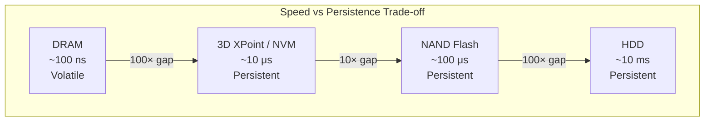
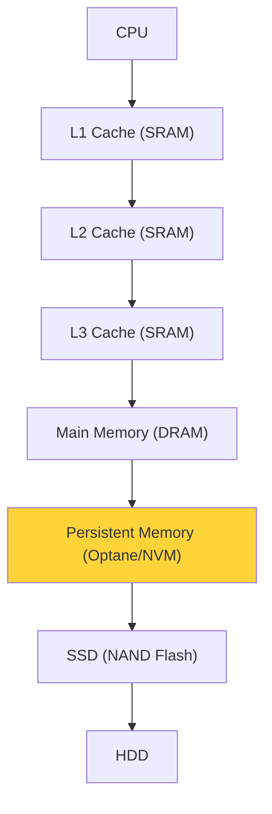

# Non-Volatile Memory (NVM)

## Overview

**Non-volatile memory (NVM)** retains data without power. While volatile memory (SRAM, DRAM) is used for caches and main memory, NVM is used for persistent storage and increasingly as a new tier in the memory hierarchy. Technologies include NAND Flash, NOR Flash, 3D XPoint (Optane), and emerging technologies like MRAM and ReRAM.

## NVM Technologies

### NAND Flash

The dominant storage technology in SSDs, USB drives, and memory cards.

**How it works**: Data stored as trapped charge on a floating gate (or charge trap in 3D NAND).

```
Control Gate
    │
┌───┴───┐
│ Oxide │
├───────┤
│Floating│ ← Trapped charge represents data
│ Gate   │
├───────┤
│ Oxide │
├───────┤
│Channel │
└───────┘
  Source    Drain
```

| Property | Value |
|----------|-------|
| Read latency | 25-100 μs |
| Write latency | 200-2000 μs |
| Erase latency | 2-10 ms |
| Endurance | 100-3000 P/E cycles (TLC/QLC) |
| Density | Very high (100+ layers in 3D NAND) |
| Cost/GB | ~$0.05-0.10 |

**Cell types**:
- **SLC** (1 bit/cell): Fastest, most endurance (100K P/E cycles)
- **MLC** (2 bits/cell): Moderate speed/endurance
- **TLC** (3 bits/cell): Common in consumer SSDs
- **QLC** (4 bits/cell): Highest density, lowest endurance

### NOR Flash

Used for firmware storage (BIOS, embedded systems).

| Property | NAND | NOR |
|----------|------|-----|
| Read speed | Moderate | Fast (XIP capable) |
| Write speed | Fast | Slow |
| Density | High | Low |
| Random read | Slow | Fast |
| Use case | Mass storage | Firmware, code storage |

**XIP (Execute in Place)**: NOR flash can be read like RAM, allowing code execution directly from flash.

### 3D XPoint (Intel Optane)

Developed by Intel and Micron. A fundamentally different technology from NAND.

**How it works**: Changes resistance of bulk material (phase change or resistive switching).

| Property | 3D XPoint | NAND Flash | DRAM |
|----------|-----------|------------|------|
| Read latency | ~10 μs | ~25-100 μs | ~50-100 ns |
| Write latency | ~10 μs | ~200-2000 μs | ~50-100 ns |
| Endurance | ~10M cycles | ~100-3000 cycles | Unlimited |
| Density | Moderate | High | Low |
| Byte-addressable | Yes | No (page-level) | Yes |
| Volatile | No | No | Yes |

**Note**: Intel discontinued Optane in 2022, but the technology influenced the industry.

### Emerging Technologies

| Technology | Speed | Endurance | Status |
|------------|-------|-----------|--------|
| **MRAM** (Magnetoresistive RAM) | ~10 ns | Unlimited | Production (embedded) |
| **ReRAM** (Resistive RAM) | ~10 ns | ~1M cycles | R&D, some production |
| **FeRAM** (Ferroelectric RAM) | ~30 ns | ~10^12 cycles | Embedded applications |
| **PCM** (Phase Change Memory) | ~50 ns | ~10^9 cycles | Research |

## The Storage/Memory Gap



NVM fills the gap between DRAM and NAND flash, offering near-DRAM speed with persistence.

## Persistent Memory (PMEM)

Intel's **Optane DC Persistent Memory** (now discontinued) was the first commercial persistent memory product:

### Form Factor
- DDR4-compatible DIMM slot
- Up to 512 GB per module
- 6 modules per channel = 3 TB per socket

### Operating Modes

**Memory Mode**: Acts as slow, large DRAM
```
┌─────────────┐
│ Optane PMEM │ ← Looks like DRAM to OS
│ (volatile)  │
└─────────────┘
┌─────────────┐
│ DRAM Cache  │ ← Invisible to OS, acts as cache
└─────────────┘
```

**App Direct Mode**: Application-aware persistence
```
┌─────────────┐
│ Optane PMEM │ ← Persistent, byte-addressable
│ (persistent)│
└─────────────┘
┌─────────────┐
│ DRAM        │ ← Normal volatile memory
└─────────────┘
```

### Persistence Challenges

With persistent memory, the CPU's write buffers and caches can reorder writes. Ensuring data is actually persistent requires:

```c
// Write data
*persistent_ptr = value;
// Ensure write reaches persistent media
_clwb(persistent_ptr);  // Cache Line Write Back
_sfence();               // Store fence (serialization)
```

## NVM in the Memory Hierarchy



## Storage Class Memory

NVM bridges storage and memory:
- **Byte-addressable** like DRAM (can be accessed via load/store)
- **Persistent** like storage (data survives power loss)
- **Slower than DRAM** but much faster than NAND

This creates a new tier: **Storage Class Memory (SCM)**.

## Interview Questions

1. **Q**: What is non-volatile memory and how does it differ from DRAM?
   **A**: NVM retains data without power (persistent). DRAM loses data when powered off (volatile). NVM technologies (NAND, 3D XPoint) are slower than DRAM but much faster than traditional storage. They fill the gap between DRAM and SSDs.

2. **Q**: What are the differences between SLC, MLC, TLC, and QLC NAND?
   **A**: They differ in bits stored per cell: SLC=1, MLC=2, TLC=3, QLC=4. More bits per cell means higher density but lower speed, lower endurance, and higher error rates. SLC is fastest and most durable; QLC is cheapest per GB.

3. **Q**: What is 3D XPoint and why was it significant?
   **A**: Intel/Micron's technology that was ~100× faster than NAND, ~10× slower than DRAM, byte-addressable, and persistent. It offered ~10M write endurance cycles (vs ~1000 for NAND). Though discontinued, it demonstrated the viability of storage-class memory.

4. **Q**: What is the difference between Memory Mode and App Direct Mode for persistent memory?
   **A**: Memory Mode treats PMEM as slow DRAM (volatile from the application's perspective, DRAM acts as cache). App Direct Mode exposes PMEM as persistent memory that applications can directly manage. Memory Mode is transparent; App Direct requires application awareness.

5. **Q**: Why is persistence challenging with CPU caches?
   **A**: CPU caches and write buffers can reorder and delay writes. A write might be in the cache but not yet in persistent media. Ensuring persistence requires explicit cache line writeback (CLWB) and memory fences (SFENCE) to force data to persistent media.

## Common Mistakes

- ❌ Confusing NAND (block-level) with DRAM (byte-addressable)
- ❌ Assuming NVM is as fast as DRAM (10-100× slower)
- ❌ Not knowing that NAND has limited write endurance
- ❌ Forgetting that persistence requires explicit cache management
- ❌ Confusing SLC/MLC/TLC/QLC endurance characteristics

## Summary

NVM technologies bridge the gap between volatile DRAM and traditional storage. NAND Flash (SLC to QLC) dominates storage with varying speed/endurance/density trade-offs. 3D XPoint offered near-DRAM speed with persistence but was discontinued. Emerging technologies (MRAM, ReRAM) continue to evolve. Persistent memory requires careful handling of CPU caches to ensure data durability.

## Cross-References

- [DRAM](dram.md) — Volatile main memory
- [SRAM](sram.md) — Cache technology
- [SSD](../../storage/ssd.md) — NAND Flash in SSDs
- [Storage Overview](../../storage/overview.md) — Storage technologies
- [Memory Hierarchy](../memory-hierarchy/README.md) — Where NVM fits
