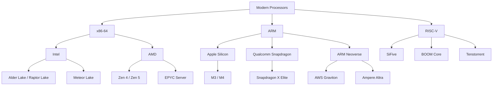
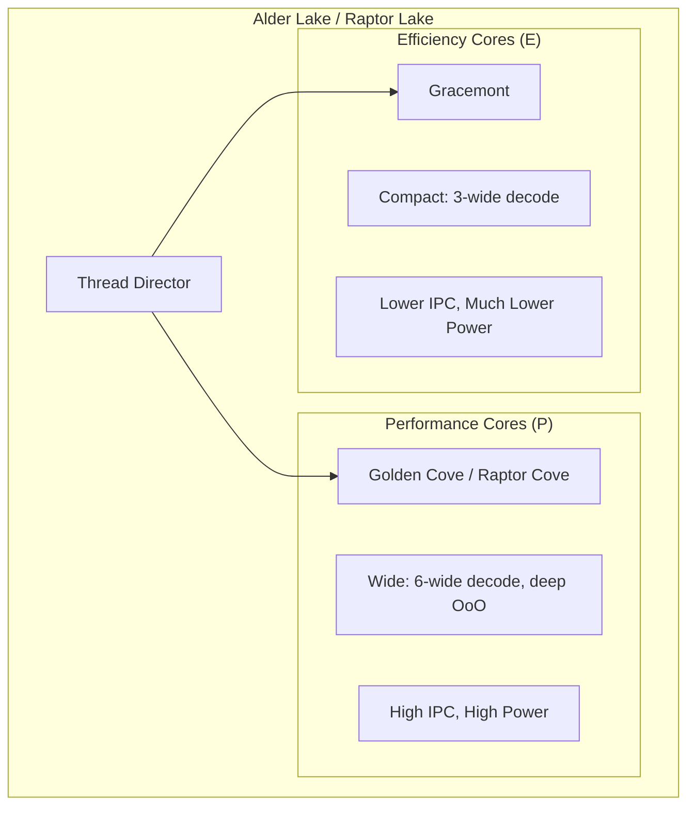
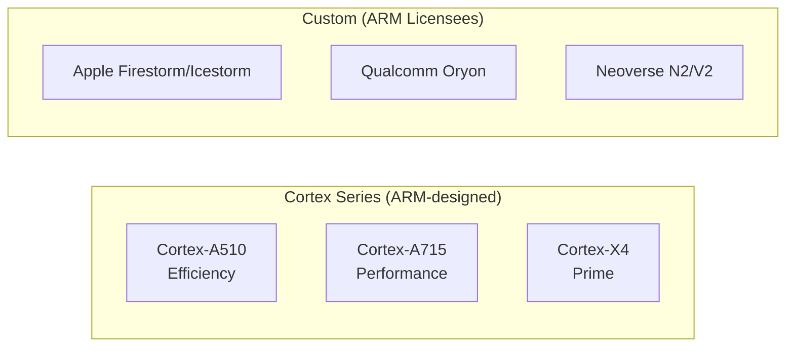
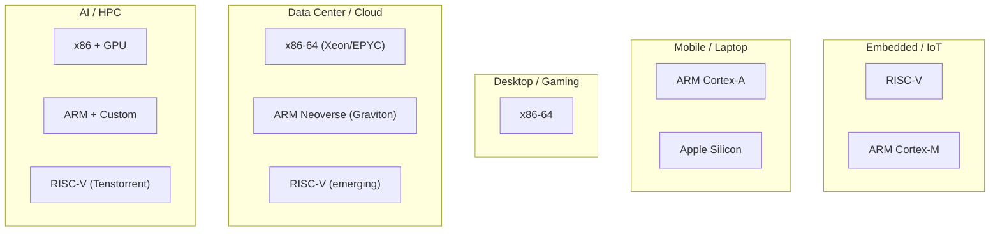

# Modern Processors

## Overview

This section covers the major processor architectures in use today: **x86-64** (Intel/AMD), **ARM** (mobile, server, Apple Silicon), and **RISC-V** (open-source). We also cover specific modern implementations: Apple Silicon, Intel Alder Lake, and AMD Zen. Understanding these architectures is essential for system design interviews.

## The Modern Processor Landscape



## Architecture Comparison

| Feature | x86-64 | ARM (AArch64) | RISC-V |
|---------|--------|---------------|--------|
| **ISA Type** | CISC (internally RISC-like) | RISC | RISC |
| **Instruction Length** | Variable (1-15 bytes) | Fixed (4 bytes) | Fixed (4 bytes, compressed 2) |
| **Registers** | 16 GPRs | 31 GPRs | 31 GPRs (RV64I) |
| **Memory Model** | TSO (Total Store Order) | Weakly ordered | Weakly ordered |
| **Privilege Levels** | Ring 0-3 | EL0-EL3 | U/S/M modes |
| **License** | Proprietary (Intel/AMD cross-license) | Licensed from ARM Ltd | Open-source (RISC-V Foundation) |
| **Primary Market** | Desktop, Server | Mobile, Server, Laptop | Embedded, Emerging |
| **Key Strength** | Legacy compatibility, high single-thread | Power efficiency, scalable | Customizable, royalty-free |

## x86-64: The Legacy Powerhouse

### Historical Evolution

```text
8086 (1978) → 386 (1985) → Pentium (1993) → Core 2 (2006) → Skylake (2015) → Alder Lake (2021) → Arrow Lake (2024)
   16-bit        32-bit       Superscalar      Multi-core      Hybrid P+E        Chiplet design
```

### x86-64 Key Features

- **Variable-length instructions**: 1–15 bytes, complex decode
- **Micro-ops**: Complex x86 instructions decoded into simpler micro-ops internally
- **TSO memory model**: Relatively strong ordering, easier for programmers
- **Legacy support**: Can run code from the 1980s (with mode switches)
- **SSE/AVX**: SIMD extensions (128→256→512-bit vectors)

### Modern x86 Implementations

| Processor | Year | Cores | Process | Key Innovation |
|-----------|------|-------|---------|----------------|
| Intel Skylake | 2015 | 4-18 | 14nm | Long-lived mainstream design |
| Intel Alder Lake | 2021 | 16 (8P+8E) | Intel 7 | Hybrid P+E cores |
| Intel Meteor Lake | 2023 | 14 (6P+8E) | Intel 4 | Chiplet/tile design |
| AMD Zen 4 | 2022 | 16-96 | 5nm | 3D V-Cache, chiplet |
| AMD Zen 5 | 2024 | 16-192 | 4nm | 2-wide fetch, improved IPC |

### Intel Hybrid Architecture (P-cores + E-cores)



**Thread Director**: Hardware-based scheduler that guides the OS on which threads go to P-cores vs E-cores based on workload characteristics.

## ARM: The Efficiency King

### ARM Architecture Generations

| Version | Year | Key Feature |
|---------|------|-------------|
| ARMv7 | 2004 | 32-bit, Thumb-2 |
| ARMv8-A | 2011 | 64-bit (AArch64), 31 GPRs |
| ARMv9-A | 2021 | SVE2, RME (security), PAC |
| ARMv9.2 | 2023 | SME (Scalable Matrix Extension) |

### ARM Design Philosophy

- **Fixed-length instructions**: 4 bytes (AArch64), simpler decode
- **Load/Store architecture**: Only load/store instructions access memory
- **Conditional execution**: Many instructions can be predicated
- **Weak memory model**: Allows more hardware optimization
- **Scalable**: Same ISA from microcontrollers to supercomputers

### ARM Implementations



| Core | Type | Target | IPC (relative) |
|------|------|--------|----------------|
| Cortex-A510 | In-order, efficiency | Mobile little cores | 1.0× |
| Cortex-A715 | OoO, performance | Mobile big cores | 2.5× |
| Cortex-X4 | OoO, prime | Mobile prime cores | 3.5× |
| Apple M3 P-core | Wide OoO | Laptop/Desktop | 4.0× |
| Neoverse V2 | Wide OoO | Server (Graviton 3) | 3.8× |

### Apple Silicon: ARM's Showcase

```text
Apple M1 (2020):  8 cores (4P+4E), 5nm, unified memory
Apple M2 (2022):  8 cores (4P+4E), 5nm, 20B transistors
Apple M3 (2023):  8 cores (4P+4E), 3nm, 25B transistors
Apple M4 (2024):  10 cores (4P+6E), 3nm, enhanced Neural Engine
```

**Key innovations:**
- **Unified Memory Architecture (UMA)**: CPU, GPU, Neural Engine share same memory
- **Wide decode**: 8-wide decode (among the widest in the industry)
- **High single-thread**: Competitive with desktop x86 at lower power
- **Custom GPU**: Designed in-house, not using ARM Mali

## RISC-V: The Open-Source ISA

### What Makes RISC-V Special

- **Open standard**: No licensing fees, anyone can implement
- **Modular**: Base ISA + optional extensions
- **Clean slate**: No legacy baggage, designed for modern workloads
- **Growing ecosystem**: From embedded to HPC

### RISC-V ISA Structure

```text
RV32I / RV64I / RV128I    ← Base Integer ISA (required)
    ├── M: Multiply/Divide
    ├── A: Atomic operations
    ├── F: Single-precision FP
    ├── D: Double-precision FP
    ├── C: Compressed instructions (16-bit)
    ├── V: Vector extension
    ├── B: Bit manipulation
    └── Custom extensions (manufacturer-defined)
```

### RISC-V Implementations

| Processor | Type | Target | Notes |
|-----------|------|--------|-------|
| SiFive P670 | OoO, high-perf | Embedded/Automotive | ARM A75 competitor |
| SiFive P870 | OoO, server | Data center | ARM Neoverse competitor |
| BOOM v3 | OoO, academic | Research/ASIC | Berkeley Out-of-Order Machine |
| Tenstorrent Ascalon | OoO, AI | AI/HPC | Jim Keller's company |
| StarFive JH7110 | In-order | SBC/Embedded | Raspberry Pi competitor |

### RISC-V vs ARM vs x86: Market Positioning



## Key Architectural Trends

### 1. Chiplet Design

Instead of one large monolithic die, modern CPUs use multiple smaller chiplets:

```text
Monolithic (traditional):
┌─────────────────────────────────────┐
│  Single die: cores + cache + I/O   │
│  Yield issues on large dies        │
└─────────────────────────────────────┘

Chiplet (modern):
┌──────────┐  ┌──────────┐  ┌──────────┐
│ Core Die │  │ Core Die │  │ I/O Die  │
│  (CCD)   │  │  (CCD)   │  │  (IOD)   │
└──────────┘  └──────────┘  └──────────┘
     └────────────┬────────────┘
           Interconnect (Infinity Fabric / UCIe)
```

**Benefits**: Better yields, mix process nodes, modular scaling

### 2. Specialized Accelerators

| Accelerator | Purpose | Examples |
|-------------|---------|---------|
| **GPU** | Parallel compute, graphics | NVIDIA, AMD, Apple |
| **NPU/TPU** | Neural network inference | Apple Neural Engine, Google TPU |
| **Media Engine** | Video encode/decode | Apple ProRes, Intel QuickSync |
| **Security** | Encryption, attestation | ARM TrustZone, Intel SGX |

### 3. Memory Architecture Evolution

| Approach | Description | Example |
|----------|-------------|---------|
| **Discrete** | Separate CPU and DRAM packages | Traditional desktop |
| **HBM** | Stacked memory on package | AMD EPYC, Intel Xeon |
| **Unified Memory** | Shared memory pool | Apple M-series |
| **CXL** | Cache-coherent interconnect for memory pooling | Server expansion |

## Interview Questions

**Q: Compare x86, ARM, and RISC-V at a high level.**

A: x86 is CISC-based with variable-length instructions and a strong memory model (TSO), dominant in desktop/server but power-hungry. ARM is RISC-based with fixed-length instructions and a weak memory model, dominant in mobile and growing in servers (Graviton, Apple Silicon). RISC-V is an open-source RISC ISA that's modular and royalty-free, currently strong in embedded and emerging in servers. Modern x86 internally converts to micro-ops, so the CISC/RISC distinction matters less for performance than for decode complexity and power.

**Q: What is Intel's hybrid architecture and why was it introduced?**

A: Alder Lake (2021) introduced Performance cores (P-cores, Golden Cove) for high single-thread performance and Efficiency cores (E-cores, Gracemont) for multi-threaded throughput at lower power. The Thread Director hardware guides the OS scheduler. This mirrors ARM's big.LITTLE approach. The benefit is better performance per watt: background tasks run on E-cores, demanding tasks get P-cores.

**Q: Why is RISC-V gaining traction despite ARM and x86 dominance?**

A: RISC-V is open-source (no licensing fees), modular (add custom extensions), and has a clean design without legacy baggage. It's attractive for: 1) embedded systems where cost matters, 2) companies wanting custom accelerators integrated into the ISA, 3) academic research, 4) countries/companies wanting ISA independence (China, India). The ecosystem is still maturing for high-performance computing.

**Q: What is Apple Silicon's key advantage?**

A: Apple's M-series chips use ARM architecture with a very wide decode (8-wide), unified memory architecture (CPU/GPU/Neural Engine share memory), and tight hardware-software integration. The unified memory eliminates CPU-GPU data copies. Apple's vertical integration (designing both chip and OS) allows optimization that's impossible for Intel/AMD with Windows/Linux.

## Cross-References

- [x86-64](x86-64.md) — Intel/AMD architecture
- [ARM](arm.md) — ARM architecture
- [RISC-V](risc-v.md) — Open-source ISA
- [Apple Silicon](apple-silicon.md) — Apple's ARM implementation
- [Alder Lake](alder-lake.md) — Intel hybrid architecture
- [AMD Zen](amd-zen.md) — AMD's chiplet design
- [CPU Architecture](../cpu/README.md)
- [Pipelining](../pipelining/README.md)
