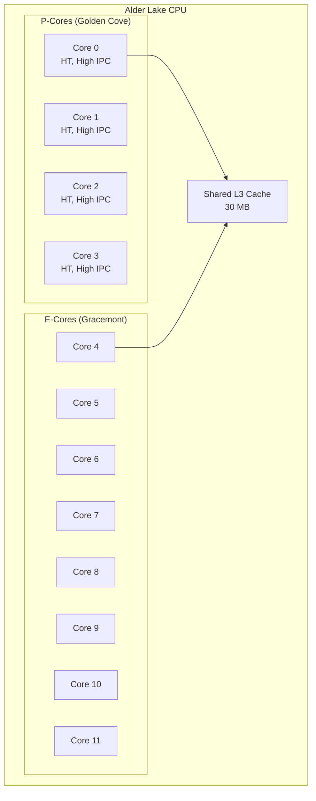
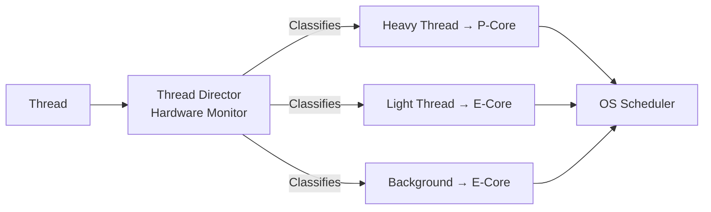

# Intel Alder Lake

## Overview

**Alder Lake** (12th Gen Intel Core, 2021) is Intel's first mainstream desktop/laptop processor to use a **hybrid architecture**, combining high-performance **P-cores** (Golden Cove) with power-efficient **E-cores** (Gracemount). This design, similar in concept to ARM's big.LITTLE, represents a major shift in Intel's x86 architecture strategy.

## Detailed Explanation

### Hybrid Architecture



### P-Core vs E-Core

| Feature | P-Core (Golden Cove) | E-Core (Gracemont) |
|---------|---------------------|-------------------|
| **Decode Width** | 6-wide | 3-wide (per core) |
| **Pipeline Depth** | ~20 stages | ~16 stages |
| **OoO Window** | 512-entry ROB | 256-entry ROB |
| **Execution Units** | 5 ALU, 3 FP | 3 ALU, 2 FP |
| **Hyper-Threading** | Yes (2 threads) | No |
| **Clock Speed** | Up to 5.2 GHz | Up to 3.9 GHz |
| **IPC** | ~1.0× (baseline) | ~0.65× of P-core |
| **Power** | High | Low |
| **Use Case** | Single-thread, gaming | Multi-thread, background |

### Thread Director

Intel's **Thread Director** is a hardware-based scheduling technology:



```
Thread Director works with the OS scheduler:
  1. Hardware monitors each thread's behavior
  2. Classifies: compute-heavy, memory-bound, background, etc.
  3. Recommends P-core or E-core to the OS
  4. OS scheduler (Windows 11, Linux 6.2+) follows recommendations

Without Thread Director (Windows 10, older Linux):
  - OS makes scheduling decisions without hardware hints
  - May put heavy threads on E-cores (poor performance)
  - Or light threads on P-cores (wastes power)
```

### SKU Configurations

| SKU | P-Cores | E-Cores | Total Threads | L3 Cache | TDP |
|-----|---------|---------|---------------|----------|-----|
| i9-12900K | 8 | 8 | 24 | 30 MB | 125W (PBP) |
| i7-12700K | 8 | 4 | 20 | 25 MB | 125W (PBP) |
| i5-12600K | 6 | 4 | 16 | 20 MB | 125W (PBP) |
| i5-12400 | 6 | 0 | 12 | 18 MB | 65W (PBP) |
| i9-12900HK (laptop) | 6 | 8 | 20 | 24 MB | 45W (PBP) |

**PBP** = Processor Base Power (sustained)
**MTP** = Maximum Turbo Power (boost, can be 241W for i9-12900K)

### Golden Cove P-Core Microarchitecture

```
Front-end:
  - 6-wide decode (up from 4-wide in Willow Cove)
  - 32 KB L1I cache, 8-way
  - 64 KB µop cache (decoded instructions)
  - Branch predictor: improved TAGE

Back-end:
  - 512-entry ROB (up from 352)
  - 5 integer ALUs (3 simple + 2 complex)
  - 3 FP/SIMD execution ports
  - 3 load + 2 store ports
  - 48 KB L1D cache, 12-way
  
Execution ports:
  Port 0: ALU, FP multiply, SIMD
  Port 1: ALU, FP add, SIMD
  Port 2: Load
  Port 3: Load
  Port 4: Store data
  Port 5: ALU, shuffle
  Port 6: ALU, branch
  Port 7: Store address
  Port 8: Store address
  Port 9: Store data
```

### Gracemont E-Core Microarchitecture

```
Front-end:
  - 3-wide decode
  - 32 KB L1I cache, 8-way
  - 64 KB µop cache
  - No hyper-threading

Back-end:
  - 256-entry ROB
  - 3 integer ALUs
  - 2 FP/SIMD execution ports
  - 2 load + 1 store port

Key: Two E-core clusters share an L2 cache
  - 4 E-cores per cluster
  - 2 MB L2 per cluster
  - Effective: 4-wide decode cluster = good throughput
```

### Performance Impact

```
Single-thread (P-core vs previous gen):
  Golden Cove: +19% IPC vs Cypress Cove (11th gen)
  Higher clock: 5.2 GHz vs 5.0 GHz boost

Multi-thread (adding E-cores):
  i9-12900K (8P+8E): vs i9-11900K (8P only)
  Cinebench R23: ~30% faster multi-thread
  Power: Similar or lower (E-cores are very efficient)

Gaming:
  P-cores handle game threads (high IPC, high clocks)
  E-cores handle background tasks (OS, Discord, streaming)
  Net result: Better gaming performance with background apps running
```

## Examples

### Example 1: Thread Director in Action

```
Scenario: Gaming + Streaming

Without Thread Director:
  P-core 0: Game render thread (good)
  P-core 1: OBS encoding (wastes P-core for background task)
  P-core 2: Game physics (good)
  E-core 0: OS services (good)

With Thread Director:
  P-core 0: Game render thread (heavy, latency-sensitive)
  P-core 1: Game physics (heavy, latency-sensitive)
  E-core 0: OBS encoding (background, throughput-oriented)
  E-core 1: OS services (background)
  
Result: Game gets more P-core time, OBS runs on efficient E-cores
```

### Example 2: Cache Hierarchy

```
Alder Lake i9-12900K:

Per P-Core:
  L1I: 32 KB, 8-way
  L1D: 48 KB, 12-way
  L2: 1.25 MB, 10-way

Per E-Core Cluster (4 cores):
  L1I: 32 KB per core, 8-way
  L1D: 32 KB per core, 8-way
  L2: 2 MB shared, 16-way

Shared:
  L3: 30 MB, 12-way, inclusive (contains L2 data)
```

### Example 3: DDR5 Support

```
Alder Lake was Intel's first DDR5 platform:

DDR5-4800 (JEDEC standard):
  - 4800 MT/s base speed
  - Two 32-bit channels per DIMM (vs one 64-bit for DDR4)
  - On-DIMM voltage regulation (PMIC)
  - Higher density: up to 64 GB per DIMM

Also supports DDR4 (motherboard dependent):
  - DDR4-3200
  - Same LGA1700 socket, different motherboards
```

## Interview Questions

### Q1: What is Alder Lake's hybrid architecture?
**Answer**: Alder Lake combines high-performance P-cores (Golden Cove) with power-efficient E-cores (Gracemont) on the same die. P-cores handle single-threaded and latency-sensitive workloads; E-cores handle multi-threaded and background tasks. Intel's Thread Director hardware helps the OS scheduler assign threads to the right core type.

### Q2: How does Thread Director work?
**Answer**: Thread Director is hardware that monitors each thread's behavior (instruction mix, memory access patterns) and classifies it (compute-heavy, memory-bound, background). It communicates recommendations to the OS scheduler, which assigns threads to P-cores or E-cores accordingly. This requires OS support (Windows 11, Linux 6.2+).

### Q3: What's the difference between PBP and MTP?
**Answer**: PBP (Processor Base Power) is the sustained power consumption under normal load. MTP (Maximum Turbo Power) is the peak power during boost. For the i9-12900K, PBP is 125W but MTP is 241W. The CPU can sustain MTP only briefly before thermal throttling.

### Q4: Why do E-cores lack Hyper-Threading?
**Answer**: E-cores are designed for power efficiency, not maximum throughput. Hyper-Threading adds complexity and power consumption for a ~15-30% throughput gain. Since E-cores are already power-constrained and there are many of them, the simpler design without HT is more efficient.

### Q5: How does Alder Lake compare to Apple M1 Pro?
**Answer**: Both use hybrid architectures, but Apple's design is more power-efficient due to ARM's simpler ISA and unified memory. Alder Lake's P-cores have higher raw performance and clock speeds, while Apple's cores are wider with better IPC. For sustained workloads, Apple often wins on perf/watt; for burst performance, Intel can be competitive.

## Common Mistakes

1. **Confusing E-cores with Atom** — Gracemont E-cores are not Atoms. They're 3-wide out-of-order cores with competitive IPC—much more capable than old Atom designs.
2. **Thinking E-cores are optional** — Some workloads (video encoding, compilation) heavily benefit from E-cores. Disabling them in BIOS reduces multi-thread performance.
3. **Ignoring Thread Director requirements** — Without proper OS support (Windows 11, recent Linux), the scheduler can't effectively use the hybrid design, leading to suboptimal performance.
4. **Comparing core counts directly** — 8P+8E ≠ 16 identical cores. The 8 E-cores collectively provide roughly 5-6 P-cores worth of throughput.

## Summary

| Aspect | Detail |
|--------|--------|
| **Architecture** | Hybrid: P-cores (Golden Cove) + E-cores (Gracemont) |
| **P-Core** | 6-wide decode, 512 ROB, up to 5.2 GHz, HT |
| **E-Core** | 3-wide decode, 256 ROB, up to 3.9 GHz, no HT |
| **Thread Director** | Hardware thread classification for OS scheduler |
| **Process** | Intel 7 (10nm Enhanced SuperFin) |
| **Memory** | DDR5-4800 or DDR4-3200 |
| **Socket** | LGA 1700 |

## Cross-References

- [AMD Zen](./amd-zen.md) — AMD's competitive response
- [Apple Silicon](./apple-silicon.md) — ARM hybrid design comparison
- [Superscalar](../pipelining/superscalar.md) — Wide decode enables high IPC
- [Out-of-Order Execution](../pipelining/ooo.md) — Both P and E cores are OoO
- [x86-64](./x86-64.md) — The ISA Alder Lake implements
