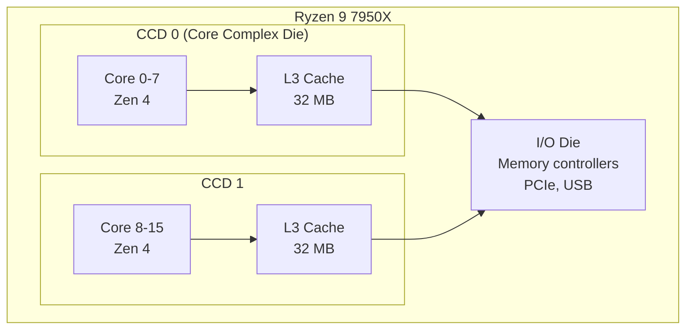
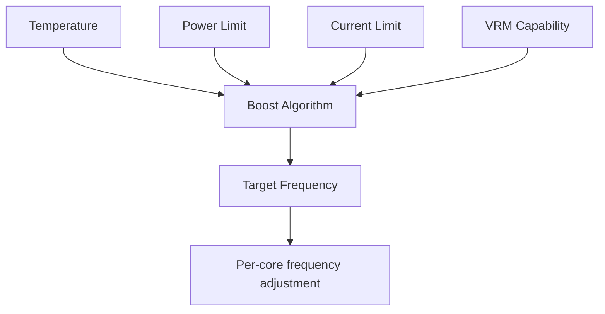

# AMD Zen Architecture

## Overview

**Zen** is AMD's modern x86-64 microarchitecture family, first released in 2017. Zen represented AMD's return to competitive high-performance CPUs after years of trailing Intel. Through multiple generations (Zen, Zen 2, Zen 3, Zen 4, Zen 5), AMD has consistently improved IPC, core counts, and power efficiency, powered by a chiplet-based design philosophy.

## Detailed Explanation

### Zen Evolution

| Generation | Year | Process | IPC Gain | Key Changes |
|-----------|------|---------|----------|-------------|
| **Zen 1** | 2017 | 14nm | Baseline | SMT, µop cache, 2× IPC vs Bulldozer |
| **Zen+** | 2018 | 12nm | +3% | Precision Boost 2, cache latency improvements |
| **Zen 2** | 2019 | 7nm | +15% | Doubled L3, 2× FP width, chiplet design |
| **Zen 3** | 2020 | 7nm | +19% | Unified 8-core CCD, wider frontend |
| **Zen 4** | 2022 | 5nm | +13% | AVX-512, AI extensions, DDR5 |
| **Zen 5** | 2024 | 4nm/3nm | +16% | 2-wide dispatch, AI, RDNA2 iGPU |

### Chiplet Design

AMD's key innovation is the **chiplet** approach:



```
Chiplet advantages:
  - CCDs use leading-edge process (5nm for compute)
  - IOD uses older, cheaper process (6nm)
  - Higher yields (smaller dies = fewer defects)
  - Mix and match: same CCD for desktop and server
  - Cost effective for high core counts

Comparison with monolithic:
  Intel: Monolithic die (all on one process)
  AMD: Chiplets (compute on best process, I/O on cheaper process)
```

### Zen 4 Microarchitecture

```
Front-end:
  - 4-wide decode
  - 6.75K µop cache (up from 4K in Zen 3)
  - Improved branch predictor (TAGE-like)
  - 32 KB L1I, 8-way

Back-end:
  - 320-entry ROB (up from 256)
  - 6 integer ALUs (4 simple + 2 complex)
  - 4 FP/SIMD execution units
  - 3 load + 2 store ports
  - 32 KB L1D, 8-way
  
Cache:
  L1I: 32 KB per core
  L1D: 32 KB per core
  L2: 1 MB per core (doubled from Zen 3)
  L3: 32 MB per CCD (shared among 8 cores)
```

### AVX-512 in Zen 4

Zen 4 was AMD's first implementation of AVX-512:

```
Zen 4 AVX-512 approach:
  - 256-bit data path (not full 512-bit)
  - Each 512-bit instruction executes as 2× 256-bit operations
  - Avoids the clock speed penalty Intel sees with 512-bit execution
  - Competitive performance with Intel's implementation

Why 256-bit?
  - Full 512-bit requires wider execution units, more power
  - 2× 256-bit is nearly as fast for most workloads
  - Avoids the frequency throttling Intel experiences
```

### Precision Boost Overdrive (PBO)

AMD's boost algorithm:



```
Precision Boost 2:
  - Monitors temperature, power, current per core
  - Boosts as high as possible within limits
  - Single-core boost: up to 5.7 GHz (7950X)
  - All-core boost: ~5.0 GHz (depends on cooling)

PBO (Precision Boost Overdrive):
  - Increases power/temperature limits
  - Allows higher sustained boost
  - "Curve Optimizer": per-core voltage/frequency tuning
  - Essentially factory-sanctioned overclocking
```

### Server: EPYC Genoa (Zen 4)

```
AMD EPYC 9004 Series (Genoa):
  - Up to 96 Zen 4 cores (12 CCDs × 8 cores)
  - 384 MB L3 cache (12 × 32 MB)
  - 12-channel DDR5-4800
  - 128 PCIe 5.0 lanes
  - 128 MB 3D V-Cache variant (Bergamo: 128 cores)
  
Chiplet composition:
  - 12 CCDs (5nm compute dies)
  - 1 IOD (6nm I/O die)
  - Connected via Infinity Fabric
```

### 3D V-Cache

AMD's 3D stacking technology:

```
3D V-Cache (Ryzen 7 5800X3D, 7800X3D):
  - Stacks additional L3 cache on top of the CCD
  - 5800X3D: 96 MB L3 (32 MB + 64 MB stacked)
  - 7800X3D: 96 MB L3 (32 MB + 64 MB stacked)
  - 7950X3D: 128 MB L3 (two CCDs with V-Cache)

Benefits:
  - 15-25% gaming performance improvement
  - Larger working set fits in cache
  - Reduces DRAM access latency

Trade-offs:
  - Slightly lower clock speeds (thermal constraints)
  - Higher cost
  - Not all workloads benefit (memory-bound vs cache-bound)
```

## Examples

### Example 1: Chiplet Scaling

```
Desktop (Ryzen 9 7950X):
  2 CCDs × 8 cores = 16 cores
  1 IOD

Server (EPYC 9654):
  12 CCDs × 8 cores = 96 cores
  1 IOD

Same CCD design used for both!
  → Economies of scale
  → Higher yields (small CCD = fewer defects)
  → Flexible product segmentation
```

### Example 2: Infinity Fabric

```
Infinity Fabric (IF) connects chiplets:
  CCD to IOD: IF On-Package (IFOP)
  - ~32 bytes/cycle per CCD
  - ~32 GB/s bandwidth per CCD

CCD to CCD: Through IOD
  - Must go through IOD (not direct)
  - Adds latency for cross-CCD communication
  - This is why Zen 3 unified 8 cores per CCD (reduced cross-CCD traffic)

Infinity Fabric Clock (FCLK):
  - Linked to memory clock (1:1 ratio ideal)
  - DDR5-6000 → FCLK 3000 MHz
  - Higher FCLK = lower inter-chiplet latency
```

### Example 3: Zen 4 vs Intel Raptor Lake

```
Single-thread (Cinebench R23):
  Ryzen 9 7950X: ~2050
  Core i9-13900K: ~2200
  → Intel wins by ~7%

Multi-thread (Cinebench R23):
  Ryzen 9 7950X (16 cores): ~38000
  Core i9-13900K (8P+16E): ~40000
  → Intel wins by ~5%

Power efficiency:
  Ryzen 9 7950X: 170W TDP
  Core i9-13900K: 253W MTP
  → AMD wins on perf/watt

Gaming:
  Roughly comparable (within 5%)
  Intel slightly ahead in some titles
  3D V-Cache models (7800X3D) lead in gaming
```

### Example 4: Memory Configuration

```
AMD Ryzen 7000 Series:
  DDR5 only (no DDR4 support)
  - DDR5-4800 JEDEC standard
  - DDR5-6000 sweet spot (1:1 FCLK:MCLK)
  - DDR5-6400+ possible with 1:2 ratio (higher latency)

Infinity Fabric ratio:
  1:1 (FCLK = MCLK) → lowest latency
  1:2 (FCLK = MCLK/2) → higher bandwidth but higher latency
  
Optimal: DDR5-6000 at 1:1 ratio (FCLK 3000 MHz)
```

## Interview Questions

### Q1: What is AMD's chiplet design?
**Answer**: AMD's chiplet design separates the CPU into multiple small dies (chiplets) connected by Infinity Fabric. Compute dies (CCDs) contain CPU cores and L3 cache, while a separate I/O die (IOD) handles memory, PCIe, and USB. This improves yields, reduces costs, and allows flexible product configurations.

### Q2: What is 3D V-Cache?
**Answer**: 3D V-Cache is AMD's technology for stacking additional L3 cache vertically on top of the CPU die using TSMC's 3D packaging. The Ryzen 7 5800X3D adds 64 MB on top of the existing 32 MB, totaling 96 MB L3. This significantly improves gaming performance by keeping more data in the fast cache.

### Q3: How does AMD's AVX-512 implementation differ from Intel's?
**Answer**: AMD Zen 4 implements AVX-512 using 256-bit execution units, executing each 512-bit instruction as two 256-bit operations. Intel uses full 512-bit data paths. AMD's approach avoids the clock speed throttling Intel experiences with 512-bit workloads, achieving competitive performance with less power.

### Q4: What is Infinity Fabric?
**Answer**: Infinity Fabric is AMD's interconnect technology that connects chiplets (CCDs, IOD) within a processor. It provides coherent memory access, cache consistency, and communication between cores. The fabric clock (FCLK) is linked to memory clock, and running at 1:1 ratio provides the lowest latency.

### Q5: Why did AMD switch to chiplets?
**Answer**: Chiplets solve several problems: (1) Higher yields — smaller dies have fewer defects; (2) Lower cost — use expensive leading-edge process only for compute; (3) Flexibility — same CCDs serve desktop (2 CCDs) and server (12 CCDs); (4) Scalability — easily add more chiplets for more cores.

## Common Mistakes

1. **Confusing CCD with CCX** — In Zen 2, a CCD had two CCXs (4 cores each). In Zen 3+, a CCD is one CCX (8 cores sharing L3). The terminology changed with the architecture.
2. **Thinking more cores always wins** — Cross-CCD communication adds latency. For latency-sensitive workloads, fewer cores on one CCD can be faster than many cores across CCDs.
3. **Ignoring FCLK:MCLK ratio** — The Infinity Fabric clock should match the memory clock (1:1) for optimal performance. Higher memory speeds at 1:2 ratio can actually be slower due to increased fabric latency.
4. **Comparing core counts across architectures** — AMD's 16 cores vs Intel's 24 cores (8P+16E) doesn't tell the full story. P-cores, E-cores, and AMD cores have different performance characteristics.

## Summary

| Aspect | Detail |
|--------|--------|
| **Architecture** | Zen 4 (2022), Zen 5 (2024) |
| **Design** | Chiplet-based (CCD + IOD) |
| **Zen 4 Decode** | 4-wide, 6.75K µop cache |
| **Zen 4 ROB** | 320 entries |
| **AVX-512** | 256-bit implementation, 2× per instruction |
| **Cache** | 32 KB L1I/D, 1 MB L2, 32 MB L3 per CCD |
| **3D V-Cache** | Up to 128 MB L3 (stacked) |
| **Process** | TSMC 5nm (Zen 4), TSMC 4nm/3nm (Zen 5) |

## Cross-References

- [Intel Alder Lake](./alder-lake.md) — Intel's competing hybrid design
- [x86-64](./x86-64.md) — The ISA both AMD and Intel implement
- [Superscalar](../pipelining/superscalar.md) — Zen's 4-wide superscalar design
- [Out-of-Order Execution](../pipelining/ooo.md) — Zen's OoO engine
- [Cache Basics](../memory-hierarchy/cache-basics.md) — Zen's cache hierarchy
- [AVX](../parallelism/avx.md) — AVX-512 implementation details

## Cross References

- [x86-64](x86-64.md)
- [Alder Lake](alder-lake.md)
- [SMT](../parallelism/smt.md)
- [Cache Hierarchy](../memory-hierarchy/levels.md)
