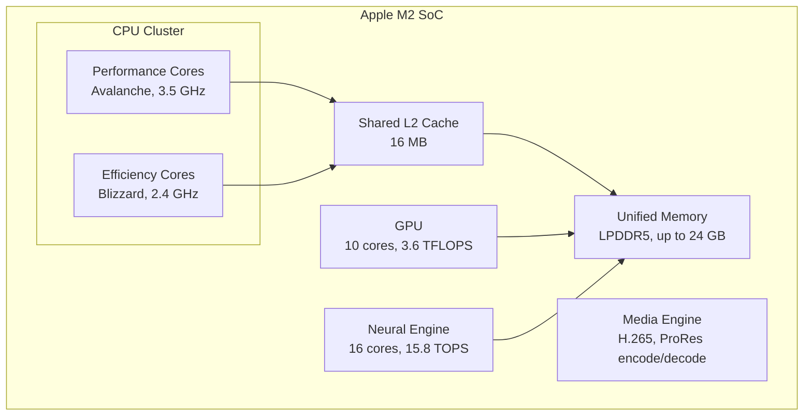
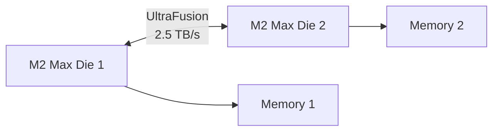

# Apple Silicon

## Overview

**Apple Silicon** is Apple's custom ARM-based system-on-chip (SoC) family, starting with the M1 in 2020. These chips have redefined performance expectations for ARM processors, matching or exceeding high-end x86 laptop CPUs while consuming significantly less power. Apple Silicon integrates CPU, GPU, Neural Engine, and unified memory into a single chip.

## Detailed Explanation

### Architecture Overview



### Key Design Decisions

**1. Unified Memory Architecture (UMA)**
```
Traditional PC:
  CPU ←→ System RAM (DDR) ←→ GPU VRAM (GDDR)
  Data must be copied between CPU and GPU memory

Apple Silicon:
  CPU ←→ Unified Memory ←→ GPU
  All processors access the same memory pool
  No copying needed → lower latency, less power
```

**2. Wide Decode, Short Pipeline**
```
M2 Performance Core:
  - 8-wide decode (widest in the industry when released)
  - ~13-stage pipeline (shorter than Intel/AMD)
  - 630+ entry ROB (largest when released)
  - 6 integer ALUs, 4 FP/SIMD units
  - 3 load units, 2 store units

M2 Efficiency Core:
  - 4-wide decode
  - 2 integer ALUs, 1 FP unit
  - Lower clock, much lower power
```

**3. High Memory Bandwidth**
```
M2:
  - 100 GB/s unified memory bandwidth
  - LPDDR5-6400

M2 Pro:
  - 200 GB/s
  - LPDDR5-6400

M2 Max:
  - 400 GB/s
  - LPDDR5-6400

M2 Ultra:
  - 800 GB/s
  - Two M2 Max dies connected via UltraFusion
```

### Generation Evolution

| Chip | Year | CPU Cores | GPU Cores | Transistors | Memory |
|------|------|-----------|-----------|-------------|--------|
| M1 | 2020 | 4P + 4E | 7-8 | 16B | 8-16 GB |
| M1 Pro | 2021 | 6P + 2E or 8P + 2E | 14-16 | 33.7B | 16-32 GB |
| M1 Max | 2021 | 8P + 2E | 24-32 | 57B | 32-64 GB |
| M1 Ultra | 2022 | 16P + 4E | 48-64 | 114B | 64-128 GB |
| M2 | 2022 | 4P + 4E | 8-10 | 20B | 8-24 GB |
| M2 Pro | 2023 | 6P + 4E or 8P + 4E | 16-19 | 40B | 16-32 GB |
| M2 Max | 2023 | 8P + 4E | 30-38 | 67B | 32-96 GB |
| M2 Ultra | 2023 | 16P + 8E | 60-76 | 134B | 64-192 GB |
| M3 | 2023 | 4P + 4E | 8-10 | 25B | 8-24 GB |
| M3 Pro | 2023 | 5P + 6E or 6P + 6E | 14-18 | 37B | 18-36 GB |
| M3 Max | 2023 | 10P + 4E or 12P + 4E | 30-40 | 92B | 36-128 GB |
| M4 | 2024 | 4P + 6E | 10 | 28B | 16-32 GB |

### UltraFusion Interconnect

For the Ultra chips, Apple connects two Max dies:



```
UltraFusion:
  - 2.5 TB/s bandwidth between dies
  - Appears as single chip to software
  - Uses silicon interposer (not traditional packaging)
  - No NUMA penalty — unified memory across both dies
```

### Performance Characteristics

```
Single-thread performance (Geekbench 6):
  M2:        ~1900
  M2 Pro:    ~1950
  M3:        ~2150
  M3 Max:    ~2150
  M4:        ~2400
  Intel i9-13900K: ~2200
  AMD Ryzen 9 7950X: ~2100

Multi-thread performance:
  M2 (8 cores):     ~8500
  M2 Ultra (24):    ~21000
  M3 Max (16):      ~15000
  Intel i9-13900K:  ~17000 (24 threads)

Power efficiency:
  M2: ~15W peak CPU power
  Intel i9-13900K: ~250W peak
  → M2 achieves ~60% of i9 performance at ~6% of the power
```

## Examples

### Example 1: Why Unified Memory Matters

```python
# Traditional GPU workflow (discrete GPU):
data = load_from_disk()
cpu_result = process_on_cpu(data)
gpu_data = copy_to_gpu(cpu_result)  # Slow PCIe transfer!
gpu_result = run_gpu_kernel(gpu_data)
final = copy_to_cpu(gpu_result)     # Slow PCIe transfer!

# Apple Silicon workflow:
data = load_from_disk()
cpu_result = process_on_cpu(data)
gpu_result = run_gpu_kernel(cpu_result)  # No copy! Same memory.
final = gpu_result  # Already accessible by CPU
```

### Example 2: P and E Core Scheduling

```
macOS thread scheduling on Apple Silicon:

Background threads → E-cores (Blizzard)
  - Low priority, non-interactive
  - Compiler jobs, file indexing, backups
  
Foreground threads → P-cores (Avalanche)
  - UI rendering, user input handling
  - High-priority, latency-sensitive
  
Adaptive:
  - Single-thread burst → 1 P-core at max boost (3.5 GHz)
  - Multi-thread → All P-cores + E-cores
  - Sustained → Thermal throttling, shift to E-cores
```

### Example 3: Neural Engine

```
Apple M2 Neural Engine:
  - 16 cores
  - 15.8 TOPS (Tera Operations Per Second)
  - Dedicated hardware for matrix operations
  - Used by Core ML framework

Workloads:
  - Image classification (ResNet, EfficientNet)
  - Object detection (YOLO)
  - Natural language processing (transformers)
  - Speech recognition
  - Computational photography (Night mode, Deep Fusion)
```

## Interview Questions

### Q1: What makes Apple Silicon different from other ARM chips?
**Answer**: Three key differentiators: (1) Apple designs custom cores with wider decode (8-wide), larger ROB, and higher IPC than ARM's reference designs; (2) Unified memory architecture eliminates CPU-GPU data copying; (3) Vertical integration—Apple controls the chip, OS, and compiler, enabling deep optimization.

### Q2: What is unified memory architecture?
**Answer**: UMA means the CPU, GPU, and other processors share the same physical memory pool. There's no separate VRAM—data doesn't need to be copied between CPU and GPU memory. This reduces latency, saves power, and simplifies programming, but the memory bandwidth is shared among all processors.

### Q3: How does Apple Silicon achieve such high single-thread performance?
**Answer**: (1) Very wide decode (8 instructions/cycle); (2) Massive out-of-order resources (630+ entry ROB); (3) Large caches (192 KB L1I, 128 KB L1D per P-core); (4) High memory bandwidth; (5) Optimized compiler (LLVM/Clang tuned for Apple Silicon); (6) Short pipeline reduces branch misprediction penalty.

### Q4: What is UltraFusion?
**Answer**: UltraFusion is Apple's die-to-die interconnect technology used to combine two M1/M2 Max dies into a single Ultra chip. It provides 2.5 TB/s bandwidth between the dies and presents them as a single unified processor to software, with no NUMA penalties.

### Q5: Why is Apple Silicon more power-efficient than x86?
**Answer**: (1) ARM's RISC ISA is inherently simpler to decode; (2) Apple's wide, efficient design extracts more work per watt; (3) Unified memory reduces data movement; (4) Process advantage (TSMC 5nm/3nm); (5) Heterogeneous cores (E-cores handle background work efficiently); (6) No legacy x86 decoder overhead.

## Common Mistakes

1. **Thinking Apple Silicon is just "ARM"** — While ARM-compatible, Apple's cores are custom designs with significantly higher IPC than ARM's reference Cortex cores. The ISA is ARM, but the microarchitecture is Apple's own.
2. **Comparing raw specs** — Clock speed and core count don't directly compare between ARM and x86. Apple's 3.5 GHz core can outperform Intel's 5.5 GHz core due to higher IPC.
3. **Ignoring the software advantage** — Apple controls the entire stack (chip, OS, compiler, frameworks). This vertical integration enables optimizations impossible for other chip makers.
4. **Assuming unified memory is always better** — UMA shares bandwidth among all processors. For GPU-heavy workloads with dedicated VRAM needs (high-end gaming, professional 3D), discrete GPUs with dedicated VRAM can have higher total bandwidth.

## Summary

| Aspect | Detail |
|--------|--------|
| **ISA** | ARMv8-A / ARMv9-A |
| **Key Innovation** | Custom wide cores, unified memory, UltraFusion |
| **Performance Cores** | 8-wide decode, 630+ entry ROB |
| **Efficiency Cores** | 4-wide decode, very low power |
| **Memory** | Unified (CPU+GPU share), up to 192 GB |
| **Process** | TSMC 5nm (M1/M2), 3nm (M3/M4) |
| **Best For** | Creative work, development, general productivity |

## Cross-References

- [ARM](./arm.md) — The ISA that Apple Silicon implements
- [Superscalar](../pipelining/superscalar.md) — Apple's 8-wide decode is superscalar
- [Out-of-Order Execution](../pipelining/ooo.md) — Apple's massive ROB enables deep OoO
- [GPU Architecture](../parallelism/gpu.md) — Apple's integrated GPU
- [Unified Memory](../memory-tech/dram.md) — How UMA works

## Cross References

- [ARM](arm.md)
- [Unified Memory](../memory-hierarchy/levels.md)
- [GPU](../parallelism/gpu.md)
