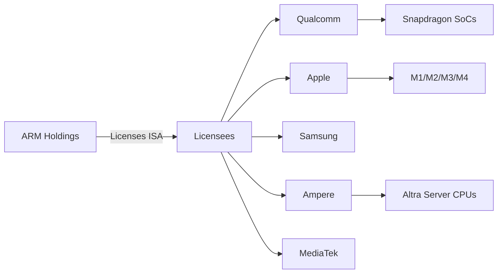
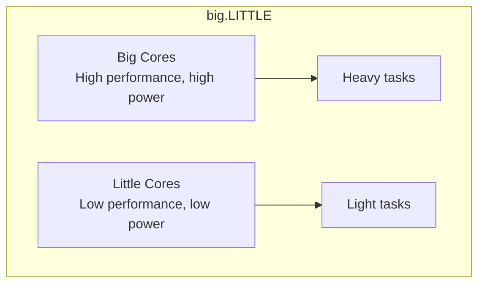

# ARM Architecture

## Overview

**ARM** (Advanced RISC Machines) is the most widely deployed processor architecture in the world, powering virtually all smartphones, tablets, and increasingly laptops and servers. ARM is a RISC load-store architecture licensed to chip manufacturers who design their own implementations. With ARMv9 (2021) and the push into servers (AWS Graviton, Ampere), ARM is challenging x86's dominance.

## Detailed Explanation

### ARM Business Model



ARM doesn't manufacture chips—it designs the ISA and licenses it. Companies can:
1. **Use ARM's designs** (Cortex-A, Cortex-M, Cortex-R) with modifications
2. **Design custom cores** implementing the ARM ISA (Apple, Qualcomm)

### ARM Architecture Versions

| Version | Year | Key Features | Example Cores |
|---------|------|-------------|---------------|
| ARMv4 | 1990s | Thumb (16-bit compressed) | ARM7TDMI |
| ARMv7 | 2004 | Thumb-2, NEON SIMD, VFP | Cortex-A15, A7 |
| ARMv8-A | 2011 | 64-bit (AArch64), 31 GPRs | Cortex-A53, A72 |
| ARMv8.2 | 2016 | Half-precision, SVE | Cortex-A75, A55 |
| ARMv9-A | 2021 | SVE2, RME, MTE | Cortex-A710, X2 |
| ARMv9.2 | 2023 | SME, enhanced security | Cortex-X4, A520 |

### AArch64 Register Set

```
General Purpose:
  X0-X30  : 31 × 64-bit general-purpose registers
  XZR     : Zero register (reads as 0, writes ignored)
  SP      : Stack pointer (separate from XZR)
  PC      : Program counter (not directly accessible as GPR)

Floating Point / SIMD:
  V0-V31  : 31 × 128-bit SIMD/FP registers
  FPCR    : FP control register
  FPSR    : FP status register

System:
  CPSR    : Current program status register
  SPSR    : Saved program status register
  ELR     : Exception link register
  SCTLR   : System control register
```

### ARM Execution Model

```
ARM instruction set features:
  - Fixed-width 32-bit instructions (A64)
  - Load-store architecture (only LDR/STR access memory)
  - 3-address format: ADD X0, X1, X2
  - Conditional execution (limited in A64, extensive in A32)
  - Barrel shifter on second ALU operand
  
Example A64 instructions:
  ADD  X0, X1, X2, LSL #3    ; X0 = X1 + (X2 << 3)
  LDR  X3, [X4, X5, SXTW #2] ; X3 = Memory[X4 + sign_extend(X5)*4]
  STP  X0, X1, [SP, #-16]!   ; Store pair, pre-decrement SP
```

### ARM Exception Levels

```
┌─────────────────────────────────┐
│ EL3: Secure Monitor             │  TrustZone, secure/non-secure switch
├─────────────────────────────────┤
│ EL2: Hypervisor                 │  Virtualization (KVM, Xen)
├─────────────────────────────────┤
│ EL1: OS Kernel                  │  Linux, Windows kernel
├─────────────────────────────────┤
│ EL0: User Application           │  Normal programs
└─────────────────────────────────┘

Each level has its own:
  - Stack pointer (SP_ELx)
  - Exception return address (ELR_ELx)
  - Saved status (SPSR_ELx)
  - Vector table (VBAR_ELx)
```

### big.LITTLE and DynamIQ

ARM introduced heterogeneous multiprocessing:



```
Typical ARM SoC (2024):
  1× Cortex-X4 (prime core, highest performance)
  3× Cortex-A720 (performance cores)
  4× Cortex-A520 (efficiency cores)

DynamIQ (successor to big.LITTLE):
  - Different core types in the same cluster
  - Shared L3 cache
  - Fine-grained power management
  - Per-core voltage/frequency scaling
```

### ARM SIMD: NEON and SVE

```
NEON (ARMv7+):
  - 128-bit SIMD registers (V0-V31)
  - Can operate on: 4×32-bit, 8×16-bit, 16×8-bit
  - Example: ADD V0.4S, V1.4S, V2.4S  (4 parallel 32-bit adds)

SVE/SVE2 (ARMv8.2+/v9):
  - Scalable Vector Extension
  - Vector length: 128-2048 bits (implementation-defined)
  - Predicated execution (masking)
  - Better for scientific/HPC workloads
  - Example: ADD Z0.S, P0/M, Z0.S, Z1.S  (masked add)
```

## Examples

### Example 1: AArch64 Function Call

```asm
// int add(int a, int b) { return a + b; }
add:
    ADD  W0, W0, W1    // W0 = a + b (first arg + second arg)
    RET                 // Return (branch to X30/LR)

// Calling:
    MOV  W0, #5        // First argument
    MOV  W1, #3        // Second argument
    BL   add            // Branch and link (saves return address in X30)
    // Result in W0 = 8
```

### Example 2: ARM vs x86 Code Density

```c
// C code: array[i] = array[i] * 2 + 1;
```

```asm
// ARM AArch64:
LDR  W1, [X0, X2, LSL #2]   // Load array[i]
LSL  W1, W1, #1               // Multiply by 2
ADD  W1, W1, #1               // Add 1
STR  W1, [X0, X2, LSL #2]   // Store array[i]

// x86-64:
MOV  EAX, [RDI + RSI*4]      // Load array[i]
SHL  EAX, 1                   // Multiply by 2
ADD  EAX, 1                   // Add 1
MOV  [RDI + RSI*4], EAX      // Store array[i]
```

### Example 3: Cache Line Sizes

```
ARM Cortex-A720:
  L1I Cache: 64 KB, 4-way, 64-byte lines
  L1D Cache: 64 KB, 4-way, 64-byte lines
  L2 Cache: 512 KB-1 MB per core
  L3 Cache: Shared, up to 16 MB

ARM Cortex-X4:
  L1I Cache: 64 KB, 8-way
  L1D Cache: 64 KB, 8-way
  L2 Cache: Up to 2 MB per core
  L3 Cache: Up to 12 MB shared
```

### Example 4: ARM in Servers

```
AWS Graviton3 (2022):
  - 64 Neoverse-V1 cores
  - ARMv8.4-A
  - 2 GHz base clock
  - 48 MB L3 cache
  - DDR5 memory
  - 60% better perf/watt vs Graviton2

Ampere Altra (2020):
  - 128 custom ARM cores (Neoverse N1)
  - 3.0 GHz
  - 128 MB L3 cache
  - 8-channel DDR5
  - Target: cloud-native workloads
```

## Interview Questions

### Q1: Why is ARM dominant in mobile?
**Answer**: ARM's RISC design leads to simpler hardware, lower power consumption, and lower cost—critical for battery-powered devices. The licensing model allows manufacturers to customize designs. The ecosystem (Android, iOS) is built on ARM. The power efficiency advantage over x86 is fundamental to mobile use cases.

### Q2: What is the difference between ARMv8-A and ARMv9-A?
**Answer**: ARMv9-A (2021) adds: Scalable Vector Extension 2 (SVE2) for better SIMD, Realm Management Extension (RME) for confidential computing, Memory Tagging Extension (MTE) for memory safety, and Transactional Memory. It maintains backward compatibility with ARMv8-A.

### Q3: What is big.LITTLE?
**Answer**: big.LITTLE is ARM's heterogeneous multiprocessing technology that combines high-performance "big" cores with power-efficient "LITTLE" cores on the same chip. The OS scheduler assigns heavy tasks to big cores and light tasks to LITTLE cores, optimizing for both performance and battery life.

### Q4: How does ARM compare to x86 for servers?
**Answer**: ARM servers (Graviton, Ampere) offer better performance per watt and lower cost for cloud-native workloads. x86 still leads in single-thread performance and legacy software compatibility. ARM is gaining market share in cloud (AWS, Azure) where power efficiency and core count matter more than peak single-thread speed.

### Q5: What is the zero register (XZR) in ARM?
**Answer**: XZR is a register that always reads as zero and discards writes. It simplifies the ISA: `MOV X0, X1` is actually `ADD X0, XZR, X1`. It provides a constant zero without needing an immediate field in the instruction encoding.

## Common Mistakes

1. **Confusing ARM ISA with ARM cores** — The ISA (ARMv8-A) is the specification; cores (Cortex-A78, Apple M2) are implementations. Different implementations of the same ISA can have vastly different performance.
2. **Thinking ARM is only for mobile** — ARM is increasingly used in servers (Graviton, Ampere), laptops (Apple M-series), embedded systems, and even supercomputers (Fugaku used ARM A64FX).
3. **Ignoring AArch32 vs AArch64** — ARMv8-A supports both 32-bit (AArch32/ARMv7 compatibility) and 64-bit (AArch64) execution states. Modern software targets AArch64.
4. **Assuming ARM means low performance** — Apple M2 Ultra has 24 cores and competes with high-end x86 workstation CPUs. ARM's performance ceiling is no longer a limitation.

## Summary

| Aspect | Detail |
|--------|--------|
| **Type** | RISC, load-store architecture |
| **Current ISA** | ARMv9-A (2021) |
| **Registers** | 31 GPRs (X0-X30), 31 SIMD/FP (V0-V31) |
| **Execution State** | AArch64 (64-bit), AArch32 (32-bit compat) |
| **Exception Levels** | EL0 (user), EL1 (kernel), EL2 (hypervisor), EL3 (secure) |
| **Key Feature** | Power efficiency, licensing model, heterogeneous cores |
| **Dominant In** | Mobile, embedded, growing in servers and laptops |

## Cross-References

- [CISC vs RISC](../cpu/cisc-vs-risc.md) — ARM is the dominant RISC architecture
- [ISA](../cpu/isa.md) — ARM defines one of the major ISAs
- [RISC-V](./risc-v.md) — The open-source RISC competitor
- [Apple Silicon](./apple-silicon.md) — Apple's custom ARM implementations
- [NEON](../parallelism/neon.md) — ARM's SIMD extension
