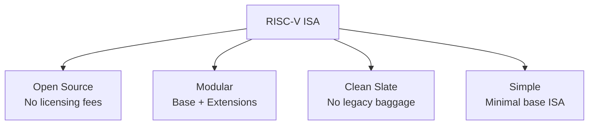

# RISC-V

## Overview

**RISC-V** (pronounced "risk-five") is an open-source Instruction Set Architecture (ISA) based on RISC principles. Unlike ARM and x86, RISC-V is free to use without licensing fees, making it attractive for academia, embedded systems, and companies wanting full control over their processor designs. Originally developed at UC Berkeley in 2010, it has grown into a global standard managed by RISC-V International.

## Detailed Explanation

### What Makes RISC-V Unique



| Feature | RISC-V | ARM | x86 |
|---------|--------|-----|-----|
| **Licensing** | Free, open | Licensed (fees) | Controlled by Intel/AMD |
| **ISA Design** | Modern, clean | Evolved over 30 years | 45+ years of legacy |
| **Extensions** | Modular (pick what you need) | Monolithic (versions) | Accumulated additions |
| **Encoding** | Fixed 32-bit (16-bit compressed) | Fixed 32-bit | Variable 1-15 bytes |
| **Ecosystem** | Growing rapidly | Mature, massive | Dominant in desktop/server |

### Base Integer ISA (RV32I / RV64I)

The base ISA is intentionally minimal:

```
RV32I: 32-bit base integer ISA
  - 47 instructions (compare: x86 has 1000+)
  - 32 registers (x0-x31), 32-bit wide
  - Load-store architecture
  - Fixed-width 32-bit instructions
  - No multiply/divide (that's the M extension)

RV64I: 64-bit base integer ISA
  - Same 47 instructions, 64-bit registers
  - Adds 32-bit operations (W suffix): ADDW, SUBW, etc.
```

### Register Set

```
Register | ABI Name | Purpose          | Saved by
---------|----------|------------------|----------
x0       | zero     | Hardwired to 0   | —
x1       | ra       | Return address   | Caller
x2       | sp       | Stack pointer    | Callee
x3       | gp       | Global pointer   | —
x4       | tp       | Thread pointer   | —
x5       | t0       | Temporary        | Caller
x6       | t1       | Temporary        | Caller
x7       | t2       | Temporary        | Caller
x8       | s0/fp    | Saved / Frame ptr| Callee
x9       | s1       | Saved            | Callee
x10-x11  | a0-a1    | Args / Return    | Caller
x12-x17  | a2-a7    | Arguments        | Caller
x18-x27  | s2-s11   | Saved            | Callee
x28-x31  | t3-t6    | Temporary        | Caller
```

### Modular Extensions

RISC-V's key innovation is modularity:

```
Base:     RV32I or RV64I (integer operations)

Standard Extensions:
  M  : Integer multiply/divide
  A  : Atomic operations (LR/SC, AMO)
  F  : Single-precision floating-point
  D  : Double-precision floating-point
  V  : Vector extensions (SIMD)
  C  : Compressed instructions (16-bit)
  Zicsr: Control and status registers
  Zifencei: Instruction-fetch fence

Naming: RV64IMAFDC = 64-bit base + Multiply + Atomics + Float + Double + Compressed
        Often written as RV64GC (G = IMAFD)
```

### Instruction Encoding

RISC-V uses a very regular encoding:

```
R-type (register-register):
  ┌────────┬───────┬───────┬───────┬────────┬────────┐
  │ funct7 │  rs2  │  rs1  │ funct3│   rd   │ opcode │
  │ 7 bits │ 5 bits│ 5 bits│ 3 bits│ 5 bits │ 7 bits │
  └────────┴───────┴───────┴───────┴────────┴────────┘
  Example: ADD x1, x2, x3

I-type (immediate):
  ┌────────────────┬───────┬───────┬────────┬────────┐
  │   immediate    │  rs1  │ funct3│   rd   │ opcode │
  │   12 bits      │ 5 bits│ 3 bits│ 5 bits │ 7 bits │
  └────────────────┴───────┴───────┴────────┴────────┘
  Example: ADDI x1, x2, 10

S-type (store):
  ┌────────┬───────┬───────┬───────┬────────┬────────┐
  │imm[11:5]│  rs2  │  rs1  │ funct3│imm[4:0]│ opcode │
  └────────┴───────┴───────┴───────┴────────┴────────┘
  Example: SW x3, 8(x1)
```

### Compressed Instructions (C Extension)

16-bit instructions for common operations:

```
Standard 32-bit: ADD x1, x2, x3  (0000000 00011 00010 000 00001 0110011)
Compressed 16-bit: C.ADD x1, x3  (1001 1 00001 00011)

Benefits:
  - 25-30% smaller code size
  - Better instruction cache utilization
  - Lower memory bandwidth
  - Particularly important for embedded systems
```

### Privilege Levels

```
┌──────────────────────────────────┐
│ Machine Mode (M)                 │  Highest privilege, bare metal
├──────────────────────────────────┤
│ Supervisor Mode (S)              │  OS kernel (Linux runs here)
├──────────────────────────────────┤
│ User Mode (U)                    │  Applications
└──────────────────────────────────┘

Optional:
  Hypervisor extension (H): Virtual machine management
  Debug mode (D): Hardware debugging
```

### Memory Model

RISC-V uses a **relaxed memory model** (RVWMO - RISC-V Weak Memory Ordering):

```
Unlike x86 (TSO - Total Store Ordering), RISC-V allows:
  - Stores to be observed out of order by other harts
  - Loads to be reordered with other loads
  - Must use FENCE instructions for ordering guarantees

This is similar to ARM's memory model.
Requires explicit barriers for correct synchronization.
```

## Examples

### Example 1: Basic RISC-V Assembly

```asm
# int factorial(int n) {
#     if (n <= 1) return 1;
#     return n * factorial(n - 1);
# }

factorial:
    addi sp, sp, -16        # Allocate stack frame
    sw   ra, 12(sp)         # Save return address
    sw   a0, 8(sp)          # Save n
    
    li   t0, 1              # t0 = 1
    bgt  a0, t0, .recurse   # if n > 1, recurse
    li   a0, 1              # return 1
    addi sp, sp, 16         # Deallocate stack
    ret                     # Return

.recurse:
    addi a0, a0, -1         # n - 1
    call factorial           # factorial(n - 1)
    lw   t0, 8(sp)          # Restore n
    mul  a0, a0, t0         # n * factorial(n - 1)
    lw   ra, 12(sp)         # Restore return address
    addi sp, sp, 16         # Deallocate stack
    ret
```

### Example 2: Vector Extension (RVV)

```asm
# Vector add: C[i] = A[i] + B[i] for i = 0..N-1
# Uses RISC-V Vector extension (RVV)

vsetvli t0, a0, e32, m1    # Set vector length, 32-bit elements
loop:
    vle32.v  v0, (a1)      # Load A[i..i+VL-1]
    vle32.v  v1, (a2)      # Load B[i..i+VL-1]
    vadd.vv  v2, v0, v1    # C = A + B (vector add)
    vse32.v  v2, (a3)      # Store C[i..i+VL-1]
    sub      a0, a0, t0    # Decrement count
    add      a1, a1, t0    # Advance A pointer
    add      a2, a2, t0    # Advance B pointer
    add      a3, a3, t0    # Advance C pointer
    bnez     a0, loop      # Loop if more elements
```

### Example 3: Atomic Operations

```asm
# Atomic increment using LR/SC (Load-Reserved / Store-Conditional)
atomic_add:
    lr.w    t0, (a0)        # Load-reserved from address a0
    add     t0, t0, a1      # Add value
    sc.w    t1, t0, (a0)    # Store-conditional
    bnez    t1, atomic_add  # Retry if failed (t1 != 0)
    # t0 now contains the old value
```

### Example 4: RISC-V Implementations

```
SiFive P670 (2022):
  - RV64GCV (with vector extension)
  - Out-of-order, 4-wide superscalar
  - 13-stage pipeline
  - Competes with ARM Cortex-A78

SiFive P550:
  - RV64GC
  - 3-wide superscalar
  - Target: high-performance embedded

StarFive JH7110:
  - 4× SiFive U74 cores (RV64GC)
  - Used in VisionFive 2 SBC
  - Linux-capable, sub-$50 board
```

## Interview Questions

### Q1: What is RISC-V and why is it important?
**Answer**: RISC-V is an open-source ISA based on RISC principles. It's important because it's free (no licensing fees), modular (pick only the extensions you need), and has a clean design without legacy baggage. It's used in embedded systems, academic research, and increasingly in commercial products.

### Q2: How is RISC-V different from ARM?
**Answer**: Key differences: (1) RISC-V is open-source, ARM is licensed; (2) RISC-V is modular (base + extensions), ARM is versioned; (3) RISC-V has a cleaner design with fewer instructions in the base ISA; (4) ARM has a much larger ecosystem and more mature software support. Both are RISC load-store architectures.

### Q3: What is the zero register (x0) for?
**Answer**: x0 is hardwired to always read as zero and discards writes. It simplifies the ISA: `MV rd, rs` is `ADDI rd, rs, 0`; `NOP` is `ADDI x0, x0, 0`; `LI rd, imm` can use `ADDI rd, x0, imm`. It eliminates the need for many pseudo-instructions that would otherwise require extra encoding.

### Q4: What does the "G" in RV64GC mean?
**Answer**: "G" stands for "General" and is shorthand for the standard extension set IMAFD: I (base integer), M (multiply/divide), A (atomics), F (single-precision float), D (double-precision float). Combined with C (compressed), RV64GC is the most common configuration for general-purpose computing.

### Q5: Why does RISC-V use a relaxed memory model?
**Answer**: A relaxed memory model allows hardware to reorder memory operations for better performance. It's simpler to implement in hardware than x86's strong TSO model. However, it requires programmers to explicitly use FENCE instructions for ordering, which is more complex for software. This is the same approach ARM uses.

## Common Mistakes

1. **Assuming RISC-V is always simpler** — The base ISA is simple, but with all extensions (V, H, etc.), a full RISC-V implementation can be as complex as ARM or x86.
2. **Thinking RISC-V is only for embedded** — While popular in embedded, RISC-V is pushing into Linux-capable boards, servers (Ventana), and even AI accelerators. The ecosystem is growing rapidly.
3. **Ignoring the memory model** — RISC-V's weak memory model means naive multithreaded code can have subtle bugs. FENCE instructions or atomic operations are needed for correctness.
4. **Confusing extensions with versions** — ARM has versions (v8, v9); RISC-V has extensions (M, A, F, D, V). You pick the extensions you need rather than implementing a whole version.

## Summary

| Aspect | Detail |
|--------|--------|
| **Type** | Open-source RISC ISA |
| **Base** | RV32I (47 instructions) or RV64I |
| **Registers** | 32 GPRs (x0 = zero), 32 FPRs |
| **Extensions** | M (mul/div), A (atomic), F/D (float), V (vector), C (compressed) |
| **Memory Model** | Weak (RVWMO), requires FENCE for ordering |
| **Privilege** | Machine, Supervisor, User |
| **Key Advantage** | Free, modular, clean design |

## Cross-References

- [CISC vs RISC](../cpu/cisc-vs-risc.md) — RISC-V is a clean RISC design
- [ISA](../cpu/isa.md) — RISC-V defines a modern ISA
- [ARM](./arm.md) — The dominant RISC architecture RISC-V aims to compete with
- [Registers](../cpu/registers.md) — RISC-V register file design
