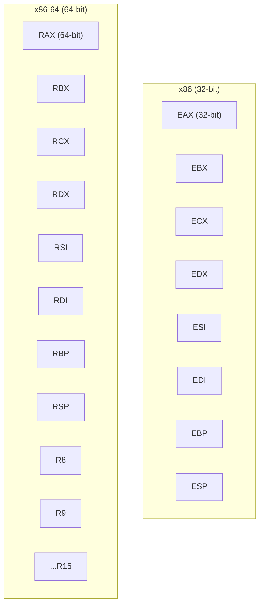
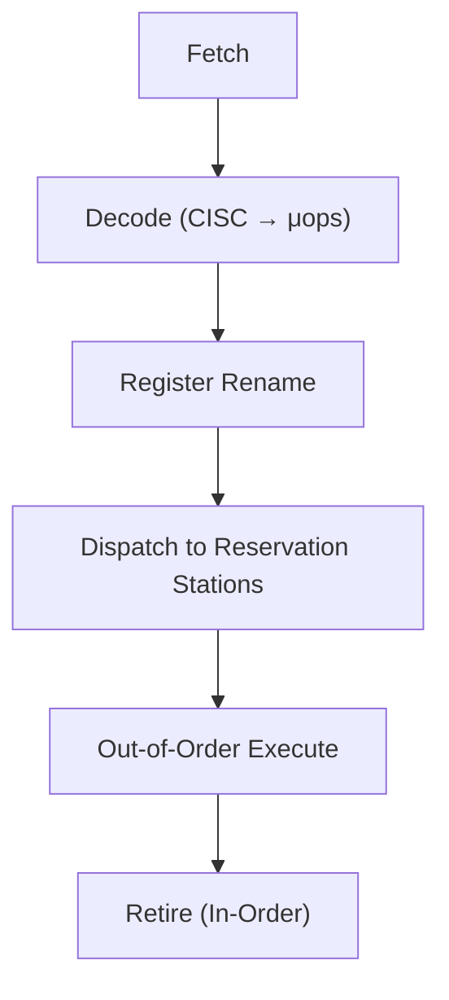

# x86-64 Architecture

## Overview

**x86-64** (also called AMD64 or Intel 64) is the 64-bit extension of the x86 ISA. Originally developed by AMD (AMD64, 2003) and adopted by Intel (EM64T/Intel 64), it's the dominant architecture for desktops, laptops, and servers. x86-64 is a CISC (Complex Instruction Set Computer) architecture with variable-length instructions.

## x86-64 Key Features

### Register Extension



| Feature | x86 (32-bit) | x86-64 (64-bit) |
|---------|-------------|-----------------|
| General-purpose registers | 8 (EAX-ESP) | 16 (RAX-R15) |
| Register width | 32 bits | 64 bits |
| SIMD registers | 8 (XMM) | 16 (XMM/YMM/ZMM) |
| Address space | 4 GB | 256 TB (48-bit) |
| Calling convention | Stack-based (cdecl) | Register-based (System V, MS x64) |

### Calling Convention (System V AMD64)

Arguments passed in registers (not on stack):
```
Integer args: RDI, RSI, RDX, RCX, R8, R9
Float args:   XMM0-XMM7
Return:       RAX (integer), XMM0 (float)
Callee-saved: RBX, RBP, R12-R15
```

### Instruction Encoding

x86-64 uses **variable-length instructions** (1-15 bytes):
```
┌──────────┬──────────┬──────────┬──────────┬──────────┐
│ Prefixes │  REX     │ Opcode   │ ModR/M   │ SIB      │
│ (0-4B)   │ (0-1B)   │ (1-3B)   │ (0-1B)   │ (0-1B)   │
├──────────┼──────────┼──────────┼──────────┼──────────┤
│ Displacement │ Immediate │
│ (0-4B)       │ (0-8B)    │
└──────────────┴───────────┘
```

- **REX prefix**: 64-bit operand size, extended registers (R8-R15)
- **ModR/M**: Addressing mode and register operands
- **SIB**: Scale-Index-Base addressing

## x86-64 vs ARM vs RISC-V

| Feature | x86-64 | ARM | RISC-V |
|---------|--------|-----|--------|
| ISA type | CISC | RISC | RISC |
| Instruction length | Variable (1-15B) | Fixed (4B) or Thumb | Fixed (4B) or compressed |
| Decode complexity | High | Low | Low |
| Registers | 16 GPR | 31 GPR | 31 GPR |
| Power efficiency | Lower | Higher | Higher |
| Ecosystem | Dominant (desktop/server) | Dominant (mobile) | Growing |
| Licensing | Proprietary (Intel/AMD) | Licensed (ARM) | Open (RISC-V) |

## Out-of-Order Execution

Modern x86-64 processors use aggressive out-of-order execution:



### Micro-ops (μops)
Complex x86 instructions are decoded into simpler **micro-ops**:
```
ADD [RAX], RBX  →  μop1: LOAD tmp, [RAX]
                    μop2: ADD tmp, RBX
                    μop3: STORE [RAX], tmp
```

This allows CISC instructions to be executed on RISC-like backends.

## Branch Prediction

Modern x86-64 has sophisticated branch prediction:

| Predictor | Description |
|-----------|-------------|
| **TAGE** | Tagged Geometric History Length predictor |
| **BTB** | Branch Target Buffer (predicts target address) |
| **RAS** | Return Address Stack (for function returns) |
| **Indirect BP** | Predicts indirect branch targets |

Misprediction penalty: 15-20 cycles on modern CPUs.

## Memory Model (TSO)

x86-64 uses **Total Store Order (TSO)**:
- Stores may be buffered (store buffer)
- Loads may bypass stores to different addresses
- All stores become visible in FIFO order
- **Strongest** memory model among mainstream ISAs

```c
// x86-64: This works without barriers
*data = 42;
*flag = 1;  // Other cores see data=42 before flag=1

// ARM/RISC-V: Need explicit barrier
*data = 42;
__asm__ __volatile__("dmb sy" ::: "memory");
*flag = 1;
```

## x86-64 Extensions Timeline

| Year | Extension | Key Feature |
|------|-----------|-------------|
| 2003 | AMD64 | 64-bit, more registers |
| 2004 | SSE3 | Horizontal operations |
| 2006 | SSSE3 | Shuffles, align |
| 2008 | SSE4.1/4.2 | Dot product, string ops |
| 2011 | AVX | 256-bit SIMD |
| 2013 | AVX2 | 256-bit integer SIMD |
| 2013 | FMA3 | Fused multiply-add |
| 2016 | AVX-512 | 512-bit SIMD, mask registers |
| 2020 | AMX | Matrix extensions (AI) |
| 2023 | AVX10 | Unified AVX-512 for P/E cores |

## Interview Questions

1. **Q**: What are the key differences between x86-64 and x86 (32-bit)?
   **A**: x86-64 adds: 16 general-purpose registers (vs 8), 64-bit register width, 16 SIMD registers, register-based calling convention, 64-bit address space. Instructions use REX prefix for 64-bit operations and extended registers (R8-R15).

2. **Q**: Why is x86-64 considered CISC but executes like RISC?
   **A**: x86-64 has complex, variable-length instructions (CISC). But internally, the decoder breaks them into simple micro-ops (μops) that execute on a RISC-like backend. This gives CISC compatibility with RISC execution efficiency.

3. **Q**: What is TSO and why does it matter?
   **A**: Total Store Order is x86-64's memory model. Stores may be buffered but become visible in order. Loads may bypass stores to different addresses. TSO is the strongest mainstream memory model, meaning fewer explicit barriers are needed compared to ARM/RISC-V.

4. **Q**: How does x86-64's variable-length instruction encoding affect performance?
   **A**: Variable-length instructions make decoding complex (must determine instruction boundaries). Modern CPUs use a pre-decoder and micro-op cache to mitigate this. Fixed-length ISAs (ARM, RISC-V) have simpler decoding but may use more instructions.

5. **Q**: What is the significance of the register-based calling convention in x86-64?
   **A**: x86 (32-bit) passes arguments on the stack (slow, memory accesses). x86-64 passes the first 6 integer and 8 float arguments in registers (fast, no memory). This significantly reduces function call overhead.

## Common Mistakes

- ❌ Confusing x86-64 with x86 (different register counts, calling conventions)
- ❌ Not knowing that x86-64 instructions are decoded into micro-ops
- ❌ Forgetting that TSO is a strong memory model (fewer barriers needed)
- ❌ Assuming variable-length instructions are always slower
- ❌ Not knowing about the 16 GPRs in x86-64

## Summary

x86-64 extends x86 to 64 bits with 16 GPRs, register-based calling, and larger address space. It's CISC externally but executes micro-ops on a RISC-like backend. TSO provides a strong memory model. Modern extensions (AVX, AVX-512, AMX) add SIMD and matrix operations for AI.

## Cross-References

- [ARM](arm.md) — RISC alternative
- [RISC-V](risc-v.md) — Open-source RISC
- [Alder Lake](alder-lake.md) — Intel hybrid design
- [AMD Zen](amd-zen.md) — AMD's implementation
- [AVX](../parallelism/avx.md) — x86-64 SIMD
