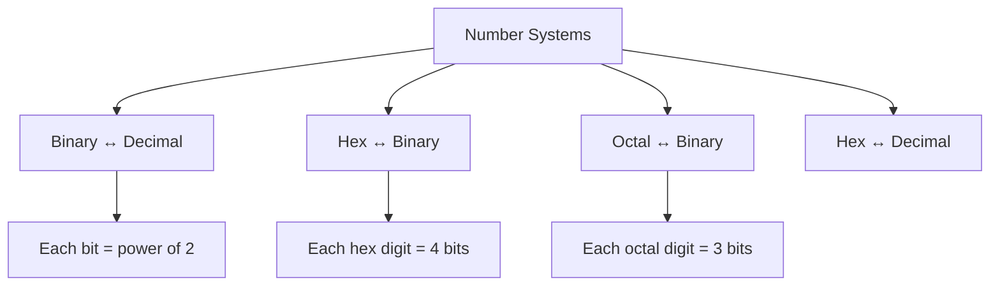

# Number Systems

## Overview

Number systems are methods of representing numbers using a specific base (radix). Computers use binary (base 2) internally, but engineers also work with hexadecimal (base 16) and octal (base 8) for convenience.

## Common Number Systems

| System | Base | Digits | Use |
|--------|------|--------|-----|
| **Binary** | 2 | 0, 1 | Internal computer representation |
| **Octal** | 8 | 0-7 | Unix permissions, legacy systems |
| **Decimal** | 10 | 0-9 | Human-readable |
| **Hexadecimal** | 16 | 0-9, A-F | Memory addresses, colors, MAC addresses |

## Conversion Quick Reference

## Interview Questions

1. **Q: Why do computers use binary?**
   A: Transistors have two stable states (ON/OFF). Binary is robust against noise — small voltage fluctuations don't change the interpretation. Analog circuits are sensitive to noise; digital (binary) circuits are reliable.

2. **Q: Convert 0x1A3 to binary.**
   A: Each hex digit = 4 bits: 1=0001, A=1010, 3=0011. Result: 0001 1010 0011.

## Summary

Binary is the foundation of computing. Hex and octal are convenient shorthand. Understanding conversions between these systems is essential for low-level programming and interviews.

## Cross-References

- [Binary](binary.md)
- [Hexadecimal](hex.md)
- [Two's Complement](twos-complement.md)
- [Floating Point](floating-point.md)
- [IEEE 754](ieee754.md)

## Cross References

- [Binary](binary.md)
- [Hexadecimal](hex.md)
- [Floating Point](floating-point.md)
- [IEEE 754](ieee754.md)
