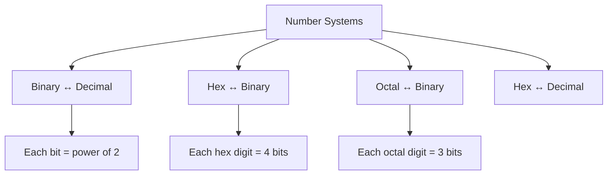

# Number Systems

## Overview

Number systems are methods of representing numbers using a specific base (radix). Computers use binary (base 2) internally, but engineers also work with hexadecimal (base 16) and octal (base 8) for convenience. Understanding number systems — especially binary arithmetic, two's complement, and floating-point representation — is essential for low-level programming and placement interviews.

## Common Number Systems

| System | Base | Digits | Use |
|--------|------|--------|-----|
| **Binary** | 2 | 0, 1 | Internal computer representation |
| **Octal** | 8 | 0-7 | Unix permissions, legacy systems |
| **Decimal** | 10 | 0-9 | Human-readable |
| **Hexadecimal** | 16 | 0-9, A-F | Memory addresses, colors, MAC addresses |

## Conversion Quick Reference



### Binary → Decimal

Multiply each bit by its positional weight (power of 2):

```
1101₂ = 1×2³ + 1×2² + 0×2¹ + 1×2⁰
       = 8 + 4 + 0 + 1
       = 13₁₀
```

### Decimal → Binary

Repeated division by 2, collect remainders bottom-up:

```
13 ÷ 2 = 6  remainder 1
 6 ÷ 2 = 3  remainder 0
 3 ÷ 2 = 1  remainder 1
 1 ÷ 2 = 0  remainder 1
→ 1101₂
```

### Hex ↔ Binary

Each hex digit maps to exactly 4 binary bits:

| Hex | Binary | | Hex | Binary |
|-----|--------|-|-----|--------|
| 0 | 0000 | | 8 | 1000 |
| 1 | 0001 | | 9 | 1001 |
| 2 | 0010 | | A | 1010 |
| 3 | 0011 | | B | 1011 |
| 4 | 0100 | | C | 1100 |
| 5 | 0101 | | D | 1101 |
| 6 | 0110 | | E | 1110 |
| 7 | 0111 | | F | 1111 |

**Example**: `0x1A3` → `0001 1010 0011` → `100010011₂`

### Octal ↔ Binary

Each octal digit maps to exactly 3 binary bits:

**Example**: `0755₈` → `111 101 101₂` → `111101101₂`

This is why Unix file permissions use octal — `rwxr-xr-x` maps naturally:
- `rwx` = 111 = 7
- `r-x` = 101 = 5
- `r-x` = 101 = 5

---

## Binary Arithmetic

### Addition

| A | B | Sum | Carry |
|---|---|-----|-------|
| 0 | 0 | 0 | 0 |
| 0 | 1 | 1 | 0 |
| 1 | 0 | 1 | 0 |
| 1 | 1 | 0 | 1 |

**Example**: `1101 + 1011`

```
  1101
+ 1011
------
 11000  (= 24₁₀, correct: 13 + 11 = 24)
```

### Overflow Detection (Unsigned)

If the result requires more bits than available, overflow occurred. For 4-bit unsigned: max = 15. `1101 + 1011 = 11000` — 5 bits needed, overflow in 4-bit system.

---

## Two's Complement

Two's complement is the standard way to represent **signed integers** in computers.

### How It Works

For an n-bit number:
- **Positive**: Same as unsigned binary
- **Negative**: Invert all bits, then add 1

**Example (8-bit)**: Represent -5

```
+5 = 00000101
Invert: 11111010
Add 1:  11111011  → This is -5
```

### Range

For n bits: **-2^(n-1)** to **2^(n-1) - 1**

| Bits | Range |
|------|-------|
| 8 | -128 to 127 |
| 16 | -32,768 to 32,767 |
| 32 | -2,147,483,648 to 2,147,483,647 |
| 64 | -9.2×10¹⁸ to 9.2×10¹⁸ |

### Why Two's Complement?

1. **Single zero**: No +0/-0 ambiguity (unlike one's complement)
2. **Addition just works**: Same circuit for signed and unsigned addition
3. **No special carry handling**: Overflow detection is simple

### Overflow Detection (Signed)

Overflow occurs when:
- Adding two positives yields a negative
- Adding two negatives yields a positive

**Shortcut**: Overflow if carry into sign bit ≠ carry out of sign bit.

### Sign Extension

To convert n-bit signed to m-bit signed (m > n): copy the sign bit to all new high-order bits.

```
8-bit -5:   11111011
16-bit -5:  11111111 11111011
```

---

## Floating-Point Representation

### Why Floating Point?

Integers can't represent fractions or very large/small numbers. Floating point uses **scientific notation** in binary:

```
(-1)^sign × 1.mantissa × 2^(exponent - bias)
```

### IEEE 754 — Single Precision (32-bit)

```
| S | E (8 bits) | M (23 bits) |
  1      8            23
```

| Component | Bits | Description |
|-----------|------|-------------|
| **Sign (S)** | 1 | 0 = positive, 1 = negative |
| **Exponent (E)** | 8 | Biased by 127 (actual = E - 127) |
| **Mantissa (M)** | 23 | Fractional part (implicit leading 1) |

**Example**: Represent 6.75 in IEEE 754

```
6.75 = 110.11₂ = 1.1011 × 2²

Sign: 0 (positive)
Exponent: 2 + 127 = 129 = 10000001₂
Mantissa: 10110000000000000000000

Result: 0 10000001 10110000000000000000000
Hex: 0x40D80000
```

### IEEE 754 — Double Precision (64-bit)

```
| S | E (11 bits) | M (52 bits) |
  1      11            52
```

- Exponent bias: 1023
- Range: ±1.8 × 10³⁰⁸
- Precision: ~15-17 decimal digits

### Special Values

| Value | Exponent | Mantissa | Meaning |
|-------|----------|----------|---------|
| **±0** | 0 | 0 | Zero (positive and negative) |
| **±∞** | 255 (all 1s) | 0 | Infinity (overflow) |
| **NaN** | 255 | ≠ 0 | Not a Number (0/0, ∞-∞) |
| **Denormalized** | 0 | ≠ 0 | Very small numbers near zero |

### Denormalized Numbers

When E=0 and M≠0, the implicit leading 1 becomes 0:

```
(-1)^S × 0.M × 2^(-126)
```

This fills the gap between zero and the smallest normalized number.

### Precision Loss

Not all decimal fractions are representable in binary:

```
0.1₁₀ = 0.0001100110011...₂ (repeating)
```

This is why `0.1 + 0.2 ≠ 0.3` in most programming languages:

```python
>>> 0.1 + 0.2
0.30000000000000004
```

**Interview tip**: Always mention floating-point comparison should use epsilon tolerance:

```python
abs(a - b) < 1e-9  # not a == b
```

---

## Practical Applications

### Memory Addresses (Hex)

```
0x7FFE_E3A0_0000    // Typical stack address on 64-bit Linux
0x0040_0000         // Typical code segment start
```

### Bit Manipulation

```c
// Check if bit n is set
bool is_set = (x >> n) & 1;

// Set bit n
x |= (1 << n);

// Clear bit n
x &= ~(1 << n);

// Toggle bit n
x ^= (1 << n);

// Count set bits (Brian Kernighan's algorithm)
int count = 0;
while (x) { x &= (x - 1); count++; }
```

### Networking

- **Subnet masks**: `255.255.255.0` = `/24` = `11111111.11111111.11111111.00000000`
- **MAC addresses**: `AA:BB:CC:DD:EE:FF` — 6 bytes in hex
- **IPv6**: `2001:0db8:85a3::8a2e:0370:7334` — 128-bit addresses in hex

---

## Interview Questions

1. **Q: Why do computers use binary?**
   A: Transistors have two stable states (ON/OFF). Binary is robust against noise — small voltage fluctuations don't change the interpretation. Analog circuits are sensitive to noise; digital (binary) circuits are reliable.

2. **Q: Convert 0x1A3 to binary.**
   A: Each hex digit = 4 bits: 1=0001, A=1010, 3=0011. Result: 0001 1010 0011.

3. **Q: Why use two's complement instead of one's complement?**
   A: Two's complement has a single zero (no +0/-0), and addition/subtraction use the same hardware as unsigned. One's complement has two zeros and requires end-around carry.

4. **Q: What is the range of an 8-bit signed integer?**
   A: -128 to 127. The asymmetry comes from zero taking one positive value: -2⁷ to 2⁷-1.

5. **Q: Why does 0.1 + 0.2 ≠ 0.3 in most languages?**
   A: 0.1 in decimal is a repeating fraction in binary (`0.000110011...`). IEEE 754 stores an approximation, and the rounding errors accumulate. Use epsilon-based comparison.

6. **Q: What is the difference between single and double precision?**
   A: Single (32-bit): 8-bit exponent, 23-bit mantissa, ~7 decimal digits precision. Double (64-bit): 11-bit exponent, 52-bit mantissa, ~15-17 decimal digits precision. Double uses more memory but provides much better precision.

7. **Q: What are NaN and Infinity in IEEE 754?**
   A: Infinity (E=255, M=0) represents overflow. NaN (E=255, M≠0) represents undefined operations like 0/0 or ∞-∞. NaN ≠ NaN (not even equal to itself).

8. **Q: How would you check if a number is a power of 2?**
   A: `n > 0 && (n & (n - 1)) == 0`. Powers of 2 have exactly one bit set; subtracting 1 flips that bit and all lower bits, so AND gives 0.

## Summary

Binary is the foundation of computing. Hex and octal are convenient shorthand. Two's complement enables efficient signed arithmetic. IEEE 754 floating point enables fractional and very large/small number representation with well-defined precision trade-offs. Understanding conversions, arithmetic, and precision issues is essential for low-level programming and interviews.

## Cross-References

- [Binary](binary.md)
- [Hexadecimal](hex.md)
- [Two's Complement](twos-complement.md)
- [Floating Point](floating-point.md)
- [IEEE 754](ieee754.md)

## References

- Patterson & Hennessy, *Computer Organization and Design* (RISC-V Edition), Chapter 3
- IEEE 754-2019 Standard for Floating-Point Arithmetic
- [CS:APP](https://csapp.cs.cmu.edu/) — Chapter 2: Representing and Manipulating Information
- [Float Exposed](https://float.exposed/) — Interactive IEEE 754 explorer
- Bruce Dawson, [Comparing Floating Point Numbers](https://randomascii.wordpress.com/2012/02/25/comparing-floating-point-numbers-2012-edition/)
