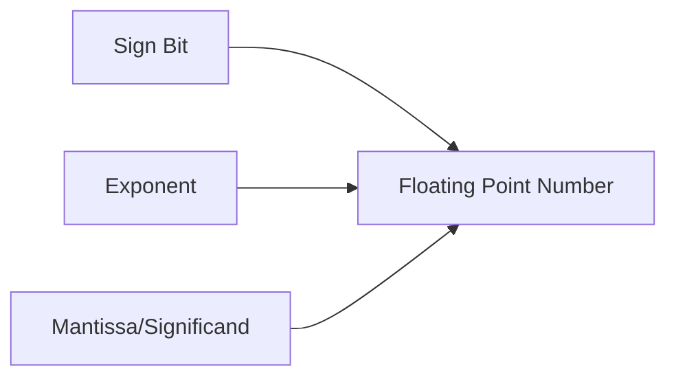

# Floating Point Numbers

## Overview

Floating point is a method of representing **real numbers** (with fractional parts) in binary. It's analogous to scientific notation in decimal: a significand multiplied by a base raised to an exponent.

## Scientific Notation Review

```
Decimal: 625.9 = 6.259 × 10²
                ↑ significand  ↑ exponent

Binary: 101.11 = 1.0111 × 2²
               ↑ significand  ↑ exponent
```

## Floating Point Components



| Component | Description |
|-----------|-------------|
| **Sign (S)** | 0 = positive, 1 = negative |
| **Exponent (E)** | Power of 2 (biased) |
| **Mantissa (M)** | Significant digits (normalized) |

## Normalized Form

Like scientific notation, floating point uses normalized form:

```
1.xxxxx × 2^e

The leading 1 is implicit (not stored) in IEEE 754.
```

Example:
```
101.11₂ = 1.0111₂ × 2²
         ↑ leading 1 is implicit
```

## Single Precision (32-bit) Format

```
Bit: 31  30      23  22                    0
     [S] [Exponent]  [Mantissa]
      1    8 bits       23 bits
```

| Field | Bits | Bias | Range |
|-------|------|------|-------|
| Sign | 1 | — | 0 or 1 |
| Exponent | 8 | 127 | 1 to 254 |
| Mantissa | 23 | — | 1.xxxx... |

## Double Precision (64-bit) Format

```
Bit: 63  62      52  51                    0
     [S] [Exponent]  [Mantissa]
      1    11 bits       52 bits
```

| Field | Bits | Bias |
|-------|------|------|
| Sign | 1 | — |
| Exponent | 11 | 1023 |
| Mantissa | 52 | — |

## Converting to Floating Point

### Example: Convert 6.75 to 32-bit IEEE 754

**Step 1: Convert to binary**
```
6 = 110₂
0.75 = 0.11₂
6.75 = 110.11₂
```

**Step 2: Normalize**
```
110.11 = 1.1011 × 2²
```

**Step 3: Determine fields**
```
Sign: 0 (positive)
Exponent: 2 + 127 (bias) = 129 = 10000001₂
Mantissa: 10110000000000000000000 (drop leading 1)
```

**Step 4: Assemble**
```
0 10000001 10110000000000000000000
= 0x40D80000
```

### Example: Convert -0.15625 to 32-bit IEEE 754

**Step 1: Convert to binary**
```
0.15625 = 0.00101₂
```

**Step 2: Normalize**
```
0.00101 = 1.01 × 2⁻³
```

**Step 3: Determine fields**
```
Sign: 1 (negative)
Exponent: -3 + 127 = 124 = 01111100₂
Mantissa: 01000000000000000000000
```

**Step 4: Assemble**
```
1 01111100 01000000000000000000000
= 0xBE200000
```

## Special Values

| Value | Sign | Exponent | Mantissa |
|-------|------|----------|----------|
| **+0** | 0 | 00000000 | 000...0 |
| **-0** | 1 | 00000000 | 000...0 |
| **+∞** | 0 | 11111111 | 000...0 |
| **-∞** | 1 | 11111111 | 000...0 |
| **NaN** | 0 or 1 | 11111111 | non-zero |

## Precision and Ranges

| Format | Bits | Precision | Range |
|--------|------|-----------|-------|
| **Single** | 32 | ~7 decimal digits | ±3.4×10³⁸ |
| **Double** | 64 | ~15 decimal digits | ±1.8×10³⁰⁸ |

## Floating Point Arithmetic

### Addition (Simplified)

1. Align exponents (shift smaller number's mantissa right)
2. Add mantissas
3. Normalize result
4. Round to fit precision

```
  1.010 × 2³
+ 1.100 × 2²
= 1.010 × 2³
+ 0.110 × 2³    (align exponents)
= 10.000 × 2³   (add)
= 1.000 × 2⁴    (normalize)
```

### Precision Loss

```
1.0 + 2⁻²³ = 1.0 (in single precision, the tiny value is lost)
```

## Interview Questions

1. **Q: What is floating point?**
   A: A method of representing real numbers using a sign, biased exponent, and mantissa. Similar to scientific notation in binary. IEEE 754 is the standard. It allows representing very large and very small numbers.

2. **Q: Why is 0.1 + 0.2 ≠ 0.3 in floating point?**
   A: 0.1 and 0.2 can't be represented exactly in binary (like 1/3 can't be in decimal). 0.1 = 0.0001100110011...₂ (repeating). The rounding errors accumulate, giving 0.30000000000000004.

3. **Q: What is the bias in IEEE 754?**
   A: The exponent is stored with a bias (127 for single, 1023 for double) to allow representing both positive and negative exponents without a sign bit. Actual exponent = stored exponent - bias.

4. **Q: What is NaN?**
   A: "Not a Number" — a special value representing undefined or unrepresentable results (0/0, ∞-∞, sqrt(-1)). NaN ≠ NaN (it's not equal to anything, including itself).

5. **Q: What is denormalized (subnormal) representation?**
   A: When the exponent field is all zeros, the implicit leading 1 becomes 0. This allows representing numbers closer to zero than the smallest normalized number, at the cost of reduced precision.

6. **Q: Why does floating point have rounding errors?**
   A: Floating point has finite precision (23 or 52 mantissa bits). Numbers that can't be represented exactly must be rounded. This is inherent to finite-precision representation of real numbers.

## Common Mistakes

- Comparing floats with == (use epsilon comparison instead)
- Assuming 0.1 + 0.2 = 0.3 exactly
- Forgetting that NaN ≠ NaN
- Not understanding the bias (exponent is stored as unsigned)
- Confusing precision (significant digits) with range (magnitude)

## Summary

Floating point represents real numbers using sign, biased exponent, and mantissa. IEEE 754 defines single (32-bit) and double (64-bit) formats. Special values include ±0, ±∞, and NaN. Rounding errors are inherent due to finite precision.

## Cross-References

- [Number Systems Overview](README.md)
- [IEEE 754](ieee754.md) — Detailed standard
- [Two's Complement](twos-complement.md) — Integer representation
- [Binary](binary.md) — Foundation
