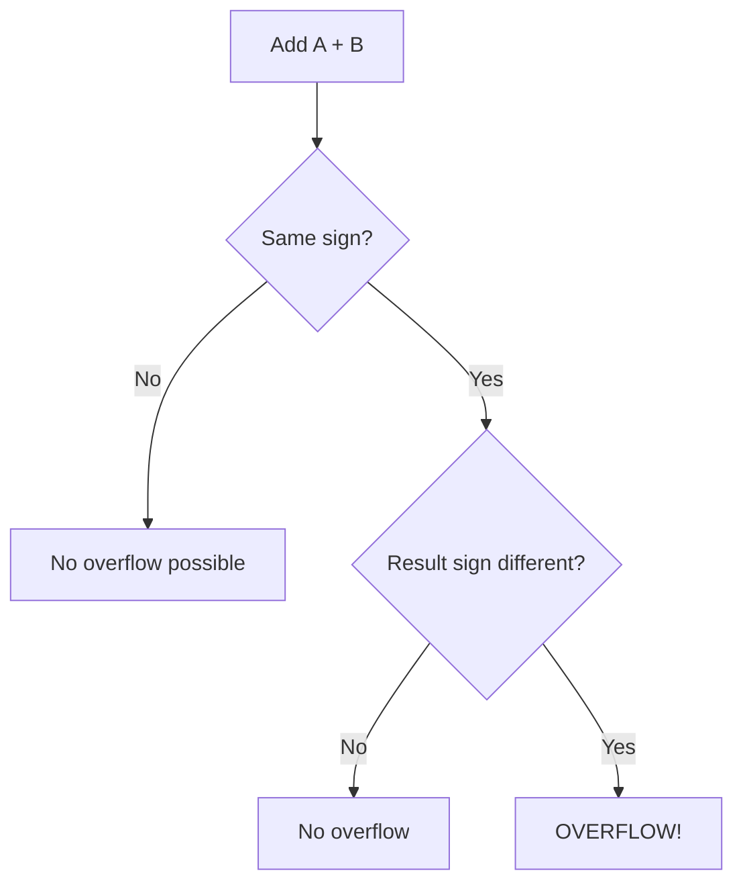

# Two's Complement

## Overview

Two's complement is the standard method for representing **signed integers** in binary. It eliminates the dual-zero problem of sign-magnitude and simplifies arithmetic circuits.

## Why Two's Complement?

| Representation | +0 | -0 | Range (8-bit) | Arithmetic |
|---------------|----|----|---------------|------------|
| **Sign-magnitude** | 00000000 | 10000000 | -127 to +127 | Complex |
| **One's complement** | 00000000 | 11111111 | -127 to +127 | Complex |
| **Two's complement** | 00000000 | (none) | -128 to +127 | Simple |

## How Two's Complement Works

For an n-bit number:
- **Positive numbers**: Same as unsigned binary
- **Negative numbers**: Invert all bits and add 1 (or equivalently: 2^n - |number|)

### Converting to Negative

```
+5  = 00000101
Invert:  11111010
Add 1:   11111011  = -5
```

### Converting from Negative

```
-5  = 11111011
Invert:  00000100
Add 1:   00000101  = +5
```

## Range

For n-bit two's complement:
- **Minimum**: -2^(n-1)
- **Maximum**: 2^(n-1) - 1

| Bits | Range |
|------|-------|
| 8 | -128 to +127 |
| 16 | -32,768 to +32,767 |
| 32 | -2,147,483,648 to +2,147,483,647 |
| 64 | -9.2×10¹⁸ to +9.2×10¹⁸ |

## Quick Tricks

### Sign Detection
MSB (Most Significant Bit) = sign bit:
- **0** → positive (or zero)
- **1** → negative

### Negation Shortcut
Starting from the right, copy all bits up to and including the first 1, then invert the rest:

```
-5 in 8-bit:
+5  = 00000101
                ↑ first 1 from right
Copy: 00000101  (up to first 1)
Invert rest: 11111011
Result: 11111011 = -5 ✓
```

### Sign Extension
Extend a negative number to more bits by copying the sign bit:

```
-5 in 4 bits:  1011
-5 in 8 bits:  11111011
-5 in 16 bits: 1111111111111011
```

## Two's Complement Arithmetic

### Addition

Just add normally (ignore overflow):

```
  00000101  (+5)
+ 11111011  (-5)
----------
1 00000000  (0, carry out is discarded)
```

### Subtraction

Subtract by adding the negation:

```
7 - 5 = 7 + (-5)

  00000111  (+7)
+ 11111011  (-5)
----------
1 00000010  (+2, carry discarded)
```

### Overflow Detection

Overflow occurs when:
- Adding two positives → negative
- Adding two negatives → positive



Example (8-bit):
```
  01111111  (+127)
+ 00000001  (+1)
----------
  10000000  (-128) ← OVERFLOW! (positive + positive = negative)
```

## Two's Complement vs Others

| Feature | Sign-Magnitude | One's Complement | Two's Complement |
|---------|---------------|-----------------|-----------------|
| **Zero** | Two (+0, -0) | Two (+0, -0) | One (00000000) |
| **Negation** | Flip MSB | Flip all bits | Flip all bits + 1 |
| **Addition** | Complex | End-around carry | Simple |
| **Range** | -(2^(n-1)-1) to +(2^(n-1)-1) | Same | -2^(n-1) to +(2^(n-1)-1) |
| **Used** | Rarely | Rarely | Almost always |

## Interview Questions

1. **Q: Why is two's complement preferred over sign-magnitude?**
   A: 1) Single representation of zero. 2) Addition/subtraction work without special cases. 3) One extra negative number (-128 in 8-bit). 4) Simpler hardware (no special subtraction circuit needed).

2. **Q: What is the two's complement of 5 in 8 bits?**
   A: +5 = 00000101. Invert: 11111010. Add 1: 11111011. So -5 = 11111011.

3. **Q: How do you detect overflow in two's complement addition?**
   A: Overflow occurs when adding two numbers of the same sign produces a result of different sign. Check: if both operands have the same MSB but the result has a different MSB, overflow occurred.

4. **Q: What is the range of 8-bit two's complement?**
   A: -128 to +127. The asymmetry comes from zero taking one of the positive representations (00000000). So there's one more negative number than positive.

5. **Q: How does sign extension work?**
   A: To extend a two's complement number to more bits, copy the sign bit (MSB) into all new high-order bits. This preserves the value: -5 in 4 bits (1011) becomes -5 in 8 bits (11111011).

6. **Q: What's the two's complement of 0?**
   A: 00000000. Invert: 11111111. Add 1: 100000000 (9 bits). Discard carry: 00000000. Zero is its own negation.

## Common Mistakes

- Forgetting that negation = invert + 1 (not just invert)
- Not understanding that the range is asymmetric (-128 to +127)
- Confusing sign extension (copy MSB) with zero extension (add zeros)
- Not detecting overflow correctly (must check same-sign inputs)
- Thinking -128 can be negated (it can't — it's the most negative value)

## Summary

Two's complement is the standard signed integer representation. Negative numbers are formed by inverting bits and adding 1. It simplifies arithmetic (addition/subtraction use the same circuit), has a single zero, and provides one extra negative value. Overflow detection checks for same-sign inputs producing different-sign results.

## Cross-References

- [Number Systems Overview](README.md)
- [Binary](binary.md) — Unsigned binary
- [Hexadecimal](hex.md) — Compact notation
- [IEEE 754](ieee754.md) — Floating point representation
