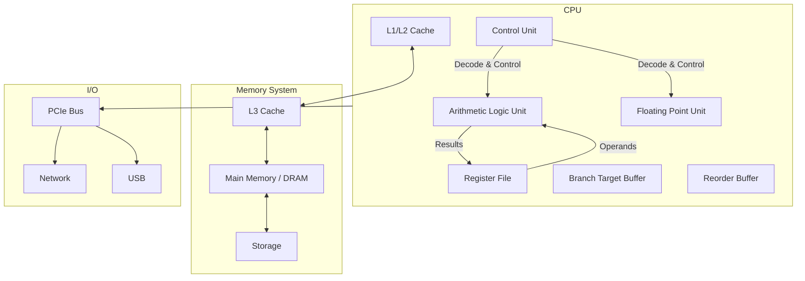

# Computer Architecture

## Overview

Computer architecture is the design and organization of computer systems — how hardware components are structured and interconnected to execute instructions. It encompasses everything from digital logic gates to processor design, memory hierarchies, and instruction set architectures.

## Why Computer Architecture Matters

- **Foundation of computing**: Every software runs on hardware — understanding the hardware makes you a better engineer
- **Performance optimization**: Knowing architecture helps write efficient code
- **Interview essential**: Core topic for hardware, systems, and even software engineering roles
- **Debugging**: Understanding how CPUs work helps debug performance issues

## Architecture Categories

```mermaid
graph TD
    A[Computer Architecture] --> B[Digital Logic]
    A --> C[Number Systems]
    A --> D[CPU Design]
    A --> E[Pipelining]
    A --> F[Memory Hierarchy]
    A --> G[Modern Processors]
    B --> H[Boolean Algebra]
    B --> I[Logic Gates]
    B --> J[Combinational Circuits]
    B --> K[Sequential Circuits]
    C --> L[Binary/Hex]
    C --> M[Twos Complement]
    C --> N[Floating Point / IEEE 754]
    D --> O[Von Neumann / Harvard]
    D --> P[ISA / CISC vs RISC]
    D --> Q[Registers / ALU / Control Unit]
    E --> R[Classic 5-Stage]
    E --> S[Hazards and Solutions]
    E --> T[Branch Prediction]
    E --> U[Superscalar / OoO]
    F --> V[Cache Hierarchy]
    F --> W[Virtual Memory]
    F --> X[Memory Technologies]
    G --> Y[x86-64]
    G --> Z[ARM]
    G --> AA[RISC-V]
```



## Key Concepts

| Concept | Description |
|---------|-------------|
| **ISA** | Instruction Set Architecture — the interface between hardware and software |
| **CISC** | Complex Instruction Set Computer (x86) |
| **RISC** | Reduced Instruction Set Computer (ARM, RISC-V) |
| **Pipelining** | Overlapping instruction execution for throughput |
| **Cache** | Fast memory close to CPU |
| **Superscalar** | Multiple instructions per clock cycle |
| **Out-of-Order** | Execute instructions as operands are ready |
| **Branch Prediction** | Speculating on branch outcomes to keep pipeline full |
| **Virtual Memory** | Abstraction that gives each process its own address space |
| **DMA** | Direct Memory Access — I/O devices transfer data without CPU |

## CPU Architecture at a High Level



## ISA vs Microarchitecture

Understanding the distinction is critical:

| Aspect | ISA | Microarchitecture |
|--------|-----|-------------------|
| **Definition** | Programmer-visible interface | Internal implementation |
| **Includes** | Instructions, registers, addressing modes, data types | Pipeline depth, cache size, execution units, branch predictor |
| **Stability** | Changes rarely (backward compatibility) | Changes every generation |
| **Example** | x86-64 | Intel Alder Lake, AMD Zen 4, Apple M3 |
| **Analogy** | Car's steering wheel and pedals | Engine internals, transmission design |

```text
Same ISA, Different Microarchitectures:
┌─────────────────────────────────────────────┐
│                x86-64 ISA                   │
│  ┌──────────┐  ┌──────────┐  ┌──────────┐  │
│  │Intel     │  │AMD       │  │Intel     │  │
│  │Skylake   │  │Zen 4     │  │Alder Lake│  │
│  │(2015)    │  │(2022)    │  │(2021)    │  │
│  │4-wide    │  │6-wide    │  │6-wide    │  │
│  │14-stage  │  │19-stage  │  │~20-stage │  │
│  └──────────┘  └──────────┘  └──────────┘  │
└─────────────────────────────────────────────┘
```

## Performance Metrics

### Key Formulas

```text
CPU Time = Instruction Count × CPI × Clock Cycle Time
         = Instruction Count × CPI / Clock Rate

Throughput = Instructions per Second (IPS)
           = Clock Rate / CPI

Speedup = Old Time / New Time
```

| Metric | Definition | Improvement Strategy |
|--------|-----------|---------------------|
| **IPC** | Instructions Per Cycle | Superscalar, OoO, better branch prediction |
| **CPI** | Cycles Per Instruction (1/IPC) | Reduce stalls, hazards, cache misses |
| **Clock Rate** | Cycles per second (GHz) | Better process node, shorter pipeline |
| **Latency** | Time for one operation | Shorter pipeline, faster memory |
| **Bandwidth** | Operations per unit time | Wider buses, more cache levels |

### The Power Wall

```text
Power ∝ Capacitance × Voltage² × Frequency

As frequency increases:
├── Power consumption grows quadratically
├── Heat generation becomes unmanageable
└── Solution: multi-core, not higher frequency

This is why modern CPUs have 4-16+ cores instead of 10+ GHz single cores.
```

## Design Philosophies: CISC vs RISC

| Aspect | CISC (x86) | RISC (ARM) |
|--------|-----------|------------|
| **Instruction length** | Variable (1–15 bytes) | Fixed (4 bytes in ARM64) |
| **Instructions** | Complex, multi-step | Simple, single-cycle target |
| **Addressing modes** | Many | Few |
| **Memory access** | Any instruction can access memory | Load/Store only |
| **Decode complexity** | High (micro-ops) | Low (direct decode) |
| **Code density** | Higher | Lower |
| **Power efficiency** | Lower | Higher |

**Modern reality**: Both CISC and RISC CPUs internally use RISC-like micro-ops. The distinction at the ISA level matters less for performance than it used to.

## Interview Questions

1. **Q: What is the difference between architecture and organization?**
   A: Architecture (ISA) is the programmer-visible interface — instruction set, data types, addressing modes. Organization is the implementation — pipeline depth, cache size, bus width. Same architecture can have different organizations (e.g., Intel Core i3 vs i9 both implement x86).

2. **Q: Why is computer architecture important for software engineers?**
   A: Understanding cache behavior, branch prediction, pipelining, and memory hierarchy helps write performance-optimized code. Example: knowing that sequential array access is cache-friendly while linked list traversal is not.

3. **Q: Explain the relationship between ISA, microarchitecture, and compiler.**
   A: The ISA defines what instructions are available. The microarchitecture determines how fast those instructions execute. The compiler translates high-level code into ISA instructions. All three layers affect performance: a good compiler can exploit ISA features, and a good microarchitecture can execute instructions efficiently.

4. **Q: Why did the industry stop increasing clock frequency around 2005?**
   A: The power wall — power consumption grows with voltage² × frequency. Higher frequencies required higher voltages, leading to exponential power growth and heat. The solution was multi-core: instead of one fast core, use multiple slower cores. This is why clock rates plateaued at ~3-5 GHz.

5. **Q: What is Moore's Law and is it still relevant?**
   A: Moore's Law (1965) predicted transistor count would double every ~2 years. It held for decades but has slowed since ~2015 due to physical limits (quantum tunneling at small feature sizes). The industry now focuses on architectural innovation (specialization, chiplets, 3D stacking) rather than just shrinking transistors.

## Summary

Computer architecture spans from digital logic to processor design. The sections below cover digital logic fundamentals, number systems, CPU design, pipelining, memory hierarchy, and modern processors — all essential interview topics.

## Cross-References

- [Digital Logic](digital-logic/README.md)
- [Number Systems](number-systems/README.md)
- [CPU Design](cpu/README.md)
- [Pipelining](pipelining/README.md)
- [Memory Hierarchy](memory-hierarchy/README.md)
- [Memory Technologies](memory-tech/README.md)
- [Modern Processors](modern/README.md)
- [OS Overview](../os/overview.md)
