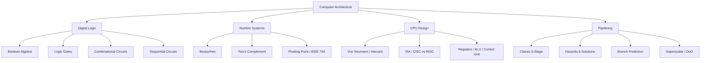

# Computer Architecture

## Overview

Computer architecture is the design and organization of computer systems — how hardware components are structured and interconnected to execute instructions. It encompasses everything from digital logic gates to processor design, memory hierarchies, and instruction set architectures.

## Why Computer Architecture Matters

- **Foundation of computing**: Every software runs on hardware — understanding the hardware makes you a better engineer
- **Performance optimization**: Knowing architecture helps write efficient code
- **Interview essential**: Core topic for hardware, systems, and even software engineering roles
- **Debugging**: Understanding how CPUs work helps debug performance issues

## Architecture Categories

## Key Concepts

| Concept | Description |
|---------|-------------|
| **ISA** | Instruction Set Architecture — the interface between hardware and software |
| **CISC** | Complex Instruction Set Computer (x86) |
| **RISC** | Reduced Instruction Set Computer (ARM, RISC-V) |
| **Pipelining** | Overlapping instruction execution for throughput |
| **Cache** | Fast memory close to CPU |
| **Superscalar** | Multiple instructions per clock cycle |
| **Out-of-Order** | Execute instructions as operands are ready |

## Interview Questions

1. **Q: What is the difference between architecture and organization?**
   A: Architecture (ISA) is the programmer-visible interface — instruction set, data types, addressing modes. Organization is the implementation — pipeline depth, cache size, bus width. Same architecture can have different organizations (e.g., Intel Core i3 vs i9 both implement x86).

2. **Q: Why is computer architecture important for software engineers?**
   A: Understanding cache behavior, branch prediction, pipelining, and memory hierarchy helps write performance-optimized code. Example: knowing that sequential array access is cache-friendly while linked list traversal is not.

## Summary

Computer architecture spans from digital logic to processor design. The sections below cover digital logic fundamentals, number systems, CPU design, and pipelining — all essential interview topics.

## Cross-References

- [Digital Logic](digital-logic/README.md)
- [Number Systems](number-systems/README.md)
- [CPU Design](cpu/README.md)
- [Pipelining](pipelining/README.md)
