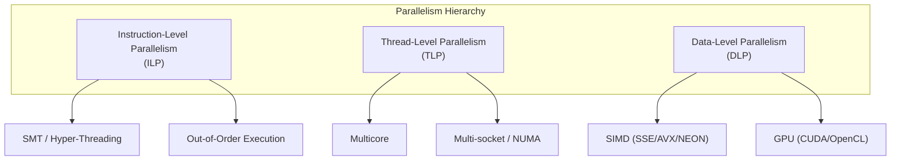

# Parallelism

## Overview

Modern processors achieve performance through multiple forms of **parallelism**: executing multiple operations simultaneously rather than sequentially. Understanding parallelism — from instruction-level (SIMD) to thread-level (multicore) to massive parallelism (GPU) — is essential for writing performant code and answering system design questions.

## Types of Parallelism



| Type | Granularity | Examples | Best For |
|------|-------------|----------|----------|
| **ILP** | Instructions within a thread | Pipelining, OoO, branch prediction | Sequential code |
| **DLP** | Same operation on multiple data | SIMD, GPU | Numerical/media processing |
| **TLP** | Independent threads/cores | Multicore, SMT | Independent tasks |

## Parallelism in Practice

### When Each Type Helps

**SIMD (DLP)**: Processing arrays of data
```c
// Scalar: 1 addition per cycle
for (int i = 0; i < N; i++)
    C[i] = A[i] + B[i];

// SIMD (AVX-512): 16 additions per cycle
for (int i = 0; i < N; i += 16)
    _mm512_store_ps(&C[i], _mm512_add_ps(_mm512_load_ps(&A[i]), _mm512_load_ps(&B[i])));
```

**Multicore (TLP)**: Independent tasks
```c
// Sequential
process_image(img1);
process_image(img2);

// Parallel
#pragma omp parallel sections
{
    #pragma omp section
    process_image(img1);
    #pragma omp section
    process_image(img2);
}
```

**GPU (Massive DLP)**: Thousands of data elements
```cuda
// CUDA kernel: each thread processes one element
__global__ void vector_add(float *C, float *A, float *B, int N) {
    int i = blockIdx.x * blockDim.x + threadIdx.x;
    if (i < N) C[i] = A[i] + B[i];
}
```

## Amdahl's Law and Parallelism

```
Speedup = 1 / ((1 - P) + P / N)

P = fraction of code that's parallelizable
N = number of processors
```

Even with infinite processors, speedup is limited by the sequential fraction:
- 90% parallel → max 10× speedup
- 99% parallel → max 100× speedup
- 99.9% parallel → max 1000× speedup

## Cross-References

- [SIMD](simd.md) — Single Instruction, Multiple Data
- [AVX](avx.md) — Intel's SIMD extensions
- [NEON](neon.md) — ARM's SIMD
- [Multicore](multicore.md) — Multi-core processors
- [SMT](smt.md) — Simultaneous Multithreading
- [GPU](gpu.md) — Graphics Processing Units
- [Amdahl's Law](../performance/amdahl.md) — Parallelism limits
