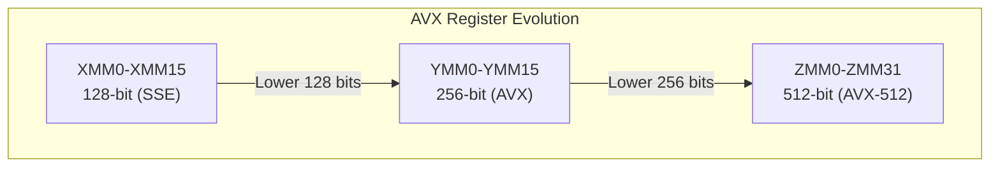

# AVX (Advanced Vector Extensions)

## Overview

**AVX** (Advanced Vector Extensions) is Intel's family of SIMD instruction sets for x86 processors. AVX extended SSE's 128-bit registers to 256 bits, and AVX-512 further extended to 512 bits. AVX is crucial for high-performance computing, machine learning, scientific simulations, and media processing.

## AVX Evolution

| Extension | Year | Register Width | Key Features |
|-----------|------|---------------|--------------|
| AVX | 2011 | 256-bit | 256-bit float ops, VEX encoding |
| AVX2 | 2013 | 256-bit | 256-bit integer ops, FMA |
| AVX-512 | 2016 | 512-bit | 512-bit ops, mask registers, 32 ZMM regs |
| AVX-512 VNNI | 2018 | 512-bit | INT8 dot product for AI |
| AVX-512 BF16 | 2020 | 512-bit | BFloat16 for AI |

## AVX Registers



### Register Overlap
```
ZMM0 (512 bits):
┌─────────────────────────────────────────────────────────┐
│                    ZMM0 (512 bits)                      │
├─────────────────────────────────┬───────────────────────┤
│          YMM0 (256 bits)        │                       │
├───────────────────┬─────────────┤                       │
│   XMM0 (128 bits) │             │                       │
└───────────────────┴─────────────┴───────────────────────┘
```

**Important**: Operations on XMM don't affect upper bits of YMM/ZMM (VEX/EVEX encoding). Operations on YMM zero the upper 256 bits of ZMM.

## AVX Instruction Categories

### Arithmetic

```c
// 8 float operations (AVX)
__m256 _mm256_add_ps(__m256 a, __m256 b);      // a + b
__m256 _mm256_sub_ps(__m256 a, __m256 b);      // a - b
__m256 _mm256_mul_ps(__m256 a, __m256 b);      // a * b
__m256 _mm256_div_ps(__m256 a, __m256 b);      // a / b
__m256 _mm256_sqrt_ps(__m256 a);               // sqrt(a)

// Fused Multiply-Add (FMA) - single instruction, one rounding
__m256 _mm256_fmadd_ps(__m256 a, __m256 b, __m256 c);  // a*b + c
__m256 _mm256_fmsub_ps(__m256 a, __m256 b, __m256 c);  // a*b - c
```

### Comparison

```c
__m256 _mm256_cmp_ps(__m256 a, __m256 b, int imm);
// imm: _CMP_LT_OS, _CMP_EQ_OQ, _CMP_GT_OS, etc.
// Returns bitmask (0xFFFFFFFF for true, 0x00000000 for false)
```

### Load/Store

```c
// Aligned (32-byte alignment required for 256-bit)
__m256 _mm256_load_ps(float const *mem_addr);
void _mm256_store_ps(float *mem_addr, __m256 a);

// Unaligned (works with any alignment, slower)
__m256 _mm256_loadu_ps(float const *mem_addr);
void _mm256_storeu_ps(float *mem_addr, __m256 a);

// Non-temporal (bypass cache, for streaming writes)
void _mm256_stream_ps(float *mem_addr, __m256 a);
```

### Shuffle and Permute

```c
// Shuffle within 128-bit lanes
__m256 _mm256_shuffle_ps(__m256 a, __m256 b, int imm);

// Permute within 256-bit
__m256 _mm256_permute_ps(__m256 a, int imm);

// Cross-lane permutation
__m256 _mm256_permute2f128_ps(__m256 a, __m256 b, int imm);
```

### Integer Operations (AVX2)

```c
__m256i _mm256_add_epi32(__m256i a, __m256i b);    // 8 int32 additions
__m256i _mm256_mullo_epi32(__m256i a, __m256i b);  // 8 int32 multiplications
__m256i _mm256_and_si256(__m256i a, __m256i b);    // Bitwise AND
__m256i _mm256_slli_epi32(__m256i a, int count);   // Shift left
```

## AVX-512 Mask Registers

AVX-512 introduces **mask registers** (k0-k7) for predicated execution:

```c
// Compare and get mask
__mmask16 mask = _mm512_cmp_ps_mask(a, b, _CMP_LT_OS);

// Conditional operation using mask
__m512 result = _mm512_mask_add_ps(src, mask, a, b);
// result[i] = mask[i] ? a[i]+b[i] : src[i]

// Compress: pack elements where mask is true
__m512 compressed = _mm512_maskz_compress_ps(mask, data);
```

This eliminates branch-heavy SIMD code.

## AVX-512 Extensions

| Extension | Purpose |
|-----------|---------|
| AVX-512F | Foundation (base instructions) |
| AVX-512DQ | Double/Quad-word operations |
| AVX-512BW | Byte/Word operations |
| AVX-512VL | 128/256-bit AVX-512 (VEX encoding) |
| AVX-512VNNI | INT8 dot product for neural networks |
| AVX-512BF16 | BFloat16 for AI |
| AVX-512IFMA | Integer FMA |
| AVX-512VBMI | Byte-level permutations |

## Performance Considerations

### Frequency Scaling
Running AVX-512 can reduce CPU clock frequency:
```
Base clock: 3.0 GHz
AVX2 workload: 2.8 GHz (small reduction)
AVX-512 workload: 2.4 GHz (significant reduction)
```

This is because AVX-512 units consume more power and generate more heat.

### Latency and Throughput

| Operation | Latency (cycles) | Throughput (per cycle) |
|-----------|-------------------|----------------------|
| AVX add (256-bit) | 3-4 | 2 |
| AVX mul (256-bit) | 3-5 | 2 |
| AVX FMA (256-bit) | 4-5 | 2 |
| AVX-512 add (512-bit) | 3-4 | 1-2 |
| AVX-512 FMA (512-bit) | 4-5 | 1-2 |

### When AVX-512 Hurts

If the clock reduction outweighs the SIMD benefit:
```
Scenario: 8 floats to process
- AVX2: 8 floats × 2.8 GHz = 22.4 GFLOPS
- AVX-512: 16 floats × 2.4 GHz = 38.4 GFLOPS (but only 8 elements needed)
  → 8 elements / 16 width = 50% utilization
  → Effective: 38.4 × 0.5 = 19.2 GFLOPS (SLOWER than AVX2!)
```

## Practical Example: Matrix Multiplication

```c
// Naive SIMD matrix multiplication (C = A × B)
void matmul_avx2(int N, float *A, float *B, float *C) {
    for (int i = 0; i < N; i++) {
        for (int j = 0; j < N; j += 8) {
            __m256 sum = _mm256_setzero_ps();
            for (int k = 0; k < N; k++) {
                __m256 a = _mm256_broadcast_ss(&A[i * N + k]);
                __m256 b = _mm256_loadu_ps(&B[k * N + j]);
                sum = _mm256_fmadd_ps(a, b, sum);
            }
            _mm256_storeu_ps(&C[i * N + j], sum);
        }
    }
}
```

## Interview Questions

1. **Q**: What is AVX and how does it differ from SSE?
   **A**: AVX extends SSE from 128-bit to 256-bit registers (YMM). It processes 8 floats or 4 doubles per instruction (vs 4/2 for SSE). AVX also introduced VEX encoding (cleaner instruction encoding) and FMA (fused multiply-add). AVX-512 further extends to 512 bits.

2. **Q**: What is FMA and why is it important?
   **A**: Fused Multiply-Add computes `a*b+c` in a single instruction with one rounding error. This is both faster (one instruction instead of two) and more accurate (single rounding) than separate multiply and add. Critical for linear algebra and neural networks.

3. **Q**: Why might AVX-512 be slower than AVX2 for some workloads?
   **A**: AVX-512 causes CPU frequency reduction (due to power/thermal limits). If the data doesn't fill 512-bit registers, the frequency penalty may outweigh the wider SIMD benefit. Also, AVX-512 instructions use more power.

4. **Q**: What are mask registers in AVX-512?
   **A**: Mask registers (k0-k7) enable predicated execution — conditional operations without branching. Each bit in the mask register corresponds to a SIMD lane. Operations are performed only on lanes where the mask bit is set.

5. **Q**: How do you handle array lengths that aren't a multiple of the SIMD width?
   **A**: Process the main body with SIMD, then handle the remainder with scalar code or masked SIMD operations (AVX-512 mask registers can handle arbitrary lengths).

## Common Mistakes

- ❌ Not aligning data to SIMD register width (32 bytes for AVX, 64 for AVX-512)
- ❌ Forgetting that AVX-512 reduces CPU frequency
- ❌ Using 512-bit operations when 256-bit would be sufficient
- ❌ Not using FMA when available (free performance)
- ❌ Confusing VEX and EVEX encoding

## Summary

AVX extends x86 SIMD to 256 bits (AVX/AVX2) and 512 bits (AVX-512). AVX2 adds 256-bit integer operations and FMA. AVX-512 adds mask registers for predicated execution. Performance depends on data width utilization and frequency scaling effects. FMA provides both speed and accuracy benefits.

## Cross-References

- [SIMD](simd.md) — SIMD concepts
- [NEON](neon.md) — ARM's SIMD equivalent
- [GPU](gpu.md) — Massive parallelism alternative
- [Performance](../performance/README.md) — Optimization techniques
