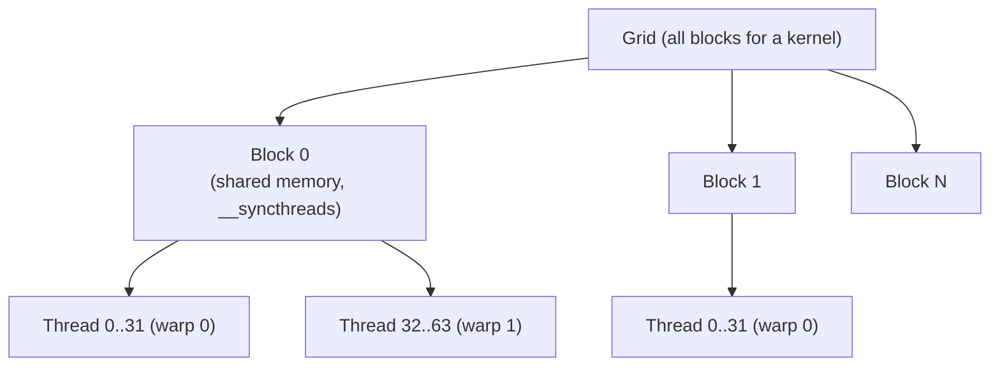

# CUDA Programming

## Overview

**CUDA** (Compute Unified Device Architecture) is NVIDIA's parallel programming platform for GPUs. Programs are written in **CUDA C++** (or Python via CuPy/Numba, or higher-level frameworks like PyTorch/Triton) and execute as **kernels** — functions run by thousands of threads in parallel on the GPU.

This page covers the CUDA programming model, memory hierarchy, and the optimization techniques that matter for performance interviews and real kernels. See [GPU Architecture](./gpu.md) for the hardware side (SMs, warps, SIMT).

## The Programming Model



Hierarchy:

- **Thread** — smallest unit; has its own registers, local memory, and `threadIdx`.
- **Block** — group of threads (≤1024) on one SM; share **shared memory** and synchronize with `__syncthreads()`.
- **Grid** — all blocks launched for one kernel; blocks are independent (no cross-block sync).

```cuda
// Vector addition kernel
__global__ void add(float* a, float* b, float* c, int n) {
    int i = blockIdx.x * blockDim.x + threadIdx.x;
    if (i < n) c[i] = a[i] + b[i];
}

int main() {
    // ... allocate device memory with cudaMalloc, copy with cudaMemcpy ...
    int threadsPerBlock = 256;
    int blocks = (n + threadsPerBlock - 1) / threadsPerBlock;
    add<<<blocks, threadsPerBlock>>>(d_a, d_b, d_c, n);
    cudaDeviceSynchronize();
}
```

**Key API pieces**: `cudaMalloc`/`cudaFree` (device memory), `cudaMemcpy` (host↔device), `cudaDeviceSynchronize` (wait for kernel), `cudaGetLastError` (check launches). Async variants (`cudaMemcpyAsync`) plus **streams** overlap transfers and kernels.

## Memory Hierarchy

| Memory | Scope | Speed | Capacity | Notes |
|---|---|---|---|---|
| **Registers** | Per thread | Fastest | 64K regs/SM (~255/thread) | Spills go to local memory |
| **Shared memory** | Per block | ~20× faster than global | 48–228 KB/SM | Manually managed; banked |
| **L1/L2 cache** | SM / GPU | Fast | — | Automatic |
| **Global memory** | All threads | ~400–800 cycles latency | GBs | DRAM; coalescing matters |
| **Constant memory** | All threads (read-only) | Cached | 64 KB | Broadcast-friendly |
| **Texture memory** | All threads (read-only) | Cached | — | Spatial locality, filtering |

**Local memory** = register spills (thread-private, but in DRAM — slow). Keep register usage under control to avoid spilling.

## Core Optimizations

### 1. Memory coalescing

A warp (32 threads) should access **adjacent addresses** so the hardware issues one wide transaction instead of 32 separate ones.

```cuda
// GOOD: thread i accesses element i — coalesced
float val = x[blockIdx.x * blockDim.x + threadIdx.x];

// BAD: stride access breaks coalescing
float val = x[(blockIdx.x * blockDim.x + threadIdx.x) * 32];
```

**Symptom → fix**: low achieved bandwidth → ensure warp threads read consecutive elements; use vectorized loads (`float4`) when alignment allows.

### 2. Shared memory tiling

Cache reused data in shared memory to cut global-memory traffic — the classic **matrix multiplication tiling** pattern: load a tile of A and B into shared memory once, reuse it across the tile's computations.

```cuda
__shared__ float As[BLOCK][BLOCK];
__shared__ float Bs[BLOCK][BLOCK];
// cooperative load: each thread loads one element
As[ty][tx] = a[row * BLOCK + tx];
Bs[ty][tx] = b[ty * n + col];
__syncthreads();
// compute using shared tiles, accumulate in register
__syncthreads();  // before overwriting tiles for the next iteration
```

### 3. Avoiding bank conflicts

Shared memory is divided into **32 banks**; threads in a warp accessing the **same bank** in the same cycle serialize. Fix by **padding**:

```cuda
// 2D tile with padding to shift bank assignment
__shared__ float tile[TILE][TILE + 1];
```

**Symptom → fix**: high shared-memory stall → pad arrays, ensure `threadIdx.x`-indexed accesses hit distinct banks.

### 4. Minimizing warp divergence

All threads in a warp execute the same instruction; an `if/else` where half the warp takes each branch executes **both paths serially** (masked). 50/50 divergence in a hot loop can halve throughput.

```cuda
// DIVERGENT: threads alternate paths within a warp
if (threadIdx.x % 2 == 0) { ... } else { ... }

// BETTER: divergence at warp/block granularity
if (blockIdx.x % 2 == 0) { ... } else { ... }
```

### 5. Occupancy and latency hiding

**Occupancy** = active warps ÷ max warps per SM. More resident warps hide memory latency (while one warp stalls, others execute). Limited by registers/thread, shared memory/block, and block size. **Target**: enough warps to saturate pipelines — 100% occupancy isn't required; balance it against register usage (avoid spills).

- **Symptom → fix**: low occupancy → reduce register pressure (`-maxrregcount` sparingly), shrink shared memory per block, tune block size.
- **Nsight Compute**'s occupancy calculator explores the trade-off.

### 6. Instruction-level parallelism (ILP)

Unroll loops and break dependency chains so multiple independent instructions are in flight — helps when occupancy is limited.

## Performance Analysis: Which Bound?

| Kernel is... | Evidence | Fix focus |
|---|---|---|
| **Memory-bound** | Low FLOPS, high memory throughput | Coalescing, tiling, vectorization |
| **Compute-bound** | High FLOPS, ALU busy | ILP, unrolling, intrinsics, Tensor Cores (mixed precision) |
| **Latency/occupancy-bound** | High stall rates | More warps, reduce register pressure |
| **Launch-bound** | Many tiny kernels | **Kernel fusion**, CUDA streams, **CUDA Graphs** |

**Rule**: profile before optimizing — `ncu` (Nsight Compute), `nsys` (Nsight Systems), and `nvidia-smi` identify the actual bound.

## Warp-Level Primitives (advanced)

Modern CUDA provides warp-synchronous intrinsics for reductions without shared memory:

- `__shfl_sync(mask, val, lane)` — exchange values across lanes in a warp.
- `__ballot_sync(mask, pred)` — return a bitmask of lanes where `pred` is true.
- `__reduce_add_sync(mask, val)` — warp-wide reduction.

These power efficient prefix sums and reductions (e.g., in softmax/attention kernels).

## GPU Generations and Tensor Cores

| Arch | Key feature |
|---|---|
| Volta (2017) | Tensor Cores (FP16), independent thread scheduling |
| Turing (2018) | RT cores, INT8/INT4 Tensor Cores |
| Ampere (2020) | FP16/BF16/INT8 Tensor Cores, TF32, sparse |
| Hopper (2022) | FP8, transformer engine, DPX instructions |
| Blackwell (2024) | FP4/FP6, 5th-gen Tensor Cores |

**Tensor Cores** do mixed-precision matrix multiply-accumulate (the backbone of LLM training/inference — see [Distributed Training](../../ml/llm/distributed-training.md)). Written via cuBLAS/cuDNN, CUTLASS, or compiler pragmas — rarely hand-coded.

## ROCm/HIP and Portability

- **ROCm/HIP** is AMD's CUDA-compatible API: most CUDA kernels port by changing `cuda*` → `hip*`.
- **SYCL** and **oneAPI** target multi-vendor GPUs.
- **Triton** (OpenAI) and **JAX/XLA** write kernels at a higher level, generating optimized code for various backends — increasingly the pragmatic choice for ML.

## Interview Questions

### Q: Explain the CUDA thread hierarchy.

A kernel launches a **grid** of **blocks**, each block holding up to 1024 **threads**. Threads in a block share shared memory and synchronize via `__syncthreads()`, so they must fit on one SM. Blocks are independent — the GPU schedules them across SMs with no cross-block synchronization (a deliberate design for scalability). Threads identify themselves with `blockIdx`, `blockDim`, and `threadIdx`.

### Q: What is memory coalescing and why does it matter?

When the 32 threads of a warp access global memory, the hardware fetches in aligned segments (e.g., 128-byte transactions). If the threads access **adjacent addresses**, one transaction serves the whole warp; if they stride or scatter, multiple transactions are needed — reducing effective bandwidth. Coalesced access (thread `i` reads element `i`) is the single most important pattern for memory-bound kernels.

### Q: What is a shared memory bank conflict?

Shared memory is split into 32 banks; a warp's memory access completes in one cycle only if threads hit **distinct banks**. If two or more threads in the warp access the **same bank** (e.g., `data[threadIdx.x * 32]`), the accesses serialize. Fix by **padding** arrays (e.g., `[TILE][TILE + 1]`) or restructuring indices so consecutive threads hit consecutive banks.

### Q: What is warp divergence and how do you avoid it?

All threads in a warp execute in lockstep (SIMT). If a branch splits the warp, the hardware executes each path **serially** with the other half masked — halving throughput for a 50/50 split. Avoid divergence by making conditions uniform per warp (e.g., branch on `blockIdx`), or restructuring data so divergent cases are processed by separate warps.

### Q: How do you determine if a kernel is memory-bound or compute-bound?

Profile with Nsight Compute: if achieved memory bandwidth is near the hardware limit while FLOPS are low, it's memory-bound (fix: coalescing, shared-memory tiling, vectorized loads). If ALU utilization is high and memory is idle, it's compute-bound (fix: ILP, intrinsics, Tensor Cores). If stalls dominate, it's latency/occupancy-bound (fix: more warps, fewer registers). Optimize for the actual bottleneck, measured — not guessed.

## References

- NVIDIA CUDA C++ Programming Guide — https://docs.nvidia.com/cuda/cuda-c-programming-guide/
- NVIDIA CUDA C++ Best Practices Guide — https://docs.nvidia.com/cuda/cuda-c-best-practices-guide/
- Nsight Compute / Nsight Systems documentation — https://docs.nvidia.com/nsight-compute/
- CUDA Samples (matrixMul, reduction) — https://github.com/NVIDIA/cuda-samples
- ROCm/HIP documentation — https://rocm.docs.amd.com/

## Related Topics

- [GPU Architecture](./gpu.md) — SMs, warps, SIMT, memory hierarchy
- [SIMD](./simd.md) — CPU-side data parallelism
- [Distributed Training](../../ml/llm/distributed-training.md) — how GPU kernels scale to multi-GPU training
- [Transformers and Attention](../../ml/transformers/README.md) — kernels that run on GPUs
- [Quantization](../../llm/llm-serving/quantization.md) — FP8/INT8 and Tensor Cores
