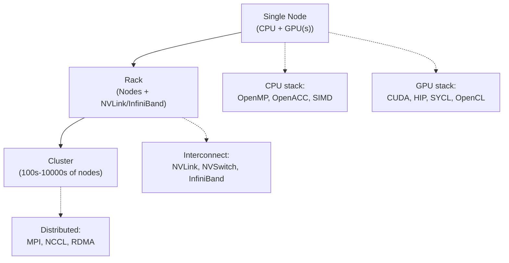
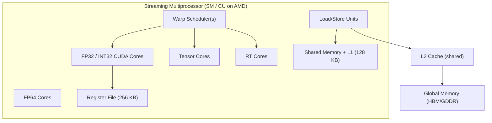
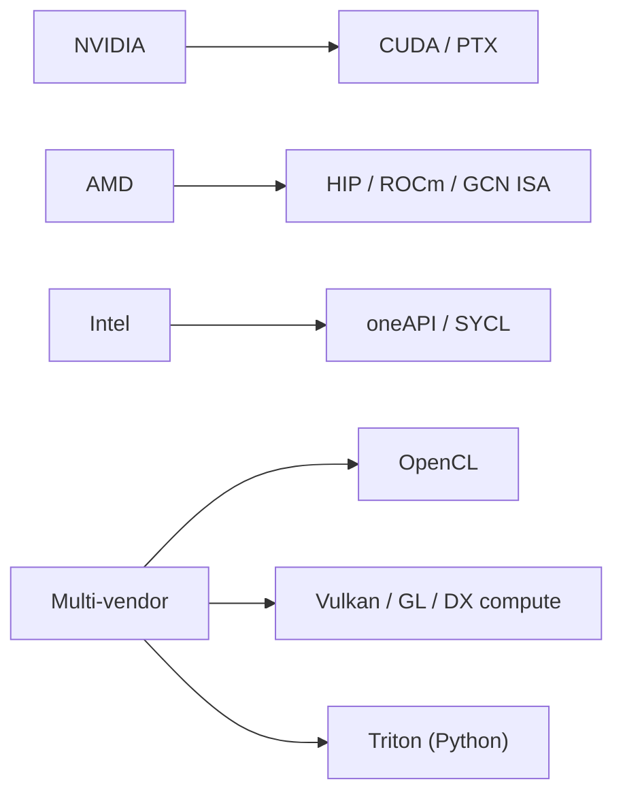
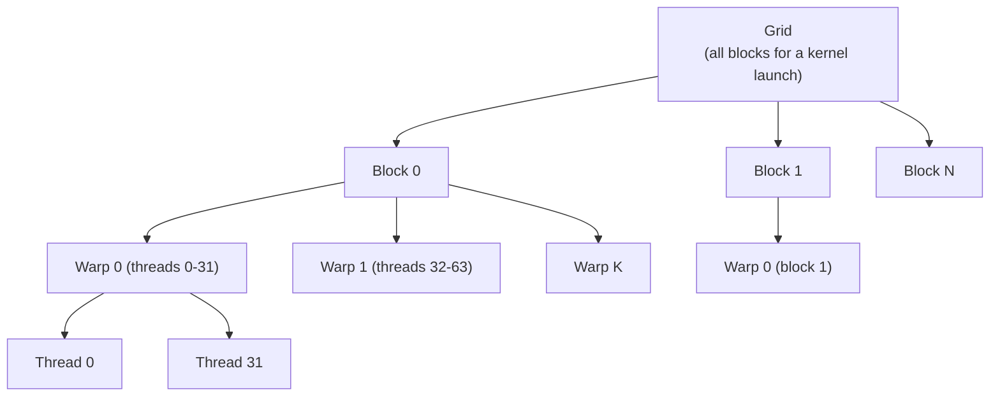
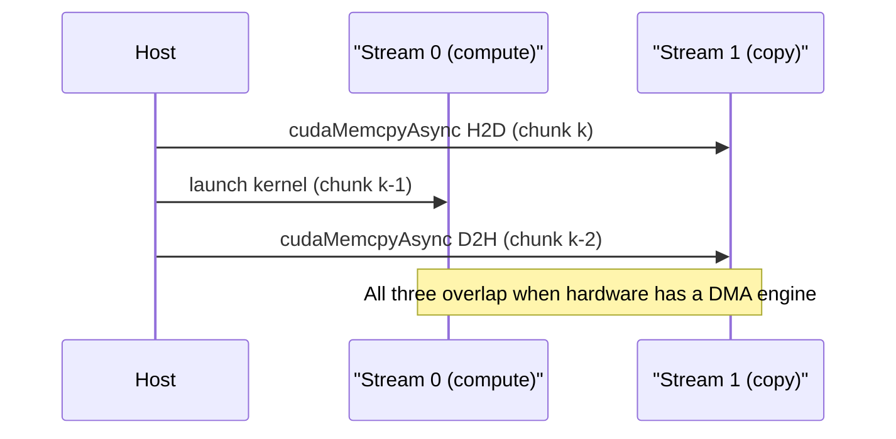
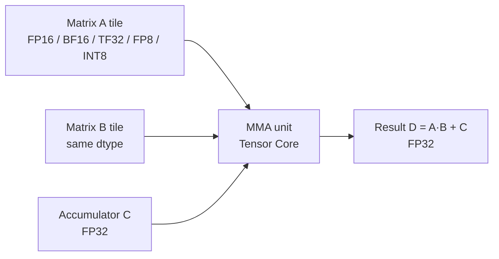
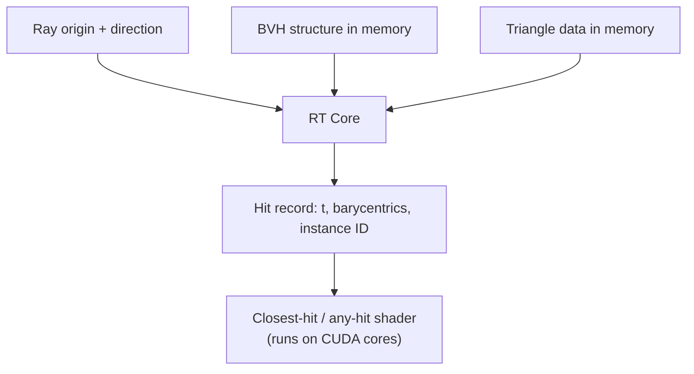
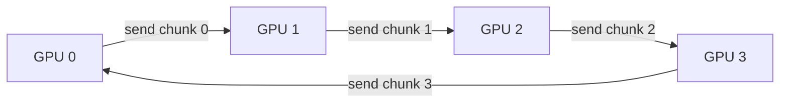
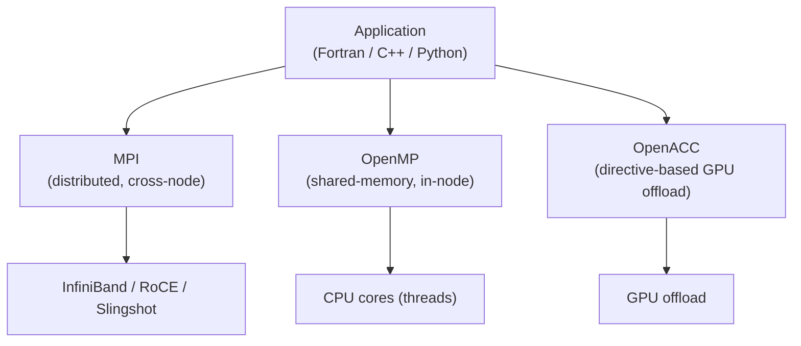
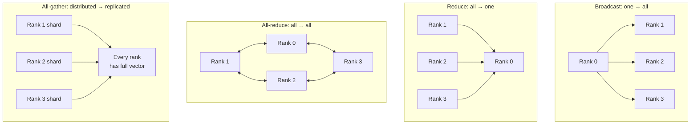

# GPUs / High Performance Computing

## Overview

This page is the **breadth-first deep dive** for Section 24 of the index: the full landscape of GPU and HPC computing — frameworks (CUDA, OpenCL, SYCL, HIP, compute shaders, Triton), special-function cores (Tensor Cores, RT Cores), multi-GPU communication (NCCL), and the classical HPC stack (MPI, OpenMP, OpenACC). It complements two siblings already in the book and **cross-references them instead of repeating** them:

- [GPU Architecture](./gpu.md) — SMs, warps, SIMT, memory hierarchy (hardware view).
- [CUDA Programming](./cuda.md) — kernels, blocks, streams, optimizations (NVIDIA software view).

This page focuses on the **frameworks, the inter-vendor portability story, and the HPC cluster layer** that the per-vendor pages do not cover.

## 1. The HPC Landscape

Modern high-performance computing spans three concentric tiers:



| Tier | Granularity | Dominant API | Latency | Typical scale |
|-----|-------------|--------------|---------|---------------|
| **Node** | Threads / warps | CUDA, HIP, OpenMP, OpenACC | ns–µs | 1–8 GPUs, 32–128 cores |
| **Rack** | Processes / GPUs | NCCL, NVLink, shared memory | µs | 8–32 GPUs |
| **Cluster** | Processes / nodes | MPI, NCCL over IB/RoCE | 1–10 µs | 100s–10000s of GPUs |

### GPU vs CPU — recap

The GPU sacrifices per-thread performance (simple in-order cores, ~1–2.5 GHz, small caches) for **massive thread-level parallelism** that hides memory latency by oversubscribing the ALUs. CPUs target latency (4–128 complex OoO cores, 3–5 GHz, large caches, aggressive branch prediction); GPUs target throughput (1000s of simple cores, SIMT warps, 1–3 TB/s HBM bandwidth). See [GPU Architecture](./gpu.md) for the full comparison table.

## 2. GPU Microarchitecture (recap)

Detailed coverage is in [GPU Architecture](./gpu.md). The essentials needed for the rest of this page:



- **SM / CU** — NVIDIA calls the compute block a *Streaming Multiprocessor*; AMD calls the equivalent a *Compute Unit*. Both contain the warp scheduler, ALUs, register file, and shared memory.
- **Warp (NVIDIA) / Wavefront (AMD)** — 32 (NV) or 32/64 (AMD) threads executing in lockstep under **SIMT** (Single Instruction, Multiple Threads).
- **Tensor Cores** — mixed-precision matrix multiply-accumulate units (see §9).
- **RT Cores** — hardware BVH traversal units for ray tracing (see §10).

## 3. Memory Hierarchy

GPU memory is a **manually managed cache hierarchy** — the programmer decides what lives in shared memory and how warps access global memory. Detailed in [CUDA Programming](./cuda.md); summarized here for the framework comparison.

| Memory | Scope | Latency | Capacity | Programmer-managed? |
|--------|-------|---------|----------|---------------------|
| **Registers** | Per-thread | 1 cycle | ~255 regs/thread | Implicit (compiler) |
| **Local memory** | Per-thread (in DRAM) | ~400–800 cyc | — | Spills only |
| **Shared memory** | Per-block | ~5 cyc (banked) | 48–228 KB/SM | Yes (`__shared__`) |
| **L1 cache** | Per-SM | ~30 cyc | 0–128 KB | No |
| **L2 cache** | Device-wide | ~200 cyc | 6–192 MB | No |
| **Global memory** | All threads + host | ~400–800 cyc | GBs (HBM/GDDR) | Yes (allocations) |
| **Constant memory** | All threads (RO) | ~cached | 64 KB | Yes (`__constant__`) |
| **Texture memory** | All threads (RO) | ~cached | — | Yes (`texture<>`) |
| **Unified Memory** | CPU+GPU | varies | limited by RAM | Managed (driver migrates pages) |

The two performance levers are **memory coalescing** (one warp → one transaction when threads access adjacent addresses) and **shared-memory tiling** (reuse data across a block to cut global traffic). Both are covered in [CUDA Programming](./cuda.md).

## 4. GPU Compute Frameworks



| Framework | Vendor | Language | Portability | Maturity | Typical use |
|-----------|--------|----------|-------------|----------|-------------|
| **CUDA** | NVIDIA | CUDA C++ | NVIDIA only | Industry standard | ML, scientific compute, HPC |
| **HIP** | AMD | C++ (CUDA-like) | AMD + NVIDIA (via hipify) | Mature | Cross-vendor ML / ROCm |
| **OpenCL** | Khronos (all) | C / C++ kernel | Broad (CPU/GPU/FPGA/DSP) | Mature, declining | Embedded, legacy HPC, FPGAs |
| **SYCL** | Khronos | Single-source C++ | Multi-vendor via oneAPI/CodePlay | Growing | Portable HPC, ML |
| **Vulkan Compute** | Khronos | GLSL/HLSL/SPIR-V | All GPUs, mobile-friendly | Mature | Graphics + compute, games |
| **OpenGL/DirectX compute shaders** | Multi | GLSL/HLSL | All GPUs | Mature | Real-time graphics pipelines |
| **Triton** | OpenAI | Python DSL | NVIDIA + AMD (via backends) | Active | ML kernel authoring |
| **OpenACC** | Multi | Directive-based (`#pragma acc`) | NVIDIA/AMD/Intel compilers | Niche | Legacy scientific Fortran/C |

### 4.1 CUDA (recap)

CUDA is NVIDIA's native platform — see [CUDA Programming](./cuda.md) for kernels, blocks, streams, events, and optimizations. It is the **performance reference** against which all other frameworks are measured.

### 4.2 OpenCL

**OpenCL** (Open Computing Language) is the Khronos Group's open standard for cross-platform heterogeneous computing. It exposes a **platform model** (host + devices), an **execution model** (kernels dispatched over ND-ranges), and a **memory model** (global, constant, local, private).

```c
// OpenCL kernel: vector add — note __global and get_global_id
__kernel void vadd(__global const float* a,
                   __global const float* b,
                   __global float* c,
                   const int n) {
    int i = get_global_id(0);
    if (i < n) c[i] = a[i] + b[i];
}
```

OpenCL concepts map to CUDA almost 1:1:

| OpenCL | CUDA equivalent |
|-------|-----------------|
| Compute unit (CU) | Streaming Multiprocessor (SM) |
| Work-item / Work-group | Thread / Block |
| Wavefront / subgroup | Warp |
| ND-range | Grid |
| `__local` / `__global` / `__constant` | Shared / Global / Constant memory |
| `barrier(CLK_LOCAL_MEM_FENCE)` | `__syncthreads()` |

OpenCL's strength is **breadth**: it runs on CPUs, GPUs, FPGAs, and DSPs from many vendors. Its weakness is **ergonomics** — verbose host API, separate kernel source strings, and slower evolution than CUDA. Adoption has declined as SYCL and HIP have absorbed its portability role.

### 4.3 SYCL

**SYCL** is Khronos's higher-level, single-source C++ model — the kernel and host code live in one `.cpp` file, and the compiler sorts out what runs where. Intel's **oneAPI** and CodePlay's plugins are the major implementations.

```cpp
#include <sycl/sycl.hpp>

// Single-source C++: kernel and host in one file
void vadd(sycl::queue& q, const float* a, const float* b,
          float* c, int n) {
    q.parallel_for(sycl::range<1>(n), [=](sycl::id<1> i) {
        c[i] = a[i] + b[i];
    }).wait();
}
```

Key properties: **single-source** (no separate kernel string, no `clSetKernelArg` boilerplate), **C++ lambdas / functors** as kernels (type-safe, no string compilation), **Unified Shared Memory (USM)** or buffer/accessor model (the latter lets the runtime track data dependencies and insert transfers automatically). Backends: DPC++ (Intel oneAPI → CUDA, HIP, Level Zero, OpenCL), CodePlay oneAPI plugins (NVIDIA, AMD), AdaptiveCpp (formerly OpenSYCL / hipSYCL).

SYCL is the most promising **open, portable** path for HPC code that must run on mixed NVIDIA + AMD + Intel clusters — at the cost of slightly less access to vendor-specific features than native CUDA/HIP.

### 4.4 HIP

**HIP** (Heterogeneous-compute Interface for Portability) is AMD's CUDA-compatible C++ API. The design intent is **near-line-for-line portability** from CUDA: `cudaMalloc` → `hipMalloc`, `__global__` stays `__global__`, `<<<...>>>` syntax is preserved.

```cpp
// HIP looks identical to CUDA
__global__ void vadd(const float* a, const float* b,
                     float* c, int n) {
    int i = hipBlockIdx_x * hipBlockDim_x + hipThreadIdx_x;
    if (i < n) c[i] = a[i] + b[i];
}

// hipLaunchKernelGGL(vadd, dim3(blocks), dim3(tpb), 0, 0, a, b, c, n);
```

Tooling: `hipify-perl` / `hipify-clang` (automated CUDA→HIP source translation), ROCm (AMD's full stack: HIP, rocBLAS, MIOpen, rocFFT — the AMD analog of CUDA + cuBLAS + cuDNN), and `hipcc` (compiles to AMD GCN/CDNA ISA on AMD or PTX on NVIDIA). HIP is the pragmatic **drop-in** for CUDA codebases that need AMD support, with the lowest porting friction of any cross-vendor option.

### 4.5 Compute Shaders (Vulkan / OpenGL / DirectX)

Graphics APIs expose compute through **compute shaders** — kernels written in GLSL/HLSL that dispatch over a 3D grid of *invocations*, sharing the same shader compiler and resource binding model as graphics.

```glsl
#version 450
layout(local_size_x = 64) in;
layout(binding = 0) buffer A { float a[]; };
layout(binding = 1) buffer B { float b[]; };
layout(binding = 2) buffer C { float c[]; };

void main() {
    uint i = gl_GlobalInvocationID.x;
    if (i < a.length()) c[i] = a[i] + b[i];
}
```

Characteristics: dispatched as `(groups_x, groups_y, groups_z)`, each group with `local_size_x×y×z` invocations (≤ 1024). Shared memory is `shared` (GLSL) / `groupshared` (HLSL); barrier is `barrier()`. The API has no explicit warp concept, but vendors expose subgroup/warp extensions (`VK_KHR_shader_subgroup`). **Strength**: integration with rendering pipelines — post-processing, particles, GPU-driven culling. **Weakness**: no rich runtime libraries (no cuBLAS / cuDNN); kernels are hand-written.

### 4.6 Triton

**Triton** (originally OpenAI, now community-driven) is a Python DSL for writing GPU kernels at a level above CUDA but below framework ops. The compiler lowers Triton to **LLVM IR → PTX / GCN**, applying tiling, software-pipelining, and memory coalescing automatically.

```python
import triton, triton.language as tl

@triton.jit
def vadd(x_ptr, y_ptr, out_ptr, n, BLOCK: tl.constexpr):
    pid = tl.program_id(0)
    offs = pid * BLOCK + tl.arange(0, BLOCK)
    mask = offs < n
    tl.store(out_ptr + offs,
            tl.load(x_ptr + offs, mask=mask) + tl.load(y_ptr + offs, mask=mask),
            mask=mask)
```

Triton is the kernel language of choice for modern ML systems (`flash-attention`, `vLLM`, parts of PyTorch 2's `torch.compile`) — the programmer expresses block-level operations and the compiler generates the warp-level instructions.

## 5. CUDA Thread Hierarchy (recap)



Detailed semantics (block size limits, `__syncthreads`, grid-stride loops) are in [CUDA Programming](./cuda.md). The same hierarchy appears under different names in OpenCL (ND-range → work-group → work-item), HIP (identical to CUDA), and SYCL (nd_range → work-group → work-item).

## 6. Streams, Events, and Kernel Fusion

CUDA streams serialize work within themselves but execute concurrently with other streams. **Overlap** of compute, host↔device copies, and kernel launches is the main lever for filling the pipeline:



**Kernel fusion** combines several small kernels into one to avoid round-trips through global memory. For element-wise chains `f(g(h(x)))`, fusion turns 3 reads + 3 writes into 1 read + 1 write. CUDA Graphs formalize this — capture a launch sequence once and replay it with low launch overhead.

```cuda
// Unfused: 3 global reads + 3 writes per element
square<<<g, b>>>(x, tmp, n);
scale<<<g, b>>>(tmp, tmp2, n);
add<<<g, b>>>(tmp2, y, n);

// Fused: 1 global read + 1 write
__global__ void fused(const float* x, float* y, int n) {
    int i = blockIdx.x * blockDim.x + threadIdx.x;
    if (i < n) y[i] = (x[i] * x[i]) * 0.5f + 1.0f;
}
```

Fusion trades register pressure for memory traffic — the GPU analog of operator fusion in compiler design.

## 7. Tensor Cores

**Tensor Cores** (introduced in Volta, 2017) are dedicated matrix multiply-accumulate units that perform \\(D = A \times B + C\\) on small tiles (e.g., \\(16 \times 16\\) FP16, or \\(8 \times 8\\) INT8) in a single cycle per warp. They are the hardware backbone of LLM training and inference.



Key points:

- **Mixed precision**: inputs are low-precision (FP16/BF16/TF32/FP8/INT8/INT4); the accumulator is always FP32 to preserve numerical range.
- **TF32** (Ampere+) is FP32 with 10-bit mantissa — speeds up FP32 workloads almost for free via cuBLAS defaults.
- **FP8** (Hopper) has `E5M2` and `E4M3` formats; the **Transformer Engine** auto-selects per-tensor.
- **Programming**: rarely hand-coded. Access via cuBLAS (`cublasGemmEx`), cuDNN, CUTLASS (C++ template library), Triton's `tl.dot` (which lowers to Tensor Core MMA), or compiler intrinsics (`wmma::mma_sync`).

Effective throughput jump: an H100 SXM reaches ~990 TFLOPS of FP8 with Tensor Cores versus ~67 TFLOPS of FP32 without — a ~15× gap that defines modern ML system design.

## 8. Ray Tracing Cores

**RT Cores** (Turing, 2018) accelerate **BVH traversal** (walking a Bounding Volume Hierarchy to find candidate triangle hits) and **ray-triangle intersection** — both without occupying shader ALUs.



In DirectX 12 Ultimate, Vulkan (via `VK_KHR_ray_tracing`), and OptiX, the programmer issues `TraceRay()` calls; the RT core handles traversal while the SM is free to run other warps. Modern RT cores (3rd-gen in Ada/Blackwell) add **Opacity Micromap** and **Displaced Micro-Mesh** hardware to compress complex geometry without exploding BVH size.

Beyond graphics, RT cores see niche use in **ray-traced acoustic simulation**, **radio propagation**, and **molecular collision** workloads — anywhere you need fast spatial queries against large static scenes.

## 9. Multi-GPU and Distributed Training

Single-GPU training caps out at ~one model copy on one device. Scaling beyond requires **data, tensor, pipeline, or expert parallelism**, all of which need to move tensors between GPUs. Three communication patterns dominate:

| Pattern | Math | Use case |
|---------|------|----------|
| **All-reduce (sum)** | \\(y_i = \sum_j x_j\\) for every \\(i\\) | Data-parallel gradient sync |
| **All-gather** | \\(y_i = (x_0, x_1, \dots, x_{n-1})\\) | Tensor-parallel activations, FSDP params |
| **Reduce-scatter** | \\(y_i = \text{shard}_i(\sum_j x_j)\\) | FSDP gradient shard |
| **All-to-all** | \\(y_i\\) receives shard \\(i\\) from every \\(j\\) | Expert / sequence parallelism |

### NCCL

**NCCL** (NVIDIA Collective Communications Library) is the de-facto standard for multi-GPU collectives on NVIDIA hardware. It picks the best topology-aware algorithm at runtime — **ring** for moderate message sizes, **tree** for very large reductions, and **collnet** for switch-assisted reductions.

**Ring all-reduce** is the canonical algorithm — it scales optimally: bandwidth per GPU is constant regardless of ring size.



For \\(n\\) GPUs and message size \\(M\\), ring all-reduce moves \\(\frac{2(n-1)}{n} M\\) bytes per GPU in \\(2(n-1)\\) steps — both numbers are **independent of \\(n\\) at the per-GPU level** (the per-step chunk shrinks as \\(n\\) grows). This is why adding more GPUs doesn't bottleneck communication until the interconnect itself saturates.

**NVLink / NVSwitch** are the physical layer — NVLink gives ~300–900 GB/s per GPU (vs ~32–64 GB/s for PCIe Gen5 x16), and NVSwitch provides all-to-all connectivity within an 8-GPU node. Cross-node, **InfiniBand HDR/NDR** (200–400 Gbps) and **RoCE** are the backbone; NCCL abstracts both via the `NCCL_NET` plugin interface.

## 10. HPC Cluster Stack

Beyond a single node, classical HPC relies on three orthogonal layers:



### 10.1 MPI (Message Passing Interface)

**MPI** is the lingua franca of distributed HPC. Programs are SPMD — the same binary runs on every rank, and ranks exchange data with explicit messages. The standard is maintained by the **MPI Forum**; common implementations are Open MPI, MPICH, and vendor variants (Intel MPI, Cray MPICH).

```c
// SPMD: rank 0 sends, rank 1 receives
MPI_Init(&argc, &argv);
int rank; MPI_Comm_rank(MPI_COMM_WORLD, &rank);
if (rank == 0)
    MPI_Send(buf, n, MPI_FLOAT, 1, 0, MPI_COMM_WORLD);
else
    MPI_Recv(buf, n, MPI_FLOAT, 0, 0, MPI_COMM_WORLD, &status);
MPI_Finalize();
```

**Collective operations** are the heart of HPC communication patterns — topology-optimized and an order of magnitude faster than naive send/recv trees:



| Collective | In → Out | Cost (tree) | Cost (ring) |
|-----------|----------|-------------|-------------|
| **Broadcast** | one rank → all | \\(O(\log n)\\) latency | \\(O(n)\\) steps |
| **Reduce** | all → one rank | \\(O(\log n)\\) latency | \\(O(n)\\) steps |
| **All-reduce** | all → all (same sum) | \\(O(\log n)\\) latency, \\(O(n \log n)\\) bandwidth | \\(O(n)\\) steps, \\(O(M)\\) per-GPU bandwidth |
| **All-gather** | sharded → replicated | \\(O(\log n)\\) latency, \\(O(M)\\) bandwidth | \\(O(n)\\) steps, \\(O(M/n)\\) per step |
| **All-to-all** | \\(x_i \to y_i\\) transpose | \\(O(n)\\) steps | \\(O(n)\\) steps |
| **Scatter / Gather** | one ↔ all (sharded) | \\(O(\log n)\\) | \\(O(n)\\) |

For GPU-aware MPI (CUDA-aware MPI), the implementation uses **CUDA Unified Memory** or **GPUDirect RDMA** to move data directly between GPUs on different nodes without staging through host memory — essential for scaling GPU clusters.

### 10.2 OpenMP

**OpenMP** is a directive-based API for shared-memory parallelism on a single node. You annotate loops and the compiler spawns threads, distributes work, and inserts barriers.

```c
#pragma omp parallel for reduction(+:sum) schedule(static)
for (int i = 0; i < n; i++) sum += a[i] * b[i];
```

Key directives: `parallel` (spawn team), `for` (distribute loop iterations), `reduction(op:var)` (combine partials), `schedule(static|dynamic|guided, chunk)` (assignment policy), `task` (irregular workloads), `target` (GPU offload — overlaps with OpenACC), `simd` (assert SIMD-vectorizable).

OpenMP + MPI is the classic **hybrid** HPC pattern: MPI between nodes, OpenMP within a node. This reduces the MPI rank count (and thus the communication footprint) and matches modern many-core nodes better than pure MPI.

### 10.3 OpenACC

**OpenACC** is a directive-based GPU offload API aimed at incremental porting of legacy Fortran/C scientific code. Like OpenMP's `target`, you annotate loops with `#pragma acc` and the compiler generates CUDA / HIP / OpenCL kernels.

```c
#pragma acc kernels loop gang vector reduction(+:sum)
for (int i = 0; i < n; i++) sum += a[i] * b[i];
```

`gang` ≈ block, `worker` ≈ warp, `vector` ≈ thread — explicit mapping to the GPU hierarchy. Common in climate, astrophysics, and computational chemistry codes where rewriting in CUDA is impractical. Largely **superseded by OpenMP `target`** for new code, but entrenched in legacy HPC apps.

### 10.4 HPC communication libraries compared

| Library | Scope | Hardware | API style | Use case |
|---------|-------|----------|-----------|----------|
| **MPI** | Cross-node, distributed | Any (CPU + GPU-aware) | Explicit sends/recvs + collectives | HPC apps, distributed CPU/GPU |
| **NCCL** | Multi-GPU (single or multi-node) | NVIDIA only | Collective-only (no point-to-point) | DL training on NVIDIA |
| **RCCL** | Multi-GPU | AMD only | NCCL-compatible | DL training on AMD |
| **OpenMP** | In-node, shared memory | CPU (+ `target` for GPU) | Directive-based | Loop parallelism |
| **OpenACC** | GPU offload | NVIDIA / AMD / Intel | Directive-based | Legacy HPC porting |
| **GASPI / GPI-2** | RDMA-based async | Any with RDMA | PGAS-style | Edge cases, niche HPC |
| **NCCL + MPI hybrid** | Multi-node multi-GPU | NVIDIA + IB/RoCE | MPI bootstraps, NCCL data | Modern DL training clusters |

## 11. Performance Optimization Summary

The four GPU performance pillars, with one-sentence diagnostics (full coverage in [CUDA Programming](./cuda.md)):

| Pillar | Symptom | Fix |
|--------|---------|-----|
| **Memory coalescing** | Low bandwidth vs peak | Reorder access so warp threads hit adjacent addresses; use `float4` vectorized loads |
| **Shared memory tiling** | High DRAM traffic for reused data | Load a tile to `__shared__` once, reuse across the block (e.g., tiled GEMM) |
| **Warp divergence** | ALU utilization < expected for compute-bound kernels | Restructure `if/else` so warps take uniform paths; sort data by branch |
| **Occupancy & latency hiding** | High stall %, low IPC | Reduce register pressure, balance block size, add ILP for memory-bound kernels |

At the cluster level, the analogs are:

| Cluster-level pillar | Symptom | Fix |
|----------------------|---------|-----|
| **Communication / computation overlap** | Idle GPUs during gradient sync | Bucket gradients, launch all-reduce async with backward pass |
| **Topology awareness** | Cross-NVLink traffic on PCIe-linked GPUs | Place data-parallel groups within NVSwitch domains; use `NCCL_TOPO_FILE` |
| **Load balance** | Some ranks idle while others lag | Tune batch size per rank, balance expert placement for MoE, use dynamic batching |
| **Numerical efficiency** | Convergence limits scaling | Use BF16 / FP8 with loss scaling; gradient clipping; communication compression |

## 12. Interview Questions

### Q1: Compare CUDA, OpenCL, SYCL, and HIP. When would you pick each?

**CUDA** is NVIDIA-native — best performance and latest features (Tensor Cores, async copies, TMA), but locks you into NVIDIA. **HIP** is AMD's CUDA-compatible API — lowest porting friction if you already have CUDA, since `hipify` automates most translation. **OpenCL** is the broadest standard (CPU/GPU/FPGA/DSP) but the most verbose and is declining; pick it for embedded or FPGA work. **SYCL** is the modern portable C++ choice — single-source, type-safe, runs on Intel/AMD/NVIDIA via oneAPI; pick it for new HPC code that must span vendors. Pragmatic answer: CUDA when you can, HIP if AMD matters, SYCL for portable new code, OpenCL only for legacy/FPGA.

### Q2: Explain SIMT and warp divergence. How much does divergence cost?

SIMT (Single Instruction, Multiple Threads) means 32 threads (a warp) execute the same instruction in lockstep, each with its own registers and predicate. When threads diverge (e.g., `if (tid % 2)`), the hardware executes each path serially with the other lane masked — a 50/50 split halves throughput for those instructions. The cost is bounded by the longest branch: a warp with 4 branches pays up to 4× the instruction count. Fix by restructuring conditions to be warp-uniform (branch on `blockIdx`), sorting data so adjacent threads take the same path, or moving divergent work into separate warps via block reorganization.

### Q3: What is memory coalescing and why is it the single most important GPU optimization?

A warp's 32 threads issue memory requests together; the GPU groups them into 128-byte aligned transactions. If thread `i` reads element `i` (consecutive addresses), the hardware issues **one** transaction — full bandwidth. If threads stride or scatter (e.g., `x[tid * STRIDE]`), the warp issues many transactions, most of which carry useless data — effective bandwidth collapses. Coalescing matters most for memory-bound kernels (most ML / scientific code is memory-bound): you can lose 5–30× to uncoalesced access, dwarfing every other optimization. Profile with Nsight Compute's memory chart; if achieved bandwidth is far below peak, coalescing is the first suspect.

### Q4: How does ring all-reduce achieve near-optimal bandwidth scaling?

For \\(n\\) GPUs each holding a vector of size \\(M\\), naive all-reduce does \\(O(nM)\\) per GPU — awful at scale. Ring all-reduce arranges GPUs in a logical ring and runs two phases — **scatter-reduce** (each GPU sends and receives \\(M/n\\)-sized chunks in \\(n-1\\) steps) and **allgather** (another \\(n-1\\) steps) — so each GPU sends and receives \\(\frac{2(n-1)}{n} M\\) bytes total. Per-GPU bandwidth is **independent of \\(n\\)** at large \\(n\\): the chunk size shrinks as the ring grows. This is why data-parallel training scales to thousands of GPUs without communication blowing up — until the interconnect itself saturates.

### Q5: What are Tensor Cores and how do they differ from CUDA cores?

CUDA cores are scalar FP32/INT32 ALUs — one FMA per cycle per core. Tensor Cores are dedicated **matrix multiply-accumulate** units that perform \\(D = A \times B + C\\) on a small tile (e.g., \\(16 \times 16\\) FP16 inputs, FP32 accumulator) in a single cycle per warp. They trade generality (only matrix MMA, fixed tile shapes, mixed precision) for ~10–15× throughput. You don't write Tensor Core instructions by hand — you call cuBLAS / cuDNN / CUTLASS, or write Triton and let `tl.dot` lower to MMA. The key insight is that **most ML compute is GEMM** (matmul, attention, convolutions), so specializing for it pays off disproportionately.

### Q6: When would you use MPI vs NCCL vs OpenMP in an HPC application?

**OpenMP** for in-node shared-memory parallelism (loop-level, low overhead). **MPI** for cross-node distribution (explicit messages, robust, works on any cluster). **NCCL** for multi-GPU collectives on NVIDIA hardware (topology-aware, uses NVLink/NVSwitch). The dominant modern pattern is **MPI + NCCL**: MPI bootstraps the process group and handles CPU-side orchestration (file I/O, host launches, sparse control messages), while NCCL handles the heavy GPU-to-GPU tensor traffic. OpenMP fills in for CPU-bound pre/post-processing within a rank.

### Q7: How would you overlap communication with computation in distributed training?

The canonical pattern is **gradient bucketing + async all-reduce during backward**: partition gradients into buckets, and as soon as a bucket's gradients are ready, launch an async `all_reduce` on a dedicated NCCL stream — by the time backward completes, most buckets have already been reduced. Additional levers: (1) **gradient compression** (8-bit, sparsification); (2) **topology-aware rank assignment** so data-parallel groups sit on the same NVSwitch; (3) **separate CUDA streams** so SMs keep working while NCCL uses the copy engines; (4) **FSDP** to keep per-rank memory low and overlap all-gather of the next layer's weights with the current layer's compute.

### Q8: A kernel is running at 30% of peak memory bandwidth. How do you debug it?

Profile with Nsight Compute (`ncu --set full ./app`) and check: (1) **memory workload analysis** — bottleneck is L2 hit rate, DRAM bandwidth, or shared-memory bank conflicts? (2) **coalescing** — is the warp's access producing one transaction or many? (3) **L2 cache hit rate** — low hit on reused data suggests tiling into shared memory; (4) **wave quantization** — is the grid a multiple of SM count, leaving some SMs idle on the last wave? (5) **occupancy** — too few resident warps means not enough outstanding requests to hide latency. Common fixes: coalesce accesses, add shared-memory tiling, tune block/grid size to fill the device, eliminate bank conflicts. Always profile before optimizing — the bottleneck is rarely where you guess.

## Common Mistakes

- ❌ Treating OpenCL/SYCL/HIP as drop-in CUDA replacements without profiling — vendor-specific features (Tensor Cores, async copies, TMA) often need explicit enablement.
- ❌ Picking MPI for in-node communication instead of OpenMP — process-per-core wastes memory and incurs unnecessary message overhead.
- ❌ Forgetting that NCCL only does **collectives** — point-to-point GPU communication still needs CUDA IPC or NVLink-aware MPI.
- ❌ Ignoring topology when placing ranks — splitting a data-parallel group across an NVLink boundary halves throughput.
- ❌ Assuming "GPU = fast" — without coalescing, tiling, and occupancy tuning, GPU code can run slower than vectorized CPU code.
- ❌ Writing custom kernels when cuBLAS / cuDNN / Triton already cover the operation at near-peak performance.
- ❌ Using FP32 throughout — Tensor Cores deliver 5–15× more throughput at FP16/BF16/TF32, often for free via cuBLAS defaults.

## Summary

GPUs and HPC form a four-layer stack: (1) the **hardware** — SMs, warps, SIMT, Tensor Cores, RT Cores, HBM; (2) the **node-level software** — CUDA, HIP, OpenCL, SYCL, compute shaders, Triton; (3) the **multi-GPU layer** — NVLink, NCCL, ring/tree all-reduce; (4) the **cluster layer** — MPI, OpenMP, OpenACC, InfiniBand. Modern ML practice converges on **CUDA or Triton** for kernel authoring, **NCCL** for inter-GPU collectives, **MPI + NCCL** for multi-node training, and **SYCL/HIP** when portability is required. Profiling tools (Nsight Compute / Systems, `ncu`, `nsys`, ROCm `omniperf`) are non-negotiable — the bottleneck at each layer is rarely where intuition puts it.

## References

- NVIDIA **CUDA C++ Programming Guide** — https://docs.nvidia.com/cuda/cuda-c-programming-guide/
- NVIDIA **NCCL Documentation** — https://docs.nvidia.com/deeplearning/nccl/
- Khronos **OpenCL Specification** — https://www.khronos.org/opencl/
- Khronos **SYCL Specification** — https://www.khronos.org/sycl/
- AMD **HIP Documentation** (ROCm) — https://rocm.docs.amd.com/projects/HIP/en/latest/
- Khronos **Vulkan Compute Shaders** — https://docs.vulkan.org/spec/latest/chapters/compute.html
- OpenAI **Triton Language** — https://triton-lang.org/
- **MPI Forum** — https://www.mpi-forum.org/docs/
- OpenMP Architecture Review Board **OpenMP Specification** — https://www.openmp.org/specifications/
- OpenACC Standard — https://www.openacc.org/specification
- Kirk & Hwu, **Programming Massively Parallel Processors: A Hands-on Approach** (4th ed., Morgan Kaufmann, 2022)
- Mattson et al., **Structured Parallel Programming** (Morgan Kaufmann, 2012)

## Cross-References

- [GPU Architecture](./gpu.md) — SMs, warps, SIMT, memory hierarchy (hardware view)
- [CUDA Programming](./cuda.md) — kernels, blocks, streams, optimizations (NVIDIA software view)
- [SIMD](./simd.md) — CPU-side data parallelism (AVX, NEON)
- [Multicore](./multicore.md) — CPU thread-level parallelism and OpenMP context
- [Distributed Training](../../ml/llm/distributed-training.md) — data / tensor / pipeline / expert parallelism on GPUs
- [Quantization](../../llm/llm-serving/quantization.md) — FP8/INT8 and Tensor Cores
- [Transformers and Attention](../../ml/transformers/README.md) — kernels that run on GPUs
- [InfiniBand](../../linux/storage/infiniband.md) — HPC cluster interconnect
