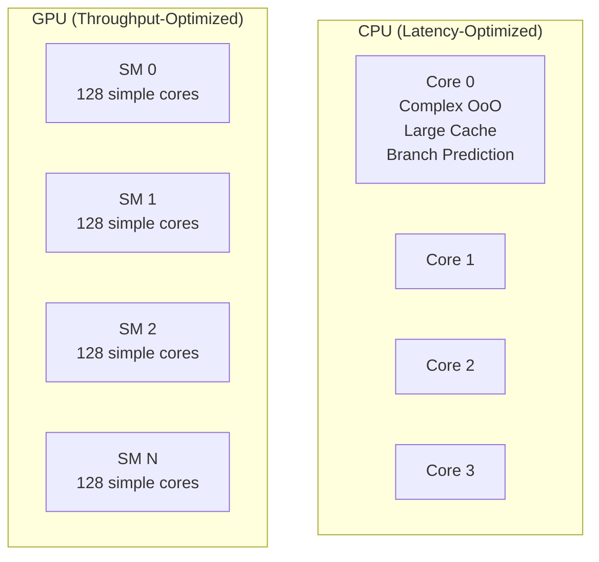
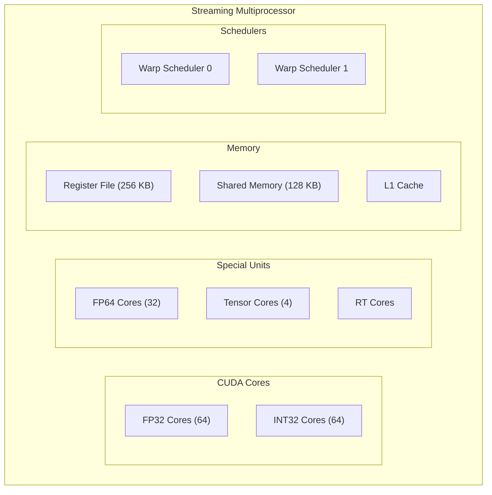
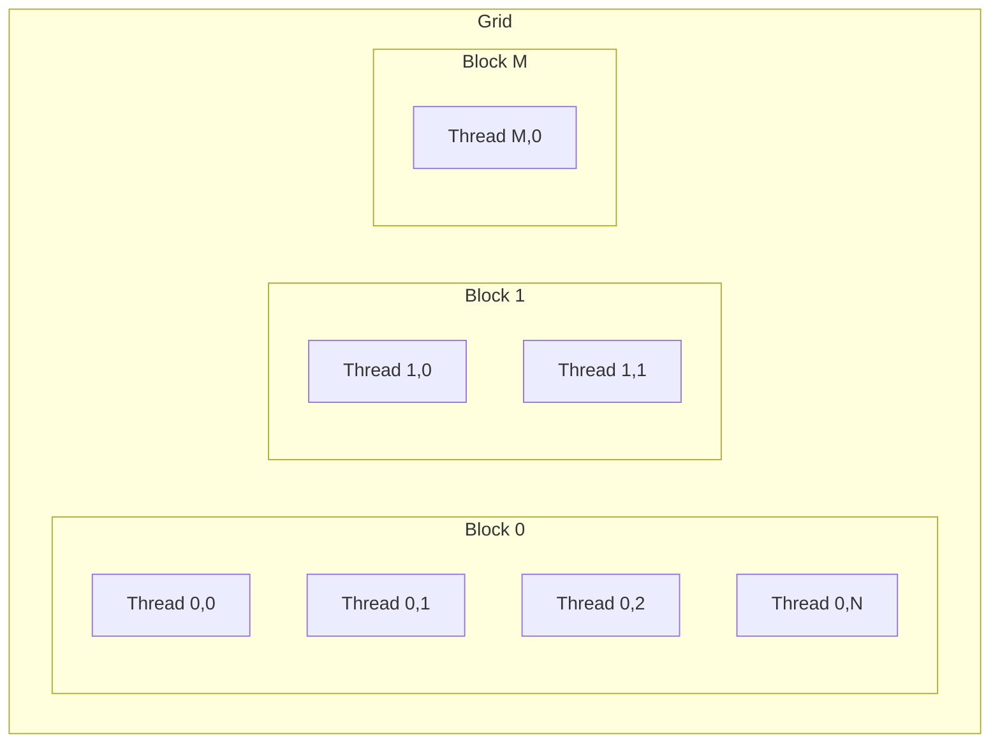
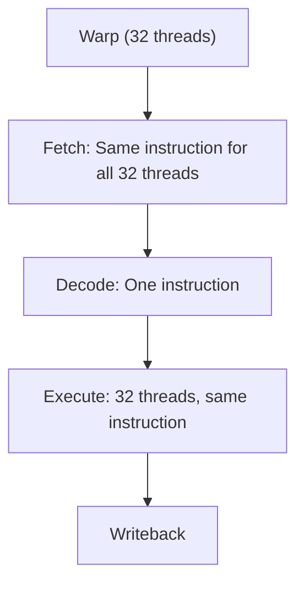
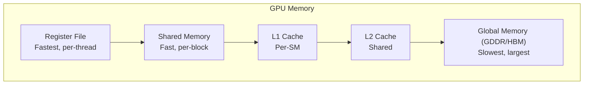

# GPU (Graphics Processing Unit)

## Overview

A **GPU** (Graphics Processing Unit) is a massively parallel processor designed for throughput-oriented workloads. Originally for graphics rendering, GPUs are now used for general-purpose computing (GPGPU) including machine learning, scientific simulation, and data processing. Understanding GPU architecture is essential for modern system design interviews.

## GPU vs CPU Architecture



| Property | CPU | GPU |
|----------|-----|-----|
| Cores | 4-128 complex | 1000s simple |
| Clock speed | 3-5 GHz | 1-2.5 GHz |
| Focus | Latency | Throughput |
| Cache | Large (MB) | Small (KB per SM) |
| Branch prediction | Excellent | Limited |
| OoO execution | Yes | No |
| Best for | Sequential, complex | Parallel, simple |

## GPU Architecture (NVIDIA)

### Streaming Multiprocessor (SM)



### Key Components
- **CUDA Cores**: Simple FP32/INT32 execution units
- **Tensor Cores**: Matrix multiply-accumulate for AI
- **Shared Memory**: Fast on-chip memory (programmable)
- **Register File**: Large (256 KB per SM)
- **Warp Scheduler**: Schedules warps for execution

## CUDA Programming Model

### Hierarchy



- **Grid**: Collection of thread blocks
- **Block**: Group of threads that can cooperate (share memory)
- **Thread**: Individual execution unit

### CUDA Kernel

```cuda
// Vector addition kernel
__global__ void vector_add(float *C, float *A, float *B, int N) {
    int i = blockIdx.x * blockDim.x + threadIdx.x;
    if (i < N)
        C[i] = A[i] + B[i];
}

// Launch: 256 threads per block, enough blocks for N elements
vector_add<<<(N+255)/256, 256>>>(d_C, d_A, d_B, N);
```

## Warps and Warp Execution

### Warp
A **warp** is a group of 32 threads that execute in lockstep (SIMT):



### SIMT (Single Instruction, Multiple Threads)
All 32 threads in a warp execute the same instruction. If threads diverge:
```
if (condition) {
    // Threads with condition=true execute this
} else {
    // Threads with condition=false execute this
}
```

**Divergence**: Both branches are executed serially, with threads masked:
```
Warp: [T0, T1, T2, ..., T31]
Condition: [T, F, T, F, T, F, ...]

Step 1: Execute if-branch (T0, T2, T4, ... active; others masked)
Step 2: Execute else-branch (T1, T3, T5, ... active; others masked)
```

**Performance impact**: Divergence serializes execution.

## GPU Memory Hierarchy



| Memory | Speed | Scope | Size |
|--------|-------|-------|------|
| Registers | ~1 cycle | Per-thread | 255 regs/thread |
| Shared Memory | ~5 cycles | Per-block | 48-128 KB/SM |
| L1 Cache | ~30 cycles | Per-SM | 128 KB/SM |
| L2 Cache | ~200 cycles | Device-wide | 6-96 MB |
| Global Memory | ~400 cycles | Device-wide | 8-192 GB |

### Shared Memory
Fast on-chip memory shared within a block:
```cuda
__shared__ float tile[32][32];  // Shared memory allocation

// All threads in block can access tile
tile[threadIdx.x][threadIdx.y] = global_data[...];
__syncthreads();  // Barrier: wait for all threads
// Now all threads can read from tile
```

### Coalesced Global Memory Access
For optimal bandwidth, threads in a warp should access consecutive addresses:
```cuda
// GOOD: Coalesced access
float val = data[threadIdx.x + blockIdx.x * blockDim.x];

// BAD: Strided access (stride = blockDim.x)
float val = data[threadIdx.x * stride];
```

## GPU Generations (NVIDIA)

| Architecture | Year | SMs | FP32 TFLOPS | Memory | Key Feature |
|-------------|------|-----|-------------|--------|-------------|
| Pascal | 2016 | 56 | 12 | 16 GB HBM2 | NVLink |
| Volta | 2017 | 80 | 15 | 16/32 GB HBM2 | Tensor Cores |
| Turing | 2018 | 72 | 16 | 8-24 GB GDDR6 | RT Cores |
| Ampere (GA100) | 2020 | 108 | 19.5 | 40/80 GB HBM2 | 3rd gen Tensor (datacenter) |
| Ampere (GA102) | 2020 | 84 | 35.6 | 24 GB GDDR6X | 3rd gen Tensor (consumer) |
| Hopper | 2022 | 132 | 67 | 80 GB HBM3 | Transformer Engine |
| Blackwell | 2024 | 192 | 125 | 192 GB HBM3E | 2nd gen Transformer |

## GPU vs TPU vs FPGA

| Feature | GPU | TPU | FPGA |
|---------|-----|-----|------|
| Flexibility | High | Low (ML only) | Very High |
| Peak performance | Very High | Very High (ML) | Moderate |
| Power efficiency | Moderate | High (ML) | Moderate |
| Programming | CUDA/OpenCL | TensorFlow | RTL/HLS |
| Use case | General parallel | ML training/inference | Custom pipelines |

## Interview Questions

1. **Q**: Why are GPUs better than CPUs for deep learning?
   **A**: GPUs have thousands of simple cores optimized for parallel computation. Deep learning involves massive matrix operations that can be parallelized across thousands of cores. Tensor Cores provide specialized matrix multiply-accumulate hardware. GPUs also have high bandwidth memory (HBM).

2. **Q**: What is a warp in GPU programming?
   **A**: A warp is a group of 32 threads that execute the same instruction simultaneously (SIMT). All threads in a warp must execute the same instruction; divergent threads are serialized. Warp-level efficiency is critical for GPU performance.

3. **Q**: What is warp divergence and how do you minimize it?
   **A**: Warp divergence occurs when threads in a warp take different code paths (if/else). Both paths are executed serially with threads masked. Minimize by ensuring adjacent threads follow the same path, or by reorganizing data so similar elements are processed together.

4. **Q**: What is coalesced memory access?
   **A**: When threads in a warp access consecutive global memory addresses, the hardware combines them into fewer memory transactions. Non-coalesced access (strided or random) wastes bandwidth and reduces performance.

5. **Q**: What is the difference between shared memory and global memory?
   **A**: Shared memory is fast on-chip memory shared among threads in a block (~5 cycles). Global memory is off-chip DRAM (GDDR/HBM) accessible by all threads (~400 cycles). Shared memory is ~80× faster but much smaller. Use shared memory for data reuse within a block.

## Common Mistakes

- ❌ Treating GPU like CPU (GPU needs massive parallelism)
- ❌ Ignoring warp divergence (can kill performance)
- ❌ Not coalescing memory access
- ❌ Using too little parallelism (need thousands of threads)
- ❌ Forgetting synchronization barriers (`__syncthreads()`)
- ❌ Not using shared memory for data reuse

## Summary

GPUs are massively parallel processors with thousands of simple cores optimized for throughput. CUDA organizes work into grids, blocks, and threads. Warps of 32 threads execute in lockstep (SIMT). Memory hierarchy includes registers, shared memory, and global memory (HBM). Tensor Cores accelerate matrix operations for AI.

## Cross-References

- [SIMD](simd.md) — CPU-level data parallelism
- [HBM](../memory-tech/hbm.md) — GPU memory technology
- [GDDR](../memory-tech/gddr.md) — GPU memory alternative
- [PCIe](../io/pcie.md) — GPU interconnect
- [Concurrency](../../concurrency/overview.md) — Software parallelism
