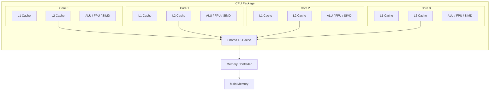
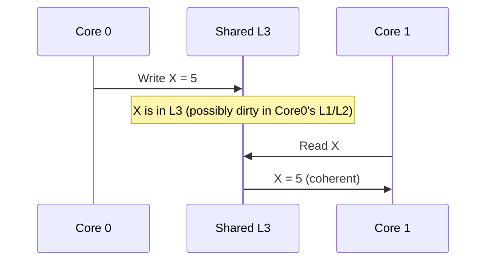
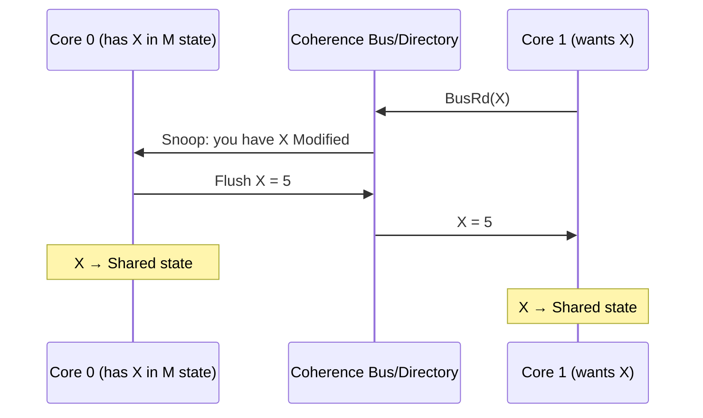
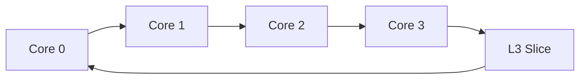
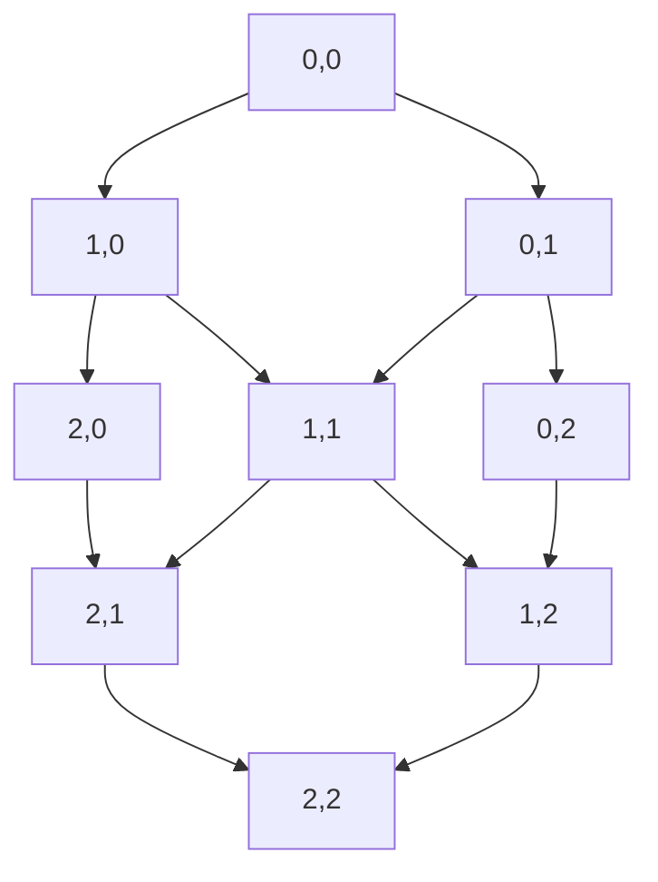
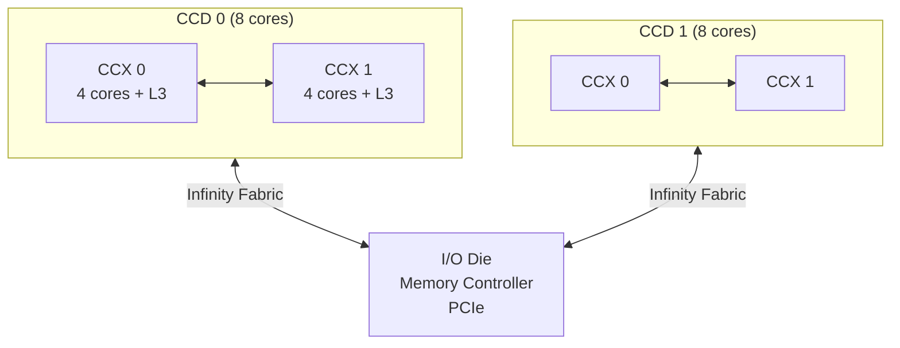

# Multicore Processors

## Overview

**Multicore processors** integrate multiple CPU cores on a single chip, enabling true parallel execution of threads. This is the primary form of thread-level parallelism (TLP) in modern systems. Understanding multicore architecture — core communication, cache hierarchy, memory consistency — is essential for system design and concurrent programming interviews.

## Multicore Evolution


| Year | Trend | Example |
|------|-------|---------|
| 2005 | Dual-core | Intel Pentium D |
| 2006 | Quad-core | Intel Core 2 Quad |
| 2011 | 8-core | AMD FX-8350 |
| 2017 | 16-core (chiplet) | AMD Ryzen Threadripper |
| 2022 | 96-core (chiplet) | AMD EPYC 9654 |
| 2024 | 128+ cores | ARM Graviton4, AMD EPYC |

## Multicore Architecture



### Core Components
Each core typically has:
- Private L1 I-cache and D-cache
- Private L2 cache
- Execution units (ALU, FPU, SIMD)
- Branch predictor
- Out-of-order execution engine

### Shared Resources
- L3 cache (shared among all cores)
- Memory controller
- I/O interfaces
- Interconnect (bus/mesh/ring)

## Core-to-Core Communication

### Through Shared Cache



### Through Coherence Protocol



## Interconnect Topologies

### Ring Bus (Intel)



- Simple, scalable to ~10 cores
- Each core has an L3 slice
- Average latency: N/2 hops for N cores

### Mesh (Intel)



- Used in Intel Xeon (server)
- Better bandwidth than ring
- 2D mesh topology

### Infinity Fabric (AMD)



- AMD's chiplet architecture
- CCDs (Core Complex Dies) connected via Infinity Fabric
- Separate I/O die for memory and I/O

## Chiplet Architecture

Modern processors use **chiplets** instead of monolithic dies:

| Aspect | Monolithic | Chiplet |
|--------|-----------|---------|
| Die size | Large (low yield) | Small (high yield) |
| Cost | High | Lower (better yields) |
| Flexibility | Fixed | Mix and match |
| Inter-die latency | None | Higher |
| Example | Intel 10th gen | AMD Zen 3/4 |

### AMD Chiplet Design
- **CCD** (Core Complex Die): 8 cores + L3 cache (7nm)
- **IOD** (I/O Die): Memory controller, PCIe, USB (6nm)
- Multiple CCDs connect to one IOD via Infinity Fabric

## Memory Consistency Models

### Sequential Consistency (SC)
All operations appear in some sequential order consistent with each processor's program order.

### Total Store Order (TSO) — x86
- Stores may be buffered (store buffer)
- Loads may bypass stores to different addresses
- All stores become visible in FIFO order

### Relaxed Models (ARM, RISC-V)
- More reordering allowed
- Requires explicit barriers (DMB, DSB on ARM)
- Better performance, more programmer burden

```c
// ARM: Need explicit barrier for ordering
*flag = 1;
__asm__ __volatile__("dmb sy" ::: "memory");  // Barrier
// Without barrier, flag write might be reordered with data write
```

## Cache Coherence in Multicore

See [Coherence](../memory-hierarchy/coherence.md) for details.

Key points:
- Each core has private L1/L2 caches
- Coherence protocol (MESI/MOESI) maintains consistency
- Coherence operates at cache-line granularity
- False sharing is a common performance issue

## Interview Questions

1. **Q**: How do cores in a multicore processor communicate?
   **A**: Primarily through shared cache (L3) and the coherence protocol. When one core writes data that another core reads, the coherence protocol (MESI/MOESI) ensures the data is transferred. Direct core-to-core communication is through shared memory with coherence.

2. **Q**: What is the difference between a core and a thread (SMT)?
   **A**: A core has its own execution units, registers, and L1/L2 cache. SMT threads share a core's execution resources but have separate architectural state (registers, PC). A 4-core/8-thread CPU has 4 physical cores, each running 2 hardware threads.

3. **Q**: What is a chiplet architecture?
   **A**: A design where the processor is split into multiple smaller dies (chiplets) connected on a package. AMD's Zen uses CCDs (cores + L3) and an IOD (memory/I/O). Benefits: better yields, lower cost, mix-and-match flexibility. Trade-off: inter-chiplet latency.

4. **Q**: What is false sharing and how do you detect/fix it?
   **A**: False sharing occurs when independent variables on the same cache line are written by different cores, causing coherence traffic. Detect with `perf c2c`. Fix by padding variables to separate cache lines (`alignas(64)`).

5. **Q**: How does the ring bus interconnect work?
   **A**: Cores are connected in a ring topology. Each core has an L3 slice. Messages travel around the ring, with each core acting as a router. Average latency is N/2 hops for N cores. Used in Intel consumer CPUs.

## Common Mistakes

- ❌ Confusing cores with threads (SMT)
- ❌ Not understanding cache coherence between cores
- ❌ Ignoring false sharing in multi-threaded code
- ❌ Assuming all cores have equal memory access latency (NUMA)
- ❌ Not knowing about chiplet vs monolithic trade-offs

## Summary

Multicore processors integrate multiple independent cores on a single chip. Each core has private L1/L2 caches and shares L3. Coherence protocols (MESI/MOESI) maintain data consistency. Modern designs use chiplet architectures (AMD CCD/IOD) for better yields. Interconnect topologies include ring, mesh, and Infinity Fabric.

## Cross-References

- [SMT](smt.md) — Hardware threading within a core
- [Cache Coherence](../memory-hierarchy/coherence.md) — Multi-core consistency
- [MESI](../memory-hierarchy/mesi.md) — Coherence protocol
- [Concurrency](../../concurrency/overview.md) — Software concurrency
- [Amdahl's Law](../performance/amdahl.md) — Parallel speedup limits
