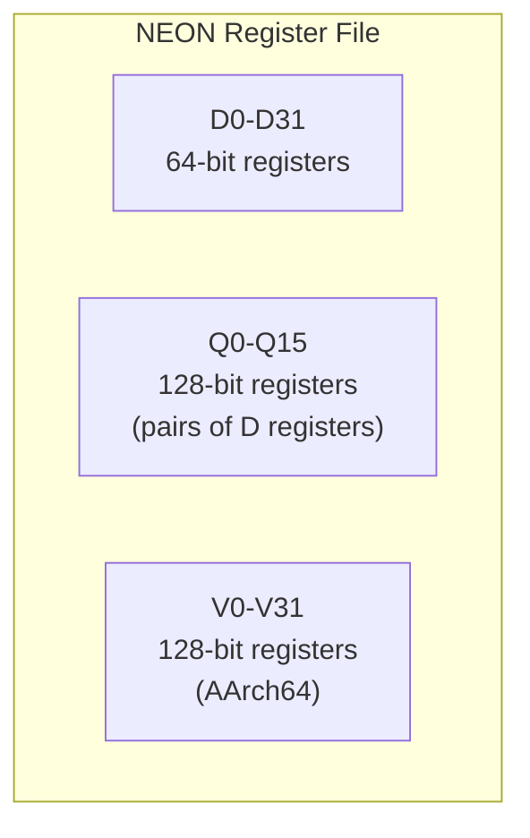

# NEON (ARM SIMD)

## Overview

**NEON** is ARM's SIMD (Single Instruction, Multiple Data) extension, providing 128-bit vector operations on ARM processors. It's the ARM equivalent of Intel's SSE/AVX, used extensively in mobile devices, embedded systems, and increasingly in servers (ARM-based cloud instances). NEON is part of the ARM Advanced SIMD architecture.

## NEON Registers



### AArch32 (32-bit ARM)
- **D0-D31**: 64-bit registers
- **Q0-Q15**: 128-bit registers (pairs of D registers)
- Q0 = {D0, D1}, Q1 = {D2, D3}, etc.

### AArch64 (64-bit ARM)
- **V0-V31**: 128-bit registers
- Lower 64 bits accessible as D0-D31
- Lower 32 bits accessible as S0-S31

## NEON Data Types

| Type | Size | Elements per 128-bit |
|------|------|---------------------|
| int8x16_t | 8-bit int | 16 |
| int16x8_t | 16-bit int | 8 |
| int32x4_t | 32-bit int | 4 |
| int64x2_t | 64-bit int | 2 |
| float16x8_t | 16-bit float | 8 |
| float32x4_t | 32-bit float | 4 |
| float64x2_t | 64-bit float | 2 |

## NEON Intrinsics

```c
#include <arm_neon.h>

// Load 4 floats
float32x4_t va = vld1q_f32(&a[i]);
float32x4_t vb = vld1q_f32(&b[i]);

// Add 4 floats
float32x4_t vc = vaddq_f32(va, vb);

// Store 4 floats
vst1q_f32(&c[i], vc);
```

### Common Operations

```c
// Arithmetic
vaddq_f32(a, b)      // 4 float additions
vmulq_f32(a, b)      // 4 float multiplications
vfmaq_f32(c, a, b)   // Fused multiply-add: c + a*b
vsubq_f32(a, b)      // 4 float subtractions

// Integer
vaddq_s32(a, b)      // 4 int32 additions
vmulq_s32(a, b)      // 4 int32 multiplications

// Comparison
vcgtq_f32(a, b)      // Compare greater than (returns mask)
vceqq_f32(a, b)      // Compare equal

// Load/Store
vld1q_f32(ptr)       // Load 4 floats
vst1q_f32(ptr, val)  // Store 4 floats

// Shuffle/Permute
vcombine_f32(a, b)   // Concatenate two 64-bit to 128-bit
vget_high_f32(a)     // Get upper 64 bits
vget_low_f32(a)      // Get lower 64 bits
```

## NEON vs SSE/AVX

| Feature | NEON | SSE | AVX2 | AVX-512 |
|---------|------|-----|------|---------|
| Register width | 128-bit | 128-bit | 256-bit | 512-bit |
| Registers | 32 (AArch64) | 16 | 16 | 32 |
| Float support | Yes | Yes | Yes | Yes |
| Integer support | Yes | Yes | Yes | Yes |
| FMA | Yes (AArch64) | No (FMA3 separate) | Yes | Yes |
| Half-precision | Yes (native) | Limited | Limited | Limited |
| Predication | No (use masks) | No | No | Yes (mask regs) |
| Frequency penalty | No | No | No | Yes |

### NEON Advantages
- **32 registers** (AArch64): More registers = fewer spills
- **Native FP16**: Half-precision float support (useful for ML)
- **No frequency penalty**: Unlike AVX-512
- **Simpler encoding**: Fixed-width instructions

### NEON Disadvantages
- **128-bit max**: AVX2/AVX-512 are wider
- **No mask registers**: Must use separate mask operations
- **Fewer specialized instructions**: Less mature than x86 SIMD

## NEON Programming Example

### Vector Addition

```c
#include <arm_neon.h>

void add_arrays_neon(float *a, float *b, float *c, int n) {
    int i;
    for (i = 0; i <= n - 4; i += 4) {
        float32x4_t va = vld1q_f32(&a[i]);
        float32x4_t vb = vld1q_f32(&b[i]);
        float32x4_t vc = vaddq_f32(va, vb);
        vst1q_f32(&c[i], vc);
    }
    // Handle remainder
    for (; i < n; i++)
        c[i] = a[i] + b[i];
}
```

### Matrix Multiply with FMA

```c
void matmul_neon(int N, float *A, float *B, float *C) {
    for (int i = 0; i < N; i++) {
        for (int j = 0; j < N; j += 4) {
            float32x4_t sum = vdupq_n_f32(0);
            for (int k = 0; k < N; k++) {
                float32x4_t a = vdupq_n_f32(A[i*N + k]);
                float32x4_t b = vld1q_f32(&B[k*N + j]);
                sum = vfmaq_f32(sum, a, b);
            }
            vst1q_f32(&C[i*N + j], sum);
        }
    }
}
```

## SVE (Scalable Vector Extension)

ARM's next-generation SIMD:
- **Scalable**: Vector length determined at runtime (128-2048 bits)
- **Predicated**: Each element has a predicate bit
- **Future-proof**: Same code works on different hardware

```c
// SVE: vector length determined at runtime
svfloat32_t va = svld1_f32(pg, &a[i]);
svfloat32_t vb = svld1_f32(pg, &b[i]);
svfloat32_t vc = svadd_f32_m(pg, va, vb);
svst1_f32(pg, &c[i], vc);
```

**Key advantage**: Code compiled for SVE runs on any SVE hardware, automatically using the available vector width.

## Apple Silicon NEON

Apple's M1/M2/M3 chips have enhanced NEON:
- **128-bit NEON**: Standard ARM NEON
- **Apple AMX** (Apple Matrix Extension): Coprocessor for matrix operations
- **Up to 4 execution units** for NEON instructions

## Interview Questions

1. **Q**: What is NEON and how does it compare to Intel's SIMD?
   **A**: NEON is ARM's 128-bit SIMD extension, equivalent to Intel's SSE. AArch64 provides 32 128-bit registers (vs 16 for SSE). NEON supports native half-precision floats and doesn't cause frequency scaling like AVX-512.

2. **Q**: How many NEON registers are available in AArch64?
   **A**: 32 registers (V0-V31), each 128 bits wide. This is double the 16 registers available in x86 SSE/AVX, reducing register pressure.

3. **Q**: What is SVE and why is it significant?
   **A**: SVE (Scalable Vector Extension) is ARM's variable-length SIMD. Vector length is determined at runtime (128-2048 bits), making code portable across different ARM implementations. It also supports predicated execution.

4. **Q**: Does NEON have a frequency penalty like AVX-512?
   **A**: No. NEON operations don't cause CPU frequency reduction. This is a significant advantage for sustained workloads where AVX-512 would cause thermal throttling.

5. **Q**: How do you handle the remainder in NEON loops?
   **A**: Process the main body with NEON (4 elements at a time for float32), then handle remaining elements with scalar code. SVE's predication can handle arbitrary lengths without remainder loops.

## Common Mistakes

- ❌ Assuming NEON is the same as SSE (similar but different intrinsics)
- ❌ Not knowing about AArch64's 32 registers (vs 16 in AArch32)
- ❌ Forgetting that NEON is 128-bit max (no 256/512-bit equivalent on ARM)
- ❌ Not using FMA instructions when available
- ❌ Confusing NEON with SVE (NEON is fixed-width, SVE is scalable)

## Summary

NEON is ARM's 128-bit SIMD extension with 32 registers in AArch64. It provides float and integer vector operations, FMA, and native half-precision support. NEON doesn't cause frequency scaling like AVX-512. SVE extends this to scalable vectors (128-2048 bits). NEON is essential for performance on ARM-based mobile, embedded, and server platforms.

## Cross-References

- [SIMD](simd.md) — SIMD concepts
- [AVX](avx.md) — Intel's SIMD
- [Apple Silicon](../modern/apple-silicon.md) — Apple's ARM implementation
- [ARM Architecture](../modern/arm.md) — ARM processor design
- [GPU](gpu.md) — Massive data parallelism
