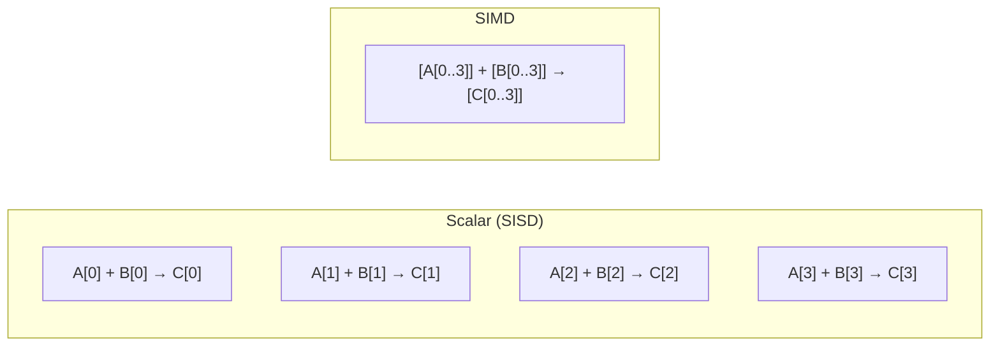
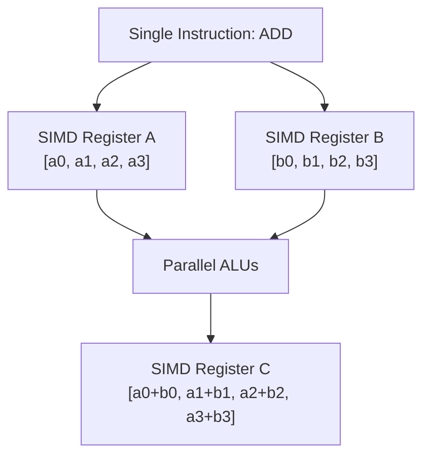

# SIMD (Single Instruction, Multiple Data)

## Overview

**SIMD** (Single Instruction, Multiple Data) is a parallelism technique where a single instruction operates on multiple data elements simultaneously. Instead of adding two numbers at a time, SIMD can add 4, 8, 16, or 32 pairs of numbers in one instruction. This is the foundation of vector processing and is essential for multimedia, scientific computing, and machine learning.

## SIMD Concept



### Key Idea
One instruction, multiple data elements processed in parallel using **wide registers**.

## SIMD Execution Model



## SIMD in x86: Evolution

| Extension | Year | Register Width | Registers | Key Feature |
|-----------|------|---------------|-----------|-------------|
| MMX | 1997 | 64-bit | 8 (MM0-MM7) | Integer SIMD |
| SSE | 1999 | 128-bit | 8 (XMM0-7) | Float SIMD |
| SSE2 | 2001 | 128-bit | 16 (XMM0-15) | Double precision |
| SSE3 | 2004 | 128-bit | 16 | Horizontal ops |
| SSE4 | 2007 | 128-bit | 16 | Dot product, blend |
| AVX | 2011 | 256-bit | 16 (YMM0-15) | 256-bit float |
| AVX2 | 2013 | 256-bit | 16 | 256-bit integer |
| AVX-512 | 2016 | 512-bit | 32 (ZMM0-31) | 512-bit, mask registers |

## SIMD Programming

### Compiler Auto-Vectorization

```c
// Compiler can auto-vectorize this:
void add_arrays(float *a, float *b, float *c, int n) {
    for (int i = 0; i < n; i++)
        c[i] = a[i] + b[i];
}

// GCC: -O3 -mavx2 -ftree-vectorize
// Compiler generates AVX2 instructions automatically
```

### Intrinsics (Explicit SIMD)

```c
#include <immintrin.h>

void add_avx2(float *a, float *b, float *c, int n) {
    for (int i = 0; i < n; i += 8) {
        __m256 va = _mm256_load_ps(&a[i]);    // Load 8 floats
        __m256 vb = _mm256_load_ps(&b[i]);    // Load 8 floats
        __m256 vc = _mm256_add_ps(va, vb);    // Add 8 pairs
        _mm256_store_ps(&c[i], vc);           // Store 8 results
    }
}
```

### Assembly (Direct SIMD)

```x86asm
; AVX2 vector addition
vmovaps ymm0, [rsi]      ; Load 8 floats from A
vmovaps ymm1, [rdx]      ; Load 8 floats from B
vaddps  ymm2, ymm0, ymm1 ; Add 8 pairs
vmovaps [rdi], ymm2       ; Store 8 results to C
```

## SIMD Data Types

| x86 Type | Width | Elements (float) | Elements (int32) |
|----------|-------|-------------------|-------------------|
| `__m128` | 128-bit | 4 floats | 4 ints |
| `__m256` | 256-bit | 8 floats | 8 ints |
| `__m512` | 512-bit | 16 floats | 16 ints |

## Common SIMD Operations

### Arithmetic
```c
_mm256_add_ps(a, b)     // 8 float additions
_mm256_sub_ps(a, b)     // 8 float subtractions
_mm256_mul_ps(a, b)     // 8 float multiplications
_mm256_fmadd_ps(a,b,c)  // 8 fused multiply-add: a*b+c
```

### Comparison
```c
_mm256_cmp_ps(a, b, _CMP_LT_OS)  // 8 comparisons, returns mask
```

### Shuffles and Permutations
```c
_mm256_shuffle_ps(a, b, imm)  // Select and interleave elements
_mm256_permute_ps(a, imm)     // Rearrange within register
```

### Load/Store
```c
_mm256_load_ps(ptr)      // Aligned load (32-byte alignment required)
_mm256_loadu_ps(ptr)     // Unaligned load (slower)
_mm256_store_ps(ptr, a)  // Aligned store
_mm256_stream_ps(ptr, a) // Non-temporal store (bypass cache)
```

## SIMD Challenges

### Alignment
SIMD loads/stores are fastest with aligned data:
```c
// Aligned allocation (32-byte for AVX)
float *data = (float*)aligned_alloc(32, n * sizeof(float));

// Misaligned access is slower (may cross cache lines)
```

### Remainder Handling
If array length isn't a multiple of SIMD width:
```c
int simd_width = 8;  // AVX: 8 floats
int remainder = n % simd_width;

// Process SIMD portion
for (int i = 0; i < n - remainder; i += simd_width)
    // SIMD operations

// Handle remainder with scalar code
for (int i = n - remainder; i < n; i++)
    // Scalar operations
```

### Data Dependencies
SIMD works best with independent operations. Reductions (sum, max) need special handling:
```c
// Horizontal sum of 8 floats in AVX
__m256 v = ...;
__m128 hi = _mm256_extractf128_ps(v, 1);
__m128 lo = _mm256_castps256_ps128(v);
__m128 sum128 = _mm_add_ps(lo, hi);
// Continue reducing to scalar...
```

## SIMD Performance

### Speedup Example
Adding two arrays of 1 million floats:

| Method | Time | Speedup |
|--------|------|---------|
| Scalar | 4.0 ms | 1× |
| SSE (128-bit) | 1.1 ms | 3.6× |
| AVX2 (256-bit) | 0.6 ms | 6.7× |
| AVX-512 (512-bit) | 0.35 ms | 11.4× |

(Assuming memory bandwidth isn't the bottleneck)

### When SIMD Helps Most
- Array operations (add, multiply, filter)
- Image processing (pixel operations)
- Audio/video encoding/decoding
- Machine learning (matrix operations)
- Physics simulations

### When SIMD Doesn't Help
- Pointer-chasing (linked lists, trees)
- Irregular access patterns
- Heavy branching (if/else per element)
- Small data sets (< SIMD width)

## SIMD vs GPU

| Aspect | SIMD (CPU) | GPU |
|--------|-----------|-----|
| Latency | Low | High |
| Throughput | Moderate | Very High |
| Threads | 1 | Thousands |
| Best for | Medium data, low latency | Large data, high throughput |
| Programming | Intrinsics, auto-vectorize | CUDA, OpenCL |

## Interview Questions

1. **Q**: What is SIMD and how does it improve performance?
   **A**: SIMD (Single Instruction, Multiple Data) processes multiple data elements with one instruction. Instead of adding two numbers per cycle, SIMD can add 8 or 16 pairs. This improves throughput for data-parallel operations by 4-16× depending on register width.

2. **Q**: What is the difference between SSE, AVX, and AVX-512?
   **A**: They are x86 SIMD extensions with increasing register widths: SSE=128-bit (4 floats), AVX=256-bit (8 floats), AVX-512=512-bit (16 floats). Wider registers process more elements per instruction.

3. **Q**: When should you use SIMD vs GPU?
   **A**: SIMD for moderate data sizes with latency requirements (CPU-based, easy to integrate). GPU for large data sizes with high throughput requirements (thousands of parallel operations). SIMD has lower overhead; GPU has higher peak throughput.

4. **Q**: What is auto-vectorization?
   **A**: The compiler automatically converts scalar loops into SIMD instructions. Enabled by flags like -O3 -mavx2. Works best for simple loops with no dependencies. Complex code may need explicit intrinsics.

5. **Q**: Why is alignment important for SIMD?
   **A**: Aligned loads/stores are faster because they don't cross cache line boundaries. Unaligned access may require two cache line fetches and merging. AVX requires 32-byte alignment for best performance.

## Common Mistakes

- ❌ Not aligning data for SIMD loads/stores
- ❌ Forgetting remainder handling when array length ≠ SIMD width
- ❌ Assuming auto-vectorization always works (it doesn't for complex code)
- ❌ Using SIMD for small data sets (overhead exceeds benefit)
- ❌ Not considering memory bandwidth as the bottleneck

## Summary

SIMD processes multiple data elements with a single instruction using wide registers. x86 has evolved from SSE (128-bit) to AVX-512 (512-bit), and ARM has NEON (128-bit). SIMD can provide 4-16× speedup for data-parallel operations. Auto-vectorization works for simple loops; complex code needs intrinsics.

## Cross-References

- [AVX](avx.md) — Intel's AVX extensions
- [NEON](neon.md) — ARM's SIMD
- [GPU](gpu.md) — Massive data parallelism
- [Multicore](multicore.md) — Thread-level parallelism
- [Performance](../performance/README.md) — Optimization techniques

## Cross References

- [AVX](avx.md)
- [NEON](neon.md)
- [GPU](gpu.md)
- [ML Deep Learning](../../ml/deep-learning/README.md)
- [LLM Inference](../../llm/llm-serving/inference.md)
