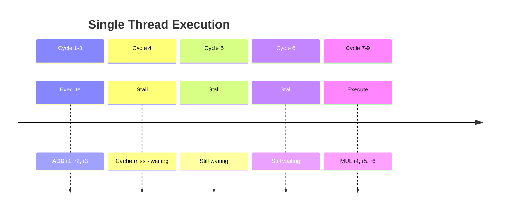
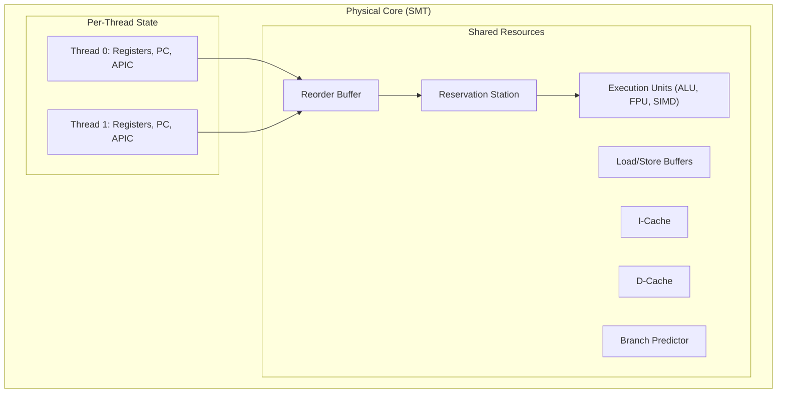
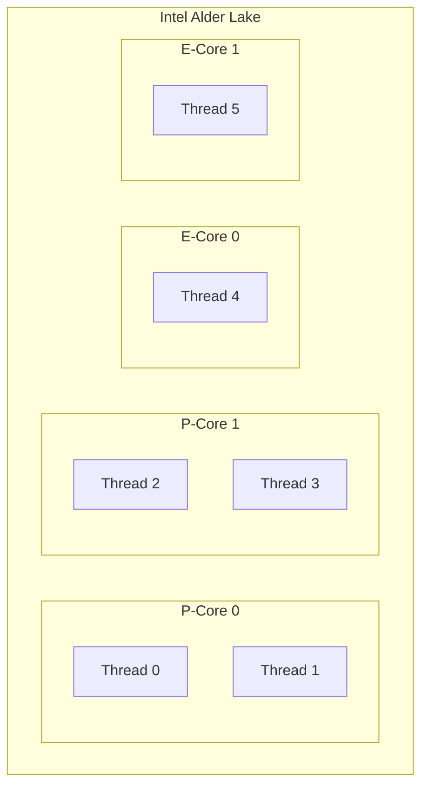

# SMT (Simultaneous Multithreading)

## Overview

**SMT** (Simultaneous Multithreading) allows a single physical core to execute multiple hardware threads simultaneously by sharing execution resources. Intel's implementation is called **Hyper-Threading Technology (HTT)**. SMT improves throughput by utilizing execution units that would otherwise be idle due to stalls or dependencies.

## How SMT Works

### Without SMT (Single Thread)



During the cache miss (cycles 4-6), execution units are **idle**.

### With SMT (Two Threads)

```mermaid
gantt
    title SMT Execution (2 threads)
    dateFormat X
    axisFormat %s
    section Thread 0
    ADD instruction :a1, 0, 3
    Cache miss stall :a2, 3, 6
    MUL instruction :a3, 6, 9
    section Thread 1
    SUB instruction :b1, 3, 6
    Cache miss stall :b2, 6, 9
    ADD instruction :b3, 9, 12
```



Thread 1 uses execution units while Thread 0 is stalled.

## SMT Resource Sharing



### Per-Thread (Not Shared)
- Architectural registers (RAX, RBX, etc.)
- Program counter
- APIC (interrupt controller) state
- Segment registers

### Shared
- Execution units (ALU, FPU, SIMD)
- Reorder buffer
- Reservation stations
- Caches (L1, L2)
- Branch predictor
- TLB

## SMT Performance

### Best Case: Complementary Workloads
When threads use different resources:
- Thread 0: Integer-heavy (uses integer ALUs)
- Thread 1: Float-heavy (uses FPU)
- **Result**: ~30-40% throughput improvement

### Worst Case: Resource Contention
When threads compete for the same resources:
- Both threads: Heavy SIMD (share SIMD units)
- Both threads: Large working set (cache thrashing)
- **Result**: ~0-10% improvement, sometimes slower

### Typical Improvement
| Workload | SMT Speedup |
|----------|-------------|
| Mixed integer/float | 20-40% |
| Similar threads | 10-20% |
| Cache-heavy | 0-10% |
| Memory-bandwidth-bound | 0-5% |

## Intel Hyper-Threading

### History
- **HTT** (2002): Pentium 4, 1 thread per core
- **HTT off** (2008-2015): Disabled in some generations
- **HTT on** (2016+): Re-enabled, 2 threads per core

### Modern Implementation (Alder Lake+)
- **P-cores**: 2 threads per core (SMT)
- **E-cores**: 1 thread per core (no SMT)



## AMD SMT

AMD Zen processors support SMT:
- **Zen/Zen+**: SMT disabled (1 thread per core)
- **Zen 2/3/4**: SMT enabled (2 threads per core)
- Similar to Intel HTT but different implementation

## SMT Security Concerns

### Spectre/Meltdown Variants
SMT can leak information between threads:
- **PortSmash**: Timing side-channel through execution ports
- **TLBleak**: TLB-based information leakage
- **Cache-based attacks**: Shared cache enables timing attacks

### Mitigations
- Disable SMT (performance penalty)
- Core scheduling (pair trusted threads)
- Microcode updates

## SMT vs Multicore

| Property | SMT | Multicore |
|----------|-----|-----------|
| Threads | 2 per core | 1 per core |
| Resources | Shared per core | Independent |
| Performance | 20-40% boost | 2× (ideal) |
| Power | Low overhead | Higher |
| Cost | Low | Higher |
| Isolation | Weak (shared cache) | Strong |

## SMT Programming Considerations

### Thread Affinity
```c
// Pin threads to specific hardware threads
cpu_set_t cpuset;
CPU_ZERO(&cpuset);
CPU_SET(0, &cpuset);  // Hardware thread 0
CPU_SET(1, &cpuset);  // Hardware thread 1 (same core as 0 on HT)
pthread_setaffinity_np(thread, sizeof(cpuset), &cpuset);
```

### Identifying SMT Threads
```bash
# Linux: Check SMT topology
lscpu | grep "Thread(s) per core"
# Thread(s) per core: 2  → SMT enabled

# Check which logical CPUs share a core
cat /sys/devices/system/cpu/cpu0/topology/thread_siblings_list
# 0,8  → CPU 0 and CPU 8 share a physical core
```

### When to Disable SMT
- Security-critical workloads
- Workloads with high cache contention
- When thread isolation is required
- Real-time systems (predictable latency)

## Interview Questions

1. **Q**: What is SMT and how does it improve performance?
   **A**: SMT allows a single physical core to execute multiple hardware threads simultaneously by sharing execution resources. When one thread stalls (e.g., cache miss), another thread uses the idle execution units. This improves throughput by 20-40% on average.

2. **Q**: What resources are shared in SMT?
   **A**: Execution units (ALU, FPU, SIMD), caches (L1, L2), branch predictor, reorder buffer, TLB. Per-thread resources include architectural registers, program counter, and APIC state.

3. **Q**: What is the difference between SMT and multicore?
   **A**: SMT shares a core's resources between threads (20-40% boost). Multicore provides independent cores (up to 2× per core). SMT is cheaper and uses less power; multicore provides better isolation and performance.

4. **Q**: When might SMT hurt performance?
   **A**: When threads compete for the same resources (both heavy SIMD, both large working sets). Cache thrashing can occur when threads evict each other's data. Security-sensitive workloads may also avoid SMT.

5. **Q**: How does Intel's Alder Lake handle SMT?
   **A**: P-cores (performance) support SMT (2 threads per core). E-cores (efficiency) don't support SMT (1 thread per core). The Thread Director OS helper schedules workloads on appropriate cores.

## Common Mistakes

- ❌ Confusing SMT threads with physical cores
- ❌ Assuming SMT always improves performance (it can hurt with resource contention)
- ❌ Not knowing about SMT security implications
- ❌ Forgetting that SMT threads share cache (isolation concerns)
- ❌ Not considering SMT when pinning thread affinity

## Summary

SMT (Hyper-Threading) allows multiple hardware threads to share a physical core's execution resources. It improves throughput by 20-40% when threads use complementary resources. Shared resources include execution units, caches, and branch predictor. SMT has security implications (side-channel attacks) and doesn't help when threads compete for the same resources.

## Cross-References

- [Multicore](multicore.md) — Multiple physical cores
- [Cache Coherence](../memory-hierarchy/coherence.md) — Shared cache implications
- [Concurrency](../../concurrency/overview.md) — Software threading
- [Performance](../performance/README.md) — Throughput optimization
