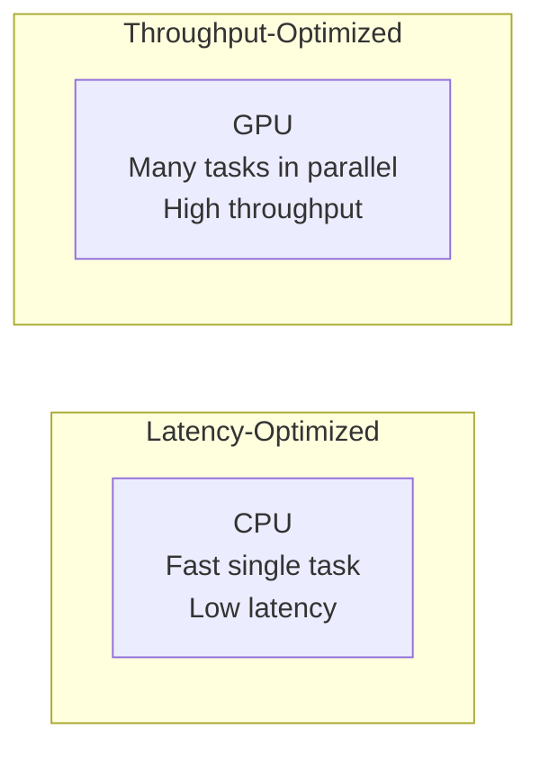

# Performance

## Overview

Understanding computer performance — how to measure, analyze, and optimize it — is critical for placement interviews. This section covers Amdahl's Law (the limits of parallel speedup), the CPU performance equation, benchmarking methodologies, and hardware performance counters.

## Performance Metrics

| Metric | Description | Formula |
|--------|-------------|---------|
| **Latency** | Time to complete one task | Time / Task |
| **Throughput** | Tasks completed per unit time | Tasks / Time |
| **Bandwidth** | Data transferred per unit time | Bytes / Time |
| **CPI** | Cycles per instruction | Cycles / Instructions |
| **IPC** | Instructions per cycle | Instructions / Cycles |
| **FLOPS** | Floating-point operations per second | FLOPs / Time |

### Latency vs Throughput



- **Latency-sensitive**: Web requests, interactive applications, databases
- **Throughput-sensitive**: Batch processing, ML training, rendering

## Key Concepts

### The Performance Equation

```
CPU Time = Instruction Count × CPI × Clock Period
         = Instruction Count × CPI / Clock Rate
```

### Amdahl's Law

```
Speedup = 1 / ((1 - P) + P / N)
```

Limits the benefit of parallelization based on the sequential fraction.

### Performance Counters

Hardware counters that measure:
- Instructions executed
- Cache misses
- Branch mispredictions
- Memory bandwidth utilization

## Cross-References

- [Amdahl's Law](amdahl.md) — Parallel speedup limits
- [Performance Equation](equation.md) — CPU time formula
- [Benchmarking](benchmarking.md) — Measuring performance
- [Performance Counters](counters.md) — Hardware measurement
- [Cache Performance](../memory-hierarchy/performance.md) — Cache-specific metrics
