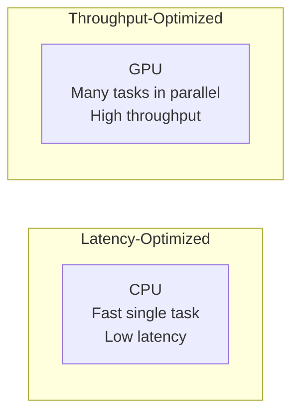
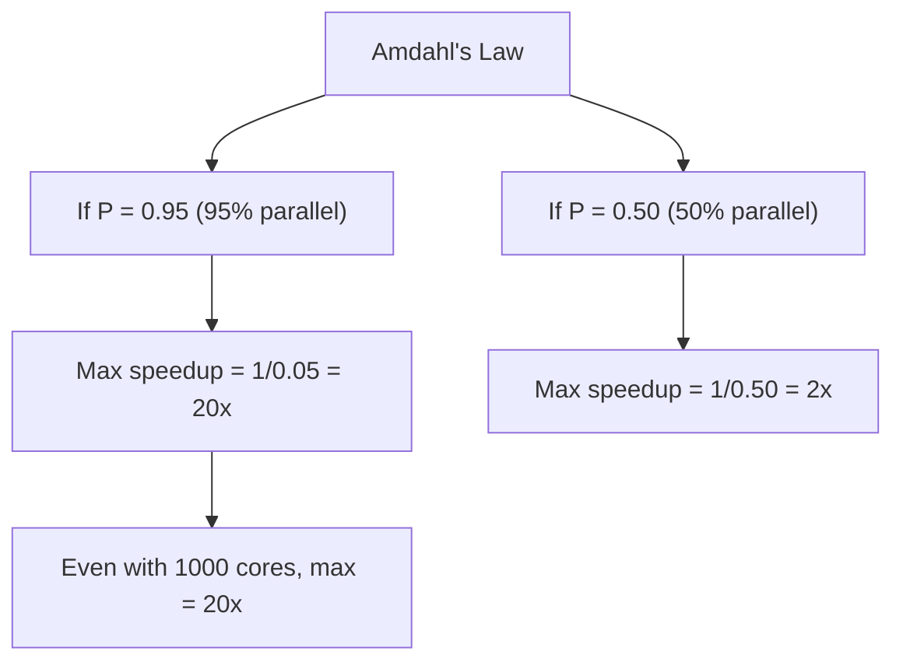
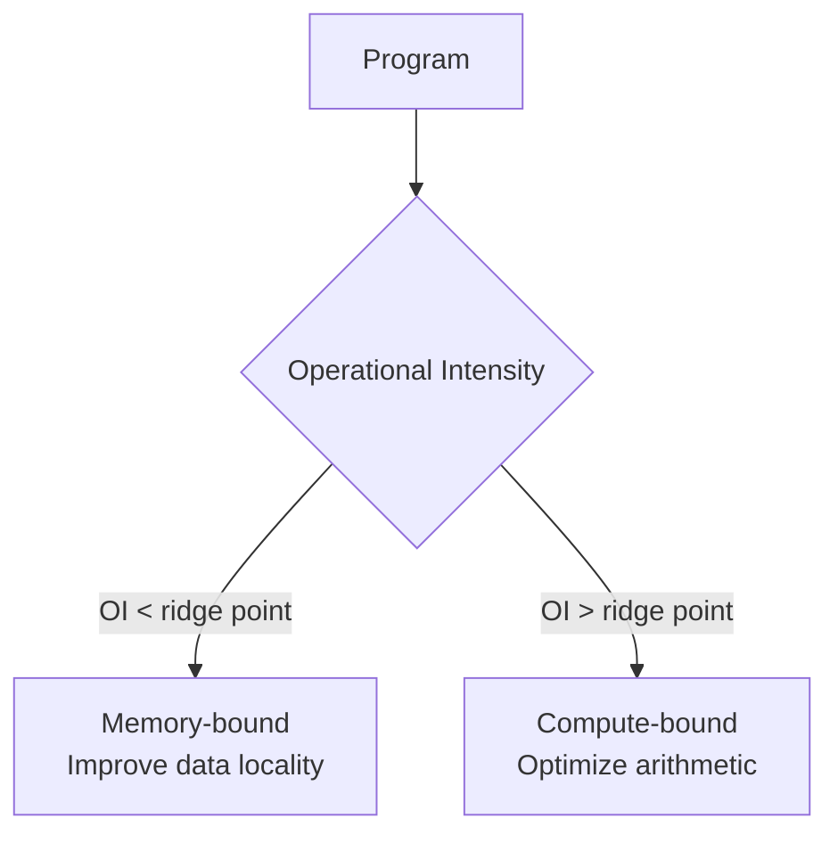

# Performance

## Overview

Understanding computer performance — how to measure, analyze, and optimize it — is critical for placement interviews. This section covers Amdahl's Law (the limits of parallel speedup), the CPU performance equation, benchmarking methodologies, and hardware performance counters.

## Performance Metrics

| Metric | Description | Formula |
|--------|-------------|---------|
| **Latency** | Time to complete one task | Time / Task |
| **Throughput** | Tasks completed per unit time | Tasks / Time |
| **Bandwidth** | Data transferred per unit time | Bytes / Time |
| **CPI** | Cycles per instruction | Cycles / Instructions |
| **IPC** | Instructions per cycle | Instructions / Cycles |
| **FLOPS** | Floating-point operations per second | FLOPs / Time |

### Latency vs Throughput



- **Latency-sensitive**: Web requests, interactive applications, databases
- **Throughput-sensitive**: Batch processing, ML training, rendering

**Key insight**: You can often trade latency for throughput (pipelining, batching) but not always the reverse.

---

## The CPU Performance Equation

```
CPU Time = Instruction Count × CPI × Clock Period
         = Instruction Count × CPI / Clock Rate
```

### Breaking It Down

| Component | What It Means | How to Improve |
|-----------|---------------|----------------|
| **Instruction Count** | Number of instructions executed | Better compilers, ISA design (CISC vs RISC) |
| **CPI** | Average cycles per instruction | Pipelining, caches, branch prediction |
| **Clock Rate** | Cycles per second (GHz) | Better process technology, shorter pipeline stages |

### Example Calculation

A program executes 10 billion instructions. CPI = 2.5. Clock rate = 4 GHz.

```
CPU Time = 10 × 10⁹ × 2.5 / (4 × 10⁹)
         = 25 / 4
         = 6.25 seconds
```

### CPI Breakdown by Instruction Type

Different instruction types have different CPIs. The average CPI is:

```
CPI_avg = Σ (CPI_i × Frequency_i)
```

| Instruction Type | CPI | Frequency | Contribution |
|-----------------|-----|-----------|--------------|
| ALU | 1 | 40% | 0.4 |
| Load/Store | 2 | 35% | 0.7 |
| Branch | 3 | 25% | 0.75 |
| **Weighted CPI** | | | **1.85** |

---

## Amdahl's Law

Amdahl's Law limits the speedup from parallelization based on the **serial fraction** of a program.

### Formula

```
Speedup = 1 / ((1 - P) + P / N)

Where:
  P = Fraction of code that can be parallelized
  N = Number of processors
```

### Key Implications



### Speedup Table

| P (parallel %) | N=4 | N=16 | N=64 | N=∞ (max) |
|----------------|-----|------|------|-----------|
| 50% | 1.6 | 1.9 | 2.0 | 2.0 |
| 75% | 2.3 | 3.5 | 3.9 | 4.0 |
| 90% | 3.1 | 6.4 | 8.8 | 10.0 |
| 95% | 3.5 | 9.1 | 14.5 | 20.0 |
| 99% | 3.9 | 13.8 | 28.7 | 100.0 |

### Gustafson's Law — The Counterpoint

Amdahl's Law assumes a **fixed problem size**. Gustafson's Law argues that with more processors, you solve **bigger problems**:

```
Scaled Speedup = N - (1 - P) × (N - 1)
```

**Interview distinction**:
- **Amdahl**: Fixed problem, more processors → diminishing returns
- **Gustafson**: Scaled problem, more processors → near-linear speedup

---

## Benchmarking

### Benchmark Types

| Type | Examples | What It Measures |
|------|----------|------------------|
| **Micro** | Dhrystone, Whetstone, CoreMark | Single aspect (integer, FP) |
| **Kernel** | LINPACK, Livermore Loops | Small representative code |
| **Application** | SPEC CPU, SPECrate | Real-world workloads |
| **System** | TPC-C, TPC-H, YCSB | End-to-end (DB, web) |

### SPEC CPU 2017

Industry-standard CPU benchmark suite:

| Suite | Workloads | Metric |
|-------|-----------|--------|
| **SPECint** | Integer (gcc, mcf, x264) | SPECint_rate |
| **SPECfp** | Floating-point (namd, lbm) | SPECfp_rate |

- **SPECrate**: Throughput (copies running in parallel)
- **SPECspeed**: Latency (single instance, faster = better)

### Benchmark Best Practices

1. **Warm up**: Run several iterations before measuring (caches, JIT)
2. **Multiple runs**: Report median, not single run
3. **Control environment**: Same hardware, OS, background processes
4. **Reproducibility**: Document exact configuration
5. **Relevance**: Benchmark should match your actual workload

### Common Pitfalls

- **Benchmarketing**: Cherry-picking favorable benchmarks
- **Overfitting**: Optimizing for benchmark, not real workload
- **Ignoring context**: Benchmark on different hardware/OS than production
- **Single metric**: No single number captures all performance aspects

---

## Hardware Performance Counters

Modern CPUs provide hardware counters that measure low-level events without significant overhead.

### What Can Be Measured

| Category | Events |
|----------|--------|
| **Instructions** | Instructions retired, branches taken/mispredicted |
| **Cache** | L1/L2/L3 hits, misses, evictions |
| **Memory** | Memory loads/stores, bandwidth utilization |
| **Pipeline** | Stalls, cycles wasted, pipeline flushes |
| **TLB** | TLB hits, misses, page walks |

### Using perf (Linux)

```bash
# Count basic events
perf stat ./my_program

# Record detailed profile
perf record -g ./my_program
perf report

# Specific events
perf stat -e cache-misses,cache-references,instructions,cycles ./my_program
```

### Key Ratios

| Ratio | Formula | Good Value | Meaning |
|-------|---------|------------|---------|
| **IPC** | instructions / cycles | > 1.0 | Pipeline efficiency |
| **Cache miss rate** | misses / references | < 5% | Memory hierarchy efficiency |
| **Branch mispredict rate** | mispredictions / branches | < 5% | Branch predictor quality |
| **Memory bandwidth** | bytes / time | Near peak | Memory subsystem utilization |

### Roofline Model

The roofline model visualizes whether a program is **compute-bound** or **memory-bound**:



- **Operational Intensity (OI)** = FLOPs / Bytes transferred
- **Ridge Point** = Peak FLOPS / Peak Bandwidth
- If OI < ridge point → memory-bound (optimize cache usage)
- If OI > ridge point → compute-bound (optimize instructions)

---

## Optimization Strategies

### Algorithmic

- Choose better algorithms (O(n log n) vs O(n²))
- Reduce constant factors (cache-friendly data structures)
- Avoid unnecessary work (short-circuit evaluation)

### Hardware-Aware

- **Cache optimization**: Array of structs → struct of arrays
- **Branch prediction**: Sort data before processing, use likely/unlikely hints
- **SIMD**: Use vector instructions (SSE, AVX) for data parallelism
- **Prefetching**: Hint the CPU about upcoming memory accesses

### Compiler

- Optimization levels (`-O0`, `-O1`, `-O2`, `-O3`, `-Os`, `-Ofast`)
- Profile-guided optimization (PGO)
- Link-time optimization (LTO)

---

## Interview Questions

1. **Q: What is Amdahl's Law and why does it matter?**
   A: Speedup = 1 / ((1-P) + P/N). It shows that the serial fraction limits parallel speedup. If 5% is serial, max speedup is 20x regardless of core count. This is why reducing the serial portion is critical for parallel performance.

2. **Q: What's the difference between latency and throughput?**
   A: Latency = time for one task. Throughput = tasks per unit time. A factory might have high throughput (1000 widgets/hour) but high latency (each widget takes 2 hours in pipeline). You can improve throughput via pipelining without improving single-task latency.

3. **Q: Explain the CPU performance equation.**
   A: CPU Time = IC × CPI / Clock Rate. Three levers: reduce instruction count (better compilers/ISA), reduce CPI (caches, pipelining, branch prediction), or increase clock rate (process technology). Modern CPUs focus on reducing CPI through ILP.

4. **Q: A program has CPI = 2.0 on a 3 GHz CPU. It executes 5 billion instructions. How long does it take?**
   A: Time = 5×10⁹ × 2.0 / 3×10⁹ = 10/3 ≈ 3.33 seconds.

5. **Q: What is the roofline model?**
   A: It plots achievable performance vs operational intensity. Below the "ridge point" a program is memory-bound; above it, compute-bound. It helps identify the bottleneck and guides optimization efforts.

6. **Q: How do you measure CPU performance in practice?**
   A: Use hardware performance counters via `perf` (Linux) or VTune. Key metrics: IPC, cache miss rate, branch misprediction rate. Compare against roofline to identify bottlenecks.

7. **Q: What's the difference between SPECint and SPECfp?**
   A: SPECint measures integer performance (compiling, compression, AI). SPECfp measures floating-point performance (physics simulation, weather modeling). Both use real application workloads, not synthetic benchmarks.

8. **Q: Why might a program with fewer instructions be slower?**
   A: CISC instructions may have higher CPI. A single complex instruction might take 10 cycles while the equivalent RISC sequence of 5 instructions at 1 cycle each finishes in 5 cycles. Total time = IC × CPI, not just IC.

## Summary

Performance analysis requires understanding the full picture: instruction count, CPI, and clock rate. Amdahl's Law constrains parallel speedup. Benchmarking must be rigorous and representative. Hardware performance counters and the roofline model provide the tools to identify bottlenecks. For interviews, be comfortable with calculations, trade-offs, and practical measurement techniques.

## Cross-References

- [Amdahl's Law](amdahl.md) — Parallel speedup limits
- [Performance Equation](equation.md) — CPU time formula
- [Benchmarking](benchmarking.md) — Measuring performance
- [Performance Counters](counters.md) — Hardware measurement
- [Cache Performance](../memory-hierarchy/performance.md) — Cache-specific metrics
- [Pipelining](../pipelining/README.md) — ILP techniques

## References

- Patterson & Hennessy, *Computer Organization and Design*, Chapter 1
- Hennessy & Patterson, *Computer Architecture: A Quantitative Approach*, Chapters 1-2
- [SPEC Benchmarks](https://www.spec.org/cpu2017/)
- [perf wiki](https://perf.wiki.kernel.org/)
- Williams, Waterman, Patterson, [Roofline: An Insightful Visual Performance Model](https://doi.org/10.1145/1498765.1498785)
