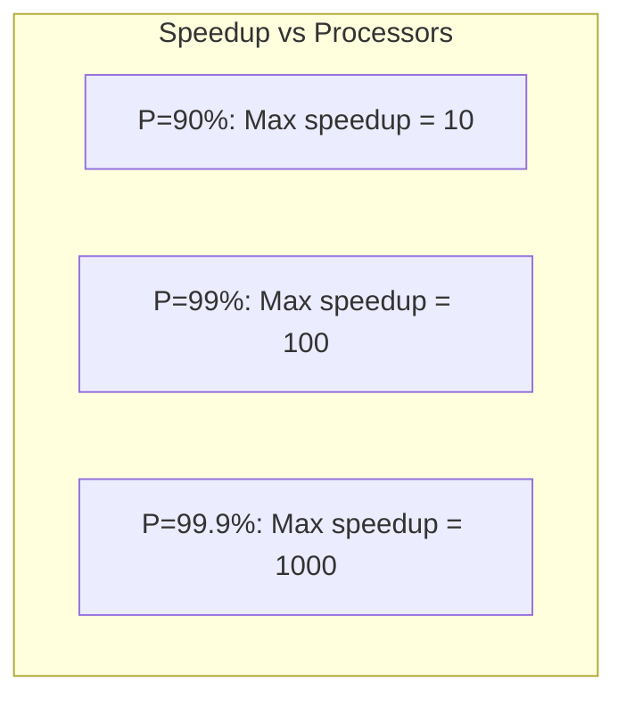
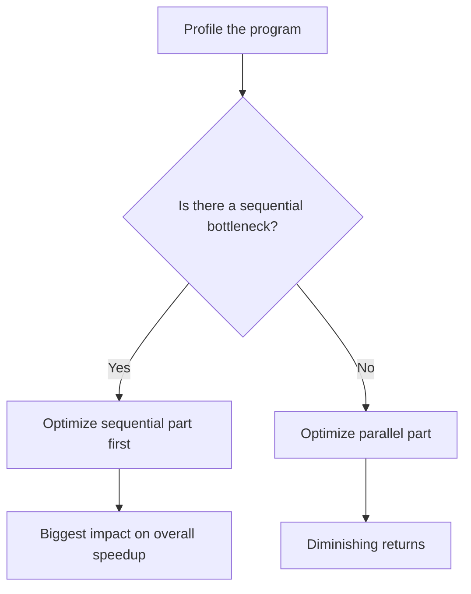

# Amdahl's Law

## Overview

**Amdahl's Law** states that the maximum speedup from parallelization is limited by the sequential fraction of the program. Even with infinite processors, the speedup cannot exceed 1/(1-P), where P is the parallelizable fraction. This is one of the most important laws in computer architecture and is frequently asked in interviews.

## The Formula

```
Speedup = 1 / ((1 - P) + P / N)

Where:
  P = Fraction of code that can be parallelized (0 ≤ P ≤ 1)
  N = Number of processors
  1-P = Sequential fraction (cannot be parallelized)
```

## Derivation

**Original execution time**: T = T_sequential + T_parallel

**With N processors**: T_N = T_sequential + T_parallel / N

**Speedup**: S = T / T_N = (T_seq + T_par) / (T_seq + T_par / N)

Let P = T_par / T (parallel fraction):

```
S = 1 / ((1 - P) + P / N)
```

## Speedup Examples

### Table: Speedup vs P and N

| P (parallel %) | N=2 | N=4 | N=8 | N=16 | N=∞ |
|----------------|-----|-----|-----|------|-----|
| 50% | 1.33 | 1.60 | 1.78 | 1.88 | 2.00 |
| 75% | 1.60 | 2.29 | 3.08 | 3.76 | 4.00 |
| 90% | 1.82 | 3.08 | 5.16 | 7.72 | 10.0 |
| 95% | 1.90 | 3.58 | 7.12 | 12.3 | 20.0 |
| 99% | 1.98 | 3.88 | 7.48 | 14.8 | 100.0 |

### Graphical Representation



## Key Insights

### 1. Sequential Bottleneck

```
Even 1% sequential code limits speedup to 100×
Even 0.1% sequential code limits speedup to 1000×
```

### 2. Diminishing Returns


### 3. Focus on Sequential Part

Optimizing the parallel part has diminishing returns. The biggest gain comes from reducing the sequential fraction.

## Example: Real-World Application

**Scenario**: A web server handles 1M requests/sec with 16 cores.
- 10% of time is sequential (locking, synchronization)
- 90% is parallel (request processing)

```
P = 0.9, N = 16
Speedup = 1 / (0.1 + 0.9/16) = 1 / (0.1 + 0.05625) = 1 / 0.15625 = 6.4×

Effective throughput = 6.4 × (1 core throughput)
```

If we reduce sequential fraction to 5%:
```
P = 0.95, N = 16
Speedup = 1 / (0.05 + 0.95/16) = 1 / (0.05 + 0.0594) = 1 / 0.1094 = 9.14×
```

**43% more throughput** by halving the sequential fraction!

## Amdahl's Law vs Gustafson's Law

### Amdahl's Law
- Fixed problem size
- Speedup limited by sequential fraction
- Pessimistic for parallel computing

### Gustafson's Law
- Scaled problem size (more data with more processors)
- Speedup = N - (1 - P) × (N - 1)
- More optimistic, realistic for large-scale computing

```
Amdahl:  "How fast can we solve this fixed problem?"
Gustafson: "How much more work can we do with more processors?"
```

## Practical Applications

### 1. Choosing Core Count

```
If P = 0.95:
  8 cores:  Speedup = 1 / (0.05 + 0.95/8)  = 6.8×
  16 cores: Speedup = 1 / (0.05 + 0.95/16) = 9.1×
  32 cores: Speedup = 1 / (0.05 + 0.95/32) = 11.6×
  64 cores: Speedup = 1 / (0.05 + 0.95/64) = 13.1×

Going from 32→64 cores: only 1.3× improvement (diminishing returns)
```

### 2. Optimization Prioritization



### 3. System Design

For a distributed system:
- **Network overhead**: Sequential (serialization, deserialization)
- **Computation**: Parallel
- **Amdahl's Law**: Network overhead limits scalability

## Interview Questions

1. **Q**: State Amdahl's Law and explain its significance.
   **A**: Speedup = 1 / ((1-P) + P/N), where P is the parallelizable fraction and N is the number of processors. It shows that parallel speedup is limited by the sequential fraction. Even with infinite processors, speedup ≤ 1/(1-P).

2. **Q**: A program is 80% parallelizable. What is the maximum speedup with infinite processors?
   **A**: Maximum speedup = 1/(1-0.8) = 1/0.2 = 5×. No matter how many processors you add, you can't get more than 5× speedup.

3. **Q**: How would you improve a system that's hitting Amdahl's Law limits?
   **A**: Focus on reducing the sequential fraction: eliminate locks, use lock-free data structures, reduce synchronization, partition data to avoid sharing. The parallel part is already optimized; the sequential bottleneck is the constraint.

4. **Q**: What is the difference between Amdahl's Law and Gustafson's Law?
   **A**: Amdahl's Law assumes fixed problem size (speedup limited by sequential fraction). Gustafson's Law assumes problem size scales with processors (speedup = N - (1-P)(N-1)). Gustafson is more realistic for large-scale computing where more processors handle more data.

5. **Q**: A system runs in 100 seconds, with 20 seconds sequential. How much faster can it run with 8 cores?
   **A**: P = 80/100 = 0.8. Speedup = 1/(0.2 + 0.8/8) = 1/(0.2+0.1) = 1/0.3 = 3.33×. New time = 100/3.33 = 30 seconds.

## Common Mistakes

- ❌ Forgetting that Amdahl's Law applies to the entire program, not just the parallel part
- ❌ Confusing "80% parallel" with "80% of the code" (it's 80% of execution time)
- ❌ Not knowing that even small sequential fractions severely limit speedup
- ❌ Confusing Amdahl's Law with Gustafson's Law
- ❌ Assuming more cores always means proportionally faster

## Summary

Amdahl's Law is the fundamental limit on parallel speedup. The maximum speedup is 1/(1-P), where P is the parallel fraction. Small sequential fractions (1-5%) severely limit scalability. The key to scaling is minimizing the sequential bottleneck, not adding more processors.

## Cross-References

- [Performance Equation](equation.md) — CPU time formula
- [Multicore](../parallelism/multicore.md) — Hardware parallelism
- [GPU](../parallelism/gpu.md) — Massive parallelism
- [Concurrency](../../concurrency/overview.md) — Software parallelism

## Cross References

- [Superscalar](../pipelining/superscalar.md)
- [Multicore](../parallelism/multicore.md)
- [Distributed Overview](../../distributed/overview.md)
- [Latency vs Throughput](../../interview/system-design/latency-vs-throughput.md)
