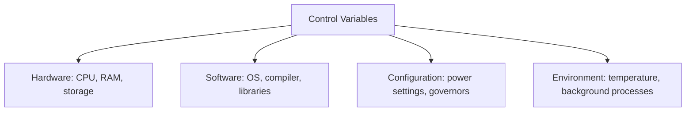
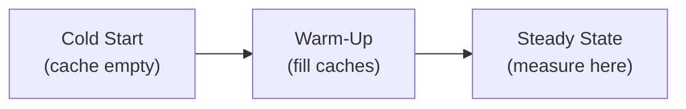

# Benchmarking

## Overview

**Benchmarking** is the practice of measuring and comparing computer performance using standardized tests. Understanding benchmarking methodology is important for evaluating systems, making purchasing decisions, and validating optimizations. This covers benchmark types, methodology, and common pitfalls.

## Types of Benchmarks

### Microbenchmarks
Test a single component or operation:
```bash
# Memory bandwidth
./stream_benchmark

# Cache latency
./latency_test --cache-level=L1

# CPU compute
./prime_benchmark --iterations=1000000
```

| Microbenchmark | Tests |
|----------------|-------|
| STREAM | Memory bandwidth |
| lmbench | Latency (cache, memory, context switch) |
| CoreMark | CPU integer performance |
| Whetstone | CPU floating-point |
| fio | Storage I/O |

### Macrobenchmarks
Test real-world application performance:
```bash
# Web server throughput
wrk -t12 -c400 -d30s http://localhost:8080

# Database performance
sysbench --test=oltp_read_write run

# Compilation speed
time make -j$(nproc)
```

| Macrobenchmark | Tests |
|----------------|-------|
| SPEC CPU | General CPU performance |
| TPC-C/TPC-H | Database performance |
| Geekbench | Mobile/desktop performance |
| MLPerf | Machine learning training/inference |
| LINPACK | HPC (Top500 ranking) |

### Synthetic Benchmarks
Artificial workloads designed to stress specific components:
- **Dhrystone**: Integer performance (no floating point)
- **Whetstone**: Floating-point performance
- **LINPACK**: Dense linear algebra (Top500 metric)

## Benchmarking Methodology

### 1. Define the Question
```
What are you trying to measure?
- Absolute performance (how fast is this system?)
- Relative performance (is A faster than B?)
- Bottleneck identification (what limits performance?)
- Regression detection (did performance change?)
```

### 2. Control Variables



**Always control**:
- CPU frequency scaling (set to performance mode)
- Background processes (minimize)
- Thermal state (warm up first)
- Power supply (consistent)

### 3. Warm-Up



Most benchmarks need warm-up to:
- Fill caches with relevant data
- Reach steady-state temperature
- Initialize JIT compilers
- Stabilize frequency scaling

### 4. Statistical Rigor

```bash
# Run multiple iterations
for i in $(seq 1 30); do
    ./benchmark >> results.txt
done

# Calculate statistics
mean=$(awk '{sum+=$1} END {print sum/NR}' results.txt)
stdev=$(awk "{sum+=(\$1-$mean)^2} END {print sqrt(sum/NR)}" results.txt)
```

**Best practices**:
- Run at least 30 iterations for statistical significance
- Report mean, median, and standard deviation
- Use confidence intervals (95% typical)
- Remove outliers (or explain them)

## Common Benchmarks

### SPEC CPU 2017

Industry-standard CPU benchmark:
- **SPECint**: 10 integer workloads
- **SPECfp**: 13 floating-point workloads
- **Single-copy**: One instance per core
- **Multi-copy**: One instance per core, all cores

```
SPEC CPU Score = Reference Time / Test Time × 100

Higher is better. Score of 100 = baseline reference machine.
```

### STREAM Benchmark

Measures sustainable memory bandwidth:

```c
// Four kernels:
// COPY:   c[i] = a[i]
// SCALE:  b[i] = scalar * c[i]
// ADD:    c[i] = a[i] + b[i]
// TRIAD:  a[i] = b[i] + scalar * c[i]
```

**Result**: Bandwidth in MB/s or GB/s.

### Geekbench

Cross-platform benchmark:
- Single-core and multi-core scores
- Workloads: crypto, integer, floating point, memory
- Widely used for mobile device comparison

## Benchmarking Tools

### Linux Tools

```bash
# perf: CPU profiling and performance counters
perf stat ./benchmark
perf record ./benchmark
perf report

# time: Basic timing
time ./benchmark

# hyperfine: Statistical benchmarking
hyperfine './benchmark' --warmup 3 --min-runs 30

# sysbench: Multi-threaded benchmarking
sysbench cpu --threads=8 run
sysbench memory --threads=8 run
sysbench fileio --file-test-mode=rndrw run
```

### Storage Benchmarks

```bash
# fio: Flexible I/O tester
fio --name=test --ioengine=libaio --direct=1 \
    --bs=4k --size=1G --numjobs=4 \
    --rw=randread --runtime=60

# dd: Simple sequential write
dd if=/dev/zero of=testfile bs=1M count=1024 conv=fdatasync
```

## Benchmark Pitfalls

### 1. Goodhart's Law
"When a measure becomes a target, it ceases to be a good measure."

Compilers benchmark against specific benchmarks:
```bash
# Compiler may optimize for SPEC but not real code
gcc -O3 -march=native -DSPEC_CPU2017 benchmark.c
```

### 2. Benchmarketing
Vendors cherry-pick favorable benchmarks:
```
Vendor A: "Our CPU is 2× faster!" (on cherry-picked benchmark)
Reality: 1.1× faster on real workloads
```

### 3. Measurement Overhead
```c
// Timing too-small operations
clock_gettime(CLOCK_MONOTONIC, &start);
single_instruction();  // Too fast to measure accurately
clock_gettime(CLOCK_MONOTONIC, &end);
// Measurement overhead may exceed the operation!
```

**Fix**: Repeat the operation in a loop.

### 4. System Noise
Background processes, interrupts, and OS scheduling add noise:
```bash
# Pin to specific CPU, set priority
taskset -c 0 nice -n -20 ./benchmark
```

### 5. Compiler Flags
```bash
# Debug vs Release builds
gcc -O0 benchmark.c    # Debug: 100ms
gcc -O3 benchmark.c    # Release: 20ms (5× difference!)
```

## Benchmarking in Interviews

### Common Questions

1. **Q**: How would you benchmark a web server?
   **A**: Use tools like wrk or Apache Bench. Measure throughput (requests/sec), latency (p50, p95, p99), and error rate. Warm up the server first. Test with varying concurrency levels. Control for network latency (use localhost or same datacenter).

2. **Q**: What is the difference between throughput and latency benchmarks?
   **A**: Throughput measures how much work is done per unit time (requests/sec, GB/s). Latency measures how long one operation takes (ms). They're often inversely related — higher throughput may increase latency.

3. **Q**: How do you ensure benchmark results are reliable?
   **A**: Control variables (hardware, software, environment), warm up, run multiple iterations (30+), report statistics (mean, std dev, confidence intervals), remove outliers, and test on representative workloads.

## Common Mistakes

- ❌ Not warming up before measuring
- ❌ Running benchmarks once (no statistical significance)
- ❌ Not controlling for background processes
- ❌ Comparing different compiler optimization levels
- ❌ Using synthetic benchmarks as proxies for real workloads
- ❌ Not accounting for measurement overhead

## Summary

Benchmarking measures and compares system performance using standardized tests. Microbenchmarks test individual components; macrobenchmarks test real applications. Proper methodology requires controlling variables, warming up, running multiple iterations, and reporting statistics. Common pitfalls include benchmarketing, measurement overhead, and system noise.

## Cross-References

- [Performance Counters](counters.md) — Hardware measurement
- [Performance Equation](equation.md) — Theoretical performance
- [Cache Performance](../memory-hierarchy/performance.md) — Cache benchmarks
- [Amdahl's Law](amdahl.md) — Parallelism limits

## Cross References

- [Performance Counters](counters.md)
- [Performance Equation](equation.md)
- [Amdahl's Law](amdahl.md)
