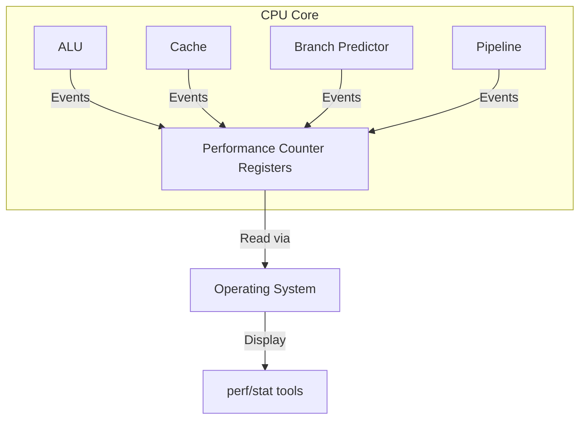
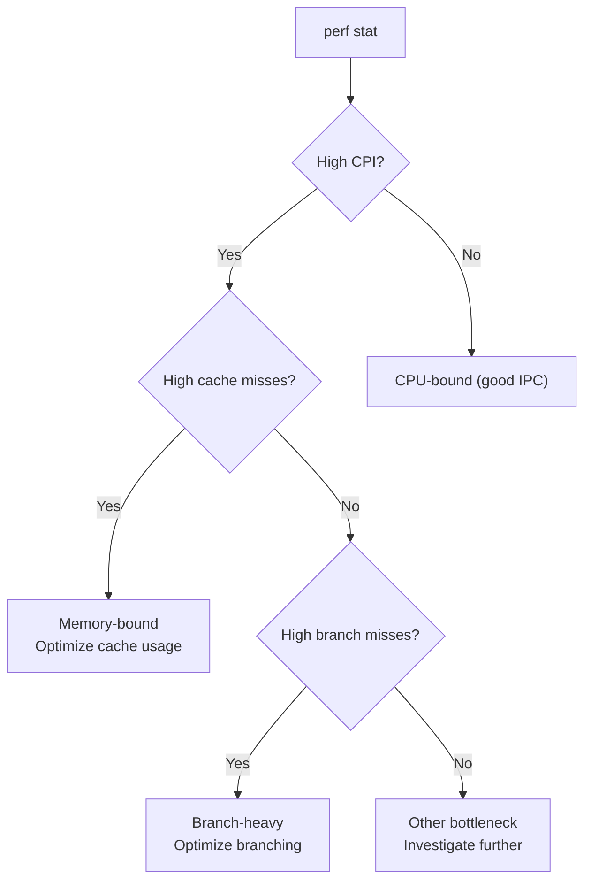

# Performance Counters

## Overview

**Hardware Performance Counters** (PMCs) are built-in CPU registers that count microarchitectural events — cache misses, branch mispredictions, instructions executed, cycles stalled, etc. They provide precise, low-overhead insight into what's happening inside the processor. Understanding and using performance counters is essential for performance engineering.

## What Are Performance Counters?



Each counter increments when a specific event occurs. Modern CPUs have 4-8 general-purpose counters per core.

## Common Performance Counter Events

### Instruction Events
| Event | Description |
|-------|-------------|
| `instructions` | Instructions retired |
| `inst_retired` | Instructions completed |
| `uops_retired` | Micro-ops retired |

### Cache Events
| Event | Description |
|-------|-------------|
| `L1-dcache-loads` | L1 data cache loads |
| `L1-dcache-load-misses` | L1 data cache load misses |
| `L1-dcache-stores` | L1 data cache stores |
| `L1-icache-load-misses` | L1 instruction cache misses |
| `LLC-loads` | Last-level cache loads |
| `LLC-load-misses` | Last-level cache load misses |

### Branch Events
| Event | Description |
|-------|-------------|
| `branch-instructions` | Branch instructions executed |
| `branch-misses` | Branch mispredictions |
| `branch-load-misses` | Branch target buffer misses |

### Memory Events
| Event | Description |
|-------|-------------|
| `dTLB-loads` | Data TLB loads |
| `dTLB-load-misses` | Data TLB load misses |
| `iTLB-loads` | Instruction TLB loads |
| `iTLB-load-misses` | Instruction TLB load misses |

### Pipeline Events
| Event | Description |
|-------|-------------|
| `cycles` | CPU cycles |
| `stalled-cycles-frontend` | Frontend stall cycles |
| `stalled-cycles-backend` | Backend stall cycles |
| `resource_stalls` | Resource-related stalls |

## Using Performance Counters

### Linux `perf stat`

```bash
# Basic statistics
perf stat ./my_program

# Output:
#  1,234,567,890  instructions   #  1.23 insn per cycle
#    987,654,321  cycles
#     12,345,678  branch-misses  #  2.50% of branches
#    456,789,012  cache-misses   #  4.20% of cache refs
```

### Specific Events

```bash
# Count specific events
perf stat -e L1-dcache-loads,L1-dcache-load-misses,LLC-loads,LLC-load-misses ./my_program

# Output:
#    500,000,000  L1-dcache-loads
#     25,000,000  L1-dcache-load-misses  # 5.0% miss rate
#      5,000,000  LLC-loads
#        500,000  LLC-load-misses        # 10.0% miss rate
```

### Multiplexing

When events exceed available counters, `perf` multiplexes:
```bash
# Events are time-shared across counters
perf stat -e cycles,instructions,cache-misses,branch-misses,L1-dcache-loads ./my_program
# Note: Some events may be estimated (shown with [percentage] confidence)
```

### `perf record` and `perf report`

```bash
# Record with call graph
perf record -g ./my_program

# Analyze
perf report

# Show hottest functions
perf report --sort=dso,symbol
```

## Derived Metrics

### CPI (Cycles Per Instruction)
```
CPI = cycles / instructions
```
- **< 1.0**: Excellent (superscalar, multiple IPC)
- **1.0-2.0**: Good
- **> 2.0**: Poor (memory stalls, branch misses)

### Cache Miss Rate
```
L1 Miss Rate = L1-dcache-load-misses / L1-dcache-loads
LLC Miss Rate = LLC-load-misses / LLC-loads
```

### Branch Misprediction Rate
```
Branch Miss Rate = branch-misses / branch-instructions
```
- **< 1%**: Excellent
- **1-5%**: Good
- **> 5%**: Needs optimization

### Memory Bandwidth
```
Bandwidth = (LLC-load-misses + LLC-store-misses) × 64 bytes / time
```

## Profiling Methodology

### 1. Start with `perf stat`

```bash
perf stat ./my_program
```

Look at:
- IPC (instructions per cycle)
- Cache miss rates
- Branch miss rates
- Stalled cycles

### 2. Identify the Bottleneck



### 3. Profile for Hotspots

```bash
perf record -g ./my_program
perf report
```

Find which functions consume the most cycles.

### 4. Drill Down

```bash
# Annotate source code
perf annotate --source ./my_program

# Cache-to-cache analysis (false sharing)
perf c2c record ./my_program
perf c2c report
```

## Intel VTune

Commercial profiling tool with detailed analysis:

```bash
# Hotspots analysis
vtune -collect hotspots -result-dir r001 ./my_program

# Memory access analysis
vtune -collect memory-access -result-dir r002 ./my_program

# Threading analysis
vtune -collect threading -result-dir r003 ./my_program
```

### VTune Insights
- **Hotspots**: Which functions use the most CPU time
- **Memory Access**: Cache misses, NUMA issues, false sharing
- **Threading**: Lock contention, thread imbalance
- **Microarchitecture**: Pipeline stalls, frontend/backend bottlenecks

## AMD uProf

AMD's profiling tool:
```bash
# CPU profiling
AMDuProfCLI collect --event-list=all --duration=10 --output-dir=results ./my_program

# Analyze
AMDuProfCLI report --input=results
```

## Performance Counter Events by Architecture

### Intel (Skylake+)
| Event | Code | Description |
|-------|------|-------------|
| `INST_RETIRED.ANY` | 0xC0 | Instructions retired |
| `CPU_CLK_UNHALTED.THREAD` | 0x3C | Cycles (thread) |
| `L1D.REPLACEMENT` | 0x51 | L1D replacements |
| `MEM_LOAD_RETIRED.L1_MISS` | 0xD1 | L1 load misses |
| `MEM_LOAD_RETIRED.L2_MISS` | 0xD2 | L2 load misses |
| `MEM_LOAD_RETIRED.L3_MISS` | 0xD3 | L3 load misses |

### AMD (Zen+)
| Event | Code | Description |
|-------|------|-------------|
| `RETIRED_INSTRUCTIONS` | 0xC0 | Instructions retired |
| `RETIRED_OPS` | 0xC1 | Micro-ops retired |
| `DATA_CACHE_MISSES` | 0x41 | L1 data cache misses |
| `L2_CACHE_MISS` | 0x43 | L2 cache misses |

## Interview Questions

1. **Q**: What are performance counters and how do you use them?
   **A**: Hardware registers that count microarchitectural events (cache misses, branch mispredictions, instructions executed). Use `perf stat` for overview, `perf record` for profiling. They help identify bottlenecks without modifying the program.

2. **Q**: A program has high CPI. How do you diagnose the cause?
   **A**: Check cache miss rates (L1, LLC) — high misses = memory bottleneck. Check branch miss rate — high misses = branch prediction problem. Check stalled cycles — frontend stalls = instruction fetch issues, backend stalls = execution/memory issues.

3. **Q**: What is a good CPI value?
   **A**: Depends on the workload. For compute-bound code with good locality, CPI < 1.0 is achievable (multiple IPC). For memory-bound code, CPI > 2.0 is common. A CPI of 1.0-1.5 is typical for well-optimized code.

4. **Q**: How do you detect false sharing using performance counters?
   **A**: Use `perf c2c` which analyzes cache-to-cache transfers. High rates of cache line invalidations between cores for different variables indicate false sharing. Also visible as high LLC miss rates with low LLC load misses.

5. **Q**: What is the difference between `perf stat` and `perf record`?
   **A**: `perf stat` counts aggregate events (total cache misses, total instructions). `perf record` samples events at intervals to build a profile showing which functions/lines cause events. Use `perf stat` first to identify the problem type, then `perf record` to find where.

## Common Mistakes

- ❌ Running on a system with other workloads (noisy measurements)
- ❌ Not accounting for multiplexing (events estimated, not exact)
- ❌ Focusing on one counter without context (e.g., cache misses without knowing access count)
- ❌ Not using `-g` for call graph profiling
- ❌ Ignoring compiler optimizations in profiling (debug builds have different profiles)

## Summary

Performance counters provide hardware-level insight into CPU behavior. Use `perf stat` for overview metrics (CPI, cache misses, branch misses) and `perf record` for hotspot profiling. High CPI with high cache misses indicates memory bottleneck; high branch misses indicate prediction problems. Modern tools (VTune, uProf) provide detailed analysis.

## Cross-References

- [Performance Equation](equation.md) — CPI and performance
- [Cache Performance](../memory-hierarchy/performance.md) — Cache miss impact
- [Benchmarking](benchmarking.md) — Measuring performance
- [Prefetching](../memory-hierarchy/prefetching.md) — Reducing cache misses
