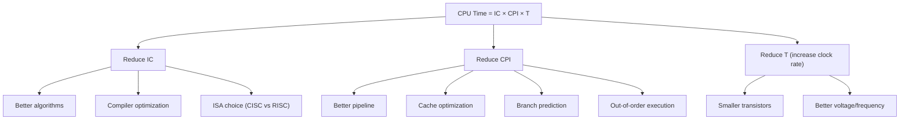

# CPU Performance Equation

## Overview

The **CPU performance equation** breaks down execution time into three fundamental components: instruction count, cycles per instruction (CPI), and clock period. This decomposition is essential for understanding where performance bottlenecks lie and how to optimize them.

## The Fundamental Equation

```
CPU Time = Instruction Count × CPI × Clock Period

Or equivalently:

CPU Time = Instruction Count × CPI / Clock Rate
```

### Components

| Component | Symbol | Unit | Affected By |
|-----------|--------|------|-------------|
| **Instruction Count** | IC | Instructions | Compiler, ISA, algorithm |
| **Cycles Per Instruction** | CPI | Cycles/Instruction | Microarchitecture, cache, pipeline |
| **Clock Period** | T | Seconds/Cycle | Process technology, voltage |
| **Clock Rate** | f = 1/T | Cycles/Second (Hz) | Process technology, voltage |

## Breaking Down the Equation

### Instruction Count (IC)

The number of instructions executed:
- **Reduced by**: Better algorithms, compiler optimization, ISA choice (CISC vs RISC)
- **Example**: A RISC processor may execute more instructions than CISC for the same task

### CPI (Cycles Per Instruction)

Average cycles per instruction:
```
CPI = Σ (CPI_i × Fraction_i)

Where CPI_i is the CPI for instruction type i,
and Fraction_i is the fraction of instructions of type i.
```

**Example**:
| Instruction Type | CPI | Frequency | Weighted CPI |
|------------------|-----|-----------|--------------|
| ALU | 1.0 | 40% | 0.40 |
| Load | 2.0 | 25% | 0.50 |
| Store | 2.0 | 15% | 0.30 |
| Branch | 1.5 | 20% | 0.30 |
| **Total** | | 100% | **1.50** |

### Clock Period / Clock Rate

```
Clock Period = 1 / Clock Rate

3 GHz processor: Clock Period = 1 / 3×10⁹ = 0.333 ns
5 GHz processor: Clock Period = 1 / 5×10⁹ = 0.200 ns
```

## Performance Optimization Strategies



## Detailed Example

### Scenario: Comparing Two Processors

**Processor A**: 2 GHz, CPI = 1.2
**Processor B**: 3 GHz, CPI = 2.0

Both run the same program with 1 billion instructions.

```
Time_A = IC × CPI_A / f_A = 10⁹ × 1.2 / 2×10⁹ = 0.6 seconds
Time_B = IC × CPI_B / f_B = 10⁹ × 2.0 / 3×10⁹ = 0.667 seconds

Processor A is faster despite lower clock rate!
```

**Lesson**: Clock rate alone doesn't determine performance. CPI matters equally.

### MIPS (Million Instructions Per Second)

```
MIPS = IC / (Time × 10⁶) = Clock Rate / (CPI × 10⁶)
```

**Problem**: MIPS doesn't account for instruction complexity. A CISC processor with fewer instructions may have higher MIPS but lower performance.

### MFLOPS (Million FLOPS)

```
MFLOPS = FP Operations / (Time × 10⁶)
```

Better for floating-point workloads, but doesn't capture integer performance.

## CPI and Memory Effects

Cache misses significantly affect CPI:

```
Effective CPI = Base CPI + Memory Stall Cycles

Memory Stalls = Memory Accesses per Instruction × Miss Rate × Miss Penalty
```

**Example**:
- Base CPI = 1.0
- 1.5 memory accesses per instruction
- 5% L1 miss rate, 10 cycle L2 penalty

```
Effective CPI = 1.0 + 1.5 × 0.05 × 10 = 1.75
```

With 2% L1 miss rate:
```
Effective CPI = 1.0 + 1.5 × 0.02 × 10 = 1.30
```

**34% CPI improvement** just by reducing L1 miss rate from 5% to 2%!

## Multi-Cycle Instructions

Different instructions take different numbers of cycles:

```
CPI = Σ (Fraction_i × Cycles_i)
```

| Instruction | Cycles | Fraction | Contribution |
|-------------|--------|----------|--------------|
| ALU | 1 | 50% | 0.50 |
| Load | 2 | 20% | 0.40 |
| Store | 2 | 10% | 0.20 |
| Branch | 3 | 15% | 0.45 |
| Multiply | 4 | 5% | 0.20 |
| **CPI** | | 100% | **1.75** |

## Performance Comparison

### Processor Comparison

```
Performance_A / Performance_B = Time_B / Time_A

= (IC_B × CPI_B × T_B) / (IC_A × CPI_A × T_A)

If IC_A = IC_B (same program):
= (CPI_B × T_B) / (CPI_A × T_A)
= (CPI_B / CPI_A) × (f_A / f_B)
```

### Example

Processor A: 2 GHz, CPI = 1.5
Processor B: 4 GHz, CPI = 2.5

```
Time ratio = (CPI_A / f_A) / (CPI_B / f_B)
           = (CPI_A × f_B) / (CPI_B × f_A)
           = (1.5 × 4) / (2.5 × 2)
           = 6 / 5 = 1.2

Processor A takes 1.2× LONGER than Processor B for the same workload.
So Processor B is 1.2× FASTER than Processor A (despite A's lower CPI,
B's higher clock rate more than compensates).

Concrete: for 10^9 instructions,
  Time_A = 10^9 × 1.5 / 2×10^9 = 0.75 s
  Time_B = 10^9 × 2.5 / 4×10^9 = 0.625 s   ← B finishes first
```

## Interview Questions

1. **Q**: Write the CPU performance equation and explain each component.
   **A**: CPU Time = IC × CPI × T = IC × CPI / f. IC = instruction count (affected by ISA, compiler). CPI = cycles per instruction (affected by microarchitecture, cache). T = clock period (affected by process technology). f = clock rate = 1/T.

2. **Q**: Two processors run the same program. A: 3 GHz, CPI 2.0. B: 2 GHz, CPI 1.2. Which is faster?
   **A**: Time_A = IC × 2.0 / 3G. Time_B = IC × 1.2 / 2G. Ratio = (2.0/3) / (1.2/2) = 0.667 / 0.6 = 1.11. Processor B is 1.11× faster despite lower clock rate.

3. **Q**: How do cache misses affect CPI?
   **A**: Effective CPI = Base CPI + Miss Rate × Miss Penalty × Memory Accesses per Instruction. A 5% miss rate with 10 cycle penalty and 1.5 accesses/instruction adds 0.75 cycles to CPI.

4. **Q**: Why is MIPS a poor performance metric?
   **A**: MIPS doesn't account for instruction complexity. A CISC processor executes fewer but more complex instructions, giving high MIPS but potentially lower actual performance. MIPS also varies with the same processor on different programs.

5. **Q**: What are the three ways to improve CPU performance?
   **A**: (1) Reduce instruction count (better algorithms, compiler). (2) Reduce CPI (better microarchitecture, caches, branch prediction). (3) Increase clock rate (smaller transistors, better process).

## Common Mistakes

- ❌ Assuming clock rate alone determines performance
- ❌ Not accounting for CPI differences between processors
- ❌ Forting that IC depends on the ISA (RISC vs CISC)
- ❌ Not considering memory stall cycles in CPI
- ❌ Using MIPS as a performance comparison metric

## Summary

CPU Time = IC × CPI / Clock Rate. Performance depends on all three factors, not just clock rate. CPI is heavily affected by cache misses and branch mispredictions. Optimization can target any component, but reducing CPI (through cache and pipeline improvements) often provides the biggest gains.

## Cross-References

- [Amdahl's Law](amdahl.md) — Parallel speedup limits
- [Cache Performance](../memory-hierarchy/performance.md) — CPI impact of cache misses
- [Benchmarking](benchmarking.md) — Measuring these metrics
- [Performance Counters](counters.md) — Hardware measurement
