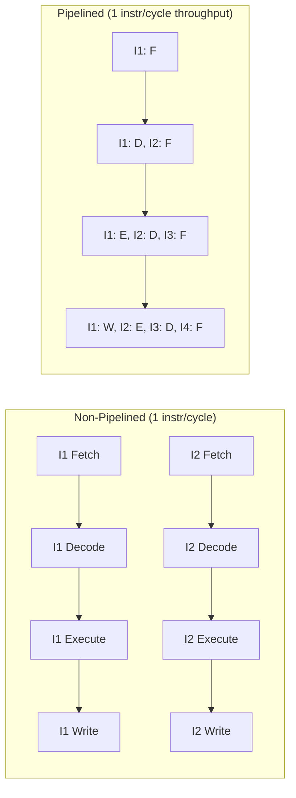

# Pipelining

## Overview

**Pipelining** is a CPU implementation technique that overlaps the execution of multiple instructions, similar to an assembly line in a factory. While one instruction is being executed, the next is being decoded, and the one after that is being fetched. This dramatically increases instruction throughput without increasing the clock speed.

## Topics

| Topic | Description |
|-------|-------------|
| [Classic Pipeline](./classic.md) | The 5-stage RISC pipeline (IF, ID, EX, MEM, WB) |
| [Pipeline Hazards](./hazards.md) | Conditions that prevent the next instruction from executing |
| [Data Hazards](./data-hazards.md) | Dependencies between instructions on data |
| [Control Hazards](./control-hazards.md) | Branches and jumps that change the flow |
| [Structural Hazards](./structural-hazards.md) | Hardware resource conflicts |
| [Forwarding/Bypassing](./forwarding.md) | Solving data hazards without stalling |
| [Branch Prediction](./branch-prediction.md) | Guessing which way a branch goes |
| [Speculative Execution](./speculative.md) | Executing before knowing if it's needed |
| [Superscalar](./superscalar.md) | Issuing multiple instructions per cycle |
| [Out-of-Order Execution](./ooo.md) | Executing instructions as operands become ready |

## Key Insight

Non-pipelined: 4 instructions × 4 stages = 16 time units
Pipelined: 4 instructions = 7 time units (after pipeline fills)

## Interview Focus

- Explain the 5-stage RISC pipeline and what happens in each stage
- Describe the three types of hazards and how each is resolved
- Explain forwarding/bypassing with a concrete example
- Compare static and dynamic branch prediction
- Explain how superscalar and out-of-order execution extend pipelining
