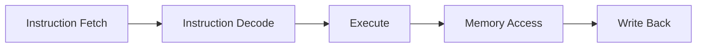
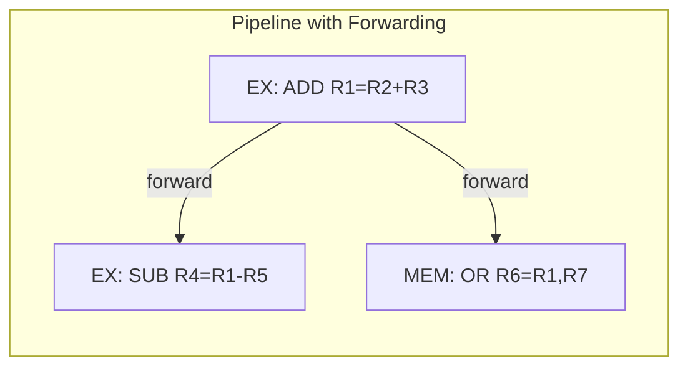
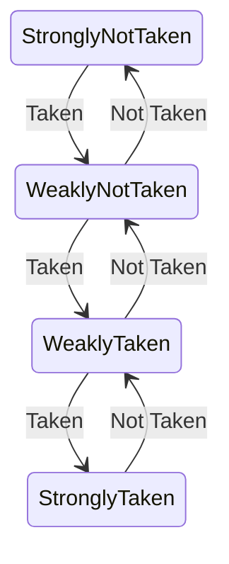
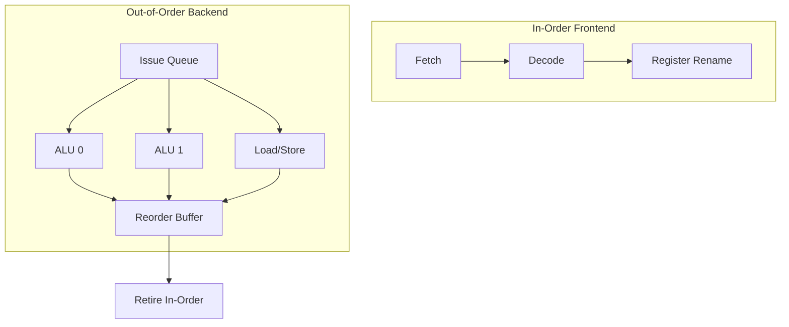

# Pipelining

## Overview

**Pipelining** is a CPU implementation technique that overlaps the execution of multiple instructions, similar to an assembly line in a factory. While one instruction is being executed, the next is being decoded, and the one after that is being fetched. This dramatically increases instruction throughput without increasing the clock speed.

## Why Pipelining Matters

- **Throughput**: Ideally, one instruction completes per clock cycle (CPI ≈ 1)
- **No frequency increase**: More work per cycle, not faster cycles
- **Foundation**: Every modern CPU uses pipelining (and goes beyond it)
- **Interview essential**: Understanding hazards and solutions is a core topic

## The Assembly Line Analogy

```text
Car Factory (Non-Pipelined):
  Car 1: [Build Body] → [Paint] → [Install Engine] → [Test]
  Car 2:                                          [Build Body] → [Paint] → ...

Car Factory (Pipelined):
  Time 1: Car1: Build Body
  Time 2: Car1: Paint       | Car2: Build Body
  Time 3: Car1: Install Eng | Car2: Paint       | Car3: Build Body
  Time 4: Car1: Test        | Car2: Install Eng | Car3: Paint | Car4: Build Body
```

Result: After the pipeline fills, one car completes every time unit instead of every four.

## Classic 5-Stage RISC Pipeline



| Stage | Action | Resources Used |
|-------|--------|----------------|
| **IF** | Fetch instruction from memory at PC | I-Cache, PC |
| **ID** | Decode instruction, read registers | Decoder, Register File |
| **EX** | ALU operation, compute branch target | ALU, Branch Unit |
| **MEM** | Read/write data memory (load/store) | D-Cache |
| **WB** | Write result to register file | Register File |

### Pipeline Timing Diagram

```text
Instruction    | IF | ID | EX | MEM | WB |
---------------|----|----|----|----|-----|
ADD R1, R2, R3 | F  | D  | E  | M   | W  |
SUB R4, R1, R5 |    | F  | D  | E   | M  | W |
AND R6, R1, R7 |    |    | F  | D   | E  | M | W |
OR  R8, R1, R9 |    |    |    | F   | D  | E | M | W |

After pipeline fills: 1 instruction completes per cycle
Speedup = Pipeline Depth (ideally 5× for 5-stage)
```

### Pipeline Performance

```text
Non-pipelined: n instructions × k stages = n × k time units
Pipelined:     k + (n-1) time units

Speedup = (n × k) / (k + n - 1)

As n → ∞: Speedup → k (pipeline depth)

For 5-stage pipeline with 100 instructions:
  Non-pipelined: 100 × 5 = 500 cycles
  Pipelined:     5 + 99 = 104 cycles
  Speedup:       500/104 ≈ 4.8×
```

## Pipeline Hazards

Hazards prevent the next instruction from executing during its designated clock cycle.

### 1. Structural Hazards

**Cause**: Two instructions need the same hardware resource simultaneously.

```text
Cycle:  |  1  |  2  |  3  |  4  |  5  |  6  |
Instr1: | IF  | ID  | EX  | MEM | WB  |     |
Instr2: |     | IF  | ID  | EX  | MEM | WB  |
Instr3: |     |     | IF  | ID  | EX  | MEM | WB  |

Problem: IF and MEM both need memory access in cycle 4
Solution: Separate I-Cache and D-Cache (Harvard-style at cache level)
```

**Solutions:**
- Duplicate resources (separate instruction and data caches)
- Pipeline the resource (multi-cycle memory access)

### 2. Data Hazards

**Cause**: Instruction depends on result of a previous instruction still in the pipeline.

```text
ADD R1, R2, R3   ; Writes R1 in WB (cycle 5)
SUB R4, R1, R5   ; Reads R1 in ID (cycle 3) ← R1 not ready yet!
```

**Three types:**

| Type | Dependency | Example | Stall Cycles |
|------|-----------|---------|-------------|
| **RAW** (Read After Write) | Read before write | `ADD R1,...; SUB R4,R1,...` | 2 without forwarding |
| **WAR** (Write After Read) | Write before read | Not possible in 5-stage in-order | 0 (no issue) |
| **WAW** (Write After Write) | Write before write | Not possible in 5-stage in-order | 0 (no issue) |

**Solution: Forwarding/Bypassing**



```text
Without forwarding (stall):
ADD R1, R2, R3  | IF | ID | EX | MEM | WB |    |    |
SUB R4, R1, R5  |    | IF | ID | stall| EX | MEM | WB |

With forwarding (no stall):
ADD R1, R2, R3  | IF | ID | EX | MEM | WB |
SUB R4, R1, R5  |    | IF | ID | EX* | MEM | WB |
                                ↑ receives R1 from EX/MEM pipeline register
```

### 3. Control Hazards

**Cause**: Branch instruction changes the flow; next instruction is unknown until branch resolves.

```text
BEQ R1, R2, label  | IF | ID | EX | ← branch resolves here
NEXT (wrong path)   |    | IF | ID | ← must flush
TARGET (correct)    |    |    | IF | ← 2 cycle penalty
```

**Solutions:**

| Strategy | Description | Penalty |
|----------|-------------|---------|
| **Stall** | Wait until branch resolves | 2+ cycles |
| **Predict Not Taken** | Assume branch not taken | 1 cycle if wrong |
| **Static Prediction** | Always predict backward branches taken | Better than 50% |
| **1-bit Dynamic** | Remember last outcome | Simple, flips on mispredict |
| **2-bit Saturating Counter** | Need 2 mispredictions to change | Better accuracy |
| **Branch Target Buffer** | Cache branch targets | 0-cycle predicted taken |
| **Correlating Predictors** | Use global/local history | >95% accuracy |
| **TAGE Predictor** | Tagged geometric history lengths | >99% accuracy |

### 2-Bit Saturating Counter



## Beyond the Classic Pipeline

### Superscalar Execution

Issue **multiple instructions per clock cycle**.

```text
Single-issue:    | I1 | I2 | I3 | I4 | I5 | I6 |
Dual-issue:      | I1,I2 | I3,I4 | I5,I6 |
Quad-issue:      | I1,I2,I3,I4 | I5,I6,I7,I8 |

IPC (Instructions Per Cycle) can exceed 1!
```

**Requirements:**
- Multiple execution units (2+ ALUs, 2+ FPUs)
- Multi-ported register file
- Instruction-level parallelism (ILP) in the code
- Complex dependency checking hardware

### Out-of-Order Execution (OoO)

Execute instructions **as operands become ready**, not in program order.



**Key structures:**

| Structure | Purpose |
|-----------|---------|
| **Reorder Buffer (ROB)** | Track instructions, ensure in-order retirement |
| **Reservation Station** | Hold instructions waiting for operands |
| **Register Rename** | Eliminate WAR/WAW hazards by renaming registers |
| **Load/Store Queue** | Handle memory ordering |

**Example:**

```text
Program order:        Execution order:
1. LOAD R1, [R2]     1. LOAD R1, [R2]    ← cache miss, slow
2. ADD R3, R1, R4    3. MUL R7, R8, R9   ← no dependency, execute first!
3. MUL R7, R8, R9    2. ADD R3, R1, R4   ← now R1 is ready
4. SUB R5, R3, R6    4. SUB R5, R3, R6
```

### Speculative Execution

Execute instructions **before knowing if they're needed** (along predicted branch path).

- Combined with branch prediction
- If prediction correct → great, work is done
- If prediction wrong → flush speculative results (wasted work and energy)
- Security implication: Spectre/Meltdown vulnerabilities exploited speculative execution

## Advanced Pipeline Concepts

### Pipeline Stalls Summary

```text
Stall Sources:
├── Data Hazards (without forwarding): 1-2 cycles
├── Load-Use Hazard (even with forwarding): 1 cycle
├── Branch Mispredict: 10-20+ cycles (depends on pipeline depth)
├── Cache Miss (L1): ~10 cycles
├── Cache Miss (L2): ~30 cycles
├── Cache Miss (L3): ~50 cycles
└── Cache Miss (DRAM): ~200 cycles
```

### Pipeline Depth vs Performance

| Processor | Pipeline Depth | Clock Rate | Branch Penalty |
|-----------|---------------|------------|----------------|
| ARM Cortex-A77 | ~11 stages | ~3 GHz | ~11 cycles |
| Intel Skylake | ~14-19 stages | ~4-5 GHz | ~15 cycles |
| AMD Zen 4 | ~19 stages | ~5.7 GHz | ~19 cycles |
| Intel Pentium 4 (NetBurst) | ~31 stages | ~3.8 GHz | ~20+ cycles |

**Lesson**: Deeper pipelines increase clock rate but also increase branch misprediction penalty. The Pentium 4's very deep pipeline was considered a design mistake.

## Interview Focus

- Explain the 5-stage RISC pipeline and what happens in each stage
- Describe the three types of hazards and how each is resolved
- Explain forwarding/bypassing with a concrete example
- Compare static and dynamic branch prediction
- Explain how superscalar and out-of-order execution extend pipelining
- Calculate pipeline speedup given a specific scenario
- Explain why deeper pipelines aren't always better

## Cross References

- [Classic Pipeline](classic.md)
- [Hazards](hazards.md)
- [Data Hazards](data-hazards.md)
- [Control Hazards](control-hazards.md)
- [Forwarding](forwarding.md)
- [Branch Prediction](branch-prediction.md)
- [Superscalar](superscalar.md)
- [Out-of-Order Execution](ooo.md)
- [CPU Architecture](../cpu/README.md)
- [OS Scheduling](../../os/scheduling/README.md)
