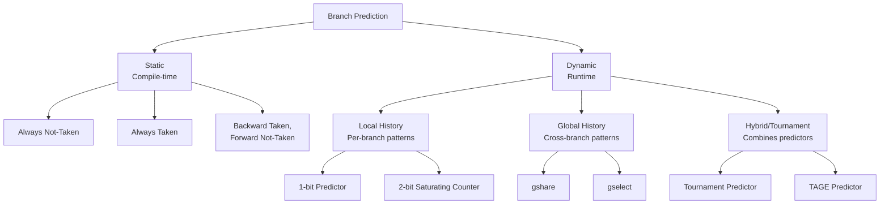
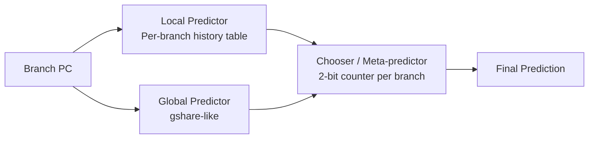

# Branch Prediction

## Overview

**Branch prediction** is a hardware technique that guesses the outcome of a branch instruction before it's actually resolved. Since branches occur roughly every 5-7 instructions (15-20% of all instructions), and modern pipelines have 10-20+ stages, accurate branch prediction is critical for performance. A misprediction in a 15-stage pipeline wastes 14 cycles of work.

## Detailed Explanation

### Why Prediction is Essential

```
Without prediction (stall until resolved):
  Branch frequency: 20%
  Pipeline depth: 15 stages
  Branch resolved at stage: 10
  Penalty: 9 cycles per branch

  CPI = 1 + 0.20 × 9 = 2.8  (2.8× slower than ideal!)

With 95% accurate prediction:
  CPI = 1 + 0.20 × 0.05 × 9 = 1.09  (nearly ideal!)
```

### Taxonomy of Branch Predictors



### 1-Bit Predictor

The simplest dynamic predictor: remember the last outcome.

```
State: Taken or Not-Taken

On each branch:
  if predicted correctly → keep same prediction
  if mispredicted → flip prediction

Problem with loops:
  Loop iterates 10 times
  Prediction: T T T T T T T T T T NT
  Actual:     T T T T T T T T T T NT
  Mispredictions: 2 (enter and exit)
  
  But if loop iterates only once:
  Prediction: NT (from last time)
  Actual:     T
  Misprediction: 1, then flips to T
  Next time: Prediction: T, Actual: NT → mispredict again!
  
  A 1-bit predictor always mispredicts twice for loops.
```

### 2-Bit Saturating Counter

Requires two consecutive mispredictions to change prediction:

```
State diagram:
  00 (Strongly Not-Taken) ──T──→ 01 (Weakly Not-Taken)
         ↑                           │
         NT                          T
         │                           ↓
  10 (Weakly Taken) ←──NT── 11 (Strongly Taken)

  Predict Taken if state >= 10
  Predict Not-Taken if state <= 01
```

```
Loop with 10 iterations (initial state: 01):
  Iter 1: Predict NT, Actual T → mispredict, state=10
  Iter 2: Predict T, Actual T  → correct, state=11
  ...
  Iter 10: Predict T, Actual T → correct, state=11
  Exit: Predict T, Actual NT   → mispredict, state=10

  Total mispredictions: 2 (enter and exit)
  1-bit predictor: 2 mispredictions too, but 1-bit flips each iteration
  for short loops, 2-bit is much better.
```

### Branch History Table (BHT)

A table indexed by the lower bits of the PC:

```
BHT: Array of 2-bit counters

Index = PC[11:2]  (lower bits of PC, ignoring byte offset)

  PC = 0x1000 → index 0 → counter state: 11 (Strongly Taken)
  PC = 0x1004 → index 1 → counter state: 01 (Weakly Not-Taken)
  PC = 0x1008 → index 2 → counter state: 10 (Weakly Taken)
  ...

Size: 2^n entries × 2 bits each
  4K entries = 8 Kbit = 1 KB
```

**Aliasing problem**: Different branches may map to the same index, interfering with each other's predictions.

### Correlating Predictors (Two-Level)

Use global history to capture patterns across branches:

```
Global History Register (GHR): Last N branch outcomes
  Example (N=4): GHR = 1011

Pattern History Table (PHT): Indexed by (PC XOR GHR)
  Each entry is a 2-bit counter

gshare: index = PC XOR GHR
gselect: index = PC || GHR (concatenation)
```

```
Example pattern: "After two taken branches, the next is usually not-taken"
  GHR = 11 (last two taken)
  Next branch: predict based on (PC XOR 11) entry
  If history shows this pattern → entry likely says "Not-Taken"
```

### Tournament Predictor

Combines multiple predictors with a chooser:



```
Chooser: 2-bit counter per branch
  00, 01: Use local predictor
  10, 11: Use global predictor

After each branch:
  If local was correct and global was wrong → decrement chooser (favor local)
  If global was correct and local was wrong → increment chooser (favor global)
  If both correct or both wrong → no change

This adapts to the best predictor for each branch.
```

### TAGE Predictor

**TAGE (Tagged Geometric History Length)** is the state of the art:

```
Multiple predictor tables, each using different history lengths:
  Table 0: No history (base predictor, 2-bit counters)
  Table 1: 4 bits of history
  Table 2: 8 bits of history
  Table 3: 16 bits of history
  Table 4: 32 bits of history
  ... (geometric progression)

Each table entry has:
  - Tag (to avoid aliasing)
  - Prediction counter (3-bit)
  - Useful counter (to manage replacement)

Prediction: Use the longest matching history (most specific)
  → Captures both short and long patterns
```

### Branch Target Buffer (BTB)

Predicts the **target address** (not just taken/not-taken):

```
BTB: Cache of branch target addresses
  Indexed by PC
  Contains: target address, branch type, prediction

On fetch:
  Check BTB for current PC
  If hit and predicted taken → fetch from stored target
  If hit and predicted not-taken → fetch sequentially
  If miss → fetch sequentially (assume not-taken)
```

### Return Address Stack (RAS)

Special predictor for function returns:

```
On CALL instruction:
  Push (PC + instruction_size) onto RAS

On RET instruction:
  Pop address from RAS, predict as branch target

RAS is a small hardware stack (8-32 entries)
Accuracy: >99% for function returns
```

## Examples

### Example 1: 2-Bit Predictor Trace

```
Branch at PC=0x100, initial state: 00 (Strongly Not-Taken)

Execution: T T T T T NT (loop with 5 iterations)

  Iter 1: State=00, Predict=NT, Actual=T → MISPREDICT, state→01
  Iter 2: State=01, Predict=NT, Actual=T → MISPREDICT, state→10
  Iter 3: State=10, Predict=T, Actual=T  → CORRECT, state→11
  Iter 4: State=11, Predict=T, Actual=T  → CORRECT, state→11
  Iter 5: State=11, Predict=T, Actual=T  → CORRECT, state→11
  Exit:   State=11, Predict=T, Actual=NT → MISPREDICT, state→10

  Accuracy: 3/6 = 50% (with cold start)
  Steady state: 5/6 = 83% (only mispredict at exit)
```

### Example 2: gshare Predictor

```
Branch PC = 0x1000 (binary: 0001000000000000)
Global History = 1011 (4-bit)

Index = PC[5:2] XOR GHR = 0000 XOR 1011 = 1011 (index 11)

Check PHT[11]: counter = 10 (Weakly Taken)
Prediction: Taken

After execution:
  If actually taken: counter → 11 (Strongly Taken)
  If not taken: counter → 01 (Weakly Not-Taken)
  Update GHR: shift in actual outcome
```

### Example 3: Prediction Accuracy Impact

```
Pipeline: 14 stages, branch at stage 8, penalty = 7 cycles
Branch frequency: 18%

Scenario 1: No prediction (always stall)
  CPI = 1 + 0.18 × 7 = 2.26

Scenario 2: Static (60% accurate)
  CPI = 1 + 0.18 × 0.40 × 7 = 1.50

Scenario 3: 2-bit (90% accurate)
  CPI = 1 + 0.18 × 0.10 × 7 = 1.13

Scenario 4: TAGE (97% accurate)
  CPI = 1 + 0.18 × 0.03 × 7 = 1.04
```

### Example 4: Real CPU Branch Predictors

```
Intel Haswell:
  - TAGE predictor with ~16K entries
  - Branch Target Buffer: 4K entries
  - Return Address Stack: 16 entries
  - Indirect Branch Predictor: 256 entries
  - Loop Detector: detects loops, predicts exit
  - Accuracy: ~96-98%

AMD Zen 4:
  - TAGE predictor
  - 64K-entry BTB
  - 32-entry RAS
  - Accuracy: ~97%
```

## Interview Questions

### Q1: Why is branch prediction important?
**Answer**: Branches occur in 15-20% of instructions, and modern pipelines are 10-20+ stages deep. Without prediction, each branch would stall the pipeline for many cycles, severely reducing throughput. A 95% accurate predictor reduces the average branch penalty to near zero.

### Q2: How does a 2-bit saturating counter work?
**Answer**: It has four states: Strongly Not-Taken (00), Weakly Not-Taken (01), Weakly Taken (10), Strongly Taken (11). It predicts Taken if the state is 10 or 11, Not-Taken if 00 or 01. On a Taken outcome, it increments (saturating at 11); on Not-Taken, it decrements (saturating at 00). It requires two consecutive mispredictions to change prediction.

### Q3: What is a tournament predictor?
**Answer**: A tournament predictor combines multiple prediction strategies (e.g., local and global) and uses a chooser (meta-predictor) to select which one to use for each branch. The chooser is trained based on which sub-predictor was correct, adapting to the best strategy per branch.

### Q4: What is a Branch Target Buffer?
**Answer**: A BTB is a cache that stores the target addresses of previously seen branch instructions, indexed by the branch's PC. When a branch is fetched, the BTB provides the predicted target address without waiting for the branch to be decoded and computed. This is essential for predicting where to fetch next.

### Q5: How does a Return Address Stack work?
**Answer**: It's a small hardware stack that predicts function returns. On a CALL instruction, the return address (PC + instruction length) is pushed onto the stack. On a RET instruction, the top of the stack is popped and used as the predicted target. This achieves >99% accuracy for function returns.

## Common Mistakes

1. **Confusing taken/not-taken prediction with target prediction** — Predicting the direction (taken or not) is one problem; predicting the target address is another. The BHT predicts direction; the BTB predicts targets.
2. **Thinking prediction is always right** — Even the best predictors (TAGE) mispredict 2-5% of the time. The goal is to minimize, not eliminate, mispredictions.
3. **Ignoring cold-start penalty** — Predictors need training. The first time a branch executes, the prediction is essentially random. For short-running programs, this matters.
4. **Forgetting about indirect branches** — Indirect branches (jump to address in register, like virtual function calls) are harder to predict than conditional branches. They need separate indirect branch predictors.

## Summary

| Predictor | Accuracy | Hardware Cost | Notes |
|-----------|----------|---------------|-------|
| **Static** | ~60% | None | Compiler-directed |
| **1-bit** | ~85% | 1 bit/branch | Mispredicts twice per loop |
| **2-bit BHT** | ~90% | 2 bits/branch | Standard baseline |
| **gshare** | ~93% | Moderate | Global history XOR PC |
| **Tournament** | ~95% | Higher | Combines local + global |
| **TAGE** | ~97% | High | State of the art |

## Cross-References

- [Control Hazards](./control-hazards.md) — The hazard that branch prediction solves
- [Speculative Execution](./speculative.md) — Executing predicted path before confirmation
- [Classic Pipeline](./classic.md) — Where branches cause hazards
- [Branch Target Buffer](#) — Predicting where to fetch (not just direction)
