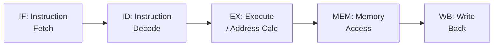

# Classic 5-Stage Pipeline

## Overview

The **classic 5-stage RISC pipeline** is the foundational model for understanding CPU pipelining. It divides instruction execution into five stages—**Instruction Fetch (IF), Instruction Decode (ID), Execute (EX), Memory Access (MEM), and Write Back (WB)**—allowing one instruction to complete per clock cycle after the pipeline fills.

## Detailed Explanation

### The Five Stages



| Stage | Full Name | Responsibilities |
|-------|-----------|-----------------|
| **IF** | Instruction Fetch | Read instruction from memory using PC; update PC |
| **ID** | Instruction Decode | Decode instruction; read registers; sign-extend immediate |
| **EX** | Execute | ALU operation; compute branch target; evaluate condition |
| **MEM** | Memory Access | Read/write data memory (for LOAD/STORE) |
| **WB** | Write Back | Write result to register file |

### Pipeline Diagram (Time vs Space)

```
         Time →
         CC1    CC2    CC3    CC4    CC5    CC6    CC7    CC8
Instr 1: IF     ID     EX     MEM    WB
Instr 2:        IF     ID     EX     MEM    WB
Instr 3:               IF     ID     EX     MEM    WB
Instr 4:                      IF     ID     EX     MEM    WB
Instr 5:                             IF     ID     EX     MEM

CC1-CC4: Pipeline filling (no completions yet)
CC5-CC8: Steady state (1 completion per cycle)
```

**Key metrics:**
- **Latency**: Time for one instruction to pass through all stages = 5 cycles
- **Throughput**: Instructions completed per cycle = 1 (in steady state)
- **Speedup**: Up to 5× compared to non-pipelined (ideal case)

### Datapath for Each Stage

```
IF Stage:
  ┌─────────┐     ┌──────────┐
  │   PC    │────→│ Instruction│
  │         │     │  Memory   │────→ IR (Instruction Register)
  │ PC + 4  │────→│           │
  └─────────┘     └──────────┘

ID Stage:
  ┌──────────┐     ┌──────────┐
  │    IR    │────→│ Register  │────→ A, B (operand registers)
  │          │     │  File     │
  │ Immediate│────→│ Sign Ext  │────→ Imm (sign-extended immediate)
  └──────────┘     └──────────┘

EX Stage:
  ┌──────────┐     ┌──────────┐
  │ A, B/Imm │────→│   ALU    │────→ ALU Result
  │          │     │          │────→ Branch Target
  └──────────┘     └──────────┘

MEM Stage:
  ┌──────────┐     ┌──────────┐
  │ALU Result│────→│  Data     │────→ Mem Data (for LOAD)
  │ B (store)│────→│  Memory   │
  └──────────┘     └──────────┘

WB Stage:
  ┌──────────┐     ┌──────────┐
  │ALU Result│──┐  │ Register  │
  │Mem Data  │──┼─→│  File     │  (write to destination register)
  └──────────┘  │  └──────────┘
              MUX (MemtoReg)
```

### Pipeline Registers

Between each stage, **pipeline registers** hold intermediate results:

```
IF/ID Register:  Holds fetched instruction and PC+4
ID/EX Register:  Holds decoded values (A, B, Imm, control signals)
EX/MEM Register: Holds ALU result, branch outcome, store data
MEM/WB Register: Holds memory data, ALU result, control signals
```

These registers isolate each stage, allowing them to operate independently on different instructions.

### CPI Analysis

```
Ideal CPI (Cycles Per Instruction) = 1

With hazards and stalls:
  CPI = 1 + stall_cycles_per_instruction

Example:
  30% of instructions are loads with 1-cycle load-use hazard
  15% of instructions are branches with 1-cycle misprediction penalty
  
  CPI = 1 + 0.30 × 1 + 0.15 × 1 = 1.45
  Speedup over non-pipelined = 5 / 1.45 ≈ 3.45×
```

## Examples

### Example 1: RISC-V Pipeline Execution

```asm
# RISC-V code
add x1, x2, x3     # R1 = R2 + R3
sub x4, x1, x5     # R4 = R1 - R5  (data dependency on x1)
and x6, x1, x7     # R6 = R1 & R7  (data dependency on x1)
or  x8, x9, x10    # R8 = R9 | R10 (no dependency)
```

```
Pipeline diagram (with forwarding):

         CC1    CC2    CC3    CC4    CC5    CC6    CC7
add:     IF     ID     EX     MEM    WB
sub:            IF     ID     EX     MEM    WB
and:                   IF     ID     EX     MEM    WB
or:                           IF     ID     EX     MEM    WB

With forwarding from EX/MEM and MEM/WB:
- sub reads x1 from EX/MEM register (forwarded from add's EX stage)
- and reads x1 from MEM/WB register (forwarded from add's MEM stage)
- No stalls needed!
```

### Example 2: Pipeline Stall (Without Forwarding)

```
Without forwarding:
         CC1    CC2    CC3    CC4    CC5    CC6    CC7    CC8
add:     IF     ID     EX     MEM    WB
sub:            IF     ID     stall  stall  EX     MEM    WB
and:                          IF     stall  ID     EX     MEM    WB
or:                                   IF     ID     EX     MEM    WB

The pipeline stalls for 2 cycles waiting for add to write x1 to register file
before sub can read it in ID stage.
```

### Example 3: LOAD-USE Hazard

```asm
lw  x1, 0(x2)    # Load x1 from memory
add x3, x1, x4   # Use x1 immediately (load-use hazard!)
```

```
         CC1    CC2    CC3    CC4    CC5    CC6    CC7
lw:      IF     ID     EX     MEM    WB
add:            IF     ID     stall  EX     MEM    WB
                                  ↑
                          1-cycle stall (data available after MEM)
                          Forwarding from MEM/WB to EX input
```

Even with forwarding, a load-use hazard requires 1 stall cycle because the data isn't available until the end of the MEM stage.

### Example 4: Pipeline Speedup Calculation

```
Non-pipelined execution:
  Clock period = 200 ns (sum of all stage delays)
  4 instructions × 200 ns = 800 ns

5-stage pipelined execution:
  Clock period = 50 ns (longest stage delay + overhead)
  Pipeline fill: 4 × 50 ns = 200 ns
  Steady state: 1 instruction × 50 ns = 50 ns
  Total: 200 + 50 = 250 ns

Speedup = 800 / 250 = 3.2×
(Not quite 5× due to pipeline overhead and fill time)
```

## Interview Questions

### Q1: What are the five stages of the classic RISC pipeline?
**Answer**: (1) **IF** — Fetch instruction from memory using PC; (2) **ID** — Decode instruction, read registers, sign-extend immediate; (3) **EX** — Execute ALU operation or compute branch target; (4) **MEM** — Access data memory for LOAD/STORE; (5) **WB** — Write result back to register file.

### Q2: Why is the pipeline clock period limited by the slowest stage?
**Answer**: Because all stages advance simultaneously on each clock edge (synchronous pipeline). If one stage takes longer than others, the entire pipeline must wait. The clock period must accommodate the slowest stage plus any overhead. This is why balanced stage delays are important.

### Q3: What is CPI in an ideal pipeline?
**Answer**: CPI (Cycles Per Instruction) = 1 in an ideal pipeline with no hazards. After the pipeline fills (4 cycles for 5 stages), one instruction completes every cycle. Real CPI is higher due to stalls from data hazards, control hazards, and structural hazards.

### Q4: What are pipeline registers and why are they needed?
**Answer**: Pipeline registers (latches) sit between stages to hold intermediate results. They isolate stages so each can work on a different instruction simultaneously. Without them, signals from one stage would interfere with the next. They also hold control signals that propagate through the pipeline.

### Q5: What limits the number of pipeline stages?
**Answer**: (1) **Pipeline overhead** — Latch setup/hold time adds to each stage; (2) **Hazard penalty** — More stages mean more cycles wasted on mispredictions and stalls; (3) **Diminishing returns** — Some stages can't be split further (e.g., cache access); (4) **Power** — More pipeline registers consume more power. Modern CPUs have 10-20+ stages.

## Common Mistakes

1. **Thinking pipelining reduces latency** — Pipelining increases throughput (instructions/second) but doesn't reduce the latency of a single instruction. Each instruction still takes 5 cycles to complete.
2. **Confusing throughput with latency** — Throughput = 1 instruction/cycle (steady state). Latency = 5 cycles per instruction. Pipelining improves throughput, not latency.
3. **Ignoring pipeline fill time** — The first instruction takes 5 cycles. Subsequent instructions overlap, but the fill time matters for short code sequences.
4. **Assuming ideal speedup is always N stages** — Real speedup is less due to hazards, stalls, unequal stage delays, and pipeline register overhead.
5. **Forgetting about LOAD-USE hazards** — Even with forwarding, a load followed immediately by a use of the loaded value requires 1 stall cycle.

## Summary

| Aspect | Detail |
|--------|--------|
| **Stages** | IF → ID → EX → MEM → WB |
| **Ideal CPI** | 1 (one instruction completes per cycle) |
| **Speedup** | Up to N× for N stages (less in practice) |
| **Pipeline Registers** | Latches between stages holding intermediate results |
| **Limitations** | Hazards (data, control, structural) cause stalls |
| **Modern CPUs** | 10-20+ stages, superscalar, out-of-order |

## Cross-References

- [Pipeline Hazards](./hazards.md) — What can go wrong in a pipeline
- [Data Hazards](./data-hazards.md) — Dependencies between instructions
- [Forwarding/Bypassing](./forwarding.md) — Solving data hazards in hardware
- [Branch Prediction](./branch-prediction.md) — Handling control hazards
- [Superscalar](./superscalar.md) — Multiple instructions per cycle
- [Von Neumann Architecture](../cpu/von-neumann.md) — The basic model being pipelined

## Cross References

- [Hazards](hazards.md)
- [Forwarding](forwarding.md)
- [Superscalar](superscalar.md)
