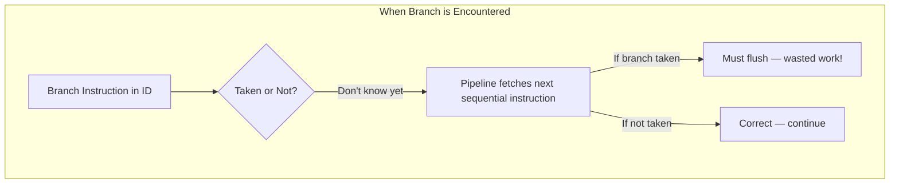
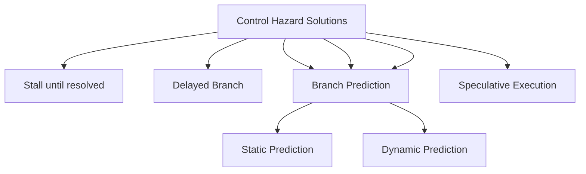
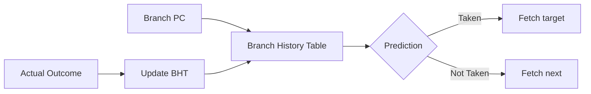
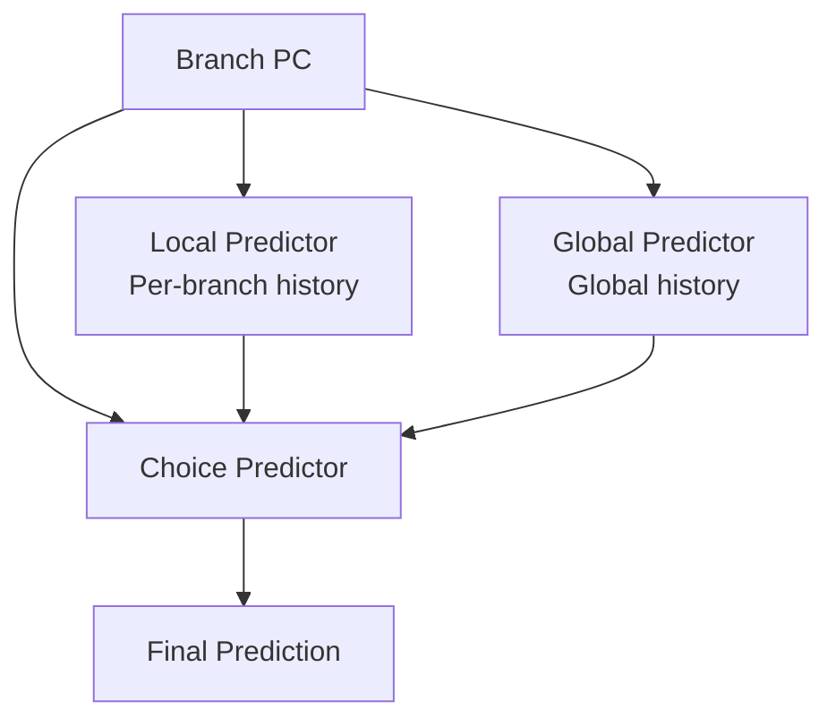

# Control Hazards

## Overview

**Control hazards** (also called **branch hazards**) occur when the pipeline makes wrong assumptions about the flow of instructions. When a branch instruction is fetched, the CPU doesn't know until the EX (or later) stage whether the branch is taken or what the target address is. Meanwhile, the pipeline has already fetched subsequent instructions that may need to be discarded.

## Detailed Explanation

### The Problem



```
Without any branch handling:
  CC1   CC2   CC3   CC4   CC5   CC6
  BEQ:  IF    ID    EX    MEM   WB    ← branch resolved in EX
  I_seq:      IF    ID    EX    MEM   WB  ← may be wrong!
  I_seq:            IF    ID    EX    MEM  WB ← may be wrong!
  I_target:               IF    ID    EX   MEM WB ← correct if taken

If branch is taken: I_seq instructions must be flushed (2 wasted cycles)
```

### Branch Penalty

The **branch penalty** is the number of cycles wasted when a branch is mispredicted:

```
In a 5-stage pipeline:
  Branch resolved in: EX stage (cycle 3)
  Penalty: 2 cycles (instructions fetched in cycles 2 and 3 are wrong)

In a deeper pipeline (e.g., 15 stages):
  Branch resolved in: Stage 10
  Penalty: 9 cycles (much worse!)

This is why branch prediction is critical for deep pipelines.
```

### Solutions Overview



| Solution | Description | Penalty |
|----------|-------------|---------|
| **Stall** | Wait until branch is resolved | 2 cycles (5-stage) |
| **Delayed Branch** | Always execute instruction after branch | 0 (compiler fills slot) |
| **Static Prediction** | Always predict taken/not-taken based on direction | 0 if correct, 2 if wrong |
| **Dynamic Prediction** | Use branch history to predict | 0 if correct, 1-2 if wrong |
| **Speculation** | Execute predicted path, squash if wrong | 0 if correct, N if wrong |

### Delayed Branch

Some ISAs (MIPS) define a **branch delay slot**:

```asm
BEQ  R1, R2, target
ADD  R3, R4, R5      # Delay slot: ALWAYS executes (even if branch taken)

# This instruction executes regardless of branch outcome
# Compiler fills it with a useful instruction from before the branch
```

```
Original:         Scheduled with delay slot:
  ADD R1,R2,R3      BEQ R6,R7,target
  SUB R4,R1,R5      ADD R1,R2,R3       ← moved into delay slot
  BEQ R6,R7,target  SUB R4,R1,R5
```

Delayed branches are less common in modern CPUs (deep pipelines make the single delay slot insufficient).

### Static Branch Prediction

Simple compile-time predictions:

| Strategy | Rule | Works Well For |
|----------|------|----------------|
| **Always not-taken** | Predict fall-through | Forward branches |
| **Always taken** | Predict branch target | Backward branches (loops) |
| **Backward taken, forward not-taken** | Loops go back, ifs go forward | General code |
| **Profile-guided** | Compiler uses profiling data | Known hot paths |

```
Loop example:
  loop:
    ADD  R1, R1, R2
    SUBI R3, R3, 1
    BNEZ R3, loop      # Backward branch → predict taken (correct!)
    
  After loop:
    ...                 # Fall through (not taken — wrong once at loop exit)
```

### Dynamic Branch Prediction

Uses hardware to track branch behavior:



**1-bit predictor**: Flips prediction on every misprediction.
- Problem: Loop that iterates 10 times mispredicts twice (enter and exit)

**2-bit saturating counter**: Requires 2 mispredictions to change prediction.
- States: Strongly Taken, Weakly Taken, Weakly Not-Taken, Strongly Not-Taken
- Only mispredicts once at loop entry and once at loop exit

```
2-bit predictor states:
  00 (Strongly Not-Taken) ←────── 01 (Weakly Not-Taken)
       │                              ↑
       ↓                              │
  10 (Weakly Taken) ──────→ 11 (Strongly Taken)

  Taken → increment (saturate at 11)
  Not-Taken → decrement (saturate at 00)
```

### Correlating Predictors (Two-Level)

Use history of recent branches to predict the current one:

```
Global History Register (GHR): records last N branch outcomes
  Example (N=4): GHR = 1011 (last 4 branches: T, NT, T, T)

Branch History Table (BHT): indexed by (PC XOR GHR)
  Each entry has a 2-bit counter

This captures patterns like:
  "After branch A is taken, branch B is usually not-taken"
```

### Tournament Predictor

Modern CPUs use **tournament predictors** that combine multiple strategies:



Intel's Haswell+ uses a TAGE predictor (Tagged Geometric History Length) that's among the most accurate, achieving >95% prediction rates.

## Examples

### Example 1: Branch Penalty Calculation

```
Pipeline: 15 stages, branch resolved at stage 10
Branch frequency: 20%
Misprediction rate: 5%

Penalty per misprediction: 9 cycles
Average branch penalty: 0.20 × 0.05 × 9 = 0.09 cycles/instruction

CPI = 1 + 0.09 = 1.09

Compare with no prediction (always stall):
Average branch penalty: 0.20 × 9 = 1.8 cycles/instruction
CPI = 1 + 1.8 = 2.8
```

### Example 2: 2-Bit Predictor Trace

```
Loop with 5 iterations, initial state: 01 (Weakly Not-Taken)

Iteration 1: Predict NT, Actual T → MISPREDICT, state → 10
Iteration 2: Predict T, Actual T  → Correct, state → 11
Iteration 3: Predict T, Actual T  → Correct, state → 11
Iteration 4: Predict T, Actual T  → Correct, state → 11
Iteration 5: Predict T, Actual T  → Correct, state → 11
Exit:        Predict T, Actual NT → MISPREDICT, state → 10

Mispredictions: 2 (entry and exit)
1-bit predictor would mispredict 4 times (flips each iteration!)
```

### Example 3: Pipeline Flush on Misprediction

```
  CC1   CC2   CC3   CC4   CC5   CC6   CC7   CC8
  BEQ:  IF    ID    EX    MEM   WB         ← resolved in EX (CC3)
  I1:         IF    ID    EX    MEM   WB   ← wrong path
  I2:               IF    ID    EX    MEM  WB ← wrong path
  target:                 IF    ID    EX   MEM WB ← correct path (if taken)

If predicted not-taken but actually taken:
  I1 and I2 must be flushed (squashed)
  Their results are discarded
  Pipeline restarts from target address
  2 cycles wasted
```

### Example 4: Return Address Stack

Function returns are hard to predict with normal predictors:

```asm
# Function called from 10 different sites
# The return address is always different!

CALL func       # Push return address
...
func:
  ...
  RET           # Pop return address, jump there
```

**Solution**: **Return Address Stack (RAS)** — a hardware stack that pushes the return address on CALL and pops it on RET. This predicts function returns with >99% accuracy.

## Interview Questions

### Q1: What is a control hazard?
**Answer**: A control hazard occurs when the pipeline fetches instructions based on assumptions about the control flow (e.g., sequential fetch) that turn out to be wrong due to branches, jumps, or function returns. The pipeline must discard incorrectly fetched instructions and restart from the correct address.

### Q2: What is the branch penalty and how can it be reduced?
**Answer**: The branch penalty is the number of wasted cycles when a branch is mispredicted. It can be reduced by: (1) resolving branches earlier in the pipeline, (2) using branch prediction to guess the outcome, (3) using speculative execution to continue while the branch is resolved, and (4) using a return address stack for function returns.

### Q3: How does a 2-bit saturating counter improve over a 1-bit predictor?
**Answer**: A 1-bit predictor flips on every misprediction, so a loop with N iterations mispredicts twice. A 2-bit saturating counter requires two consecutive mispredictions to change prediction, so a loop mispredicts only at entry and exit (regardless of iteration count), reducing mispredictions from 2N to 2.

### Q4: What is speculative execution?
**Answer**: Speculative execution is the technique of executing instructions along the predicted branch path before the branch is actually resolved. If the prediction is correct, the results are committed. If wrong, the speculative results are discarded (squashed). This hides the branch penalty but requires mechanisms to undo incorrect side effects.

### Q5: Why are function returns hard to predict?
**Answer**: A function can be called from many different sites, each with a different return address. Static predictors and even dynamic history-based predictors struggle because the return address changes with every call. A Return Address Stack (RAS) solves this by maintaining a hardware stack of return addresses.

## Common Mistakes

1. **Confusing branch prediction with branch resolution** — Prediction is a guess made early; resolution is the actual determination of the branch outcome. The prediction may be wrong.
2. **Thinking delayed branches are a modern technique** — Delayed branches (one delay slot) were used in early RISC (MIPS, SPARC). Modern deep pipelines have too many stages for a single delay slot to help.
3. **Ignoring the cost of misprediction** — In deep pipelines (15-20 stages), a misprediction wastes 10-15 cycles of work. This is why branch prediction accuracy is so important for performance.
4. **Forgetting about indirect branches** — Indirect branches (jump to address in a register) are harder to predict than conditional branches. Virtual function calls and switch statements use indirect branches.

## Summary

| Solution | Accuracy | Complexity | Used In |
|----------|----------|------------|---------|
| **Stall** | 100% correct | None | Early/simple CPUs |
| **Delayed Branch** | 100% correct | Low | MIPS, SPARC (legacy) |
| **Static Prediction** | ~60-70% | None | Compiler-directed |
| **1-bit Predictor** | ~85% | Very low | Simple CPUs |
| **2-bit Saturating** | ~90% | Low | Basic dynamic prediction |
| **Tournament/TAGE** | ~95-97% | High | Modern Intel/AMD CPUs |

## Cross-References

- [Branch Prediction](./branch-prediction.md) — Detailed prediction algorithms
- [Speculative Execution](./speculative.md) — Executing before knowing the outcome
- [Pipeline Hazards](./hazards.md) — Overview of all hazard types
- [Classic Pipeline](./classic.md) — Where control hazards occur

## Cross References

- [Branch Prediction](branch-prediction.md)
- [Speculative Execution](speculative.md)
- [Hazards](hazards.md)
