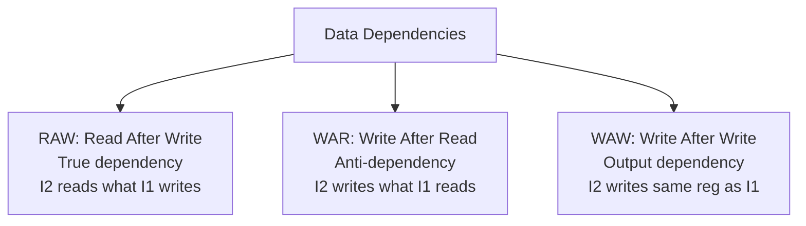

# Data Hazards

## Overview

**Data hazards** occur when an instruction depends on the result of a previous instruction that hasn't yet been written back to the register file. They are the most common type of pipeline hazard and arise from **Read After Write (RAW)**, **Write After Read (WAR)**, and **Write After Write (WAW)** dependencies.

## Detailed Explanation

### Types of Data Dependencies



| Type | Name | Example | Hazard in In-Order? |
|------|------|---------|-------------------|
| **RAW** | Read After Write (True) | `ADD R1,R2,R3` → `SUB R4,R1,R5` | Yes |
| **WAR** | Write After Read (Anti) | `ADD R1,R2,R3` → `SUB R2,R4,R5` | No (in-order) |
| **WAW** | Write After Write (Output) | `ADD R1,R2,R3` → `SUB R1,R4,R5` | No (in-order) |

**Important**: In a simple in-order 5-stage pipeline, only RAW hazards are actual hazards. WAR and WAW hazards don't occur because instructions execute and write back in program order. They become hazards in out-of-order pipelines.

### RAW Hazard Distance

The **distance** is the number of instructions between the producer and consumer:

```
Distance 1 (adjacent):
  ADD R1, R2, R3    ; writes R1 in WB (cycle 5)
  SUB R4, R1, R5    ; reads R1 in ID (cycle 3) — CONFLICT!

Distance 2:
  ADD R1, R2, R3    ; writes R1 in WB (cycle 5)
  OR  R6, R7, R8    ; doesn't use R1
  SUB R4, R1, R5    ; reads R1 in ID (cycle 4) — still early!

Distance 3:
  ADD R1, R2, R3    ; writes R1 in WB (cycle 5)
  OR  R6, R7, R8    ; doesn't use R1
  AND R9, R10, R11  ; doesn't use R1
  SUB R4, R1, R5    ; reads R1 in ID (cycle 5) — WB and ID in same cycle
```

With forwarding:
- Distance 1 with ALU→ALU forwarding: 0 stall cycles (EX result forwarded to EX input)
- Distance 1 with LOAD: 1 stall cycle (data available after MEM, needed in EX)
- Distance 2+: 0 stall cycles (forwarding from MEM/WB register)

### Load-Use Hazard

The most common unresolvable-without-stall data hazard:

```
LW  R1, 0(R2)     ; Data available at end of MEM stage (cycle 4)
ADD R3, R1, R4     ; Data needed at beginning of EX stage (cycle 3)

Timeline:
  CC1   CC2   CC3   CC4   CC5
  LW:   IF    ID    EX    MEM   WB   ← data ready at end of CC4
  ADD:        IF    ID    EX    MEM  WB ← needs data at start of CC3!

Even with forwarding, there's a 1-cycle gap.
The pipeline must stall for 1 cycle.
```

### Forwarding Paths

```mermaid
graph TB
    subgraph Pipeline
        IF1[IF] --> ID1[ID] --> EX1[EX] --> MEM1[MEM] --> WB1[WB]
    end
    EX1 -->|EX/MEM Forward| EX1
    MEM1 -->|MEM/WB Forward| EX1
    WB1 -->|Register File (no forward needed)| ID1
```

Three forwarding paths:
1. **EX/MEM → EX**: Forward ALU result from previous instruction
2. **MEM/WB → EX**: Forward ALU result from 2 instructions ago, or memory data from previous instruction
3. **MEM/MEM**: Forward store data for load-store sequences (some implementations)

### WAR and WAW in Out-of-Order

In an out-of-order pipeline, WAR and WAW become real hazards:

```
WAR Hazard (Write After Read):
  I1: ADD R1, R2, R3    ; Reads R2
  I2: SUB R2, R4, R5    ; Writes R2 (but I1 might not have read it yet!)

  In-order: I1 reads R2 in ID, I2 writes R2 in WB later — no conflict
  Out-of-order: I2 might execute first and overwrite R2 before I1 reads it!
  
  Solution: Register renaming

WAW Hazard (Write After Write):
  I1: ADD R1, R2, R3    ; Writes R1
  I2: SUB R1, R4, R5    ; Writes R1 (should be the final value)

  In-order: Both write in order — I2's value is final
  Out-of-order: I1 might write after I2, leaving wrong value in R1!
  
  Solution: Register renaming
```

## Examples

### Example 1: RAW Hazard with Forwarding

```asm
ADD x1, x2, x3     # x1 = x2 + x3
SUB x4, x1, x5     # x4 = x1 - x5  (RAW on x1)
AND x6, x1, x7     # x6 = x1 & x7  (RAW on x1)
```

```
Pipeline with forwarding:
  CC1   CC2   CC3   CC4   CC5   CC6   CC7
  ADD:  IF    ID    EX    MEM   WB
  SUB:        IF    ID    EX    MEM   WB
  AND:              IF    ID    EX    MEM   WB

Forwarding paths:
  ADD's EX result → SUB's EX input (EX/MEM forward)
  ADD's MEM result → AND's EX input (MEM/WB forward)

No stalls needed! Both dependencies resolved by forwarding.
```

### Example 2: Load-Use Hazard (Must Stall)

```asm
LW   x1, 0(x2)     # Load x1 from memory
ADD  x3, x1, x4     # Use x1 immediately — load-use hazard!
SUB  x5, x3, x6     # Uses x3 (forwarded from ADD)
```

```
Pipeline:
  CC1   CC2   CC3   CC4   CC5   CC6   CC7   CC8
  LW:   IF    ID    EX    MEM   WB
  ADD:        IF    ID    stall EX    MEM   WB
  SUB:              IF    stall ID    EX    MEM   WB

1-cycle stall inserted because:
  LW data available at end of MEM (CC4)
  ADD needs data at start of EX (CC3)
  Forward from MEM/WB to EX input resolves it after the stall
```

### Example 3: Compiler Scheduling to Avoid Hazards

```asm
# Original code (load-use hazard):
LW   x1, 0(x2)
ADD  x3, x1, x4     # Stall! Must wait for x1
SUB  x5, x6, x7     # Independent instruction

# Scheduled code (no stall):
LW   x1, 0(x2)
SUB  x5, x6, x7     # Moved here — independent, fills the stall slot
ADD  x3, x1, x4     # Now x1 is ready (1 cycle gap)
```

### Example 4: Register Renaming for WAR/WAW

```
Original (with WAR and WAW hazards):
  I1: MUL R1, R2, R3     # R1 = R2 * R3
  I2: ADD R2, R4, R5     # R2 = R4 + R5 (WAR: I1 reads R2, I2 writes R2)
  I3: SUB R1, R6, R7     # R1 = R6 - R7 (WAW: both I1 and I3 write R1)

After register renaming:
  I1: MUL P1, P2, P3     # P1 = P2 * P3 (R1→P1, R2→P2, R3→P3)
  I2: ADD P4, P5, P6     # P4 = P5 + P6 (R2→P4, new mapping!)
  I3: SUB P7, P8, P9     # P7 = P8 - P9 (R1→P7, new mapping!)

  WAR eliminated: I1 reads P2, I2 writes P4 (different physical registers)
  WAW eliminated: I1 writes P1, I3 writes P7 (different physical registers)
```

## Interview Questions

### Q1: What are the three types of data dependencies?
**Answer**: (1) **RAW (Read After Write)** — true dependency: an instruction reads a register that a previous instruction writes; (2) **WAR (Write After Read)** — anti-dependency: an instruction writes a register that a previous instruction reads; (3) **WAW (Write After Write)** — output dependency: two instructions write the same register.

### Q2: Why is RAW the only hazard in an in-order pipeline?
**Answer**: Because instructions execute and write back in program order. In WAR, the reader completes before the writer starts (no conflict). In WAW, writes happen in order (second write is correctly final). RAW is a hazard because the reader may need the value before the writer produces it.

### Q3: What is a load-use hazard and why can't forwarding fully solve it?
**Answer**: A load-use hazard occurs when an instruction uses a value loaded from memory by the immediately preceding instruction. The loaded data isn't available until the end of the MEM stage, but the dependent instruction needs it at the beginning of the EX stage. Forwarding from MEM/WB to EX resolves it after a 1-cycle stall.

### Q4: How does register renaming solve WAR and WAW hazards?
**Answer**: Register renaming maps architectural registers (ISA-visible) to a larger set of physical registers. Each write creates a new physical register mapping, eliminating anti-dependencies (WAR) and output dependencies (WAW). Two instructions can read and write the same architectural register without conflict because they use different physical registers.

### Q5: How can compilers help with data hazards?
**Answer**: Compilers can **schedule instructions** to separate dependent instructions with independent ones, filling what would be stall cycles. They can also **unroll loops** to expose more scheduling opportunities and **allocate registers** to minimize spills.

## Common Mistakes

1. **Confusing dependencies with hazards** — A dependency is a semantic relationship (the program's logic). A hazard is a hardware implementation issue (the pipeline can't handle the dependency without stalling). Not all dependencies become hazards with forwarding.
2. **Forgetting load-use hazards** — Even with forwarding, a load followed immediately by a use requires 1 stall cycle. This is the most common data hazard in practice.
3. **Thinking forwarding eliminates all stalls** — Forwarding solves ALU-to-ALU data hazards with 0 stalls. But load-use still needs 1 stall. And very long-latency operations (multiply, divide) may need more.
4. **Ignoring WAR/WAW in OoO context** — These aren't hazards in simple in-order pipelines, but they're critical in out-of-order processors. Register renaming is essential for OoO execution.

## Summary

| Dependency | In-Order Hazard? | OoO Hazard? | Solution |
|------------|-----------------|-------------|----------|
| **RAW** | Yes | Yes | Forwarding, stalling, scheduling |
| **WAR** | No | Yes | Register renaming |
| **WAW** | No | Yes | Register renaming |

| Forwarding Path | Resolves | Stall Cycles |
|-----------------|----------|--------------|
| EX/MEM → EX | Previous ALU result | 0 |
| MEM/WB → EX | ALU result (2 ago), load (1 ago) | 0 (1 for load-use) |
| Register file | Anything 3+ instructions ago | 0 |

## Cross-References

- [Pipeline Hazards](./hazards.md) — Overview of all hazard types
- [Forwarding/Bypassing](./forwarding.md) — Hardware solution for data hazards
- [Out-of-Order Execution](./ooo.md) — Where WAR and WAW become real hazards
- [Classic Pipeline](./classic.md) — The pipeline where these hazards occur
- [Registers](../cpu/registers.md) — Register file design affects hazard handling
