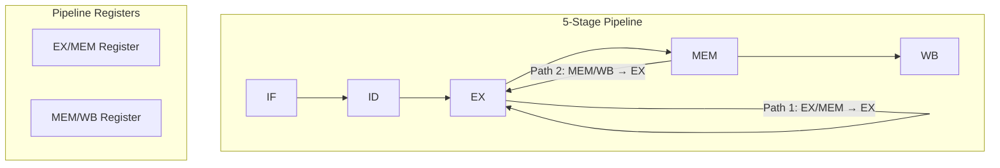

# Forwarding / Bypassing

## Overview

**Forwarding** (also called **bypassing**) is a hardware technique that solves data hazards by routing results directly from where they're produced (later pipeline stages) to where they're needed (earlier pipeline stages), bypassing the register file. This eliminates most stall cycles that would otherwise be needed to wait for results to be written back.

## Detailed Explanation

### The Problem Forwarding Solves

Without forwarding:
```
ADD R1, R2, R3    ; Produces R1 in WB (end of CC5)
SUB R4, R1, R5    ; Needs R1 in ID (CC3) — register file not yet updated!

Must stall for 2 cycles (CC3, CC4 become bubbles) until R1 is written to register file in CC5.
With the write-first-half / read-second-half register-file convention, SUB's ID can shift to CC5 to safely read R1.
```

With forwarding:
```
ADD R1, R2, R3    ; Produces R1 at end of EX (cycle 3)
SUB R4, R1, R5    ; Needs R1 at start of EX (cycle 3) — can forward!

Forward the result from ADD's EX/MEM register to SUB's EX stage input.
No stall needed!
```

### Forwarding Paths



**Two main forwarding paths:**

| Path | From | To | Resolves |
|------|------|-----|----------|
| **EX/MEM → EX** | ALU result of previous instruction | ALU input of current instruction | Distance-1 ALU dependencies |
| **MEM/WB → EX** | ALU result (2 ago) or memory data (1 ago) | ALU input of current instruction | Distance-2 ALU, distance-1 load |

### Forwarding MUX

The EX stage has multiplexers that select the source of operands:

```
Normal:     Operand comes from register file (ID stage)
Forward 1:  Operand comes from EX/MEM register (previous instruction's result)
Forward 2:  Operand comes from MEM/WB register (instruction 2 ago's result)

                    ┌─────────┐
Register File ──────┤         │
                    │   MUX   ├──── ALU Input A
EX/MEM Forward ─────┤         │
                    └─────────┘
MEM/WB Forward ─────┤         │
                    │   MUX   ├──── ALU Input B
Register File ──────┤         │
                    └─────────┘
```

### Forwarding Control Logic

The forwarding unit compares register numbers to decide when to forward:

```
// Forward from EX/MEM to EX
if (EX/MEM.RegWrite == 1
    AND EX/MEM.Rd == ID/EX.Rs1)
  → Forward EX/MEM.ALUResult to ALU input A

if (EX/MEM.RegWrite == 1
    AND EX/MEM.Rd == ID/EX.Rs2)
  → Forward EX/MEM.ALUResult to ALU input B

// Forward from MEM/WB to EX (if EX/MEM doesn't forward)
if (MEM/WB.RegWrite == 1
    AND MEM/WB.Rd == ID/EX.Rs1
    AND NOT (EX/MEM.RegWrite AND EX/MEM.Rd == ID/EX.Rs1))
  → Forward MEM/WB data to ALU input A

(Similar logic for input B)
```

### Load-Use Hazard (Forwarding Can't Fully Solve)

```
LW  R1, 0(R2)    ; Data available at end of MEM (cycle 4)
ADD R3, R1, R4    ; Data needed at start of EX (cycle 4)

Timeline:
  CC1   CC2   CC3   CC4   CC5
  LW:   IF    ID    EX    MEM   WB  ← data ready end of CC4
  ADD:        IF    ID    EX    MEM  WB ← needs at start of CC4

Even with MEM/WB → EX forwarding, there's a 1-cycle gap (ADD's EX is CC4, but LW's MEM result isn't ready until end of CC4).
Must insert 1 stall cycle, then forward from MEM/WB.
```

```
With 1-cycle stall:
  CC1   CC2   CC3   CC4   CC5   CC6   CC7
  LW:   IF    ID    EX    MEM   WB
  ADD:        IF    ID    stall EX    MEM   WB
                              ↑
                      Forward from MEM/WB to EX
```

### Double Data Hazard

When two consecutive instructions both write to the same register, and a third reads it:

```
ADD R1, R2, R3    ; Writes R1
SUB R1, R4, R5    ; Also writes R1
OR  R6, R1, R7    ; Reads R1 — which value?

The most recent write (SUB) should be forwarded.
Priority: EX/MEM forward takes priority over MEM/WB forward.
```

## Examples

### Example 1: EX/MEM Forwarding

```asm
ADD x1, x2, x3     # Produces x1 at end of EX (CC3)
SUB x4, x1, x5     # Needs x1 at start of EX (CC3)
```

```
  CC1   CC2   CC3   CC4   CC5
  ADD:  IF    ID    EX    MEM   WB
  SUB:        IF    ID    EX    MEM   WB
                        ↑     ↑
                  Needs x1  ADD produces x1

  Forward: ADD's EX result (in EX/MEM register) → SUB's ALU input A
  Result available at end of CC3 (EX/MEM written), used at start of CC4 (EX)
  → Actually works because EX/MEM is written at end of CC3, read at start of CC4
  → 0 stall cycles!
```

### Example 2: MEM/WB Forwarding

```asm
ADD x1, x2, x3     # Produces x1 (CC3)
OR  x6, x7, x8     # Doesn't use x1
SUB x4, x1, x5     # Needs x1
```

```
  CC1   CC2   CC3   CC4   CC5   CC6   CC7
  ADD:  IF    ID    EX    MEM   WB
  OR:         IF    ID    EX    MEM   WB
  SUB:              IF    ID    EX    MEM   WB
                              ↑
                        SUB's EX needs x1
                        ADD's WB produces x1

  Forward: ADD's MEM/WB result → SUB's ALU input A
  0 stall cycles!
```

### Example 3: Load-Use with Stall and Forward

```asm
LW   x1, 0(x2)     # Load x1 from memory
ADD  x3, x1, x4     # Use x1 immediately
```

```
  CC1   CC2   CC3   CC4   CC5   CC6   CC7
  LW:   IF    ID    EX    MEM   WB
  ADD:        IF    ID    stall EX    MEM   WB
                          ↑
                    1-cycle stall (load-use penalty)
  
  After stall: LW's data in MEM/WB register, forwarded to ADD's EX input
  Total penalty: 1 cycle
```

### Example 4: Forwarding with Store

```asm
LW   x1, 0(x2)     # Load x1
SW   x1, 0(x3)     # Store x1 (uses x1 as data)
```

```
  CC1   CC2   CC3   CC4   CC5   CC6
  LW:   IF    ID    EX    MEM   WB
  SW:         IF    ID    EX    MEM   WB

  SW needs x1 as store data in MEM stage (CC5)
  LW provides x1 at end of MEM (CC4)
  
  Need MEM/MEM forwarding (some designs):
  Forward LW's MEM result → SW's store data input
  
  Or: 1 stall cycle + MEM/WB → EX forward
```

## Interview Questions

### Q1: What is forwarding in a pipeline?
**Answer**: Forwarding (bypassing) is a hardware technique that routes results from later pipeline stages (EX/MEM or MEM/WB registers) directly to the inputs of earlier stages (EX), bypassing the register file. This allows dependent instructions to use results before they're written back, eliminating stall cycles for most data hazards.

### Q2: Why can't forwarding solve load-use hazards completely?
**Answer**: Because the loaded data isn't available until the end of the MEM stage, but the dependent instruction needs it at the beginning of the EX stage. Even with forwarding from MEM/WB to EX, there's a 1-cycle gap. The pipeline must stall for 1 cycle, then forward the data.

### Q3: How does the forwarding unit decide what to forward?
**Answer**: It compares the destination register of instructions in EX/MEM and MEM/WB stages with the source registers of the instruction in the EX stage. If the register numbers match and the destination instruction will write (RegWrite=1), forwarding is enabled. EX/MEM forwarding takes priority over MEM/WB forwarding.

### Q4: What is double data hazard?
**Answer**: When two consecutive instructions both write to the same register, and a third instruction reads that register. The forwarding unit must prioritize the more recent write (EX/MEM) over the older write (MEM/WB). The priority logic ensures the correct value is forwarded.

### Q5: Does forwarding affect the clock period?
**Answer**: Slightly. The forwarding MUXes and comparison logic add to the EX stage's critical path. However, the performance gain from eliminating stalls far outweighs the small increase in clock period. In practice, forwarding paths are carefully designed to minimize timing impact.

## Common Mistakes

1. **Thinking forwarding eliminates all stalls** — It eliminates stalls for ALU-to-ALU dependencies but not for load-use hazards (1 stall) or long-latency operations.
2. **Confusing forwarding with register renaming** — Forwarding moves data between pipeline stages; register renaming eliminates false dependencies by using different physical registers. They solve different problems.
3. **Forgetting about priority logic** — When multiple forwarding sources match, the most recent one must take priority. Missing this causes incorrect results.
4. **Ignoring forwarding for store instructions** — Stores need forwarding for both the address (base register) and the data (value to store). The forwarding paths must handle both.

## Summary

| Forwarding Path | Source | Destination | Stall Cycles |
|-----------------|--------|-------------|--------------|
| **EX/MEM → EX** | Previous ALU result | Current ALU input | 0 |
| **MEM/WB → EX** | ALU (2 ago) or Load (1 ago) | Current ALU input | 0 (1 for load-use) |
| **MEM/MEM** | Store data forwarding | Store data input | 0 |
| **Register File** | Anything 3+ ago | ID stage | 0 |

## Cross-References

- [Data Hazards](./data-hazards.md) — The hazards that forwarding solves
- [Classic Pipeline](./classic.md) — The pipeline with forwarding paths
- [Pipeline Hazards](./hazards.md) — Overview of all hazard types
- [Out-of-Order Execution](./ooo.md) — OoO uses physical register files for forwarding
- [Registers](../cpu/registers.md) — Register file design for multi-ported access
