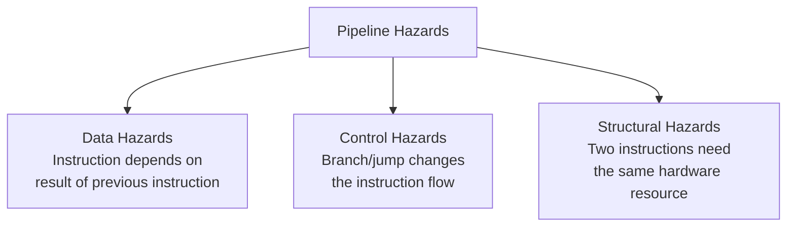

# Pipeline Hazards

## Overview

**Pipeline hazards** are conditions that prevent the next instruction in the pipeline from executing during its designated clock cycle. They cause **stalls** (pipeline bubbles) that reduce the effective throughput below the ideal CPI of 1. There are three types: **data hazards**, **control hazards**, and **structural hazards**.

## Detailed Explanation

### The Three Types



### Overview Comparison

| Hazard Type | Cause | Example | Resolution |
|-------------|-------|---------|------------|
| **Data** | Data dependency between instructions | `ADD R1,R2,R3` then `SUB R4,R1,R5` | Forwarding, stalling, compiler scheduling |
| **Control** | Branch/jump changes PC | `BEQ R1,R2,label` followed by sequential instruction | Branch prediction, delayed branch, speculation |
| **Structural** | Hardware resource conflict | Two instructions need memory access in same cycle | Duplicate resources, pipeline stalling |

### Stall Mechanism

When a hazard is detected, the pipeline control inserts a **bubble** (NOP):

```
Normal execution:
  CC1   CC2   CC3   CC4   CC5   CC6
  I1:   IF    ID    EX    MEM   WB
  I2:         IF    ID    EX    MEM   WB
  I3:               IF    ID    EX    MEM   WB

With 1-cycle stall:
  CC1   CC2   CC3   CC4   CC5   CC6   CC7
  I1:   IF    ID    EX    MEM   WB
  I2:         IF    ID    stall EX    MEM   WB
  I3:               IF    stall ID    EX    MEM   WB
                        ↑
                    Bubble (NOP) inserted
```

### Hazard Detection

The hazard detection unit sits in the ID stage:

```
Inputs:
  - Source registers of current instruction (ID stage)
  - Destination register of instruction in EX stage
  - Destination register of instruction in MEM stage
  - Control signals (MemRead for load-use detection)

Output:
  - Stall signal (freezes IF and ID stages, inserts bubble in EX)
```

### Performance Impact

```
Stall cycles per instruction:
  Data hazards:    0-2 cycles (with forwarding: 0-1)
  Control hazards: 0-2 cycles (with prediction: 0-1 for mispredicts)
  Structural:      0-1 cycles

Effective CPI:
  CPI = 1 + stall_cycles
  
  Example: 20% branches with 10% misprediction rate, 30% loads with 1 cycle load-use
  CPI = 1 + 0.20 × 0.10 × 1 + 0.30 × 1 × 1 = 1.32
```

## Examples

### Example 1: All Three Hazards in One Code Sequence

```asm
# RISC-V code demonstrating all three hazards

lw   x1, 0(x2)      # I1: Load x1 from memory
add  x3, x1, x4      # I2: DATA HAZARD - uses x1 (load-use)
add  x5, x3, x6      # I3: DATA HAZARD - uses x3
beq  x5, x7, label   # I4: CONTROL HAZARD - branch
add  x8, x9, x10     # I5: Next sequential instruction (may not execute)
label:
or   x11, x12, x13   # I6: Branch target
```

```
Pipeline execution:
  CC1   CC2   CC3   CC4   CC5   CC6   CC7   CC8   CC9
  I1:   IF    ID    EX    MEM   WB
  I2:         IF    ID    stall EX    MEM   WB        (data: load-use)
  I3:               IF    stall ID    EX    MEM   WB  (data: depends on I2)
  I4:                     IF    ID    EX    MEM   WB
  I5:                           IF    ID    EX    MEM  WB
  I6:                                 IF    ID    EX   MEM WB

If branch is taken: I5 is flushed (control hazard)
```

### Example 2: Structural Hazard - Single Memory Port

```
If instruction and data share one memory port:

  I1 (LOAD): IF uses memory    MEM uses memory
  I2:        IF uses memory    ...

Conflict at CC3: I1 needs memory (MEM stage) while I2 needs memory (IF stage)

Solution: Split into separate instruction and data caches (Harvard at L1)
```

### Example 3: Resolving Hazards Summary

```
Data hazards:
  ✓ Forwarding/bypassing (hardware) — resolves most RAW hazards
  ✓ Load-use stall (1 cycle) — can't avoid for load followed by use
  ✓ Compiler instruction scheduling — reorganize code to avoid hazards

Control hazards:
  ✓ Branch prediction — guess the branch outcome
  ✓ Branch target buffer (BTB) — cache branch targets
  ✓ Delayed branch — always execute the instruction after branch
  ✓ Speculative execution — execute predicted path, squash if wrong

Structural hazards:
  ✓ Duplicate resources — separate I-cache and D-cache
  ✓ Multi-port register file — multiple read/write ports
  ✓ Pipeline stalling — last resort
```

## Interview Questions

### Q1: What are the three types of pipeline hazards?
**Answer**: (1) **Data hazards** — an instruction depends on the result of a previous instruction that hasn't completed; (2) **Control hazards** — a branch or jump changes the instruction flow, and the pipeline has already fetched the wrong instructions; (3) **Structural hazards** — two instructions need the same hardware resource in the same cycle.

### Q2: What is a pipeline bubble?
**Answer**: A bubble is a NOP (no-operation) inserted into the pipeline when a hazard is detected. It stalls one stage while allowing others to continue, effectively wasting a cycle. Bubbles reduce throughput but are necessary to ensure correct execution.

### Q3: How does forwarding solve data hazards?
**Answer**: Forwarding (bypassing) routes the result from a later pipeline stage (EX or MEM) directly to the input of an earlier stage (EX), bypassing the register file. This allows a dependent instruction to use the result before it's written back, eliminating the need to stall.

### Q4: Can all hazards be resolved in hardware?
**Answer**: No. Some require compiler assistance: instruction scheduling to separate dependent instructions, branch delay slots (in some ISAs), and loop unrolling. Hardware solutions (forwarding, prediction) handle most cases, but the compiler can reduce the remaining penalty.

### Q5: What is the difference between a stall and a flush?
**Answer**: A **stall** inserts bubbles to delay the pipeline while waiting for data or resources. A **flush** discards instructions that were speculatively fetched (e.g., after a branch misprediction). Stalls waste cycles; flushes waste work that was already done.

## Common Mistakes

1. **Confusing stalls with flushes** — Stalls delay the pipeline; flushes discard already-fetched instructions. Both waste cycles but for different reasons.
2. **Thinking forwarding eliminates all data hazards** — Forwarding can't help with load-use hazards (data not available until end of MEM stage). One stall cycle is still needed.
3. **Ignoring compiler's role** — Modern compilers aggressively schedule instructions to minimize hazards. The code you write isn't the order it executes.
4. **Forgetting about WAW and WAR hazards** — In simple in-order pipelines, only RAW (Read After Write) hazards exist. Out-of-order pipelines can also have WAR (Write After Read) and WAW (Write After Write) hazards, requiring register renaming.

## Summary

| Hazard | Cause | Hardware Solution | Compiler Solution |
|--------|-------|-------------------|-------------------|
| **Data (RAW)** | Data dependency | Forwarding, 1-cycle load-use stall | Instruction scheduling |
| **Control** | Branches | Branch prediction, speculation | Delayed branch, loop unrolling |
| **Structural** | Resource conflict | Duplicate resources | Code scheduling |

## Cross-References

- [Data Hazards](./data-hazards.md) — Detailed data hazard analysis
- [Control Hazards](./control-hazards.md) — Branch-related hazards
- [Structural Hazards](./structural-hazards.md) — Resource conflicts
- [Forwarding/Bypassing](./forwarding.md) — Hardware solution for data hazards
- [Branch Prediction](./branch-prediction.md) — Hardware solution for control hazards
- [Classic Pipeline](./classic.md) — The 5-stage pipeline these hazards affect

## Cross References

- [Data Hazards](data-hazards.md)
- [Control Hazards](control-hazards.md)
- [Structural Hazards](structural-hazards.md)
- [Forwarding](forwarding.md)
