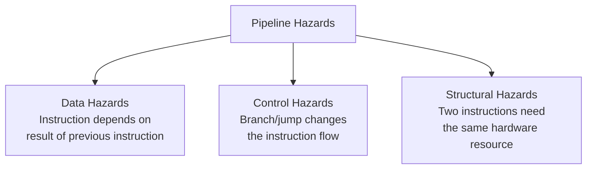
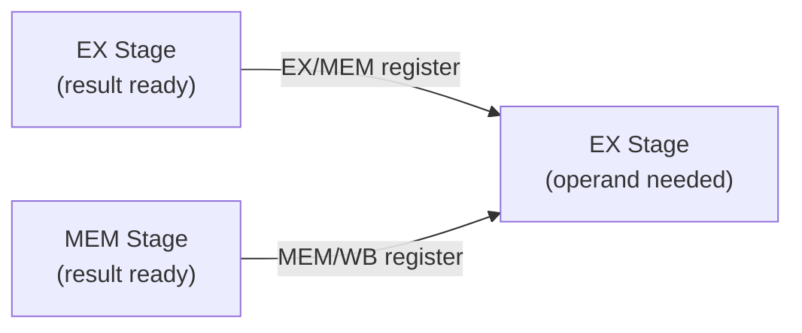
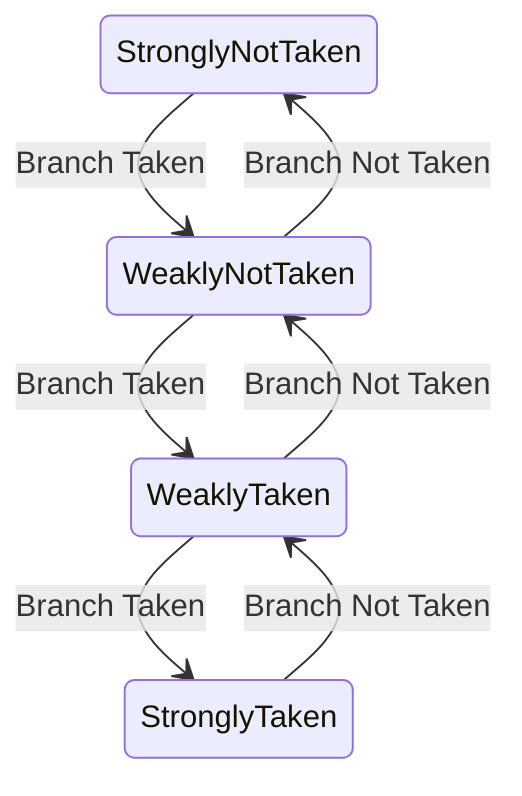
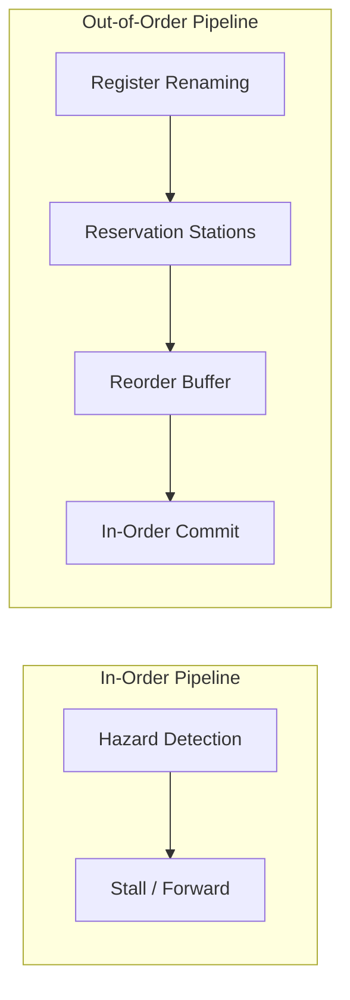

# Pipeline Hazards

## Overview

**Pipeline hazards** are conditions that prevent the next instruction in the pipeline from executing during its designated clock cycle. They cause **stalls** (pipeline bubbles) that reduce the effective throughput below the ideal CPI of 1. There are three types: **data hazards**, **control hazards**, and **structural hazards**.

## The Three Types at a Glance



| Hazard Type | Cause | Example | Resolution |
|-------------|-------|---------|------------|
| **Data** | Data dependency between instructions | `ADD R1,R2,R3` then `SUB R4,R1,R5` | Forwarding, stalling, compiler scheduling |
| **Control** | Branch/jump changes PC | `BEQ R1,R2,label` followed by sequential instruction | Branch prediction, delayed branch, speculation |
| **Structural** | Hardware resource conflict | Two instructions need memory access in same cycle | Duplicate resources, pipeline stalling |

---

## Data Hazards

Data hazards occur when an instruction depends on the result of a previous instruction that has not yet completed. There are three subtypes based on the ordering of read (R) and write (W) operations to the same register.

### Read After Write (RAW) — True Dependency

The most common hazard. An instruction tries to read a register that a prior instruction has not yet written back.

```asm
ADD x1, x2, x3    # I1: writes x1
SUB x4, x1, x5    # I2: reads x1 ← HAZARD if I1 hasn't written back yet
```

```
Without forwarding:
  CC1   CC2   CC3   CC4   CC5   CC6   CC7
  I1:   IF    ID    EX    MEM   WB
  I2:         IF    ID    stall stall EX    MEM   WB
                                     ↑
                              x1 available after WB of I1

With forwarding:
  CC1   CC2   CC3   CC4   CC5
  I1:   IF    ID    EX    MEM   WB
  I2:         IF    ID    EX    MEM   WB
                           ↑
                    Forward x1 from EX/MEM register
```

### Write After Read (WAR) — Anti-Dependency

An instruction tries to write a register that a prior instruction has not yet read. This is **not** a hazard in simple in-order pipelines because reads happen in ID and writes happen in WB, so reads always complete before writes. However, it **is** a hazard in out-of-order pipelines.

```asm
ADD x1, x2, x3    # I1: reads x1
SUB x1, x4, x5    # I2: writes x1 ← WAR if I2 executes before I1 reads
```

```
In-order pipeline (5-stage): NOT a hazard
  I1 reads x1 in ID (CC2)
  I2 writes x1 in WB (CC7, assuming I2 is after I1)
  → Read happens before write. Safe.

Out-of-order pipeline: HAZARD
  If I2 is reordered to complete before I1 reads x1
  → I1 gets wrong value. Solution: Register renaming.
```

### Write After Write (WAW) — Output Dependency

Two instructions write to the same register. If they complete out of order, the wrong value is left in the register.

```asm
ADD x1, x2, x3    # I1: writes x1
MUL x1, x4, x5    # I2: writes x1 ← WAW if I2 writes before I1
```

```
In-order pipeline (5-stage): NOT a hazard
  Both write in WB. I1 writes in CC5, I2 writes in CC6 (later).
  → Correct order maintained by pipeline order.

Out-of-order pipeline: HAZARD
  If I2 completes and writes back before I1
  → x1 has wrong value (I1's result overwrites I2's)
  → Solution: Register renaming, or ensure in-order commit.
```

### Summary of Data Hazard Types

| Type | Ordering | In-Order Pipeline? | Out-of-Order Pipeline? | Solution |
|------|----------|-------------------|----------------------|----------|
| **RAW** | Read after Write | Yes (most common) | Yes | Forwarding, stalls |
| **WAR** | Write after Read | No | Yes | Register renaming |
| **WAW** | Write after Write | No | Yes | Register renaming, in-order commit |

### Forwarding (Bypassing) — The Primary Solution

Forwarding routes results from later pipeline stages directly to earlier stages, bypassing the register file.



```
Forwarding paths:
  1. EX/MEM → EX input: Forward ALU result from previous instruction
  2. MEM/WB → EX input: Forward from two instructions ago
  3. MEM/WB → MEM input: Forward load data for store instructions
```

### Load-Use Hazard — Forwarding Can't Fully Solve

When a load instruction is followed immediately by an instruction that uses the loaded value, even forwarding requires a 1-cycle stall because the data isn't available until the end of the MEM stage.

```asm
LD  x1, 0(x2)     # I1: data available at end of MEM (CC4)
ADD x3, x1, x4    # I2: needs x1 at start of EX (CC4) — 1 cycle too early!
```

```
  CC1   CC2   CC3   CC4   CC5   CC6   CC7
  I1:   IF    ID    EX    MEM   WB
  I2:         IF    ID    stall EX    MEM   WB
                              ↑
                    1-cycle load-use stall (unavoidable)
                    Data forwarded from MEM/WB to EX input
```

**Compiler mitigation**: Instruction scheduling — move an independent instruction between the load and its use:

```asm
# Before scheduling (1 stall):
LD   x1, 0(x2)
ADD  x3, x1, x4      # stall! depends on x1
OR   x7, x8, x9      # independent

# After scheduling (0 stalls):
LD   x1, 0(x2)
OR   x7, x8, x9      # fill the delay slot with independent work
ADD  x3, x1, x4      # x1 now available via forwarding
```

### Data Hazard Detection

The hazard detection unit sits in the ID stage and checks:

```
Inputs:
  - Source registers of current instruction (rs1, rs2 in ID stage)
  - Destination register of instruction in EX stage (EX/MEM.rd)
  - Destination register of instruction in MEM stage (MEM/WB.rd)
  - MemRead signal of EX stage instruction (for load-use detection)

Detection logic (simplified):
  if (EX/MEM.RegWrite AND EX/MEM.rd ≠ 0 AND
      (EX/MEM.rd = ID/EX.rs1 OR EX/MEM.rd = ID/EX.rs2)):
      → Stall (load-use if EX/MEM.MemRead)

  if (MEM/WB.RegWrite AND MEM/WB.rd ≠ 0 AND
      (MEM/WB.rd = ID/EX.rs1 OR MEM/WB.rd = ID/EX.rs2)):
      → Forward from MEM/WB
```

---

## Control Hazards

Control hazards (branch hazards) occur when the pipeline makes wrong assumptions about the flow of instructions — typically because a branch or jump changes the PC.

### The Problem

```
BEQ x1, x2, label   # Branch instruction
ADD x3, x4, x5      # Fetched speculatively — may be wrong!
ADD x6, x7, x8      # Also speculative
label:
SUB x9, x10, x11    # Branch target
```

```
  CC1   CC2   CC3   CC4   CC5
  BEQ:  IF    ID    EX    MEM   WB     ← Branch resolved in EX (CC3)
  ADD1:       IF    ID    EX    ...    ← Already fetched!
  ADD2:             IF    ID    ...    ← Also fetched!

If branch is taken: ADD1 and ADD2 must be flushed (2 wasted cycles)
```

### Branch Penalty

The branch penalty depends on which stage the branch decision is made:

| Branch Resolution Stage | Penalty (cycles) | Notes |
|------------------------|-------------------|-------|
| ID (early comparison) | 1 cycle | Requires dedicated comparator in ID |
| EX (ALU comparison) | 2 cycles | Standard 5-stage pipeline |
| MEM | 3 cycles | Rare, very expensive |

### Solution 1: Branch Prediction (Static)

```asm
# Predict not-taken (simplest):
# Always fetch the next sequential instruction
# If branch is taken: flush and fetch target
# Accuracy: ~50-60% (most branches are taken in practice)

# Predict always taken:
# Always fetch the branch target
# Works well for backward branches (loops)
# Accuracy: ~60-70%

# Backward taken, forward not-taken (BTFNT):
# Loop branches (backward) → predict taken
# If-else branches (forward) → predict not-taken
# Accuracy: ~65-75%
```

### Solution 2: Branch Prediction (Dynamic)

#### 1-Bit Predictor

```
Simple state machine:
  Predict Taken ──(mispredict)──→ Predict Not-Taken
  Predict Not-Taken ──(mispredict)──→ Predict Taken

Problem: A loop that runs 10 times will mispredict twice
(iteration 1: predict NT, actually T → mispredict
 iteration 10: predict T, actually NT → mispredict)
```

#### 2-Bit Saturating Counter (Most Common)



```
States:
  00: Strongly Not Taken → predict NT
  01: Weakly Not Taken   → predict NT
  10: Weakly Taken       → predict T
  11: Strongly Taken     → predict T

Advantage: Requires 2 consecutive mispredictions to change prediction.
Loop with 10 iterations: mispredicts only at entry and exit (2/10 = 80% accuracy).
```

#### Branch Target Buffer (BTB)

```
┌──────────────────────────────────────────┐
│              Branch Target Buffer         │
├──────────┬──────────────┬────────────────┤
│ PC Tag   │ Target Addr  │ Prediction Bits│
├──────────┼──────────────┼────────────────┤
│ 0x1000   │ 0x2000       │ 11 (taken)     │
│ 0x1020   │ 0x1000       │ 10 (taken)     │
│ 0x1040   │ 0x3000       │ 01 (not taken) │
└──────────┴──────────────┴────────────────┘

On IF stage:
  1. Look up PC in BTB
  2. If hit and predicted taken → redirect fetch to target
  3. If miss or predicted not-taken → fetch sequentially
```

### Solution 3: Delayed Branch

```asm
# The instruction AFTER a branch always executes (branch delay slot):
BEQ x1, x2, label
ADD x3, x4, x5       # ← Delay slot: always executes
label:
SUB x6, x7, x8

# Compiler fills delay slot with useful instruction:
# 1. From before the branch (if independent)
# 2. From the branch target (if safe for fall-through)
# 3. NOP (if nothing useful available)
```

**Note**: RISC-V does **not** have branch delay slots (simplifies hardware). MIPS and SPARC do.

### Solution 4: Speculative Execution

```
Modern processors:
  1. Predict branch direction early
  2. Speculatively execute along predicted path
  3. Keep results in reorder buffer (ROB)
  4. If prediction correct → commit results
  5. If misprediction → flush pipeline, discard speculative results

  Penalty: 10-20 cycles in modern CPUs (deep pipelines)
  Misprediction rate target: < 5% for well-predicted workloads
```

---

## Structural Hazards

Structural hazards occur when two instructions need the same hardware resource in the same clock cycle.

### Common Structural Hazards

#### 1. Single Memory Port

```
Problem: Instruction fetch and data access share one memory port.

  CC1   CC2   CC3   CC4   CC5
  I1:   IF    ID    EX    MEM   WB
  I2:         IF    ID    EX    MEM   WB
  I3:               IF    ...

At CC4: I1 needs memory (MEM stage for load/store)
At CC4: I3 needs memory (IF stage for instruction fetch)
→ CONFLICT!

Solution: Split into separate I-cache and D-cache (Harvard architecture at L1)
```

#### 2. Register File Port Conflict

```
Problem: Multiple reads/writes to register file in same cycle.

  ADD x1, x2, x3    # ID: read x2, x3; WB: write x1
  SUB x4, x1, x5    # ID: read x1, x5

If ADD is in WB (writing x1) and SUB is in ID (reading x1) in same cycle:
→ Need 2 read ports + 1 write port minimum

Modern solutions:
  - Multi-ported register file (expensive in area/power)
  - Register renaming (eliminates false dependencies)
  - Register file banking (split into banks)
```

#### 3. Functional Unit Conflict

```
In a simple pipeline, all instructions use the ALU.
But what about floating-point operations?

  ADD.D f1, f2, f3   # FP add — takes multiple cycles
  MUL.D f4, f5, f6   # FP multiply — needs multiplier

If only one FP unit exists:
  → MUL.D must wait for ADD.D to finish

Solution: Multiple functional units (pipelined or non-pipelined)
```

### Structural Hazard Resolution Summary

| Hazard | Resource | Solution |
|--------|----------|----------|
| Memory port | Single memory | Split I-cache/D-cache |
| Register file | Read/write ports | Multi-ported register file |
| Functional unit | ALU/FP unit | Multiple units, pipelining |
| Write-back bus | Single bus | Multiple write-back paths |

---

## Stall Mechanism

When a hazard is detected, the pipeline control inserts a **bubble** (NOP):

```
Normal execution:
  CC1   CC2   CC3   CC4   CC5   CC6
  I1:   IF    ID    EX    MEM   WB
  I2:         IF    ID    EX    MEM   WB
  I3:               IF    ID    EX    MEM   WB

With 1-cycle stall:
  CC1   CC2   CC3   CC4   CC5   CC6   CC7
  I1:   IF    ID    EX    MEM   WB
  I2:         IF    ID    stall EX    MEM   WB
  I3:               IF    stall ID    EX    MEM   WB
                        ↑
                    Bubble (NOP) inserted
```

### Pipeline Control Signals

```
Stall conditions (freeze IF and ID stages):
  - Load-use hazard detected
  - Structural hazard (e.g., cache miss)

Flush conditions (insert bubbles into EX stage):
  - Branch misprediction detected
  - Exception occurred

  Stall:  PCWrite = 0, IF/ID.Write = 0, insert NOP in ID/EX
  Flush:  Set IF/ID.Register = NOP, or ID/EX.Register = NOP
```

---

## Performance Impact

```
CPI = 1 + stall_cycles_per_instruction

Stall cycles per instruction:
  Data hazards:    0-2 cycles (with forwarding: 0-1)
  Control hazards: 0-2 cycles (with prediction: 0-1 for mispredicts)
  Structural:      0-1 cycles

Example calculation:
  - 20% of instructions are branches
  - Branch predictor accuracy: 90% (10% misprediction)
  - Branch penalty on mispredict: 2 cycles
  - 30% of instructions are loads
  - 20% of loads have load-use hazard (1 cycle stall)

  CPI = 1 + (0.20 × 0.10 × 2) + (0.30 × 0.20 × 1)
      = 1 + 0.04 + 0.06
      = 1.10
```

---

## Complete Example: All Three Hazards

```asm
# RISC-V code demonstrating all three hazard types

lw   x1, 0(x2)      # I1: Load x1 from memory
add  x3, x1, x4      # I2: DATA HAZARD (load-use) — uses x1
add  x5, x3, x6      # I3: DATA HAZARD — uses x3
beq  x5, x7, label   # I4: CONTROL HAZARD — branch
add  x8, x9, x10     # I5: Speculative (may be flushed)
label:
or   x11, x12, x13   # I6: Branch target
```

```
Pipeline execution:
  CC1   CC2   CC3   CC4   CC5   CC6   CC7   CC8   CC9
  I1:   IF    ID    EX    MEM   WB
  I2:         IF    ID    stall EX    MEM   WB         (data: load-use)
  I3:               IF    stall ID    EX    MEM   WB   (data: depends on I2)
  I4:                     IF    ID    EX    MEM   WB
  I5:                           IF    ID    EX    MEM   WB
  I6:                                 IF    ID    EX    MEM WB

If branch taken: I5 flushed (control hazard, 1 bubble)
Total: 1 stall (load-use) + 1 flush (misprediction) = 2 extra cycles
```

---

## Modern Processor Techniques



| Technique | What It Solves | Complexity |
|-----------|---------------|------------|
| Forwarding | RAW hazards | Low |
| Load-use stall | Load-use data hazard | Low |
| Register renaming | WAR, WAW hazards | Medium |
| Branch prediction | Control hazards | Medium |
| Speculative execution | Control hazards | High |
| Out-of-order execution | All hazard types | Very high |
| Reorder buffer | Correct state on mispredict/exception | High |

---

## Interview Questions

### Q1: What are the three types of pipeline hazards?
**Answer**: (1) **Data hazards** — an instruction depends on the result of a previous instruction that hasn't completed; (2) **Control hazards** — a branch or jump changes the instruction flow, and the pipeline has already fetched the wrong instructions; (3) **Structural hazards** — two instructions need the same hardware resource in the same cycle.

### Q2: What is the difference between RAW, WAR, and WAW?
**Answer**: **RAW** (Read After Write) — true dependency, the most common hazard in in-order pipelines. **WAR** (Write After Read) — anti-dependency, only a hazard in out-of-order pipelines. **WAW** (Write After Write) — output dependency, also only in out-of-order pipelines. WAR and WAW are resolved by register renaming.

### Q3: Why can't forwarding solve all data hazards?
**Answer**: Forwarding can't solve the **load-use hazard** because the data from a load isn't available until the end of the MEM stage, but the dependent instruction needs it at the start of the EX stage. A 1-cycle stall is unavoidable. The compiler can mitigate this by scheduling independent instructions between the load and its use.

### Q4: How does a 2-bit branch predictor work?
**Answer**: It uses a 2-bit saturating counter with four states: Strongly Not Taken, Weakly Not Taken, Weakly Taken, Strongly Taken. On a taken branch, the counter increments; on not-taken, it decrements. The prediction is the counter's direction. It requires two consecutive mispredictions to flip the prediction, making it robust against occasional anomalies in loop behavior.

### Q5: What is the difference between a stall and a flush?
**Answer**: A **stall** inserts bubbles to delay the pipeline while waiting for data or resources. A **flush** discards instructions that were speculatively fetched (e.g., after a branch misprediction). Stalls waste cycles; flushes waste work that was already done.

### Q6: Can all hazards be resolved in hardware?
**Answer**: No. Some require compiler assistance: instruction scheduling to separate dependent instructions, branch delay slots (in some ISAs), and loop unrolling. Hardware solutions (forwarding, prediction) handle most cases, but the compiler can reduce the remaining penalty.

### Q7: What is register renaming and what does it solve?
**Answer**: Register renaming maps architectural registers (e.g., x1, x2) to a larger set of physical registers. This eliminates WAR and WAW hazards because two instructions that use the same architectural register actually use different physical registers. Modern CPUs (like x86-64) rename the 16 architectural registers to 100+ physical registers.

---

## Common Mistakes

1. **Confusing stalls with flushes** — Stalls delay the pipeline; flushes discard already-fetched instructions. Both waste cycles but for different reasons.
2. **Thinking forwarding eliminates all data hazards** — Forwarding can't help with load-use hazards (data not available until end of MEM stage). One stall cycle is still needed.
3. **Ignoring compiler's role** — Modern compilers aggressively schedule instructions to minimize hazards. The code you write isn't the order it executes.
4. **Forgetting about WAW and WAR hazards** — In simple in-order pipelines, only RAW hazards exist. Out-of-order pipelines can also have WAR and WAW hazards, requiring register renaming.
5. **Confusing branch prediction accuracy with CPI impact** — A 90% accurate predictor on 20% branch frequency means only 2% of instructions are mispredicted. The CPI impact depends on the misprediction penalty.

---

## Summary

| Hazard | Cause | Hardware Solution | Compiler Solution |
|--------|-------|-------------------|-------------------|
| **Data (RAW)** | Data dependency | Forwarding, 1-cycle load-use stall | Instruction scheduling |
| **Data (WAR)** | Anti-dependency | Register renaming | — |
| **Data (WAW)** | Output dependency | Register renaming, in-order commit | — |
| **Control** | Branches | Branch prediction, speculation | Delayed branch, loop unrolling |
| **Structural** | Resource conflict | Duplicate resources | Code scheduling |

## Cross-References

- [Data Hazards](./data-hazards.md) — Detailed data hazard analysis
- [Control Hazards](./control-hazards.md) — Branch-related hazards
- [Structural Hazards](./structural-hazards.md) — Resource conflicts
- [Forwarding/Bypassing](./forwarding.md) — Hardware solution for data hazards
- [Branch Prediction](./branch-prediction.md) — Hardware solution for control hazards
- [Classic Pipeline](./classic.md) — The 5-stage pipeline these hazards affect
