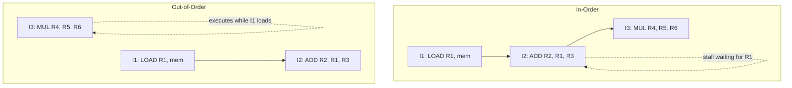
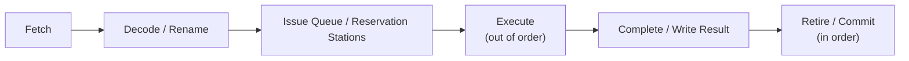
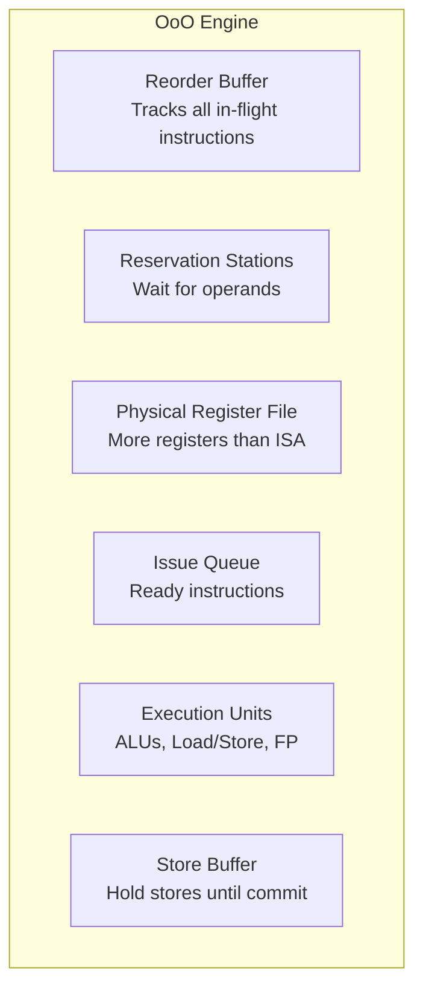
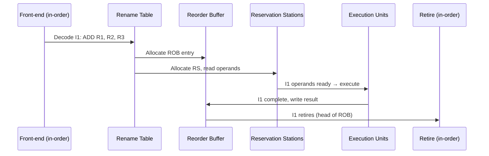

# Out-of-Order Execution

## Overview

**Out-of-order (OoO) execution** allows a CPU to execute instructions as soon as their operands are ready, rather than waiting for all previous instructions to complete in program order. This is the key technique that enables modern CPUs to extract instruction-level parallelism from sequential code, hiding memory latency and functional unit delays.

## Detailed Explanation

### In-Order vs Out-of-Order



```
In-order execution:
  LOAD R1, [mem]     ; Cache miss → 100 cycle wait
  ADD  R2, R1, R3    ; Stalls waiting for R1 (100 cycles!)
  MUL  R4, R5, R6    ; Also stalls (in-order, can't skip ahead)
  Total: 100+ cycles

Out-of-order execution:
  LOAD R1, [mem]     ; Cache miss → 100 cycle wait
  ADD  R2, R1, R3    ; Waits for R1
  MUL  R4, R5, R6    ; Executes immediately (independent!) 
  Total: ~100 cycles (MUL hidden in the load latency)
```

### The OoO Pipeline Structure



**Three phases:**

| Phase | Order | Description |
|-------|-------|-------------|
| **Front-end** | In-order | Fetch and decode instructions in program order |
| **Execution** | Out-of-order | Execute as operands become ready |
| **Back-end** | In-order | Retire (commit) results in program order |

### Key Structures



#### Reorder Buffer (ROB)

The ROB is the central data structure that maintains program order:

```
ROB Entry:
  ┌────────────────────────────────────┐
  │ Instruction │ Dest Reg │ Result    │
  │ Ready bit   │ Complete │ Exception │
  │ Speculative │ Store?   │ ...       │
  └────────────────────────────────────┘

Instructions enter at the tail (fetch/decode)
Results are written as instructions complete (out of order)
Instructions retire from the head (in order)
```

```
ROB state example:
  Head → [I1: ADD R1,R2,R3  | Complete ✓ | Ready ✓]  ← can retire
         [I2: MUL R4,R5,R6  | Complete ✓ | Ready ✓]  ← can retire
         [I3: LOAD R7,[mem] | Complete ✗ | Waiting]   ← can't retire yet
         [I4: SUB R8,R7,R9  | Complete ✗ | Waiting]   ← depends on I3
         [I5: ADD R10,R11,R12| Complete ✓ | Ready ✓]  ← can't retire (head not done)
  Tail ← 
```

#### Register Renaming

Maps architectural registers (ISA) to physical registers (hardware):

```
Architectural state: R1, R2, R3, R4 (4 registers)
Physical registers: P0-P15 (16 registers)

Rename table:
  R1 → P5 (last writer)
  R2 → P3
  R3 → P7
  R4 → P12

When I1 writes R1:
  Allocate new physical register P16
  Update rename table: R1 → P16
  I1's result goes to P16
  Old mapping (P5) is freed when I1 retires

This eliminates WAR and WAW hazards!
```

#### Reservation Stations (RS)

Each instruction waits in a reservation station until its operands are ready:

```
Reservation Station Entry:
  ┌────────────────────────────────────────────┐
  │ Op │ Vj │ Qj │ Vk │ Qk │ Dest │ A         │
  │    │val │tag │val │tag │ ROB# │ Address   │
  └────────────────────────────────────────────┘

  Vj/Vk: Operand values (if available)
  Qj/Qk: Tags of instructions producing operands (if not ready)
  
Example:
  ADD R1, R2, R3
  Vj = P3.value (R2 ready), Qk = P7.tag (R3 not ready yet)
  When P7 is written: capture value, mark ready, issue to ALU
```

### Execution Flow



### Memory Disambiguation

Out-of-order execution creates challenges for memory ordering:

```
STORE [0x1000], R1    ; I1: Store address unknown until EX
LOAD  R2, [0x1000]    ; I2: Should see I1's value

Problem: I2 might execute before I1's address is known!

Solutions:
  1. Store buffer: Stores buffered until retirement
  2. Memory disambiguation: Predict whether load aliases with pending store
  3. Load-store queue: Track all memory operations
  4. If alias detected: Squash and replay load
```

### Precise Exceptions

In-order retirement ensures **precise exceptions**:

```
Even though instructions execute out of order, they retire in order.
If I3 causes an exception:
  - I1 and I2 have already retired (their results are committed)
  - I3 and all later instructions are squashed
  - The architectural state is exactly as if only I1 and I2 executed
  - Exception handler sees a clean state
```

## Examples

### Example 1: Hiding Cache Miss Latency

```asm
LOAD R1, [addr1]     # Cache miss: 100 cycles
ADD  R2, R3, R4      # Independent: executes during load wait
MUL  R5, R6, R7      # Independent: executes during load wait
SUB  R8, R1, R9      # Depends on R1: waits for load
```

```
In-order: 100 + 1 + 1 + 1 = 103 cycles
Out-of-order: 100 + 1 = 101 cycles
  ADD and MUL hidden in load latency
  SUB executes as soon as load completes
```

### Example 2: Register Renaming Eliminates False Dependencies

```asm
# Original (WAR and WAW hazards):
ADD R1, R2, R3      # Writes R1
SUB R4, R1, R5      # Reads R1 (RAW: true dependency)
MUL R1, R6, R7      # Writes R1 (WAW: output dependency)
DIV R8, R1, R9      # Reads R1 (RAW: depends on MUL, not ADD)
```

```
Without renaming:
  ADD and MUL can't execute in parallel (WAW on R1)
  SUB must wait for ADD (RAW on R1)

With renaming:
  ADD: P1 = P2 + P3         (R1→P1)
  SUB: P4 = P1 - P5         (R1→P1, RAW preserved)
  MUL: P6 = P7 * P8         (R1→P6, new mapping!)
  DIV: P9 = P6 / P10        (R1→P6, depends on MUL)

  ADD and MUL can execute in parallel (different physical registers)
  WAW eliminated!
```

### Example 3: ROB and In-Order Retirement

```
Time 1: I1 (ADD) completes out of order
Time 2: I3 (MUL) completes out of order
Time 3: I2 (LOAD) completes out of order

Retirement order (always in program order):
  Retire I1 (head of ROB)
  Retire I2 (next in ROB)
  Retire I3 (next in ROB)

Even though I3 completed before I2, it retires after I2.
This ensures precise exceptions and correct memory ordering.
```

### Example 4: Modern OoO CPU Specifications

```
Intel Skylake:
  - Reorder Buffer: 224 entries
  - Reservation Stations: 97 entries
  - Physical registers: 180 integer, 168 FP
  - Load buffer: 72 entries
  - Store buffer: 56 entries

AMD Zen 4:
  - Reorder Buffer: 320 entries
  - Physical registers: 224 integer, 192 FP
  - Load buffer: 88 entries
  - Store buffer: 64 entries

Apple M2:
  - Reorder Buffer: ~600+ entries
  - Physical registers: 380+ integer
  - Load buffer: 130 entries
```

## Interview Questions

### Q1: What is out-of-order execution?
**Answer**: Out-of-order execution allows a CPU to execute instructions as soon as their operands are ready, rather than waiting for all previous instructions to complete. Instructions are fetched and decoded in order, executed out of order, and retired (committed) in order. This hides latency from cache misses and multi-cycle operations.

### Q2: What is the role of the Reorder Buffer?
**Answer**: The ROB tracks all in-flight instructions in program order. It ensures in-order retirement (commit), enables precise exceptions, and manages register freeing. Instructions enter at the tail, complete out of order (writing results to the ROB), and retire from the head when all prior instructions are complete.

### Q3: How does register renaming work?
**Answer**: The CPU maintains a larger set of physical registers than the ISA specifies. A rename table maps each architectural register to its most recent physical register. When an instruction writes a register, a new physical register is allocated, eliminating WAR and WAW hazards. Old physical registers are freed when the instruction that last wrote them retires.

### Q4: What is a reservation station?
**Answer**: A reservation station holds an instruction waiting for its operands. It stores the operation, available operand values, and tags identifying instructions that will produce missing operands. When an operand is produced (broadcast on the common data bus), the reservation station captures the value. When all operands are ready, the instruction issues to an execution unit.

### Q5: How do out-of-order CPUs handle memory ordering?
**Answer**: Stores are buffered in a store buffer and committed to cache only at retirement (in program order). Loads check the store buffer for forwarding and use memory disambiguation to predict whether they alias with pending stores. If a load is incorrectly reordered past a store, it's squashed and replayed.

## Common Mistakes

1. **Confusing out-of-order with speculative** — OoO reorders instructions based on data readiness. Speculation executes instructions before knowing if they're on the correct path. They're complementary: most OoO CPUs also speculate.
2. **Thinking OoO changes program semantics** — In-order retirement ensures the program behaves as if executed in order. OoO is a microarchitectural optimization invisible to the programmer.
3. **Ignoring the power cost** — OoO hardware (ROB, rename, reservation stations) consumes significant power and area. This is why embedded and low-power CPUs are often in-order.
4. **Forgetting about precise exceptions** — The ROB's in-order retirement is essential for precise exceptions. Without it, exception handling would be extremely complex.
5. **Assuming OoO helps all code** — Code with long dependency chains (e.g., pointer chasing) has little ILP for OoO to exploit. OoO helps most when there are independent instructions to execute during stalls.

## Summary

| Aspect | Detail |
|--------|--------|
| **What** | Execute instructions when operands ready, not in program order |
| **Key Structures** | ROB, Reservation Stations, Physical Register File, Store Buffer |
| **Three Phases** | Front-end (in-order) → Execute (OoO) → Retire (in-order) |
| **Benefits** | Hides latency, extracts ILP from sequential code |
| **Guarantees** | Precise exceptions, correct memory ordering |
| **Cost** | Significant power, area, and complexity |

## Cross-References

- [Superscalar](./superscalar.md) — Multiple issue + OoO = modern high-performance CPU
- [Data Hazards](./data-hazards.md) — OoO resolves WAR/WAW via register renaming
- [Forwarding/Bypassing](./forwarding.md) — OoO extends forwarding with physical registers
- [Speculative Execution](./speculative.md) — OoO CPUs typically also speculate
- [Branch Prediction](./branch-prediction.md) — OoO needs prediction to keep the pipeline full
- [Registers](../cpu/registers.md) — Physical vs architectural register files
