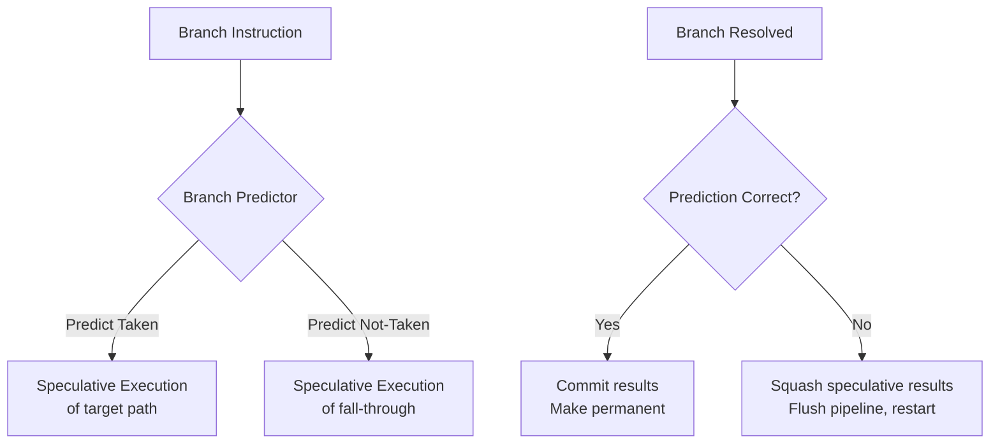
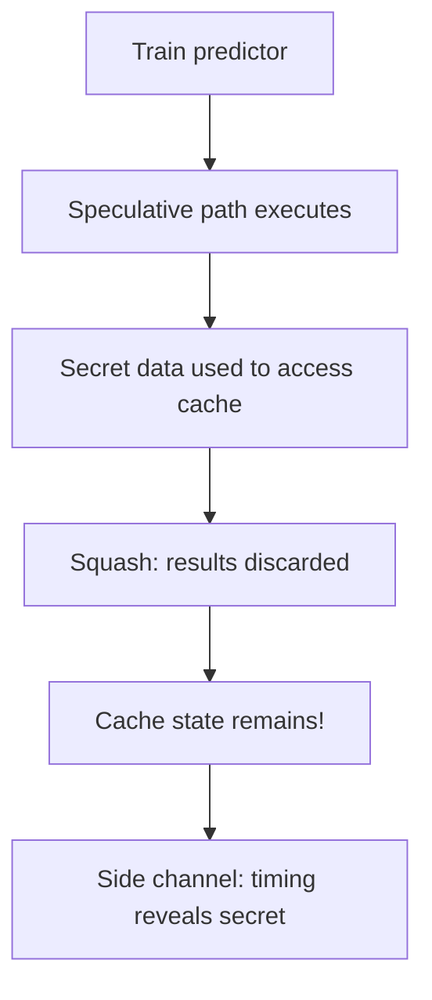

# Speculative Execution

## Overview

**Speculative execution** is a technique where the CPU executes instructions along a predicted path before knowing whether that path is correct. If the prediction is right, the results are committed (made permanent). If wrong, the speculative results are discarded and execution restarts from the correct path. This is closely tied to branch prediction and is the source of the famous Spectre and Meltdown security vulnerabilities.

## Detailed Explanation

### How Speculation Works



### Speculative vs Non-Speculative Execution

```
Non-speculative (in-order, stall on branch):
  CC1   CC2   CC3   CC4   CC5   CC6   CC7   CC8
  BEQ:  IF    ID    EX    MEM   WB
  ---:        stall stall
  target:                 IF    ID    EX    MEM   WB
  
  2 cycles wasted (stall)

Speculative (execute predicted path):
  CC1   CC2   CC3   CC4   CC5   CC6   CC7   CC8
  BEQ:  IF    ID    EX    MEM   WB
  I1:         IF    ID    EX    MEM   WB    ← speculative
  I2:               IF    ID    EX    MEM   WB ← speculative
  target:                 IF    ID    EX    MEM  WB ← also fetched

  If prediction correct: 0 wasted cycles
  If prediction wrong: squash I1, I2; restart from target
```

### What Happens on Misprediction

When a branch is resolved and the prediction was wrong:

1. **Flush** all instructions after the mispredicted branch in the pipeline
2. **Discard** any results from speculative instructions (they never happened)
3. **Redirect** the fetch unit to the correct address
4. **Restore** the register rename map to the state at the mispredicted branch

```
Squash mechanism:
  - Each instruction has a "speculative" bit
  - On misprediction: all speculative instructions are marked invalid
  - Results from invalid instructions are not written to the register file
  - Memory stores are held in a store buffer until the branch is resolved
  - The pipeline is flushed and restarted
```

### Register Renaming and Speculation

Speculative execution requires **checkpointing** the register rename state:

```
At branch:
  Save current register rename map (checkpoint)

Speculative execution:
  Uses the rename map, creating new mappings

On misprediction:
  Restore the saved checkpoint
  All speculative mappings are discarded

On correct prediction:
  Discard the checkpoint (no longer needed)
```

### Memory Disambiguation

Speculative loads and stores create a problem: what if a speculative store writes to the same address as a later non-speculative load?

```
Speculative:
  IF branch predicted taken:
    STORE [0x1000], R1    ← speculative store
    ...
  Later:
    LOAD R2, [0x1000]     ← should this see the speculative store?

Solution:
  - Stores are buffered (not committed to memory) until branch resolves
  - If misprediction: buffered stores are discarded
  - If correct: stores are committed in order
```

### Speculative Execution and Security

Speculative execution can leave **microarchitectural traces** even when results are squashed:

```
Spectre Attack (simplified):
  1. Train branch predictor to predict a branch as taken
  2. Provide input that makes the branch go to a "speculative" path
  3. On the speculative path: access secret data and use it to index into an array
  4. The array access loads a cache line based on the secret data
  5. Branch is resolved as mispredicted → squash
  6. BUT: the cache line is now warm (loaded into cache)
  7. Measure access time to array entries → determine which was cached → reveal secret

The squash discards the register result but NOT the cache state.
This is a side-channel attack exploiting speculative execution.
```



### Mitigations

| Mitigation | How It Works |
|------------|-------------|
| **Retpoline** | Replace indirect branches with return-based sequences |
| **IBRS/IBPB** | Indirect Branch Restricted Speculation / Indirect Branch Prediction Barrier |
| **STIBP** | Single Thread Indirect Branch Predictors (prevent cross-thread training) |
| **SSBD** | Speculative Store Bypass Disable |
| **Microcode updates** | CPU vendor patches to disable vulnerable speculation paths |
| **Compiler barriers** | `lfence` instructions to prevent speculative execution past certain points |

## Examples

### Example 1: Basic Speculation

```asm
BEQ  R1, R2, target    # Branch predicted taken
ADD  R3, R4, R5        # Speculative: on predicted path
SUB  R6, R7, R8        # Speculative: on predicted path
target:
OR   R9, R10, R11      # Branch target
```

```
If prediction correct:
  ADD and SUB execute and commit → 0 wasted cycles

If prediction wrong:
  ADD and SUB results are squashed
  Pipeline restarts from OR instruction
  2 cycles wasted (for this example with 2 speculative instructions)
```

### Example 2: Speculation with Exception

```asm
# Speculative code that would cause an exception
BEQ  R1, R2, target     # Predicted not-taken
LOAD R3, [0x0000]       # Speculative: would cause page fault if committed
ADD  R4, R3, R5         # Speculative: uses loaded value
...
target:
# Branch is actually taken → LOAD and ADD are squashed
# Exception from LOAD is suppressed! (it was speculative)
```

Modern CPUs suppress exceptions from speculative instructions until they're committed.

### Example 3: Store Buffer Speculation

```
STORE [addr1], R1       # Speculative store (buffered, not committed)
LOAD  R2, [addr2]       # Normal load

If addr1 == addr2:
  The load should see the stored value
  → Store-to-load forwarding from store buffer

If branch mispredicts:
  Store is discarded from buffer
  Load's result is also squashed
```

### Example 4: Performance Impact

```
Scenario: 14-stage pipeline, 20% branches, 5% misprediction
Without speculation (stall on branch):
  CPI = 1 + 0.20 × 8 = 2.6

With speculation (95% prediction accuracy):
  CPI = 1 + 0.20 × 0.05 × 8 = 1.08

Speculation turns a 2.6× slowdown into near-ideal performance.
The cost of squashing (rare mispredictions) is far less than
the cost of stalling (every branch).
```

## Interview Questions

### Q1: What is speculative execution?
**Answer**: Speculative execution is the technique of executing instructions along a predicted branch path before the branch is actually resolved. If the prediction is correct, the results are committed. If wrong, the speculative results are discarded and execution restarts from the correct path. This hides the branch penalty and improves throughput.

### Q2: What happens to speculative results on misprediction?
**Answer**: All instructions fetched after the mispredicted branch are flushed from the pipeline. Their register results are discarded (not written to the architectural register file), and any memory stores are removed from the store buffer. The register rename map is restored to the state at the mispredicted branch.

### Q3: What is the Spectre vulnerability?
**Answer**: Spectre exploits speculative execution to leak information through microarchitectural side channels (primarily cache timing). An attacker tricks the CPU into speculatively executing code that accesses secret data, which influences cache state. Even though the speculative results are squashed, the cache state persists and can be measured to infer the secret data.

### Q4: How does register renaming support speculation?
**Answer**: Register renaming creates a checkpoint of the rename map at each branch. Speculative instructions use and modify the rename map. On misprediction, the checkpoint is restored, discarding all speculative mappings. On correct prediction, the checkpoint is discarded. This allows speculative execution without corrupting the architectural state.

### Q5: Why can't exceptions be taken on speculative instructions?
**Answer**: Because the speculative instruction might not be on the correct execution path. Taking an exception (like a page fault) on a speculative instruction that would be squashed would cause incorrect behavior. Exceptions are deferred until the instruction is committed (retired).

## Common Mistakes

1. **Confusing speculation with out-of-order execution** — Speculation executes instructions before knowing if they're needed (predicting control flow). Out-of-order execution reorders instructions based on data availability. They're complementary but distinct techniques.
2. **Thinking squashed instructions have no effect** — They don't affect architectural state (registers, memory), but they affect microarchitectural state (caches, TLBs, branch predictors). This is the basis of Spectre attacks.
3. **Assuming speculation always helps** — Mispredictions waste energy and execution slots. For code with unpredictable branches, speculation can hurt power efficiency even if average performance improves.
4. **Forgetting about store buffering** — Speculative stores must be buffered, not committed. This requires additional hardware (store buffer) and complexity for memory ordering.

## Summary

| Aspect | Detail |
|--------|--------|
| **What** | Execute predicted path before branch resolves |
| **Benefit** | Hides branch penalty, improves throughput |
| **Cost on Misprediction** | Flush pipeline, discard results, restart |
| **Security Impact** | Spectre/Meltdown exploit speculative side effects |
| **Key Requirement** | Checkpointing (register rename map), store buffering |
| **Exception Handling** | Suppress until instruction is committed |

## Cross-References

- [Branch Prediction](./branch-prediction.md) — Prediction drives speculation
- [Control Hazards](./control-hazards.md) — The hazard speculation addresses
- [Out-of-Order Execution](./ooo.md) — Complementary technique to speculation
- [Superscalar](./superscalar.md) — Wider issue enables more speculation
