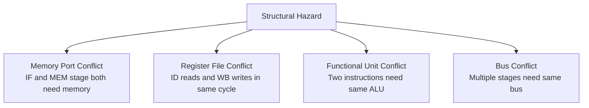

# Structural Hazards

## Overview

**Structural hazards** occur when two or more instructions in the pipeline need the same hardware resource at the same time. Unlike data hazards (which are about dependencies) and control hazards (which are about flow), structural hazards are purely about **resource conflicts**. They were more common in early CPUs and are largely resolved by designing sufficient hardware resources.

## Detailed Explanation

### What Causes Structural Hazards



### Common Resource Conflicts

| Resource | Conflict | Typical Solution |
|----------|----------|-----------------|
| **Memory** | IF (fetch) and MEM (load/store) both access memory | Separate I-cache and D-cache |
| **Register File** | ID (read) and WB (write) in same cycle | Multi-port register file; write in first half, read in second half |
| **ALU** | Multiple instructions need ALU in same cycle | Multiple ALUs (superscalar) |
| **Divider** | Division takes many cycles, blocks pipeline | Separate divide unit with queuing |
| **Bus** | Multiple stages need memory bus | Separate buses, arbitration |

### The Memory Port Problem

The most classic structural hazard:

```
Single unified memory:
  CC1   CC2   CC3   CC4   CC5
  I1:   IF    ID    EX    MEM   WB   ← MEM stage needs memory at CC4
  I2:         IF    ID    EX    MEM  WB ← IF stage needs memory at CC2
  I3:               IF    ID    EX   MEM WB

At CC4: I1's MEM and I4's IF both want memory access simultaneously!
```

**Solution**: Split into separate instruction and data memories (or caches):

```
With separate I-cache and D-cache:
  I-cache serves IF stage
  D-cache serves MEM stage
  No conflict — they're physically separate hardware
```

This is the Harvard approach applied at the cache level.

### Register File Conflict

```
Same-cycle read and write:
  CC3: I1 (WB) writes R1
  CC3: I3 (ID) reads R1

Solution 1: Write in first half of cycle, read in second half
Solution 2: Multi-port register file (separate read and write ports)
Solution 3: Forwarding (bypass the register file entirely)
```

### Superscalar Structural Hazards

When issuing multiple instructions per cycle, more conflicts arise:

```
2-wide superscalar:
  Both instructions in EX stage need ALU

Solutions:
  - Multiple ALUs (most common)
  - Different functional units for different operations
  - Issue only one ALU instruction per cycle (restricted issue)
```

### Functional Unit Latencies

Some operations take multiple cycles, creating structural hazards:

```
  MUL R1, R2, R3    ; Takes 3 cycles in multiply unit
  MUL R4, R5, R6    ; Can't start until first MUL finishes (if only 1 unit)

  Solutions:
    - Pipelined multiply unit (accept new multiply every cycle)
    - Multiple multiply units
    - Separate multiply from ALU operations
```

## Examples

### Example 1: Memory Conflict Resolution

```
Problem: Unified memory with 1 cycle access time
  I1 (LOAD): needs memory in MEM stage
  I4 (fetch): needs memory in IF stage
  Both happen in same cycle → structural hazard

Solution A: Separate caches
  L1 I-cache (32 KB) → serves IF stage
  L1 D-cache (32 KB) → serves MEM stage
  Unified L2 cache → handles misses from both

Solution B: Memory stalling
  If only one memory port: stall IF for 1 cycle when MEM needs access
  Reduces throughput but avoids incorrect execution
```

### Example 2: Multi-Port Register File

```
4-read, 2-write register file (typical for superscalar):

  Port 1 Read: Source operand 1 of instruction A
  Port 2 Read: Source operand 2 of instruction A
  Port 3 Read: Source operand 1 of instruction B
  Port 4 Read: Source operand 2 of instruction B
  Port 1 Write: Destination of instruction A (from WB)
  Port 2 Write: Destination of instruction B (from WB)

  Total: 6 ports on the register file
  Each port is physically separate hardware
```

### Example 3: Pipelined Functional Units

```
Non-pipelined multiply unit:
  CC1: MUL R1, R2, R3 starts
  CC2: MUL continuing...
  CC3: MUL continuing... completes
  CC4: MUL R4, R5, R6 can start (structural hazard if attempted earlier)

Pipelined multiply unit:
  CC1: MUL R1, R2, R3 starts
  CC2: MUL R4, R5, R6 starts (previous in stage 2)
  CC3: MUL R7, R8, R9 starts (previous in stage 3, first completes)
  → 1 multiply result per cycle throughput (3-cycle latency)
```

### Example 4: Intel Skylake Execution Ports

```
Intel Skylake has 8 execution ports:
  Port 0: ALU, MUL, DIV, FP, SIMD
  Port 1: ALU, MUL, FP, SIMD
  Port 2: Load
  Port 3: Load
  Port 4: Store data
  Port 5: ALU, shuffle, blend
  Port 6: ALU, branch
  Port 7: Store address

Structural hazard: If 3 loads are ready but only 2 load ports exist,
one must wait. The scheduler avoids this by monitoring port availability.
```

## Interview Questions

### Q1: What is a structural hazard?
**Answer**: A structural hazard occurs when two instructions in the pipeline need the same hardware resource in the same clock cycle. For example, an instruction fetch and a data load both needing memory access simultaneously. It's resolved by duplicating resources (separate caches) or stalling.

### Q2: How are structural hazards different from data hazards?
**Answer**: Structural hazards are about **resource conflicts** (two instructions need the same hardware), while data hazards are about **data dependencies** (one instruction needs the result of another). Structural hazards are solved by adding hardware; data hazards are solved by forwarding or stalling.

### Q3: Why do modern CPUs rarely have structural hazards?
**Answer**: Because designers provision enough resources: separate L1 instruction and data caches, multi-ported register files, multiple ALUs, and pipelined functional units. The hardware cost is justified by the performance gain. Structural hazards are mostly a concern for simple, low-cost designs.

### Q4: What is a pipelined functional unit?
**Answer**: A functional unit (like a multiplier) that can accept a new operation every cycle even though each operation takes multiple cycles to complete. Like an assembly line, different stages of different operations execute simultaneously. This avoids structural hazards while maintaining multi-cycle latency.

### Q5: How does superscalar design create more structural hazards?
**Answer**: Issuing multiple instructions per cycle increases the demand for every resource. If 4 instructions issue per cycle, you might need 4 ALUs, 4 memory ports, and a register file with 8+ read ports and 4+ write ports. Any shortage creates a structural hazard that limits issue width.

## Common Mistakes

1. **Thinking structural hazards are rare** — They're rare in modern high-performance CPUs, but common in embedded processors and microcontrollers with limited resources.
2. **Conflicting with data hazards** — A conflict over a register file port is structural (resource), while a conflict over register data is a data hazard (dependency).
3. **Forgetting about functional unit contention** — Even with caches and multi-port register files, specialized units (divider, SIMD) can become bottlenecks.
4. **Ignoring the cost of duplicating resources** — More hardware means more power, area, and complexity. Designers balance resource duplication against the frequency of conflicts.

## Summary

| Resource | Conflict | Solution |
|----------|----------|----------|
| **Memory** | IF + MEM same cycle | Separate I-cache / D-cache |
| **Register File** | ID read + WB write same cycle | Multi-port RF; half-cycle write |
| **ALU** | Multiple EX stages need ALU | Multiple ALUs, pipelined ALU |
| **Divider** | Multi-cycle, blocks pipeline | Pipelined divider, separate unit |
| **Bus** | Multiple stages need bus | Multiple buses, arbitration |

## Cross-References

- [Pipeline Hazards](./hazards.md) — Overview of all hazard types
- [Classic Pipeline](./classic.md) — Where structural hazards occur
- [Superscalar](./superscalar.md) — Multiple issue creates more resource demands
- [Harvard Architecture](../cpu/harvard.md) — Separate memories solve the classic structural hazard
- [Split Caches](../memory-hierarchy/split.md) — I-cache and D-cache separation

## Cross References

- [Hazards](hazards.md)
- [Superscalar](superscalar.md)
